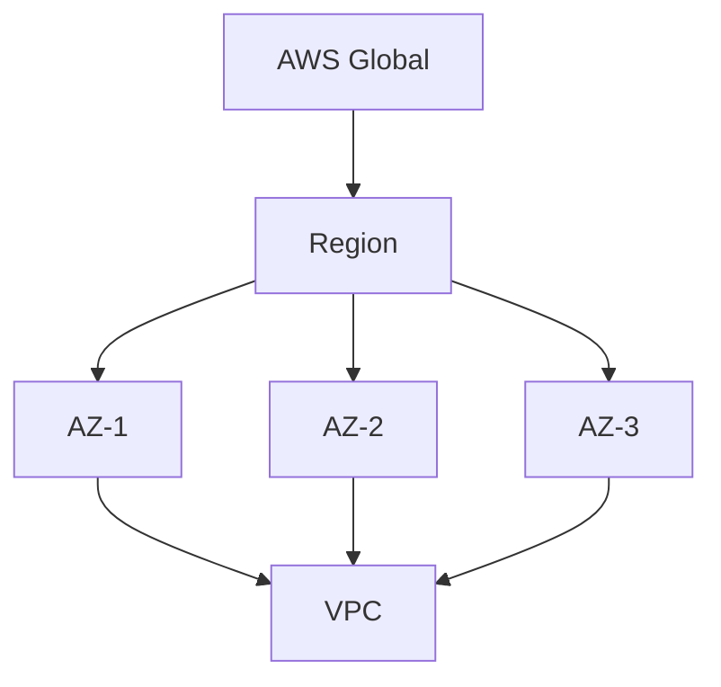
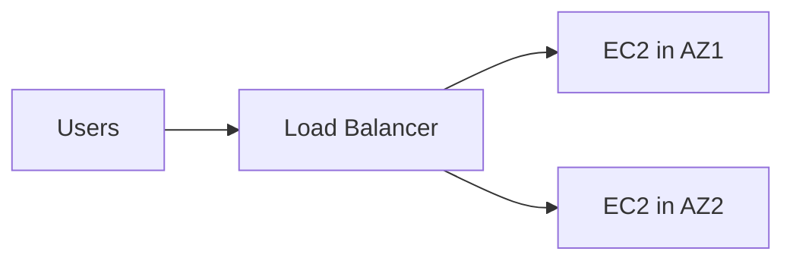
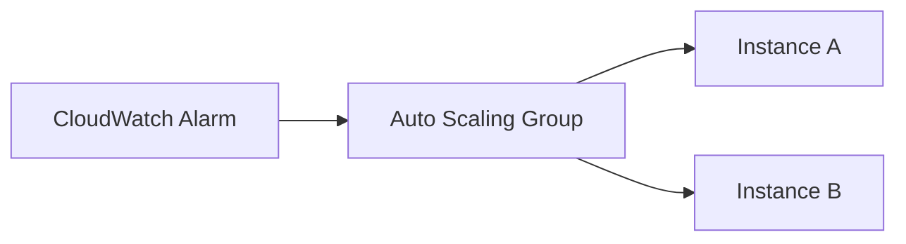
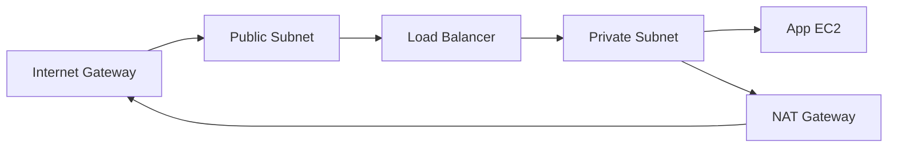

# ☁️ AWS Ultimate Interview Guide (Easy → Tough)

> Built for interview prep: **simple definitions + bullet answers + diagrams + practical CLI/IaC snippets**.  
> Use the difficulty levels to stop wherever you want.

---

## ✅ How to study (fast)
- **Level 1 (Basics)**: 45–60 min (enough for many fresher interviews)
- **Level 2 (Core Services)**: 2–3 hours (most backend/dev interviews)
- **Level 3 (Architecture + Ops + Security)**: 3–5 hours (senior/production focus)
- **Level 4–5 (Specialized/Advanced)**: optional, for cloud-heavy roles

---

## 🧠 AWS mental model (memorize)
AWS = **global infrastructure + services + security model**.

- **Regions** = geographic areas (e.g., Mumbai)  
- **Availability Zones (AZs)** = separate datacenters in a region  
- **VPC** = your private network in AWS  
- **IAM** = identity + permissions  
- **Shared responsibility** = AWS secures the cloud; you secure what you put in it



---

# Difficulty Levels

- **🟩 Level 1 — Fundamentals** (Q1–Q10 + a few musts)
- **🟦 Level 2 — Core Services** (Compute, Storage, DB, Networking essentials)
- **🟧 Level 3 — Production Architecture & Ops** (Security, Monitoring, IaC, Serverless integration)
- **🟥 Level 4 — Specialized** (Analytics/ML, DevOps tools deeper)
- **🟪 Level 5 — Advanced/Enterprise** (multi-account governance, hybrid/edge, cost strategy)

---

# 🟩 Level 1 — AWS Fundamentals (Must Know)

## 1) What is AWS and key features?
**Answer:** AWS is a cloud platform providing on-demand services like compute, storage, networking, databases, and security. You pay for what you use, scale quickly, and deploy globally with managed services.

**Key points (interview)**
- On-demand + pay-as-you-go
- Global infrastructure (Regions/AZs)
- Managed services reduce ops work
- Strong security + compliance options

---

## 2) Regions and Availability Zones (AZs)
**Answer:** A Region is a geographic location. Each Region contains multiple AZs (separate datacenters with independent power/network). Designing across multiple AZs improves high availability.

**Key points**
- Multi-AZ = fault tolerance
- Latency is lower within a Region than cross-Region
- Choose Region based on latency, compliance, cost

---

## 3) What is an AMI?
**Answer:** An AMI (Amazon Machine Image) is a template for launching EC2 instances. It includes OS + software + configuration. You can create custom AMIs to standardize servers.

**Common use**
- Golden images for consistent deployment
- Faster scaling (pre-baked images)

---

## 4) Elastic IP vs Public IP
**Answer:** Public IP can change when you stop/start an instance. Elastic IP (EIP) is a static public IPv4 address you can attach/detach to instances—useful when you need a fixed IP.

**Interview note**
- Prefer Load Balancers + DNS instead of fixed IPs (more scalable)

---

## 5) AWS Management Console role
**Answer:** Console is the web UI for managing AWS resources. In real projects, teams also use CLI/SDK/IaC (CloudFormation/Terraform/CDK) for automation and repeatability.

---

## 6) Elastic computing concept
**Answer:** Elastic computing means you can scale resources up/down quickly based on demand. AWS supports this via Auto Scaling groups, serverless, and managed services.

---

## 7) IAM and why important
**Answer:** IAM manages identities (users/roles) and permissions (policies). It’s critical because it controls who can access what, and it enables secure access using least privilege.

**Key points**
- Users, Roles, Groups, Policies
- Least privilege
- MFA + access keys hygiene

**Example IAM policy snippet (S3 read-only to a bucket)**
```json
{
  "Version": "2012-10-17",
  "Statement": [{
    "Effect": "Allow",
    "Action": ["s3:GetObject"],
    "Resource": ["arn:aws:s3:::my-bucket/*"]
  }]
}
```

---

## 8) Shared Responsibility Model
**Answer:** AWS is responsible for security **of** the cloud (datacenters, hardware, managed infrastructure). You are responsible for security **in** the cloud (IAM, data encryption, OS patching on EC2, app security).

```mermaid
flowchart LR
  AWS[AWS responsibility
(Security OF cloud)] --> A1[Physical DC]
  AWS --> A2[Hardware]
  AWS --> A3[Managed service infra]
  YOU[Customer responsibility
(Security IN cloud)] --> B1[IAM & access]
  YOU --> B2[Data encryption]
  YOU --> B3[Network config]
  YOU --> B4[OS patching on EC2]
```

---

## 9) Vertical vs Horizontal scaling
**Answer:** Vertical scaling = bigger machine (scale up). Horizontal scaling = more machines (scale out). AWS encourages horizontal scaling using load balancers and Auto Scaling.

---

## 10) High availability (HA) concept
**Answer:** HA means minimizing downtime by designing for failures. In AWS, HA typically means multi-AZ deployment + health checks + Auto Scaling + load balancing.

**Mini architecture**


---

# 🟦 Level 2 — Core AWS Services (Most Interviewed)

## Compute (Q11–Q20)

## 11) What is EC2?
**Answer:** EC2 provides virtual servers in the cloud. You choose instance type, storage, networking, and security groups. Great when you need OS-level control.

**Key points**
- Full control, but you manage patching and scaling strategy
- Combine with EBS, SG, IAM role

**CLI**
```bash
aws ec2 describe-instances --query "Reservations[].Instances[].InstanceId"
```

---

## 12) EC2 instance types (use cases)
**Answer:** Instance families are optimized for different workloads: general purpose (t), compute (c), memory (r), storage (i), GPU (g/p). Choose based on CPU, memory, network, storage needs.

**Quick mapping**
- `t` dev/test, bursty
- `c` CPU-heavy APIs
- `r` caching/analytics
- `i` high IOPS DB/search
- `g/p` ML/graphics

---

## 13) ECS (what + how)
**Answer:** ECS runs containers (Docker) as tasks and services. It schedules containers onto EC2 or Fargate and handles scaling, load balancing, and deployments.

**Key points**
- ECS = AWS container orchestrator
- Works with ALB + Auto Scaling

---

## 14) EC2 vs Lambda
**Answer:** EC2 is server-based (you manage OS/runtime). Lambda is serverless (AWS runs your code on events). Use Lambda for event-driven workloads; use EC2 when you need long-running processes or OS control.

---

## 15) Elastic Beanstalk
**Answer:** Beanstalk is a PaaS that deploys apps (Node/Java/Python/etc) and automatically provisions EC2, ELB, scaling, and monitoring. Good for quick deployments without deep infra work.

---

## 16) Auto Scaling (core idea)
**Answer:** Auto Scaling adjusts EC2 instance count based on metrics (CPU, request count, custom CloudWatch metrics). It improves availability and cost efficiency.

**Mini diagram**


---

## 17) EKS benefits
**Answer:** EKS is managed Kubernetes. AWS manages control plane availability, upgrades, and integration with IAM/VPC. Use it when you want Kubernetes ecosystem + portability.

---

## 18) Spot instances
**Answer:** Spot gives unused EC2 capacity at big discounts, but it can be interrupted. Use for fault-tolerant workloads (batch jobs, CI, data processing).

---

## 19) Fargate vs ECS
**Answer:** Fargate is “serverless containers”: you run containers without managing EC2 instances. ECS is the orchestrator; Fargate is the compute option.

---

## 20) ECR purpose
**Answer:** ECR is AWS’s container registry for storing and scanning images. ECS/EKS pull images from ECR in deployments.

**CLI (login + push outline)**
```bash
aws ecr get-login-password | docker login --username AWS --password-stdin <account>.dkr.ecr.<region>.amazonaws.com
```

---

## Storage & Databases (Q21–Q30)

## 21) S3 and key features
**Answer:** S3 is object storage for files/blobs. It’s highly durable, scalable, supports versioning, lifecycle policies, and encryption.

**Key points**
- Object storage (not a filesystem)
- Great for static assets, backups, logs, data lakes

**CLI**
```bash
aws s3 mb s3://my-bucket-12345
aws s3 cp ./file.txt s3://my-bucket-12345/file.txt
```

---

## 22) S3 vs EBS
**Answer:** S3 stores objects accessed via API/HTTP. EBS is block storage attached to EC2 like a disk. Use EBS for OS + databases on EC2; use S3 for files, backups, static content.

---

## 23) RDS and engines
**Answer:** RDS is managed relational database service (patching, backups, replicas). It supports engines like MySQL, PostgreSQL, MariaDB, Oracle, SQL Server, and Aurora.

---

## 24) S3 buckets and objects
**Answer:** Bucket is the top-level container; objects are files + metadata stored inside. Objects are addressed by key (path-like string).

---

## 25) DynamoDB and when to use
**Answer:** DynamoDB is a managed NoSQL key-value/document DB with very high scale and low latency. Use it for session stores, leaderboards, event data, and scalable APIs.

---

## 26) RDS vs Aurora
**Answer:** Aurora is AWS’s cloud-optimized relational engine compatible with MySQL/Postgres, generally offering better performance and replication options. RDS is broader (multiple engines) with traditional managed DB patterns.

---

## 27) EFS use cases
**Answer:** EFS is a managed network file system (NFS) that can be mounted by multiple EC2 instances. Use it for shared file storage across servers (uploads, shared assets).

---

## 28) S3 durability & availability
**Answer:** Durability refers to not losing data; availability refers to being able to access it. S3 is designed for very high durability using redundancy across multiple facilities in a region.

---

## 29) Redshift vs RDS
**Answer:** RDS is for OLTP (transactional DB). Redshift is a data warehouse for OLAP analytics (columnar storage, large-scale queries).

---

## 30) S3 Glacier
**Answer:** Glacier is low-cost archival storage for infrequently accessed data. Use lifecycle rules to move objects from S3 to Glacier tiers.

---

## Networking & Delivery (Q31–Q40)

## 31) VPC and key components
**Answer:** VPC is your private network in AWS. It contains subnets, route tables, security groups, NACLs, gateways, and peering options.



---

## 32) Security Groups vs NACLs
**Answer:** Security Groups are stateful firewalls at instance/ENI level. NACLs are stateless firewalls at subnet level. SGs are usually your primary control; NACLs are an extra layer.

---

## 33) Route 53
**Answer:** Route 53 is DNS service that routes users to endpoints (ALB, CloudFront, EC2). It supports health checks, routing policies (weighted, latency, failover).

---

## 34) Subnets in VPC
**Answer:** Subnets divide a VPC by IP ranges and AZ. Public subnets route to Internet Gateway; private subnets don’t (they use NAT for outbound).

---

## 35) CloudFront
**Answer:** CloudFront is a CDN that caches content at edge locations for lower latency. It improves performance and can add security (WAF integration).

---

## 36) ELB purpose
**Answer:** Load balancers distribute traffic across targets and improve availability. Common types: ALB (HTTP), NLB (TCP), GWLB.

---

## 37) Direct Connect
**Answer:** Direct Connect is a dedicated private link from your on-prem to AWS. Use it for stable bandwidth, lower latency, and hybrid architectures.

---

## 38) VPC Peering
**Answer:** VPC peering connects two VPCs privately. It’s one-to-one; for many VPCs, Transit Gateway scales better.

---

## 39) API Gateway use cases
**Answer:** API Gateway builds managed APIs (REST/HTTP/WebSocket) with auth, throttling, monitoring, and integration with Lambda or backends.

---

## 40) Transit Gateway
**Answer:** Transit Gateway is a hub that connects many VPCs and on-prem networks (hub-and-spoke). It simplifies routing at scale.

---

# 🟧 Level 3 — Security, Monitoring, IaC, Serverless Integration

## Security & Compliance (Q41–Q50)

## 41) KMS
**Answer:** KMS manages encryption keys used to encrypt data in services like S3, EBS, RDS. It provides key policies, rotation, and audit integration.

---

## 42) CloudTrail
**Answer:** CloudTrail records AWS API calls and account activity (who did what). It’s essential for audits and incident investigation.

---

## 43) WAF
**Answer:** WAF protects web apps from common attacks (SQLi, XSS) using rules. Works with CloudFront, ALB, API Gateway.

---

## 44) Shield
**Answer:** Shield provides DDoS protection. Standard is automatic; Advanced adds enhanced detection and response support.

---

## 45) Secrets Manager
**Answer:** Stores secrets (DB passwords, API keys) securely with rotation support. Better than hardcoding or plain env vars.

---

## 46) Compliance programs
**Answer:** AWS offers compliance reports and certifications (SOC, ISO, PCI, etc). You still must design your app to meet compliance requirements.

---

## 47) AWS Config
**Answer:** Config tracks resource configurations and changes over time. Useful for governance, drift detection, and compliance checks.

---

## 48) GuardDuty
**Answer:** GuardDuty is threat detection using logs (CloudTrail, VPC flow logs, DNS). It alerts on suspicious behavior.

---

## 49) Security Hub
**Answer:** Central dashboard for security findings from GuardDuty, Inspector, Config, etc. Helps unify security posture.

---

## 50) Artifact
**Answer:** Artifact provides on-demand access to AWS compliance reports and agreements.

---

## Monitoring & Management (Q51–Q60)

## 51) CloudWatch
**Answer:** CloudWatch collects metrics, logs, alarms, and dashboards. It’s your primary monitoring tool for AWS resources and applications.

---

## 52) CloudWatch vs CloudTrail
**Answer:** CloudWatch = metrics/logs/alarms for performance and ops. CloudTrail = audit log of API activity and changes.

---

## 53) Systems Manager (SSM)
**Answer:** SSM helps manage fleets (patching, run commands, session manager). It reduces the need for SSH and centralizes ops.

---

## 54) EventBridge
**Answer:** EventBridge routes events from AWS services/SaaS/apps to targets (Lambda, SQS, Step Functions). It’s great for event-driven architectures.

---

## 55) OpsWorks
**Answer:** OpsWorks is configuration management (Chef/Puppet) for infrastructure automation. Less popular now compared to Terraform/CloudFormation/SSM.

---

## 56) Config Rules
**Answer:** Config Rules evaluate resource configurations against rules (e.g., S3 bucket must not be public).

---

## 57) CloudFormation
**Answer:** CloudFormation is Infrastructure as Code (IaC) to provision AWS resources from templates (repeatable, versioned).

**Tiny CloudFormation example (S3 bucket)**
```yaml
AWSTemplateFormatVersion: "2010-09-09"
Resources:
  MyBucket:
    Type: AWS::S3::Bucket
    Properties:
      BucketName: my-cfn-bucket-12345
```

---

## 58) Service Catalog
**Answer:** Service Catalog lets orgs create approved “products” (templates) for teams to deploy safely.

---

## 59) Trusted Advisor
**Answer:** Trusted Advisor checks best practices across cost, performance, security, fault tolerance, and service limits.

---

## 60) Personal Health Dashboard
**Answer:** Shows AWS service events affecting your account/resources, plus proactive notifications.

---

## Application Integration & Serverless (Q61–Q70)

## 61) SQS
**Answer:** SQS is a managed message queue that decouples services. Producers send messages; consumers poll and process. Helps handle spikes reliably.

**CLI**
```bash
aws sqs send-message --queue-url <URL> --message-body "hello"
```

---

## 62) SQS vs SNS
**Answer:** SQS is queue (pull-based, one consumer per message). SNS is pub/sub (push-based, fan-out to multiple subscribers).

---

## 63) Lambda
**Answer:** Lambda runs code on events without managing servers. You pay per request + compute time. Great for event-driven tasks and APIs.

**Simple Node.js Lambda handler**
```js
export const handler = async (event) => {
  return { statusCode: 200, body: JSON.stringify({ ok: true }) };
};
```

---

## 64) API Gateway benefits (again, but interview level)
**Answer:** Adds auth, throttling, caching, monitoring, request validation and integrates tightly with Lambda/server backends.

---

## 65) DynamoDB Streams
**Answer:** Streams capture item-level changes and can trigger Lambda for reactive workflows (sync to search index, audit).

---

## 66) Step Functions
**Answer:** Step Functions orchestrate workflows (state machines) across Lambda/services with retries, timeouts, and branching.

---

## 67) Kinesis
**Answer:** Kinesis handles streaming data ingestion at scale (clickstreams, IoT telemetry). Consumers process records in near-real-time.

---

## 68) AppSync
**Answer:** AppSync provides managed GraphQL with real-time subscriptions and offline sync. Often used for mobile apps.

---

## 69) EventBridge role in serverless
**Answer:** EventBridge is the event bus that connects producers and consumers across AWS services. It enables loosely coupled serverless architectures.

---

## 70) SAM
**Answer:** Serverless Application Model (SAM) simplifies building serverless apps with templates (Lambda, API Gateway, etc).

**Tiny SAM snippet**
```yaml
Transform: AWS::Serverless-2016-10-31
Resources:
  HelloFn:
    Type: AWS::Serverless::Function
    Properties:
      Runtime: nodejs20.x
      Handler: index.handler
      InlineCode: |
        exports.handler = async () => ({ statusCode: 200, body: "hi" });
```

---

# 🟥 Level 4 — Analytics & ML (Optional unless role needs it)

## 71) EMR
**Answer:** EMR is managed big data processing (Spark, Hadoop). Use for batch analytics, ETL, and large-scale processing.

## 72) Redshift vs Athena
**Answer:** Redshift is a managed data warehouse (store+query). Athena is serverless SQL querying directly on S3 data (pay per query).

## 74) Glue
**Answer:** Glue is managed ETL with crawlers, catalog, and job execution—often used with S3 data lakes.

## 75) SageMaker
**Answer:** SageMaker helps build/train/deploy ML models with managed notebooks, training jobs, endpoints.

## 76) QuickSight
**Answer:** Managed BI dashboards and visualizations over AWS data sources.

---

# 🟪 Level 5 — Advanced/Enterprise (For senior/cloud-heavy interviews)

## 91) Well-Architected Framework + pillars
**Answer:** A set of best practices to design secure, reliable, efficient, and cost-optimized systems. Pillars: Operational Excellence, Security, Reliability, Performance Efficiency, Cost Optimization, Sustainability.

## 93) Outposts
**Answer:** AWS infrastructure installed on-prem for hybrid cloud with AWS APIs.

## 95) Local Zones / Wavelength
**Answer:** Bring AWS closer to end users (latency-sensitive workloads).

## 99) Control Tower
**Answer:** Multi-account governance + landing zone setup for large organizations.

## 100) Savings Plans
**Answer:** Cost model that provides discounts for committed usage over time (compute savings).

---

# ✅ AWS Interview Cheat Sheet (15 minutes)

### “What is AWS?”
> “AWS is a cloud platform providing compute, storage, networking, database, security and managed services globally, with pay-as-you-go and elasticity.”

### “Regions/AZs?”
> “Region is a geography; AZs are isolated datacenters. Multi-AZ builds high availability.”

### “IAM?”
> “Identity + permissions. Use least privilege and roles.”

### “EC2 vs Lambda?”
> “EC2 for server control, Lambda for event-driven serverless.”

### “S3 vs EBS vs EFS?”
- S3: object storage
- EBS: block disk for one EC2
- EFS: shared filesystem (NFS)

### “SG vs NACL?”
- SG: stateful instance-level
- NACL: stateless subnet-level

---

# ⚠️ Common AWS Interview Traps
- Mixing up **durability** vs **availability**
- Thinking **public subnet** means “public IP” (it means route to IGW)
- Putting databases in public subnets
- Using IAM users in production instead of roles
- Blocking systems without monitoring/alarms

---

If you want, I can generate a **scenario-based AWS interview pack** next (e.g., “design highly available Node API”, “S3 upload + CloudFront”, “cost optimization”, “secure VPC with private subnets”, etc.) in the same format you liked.
