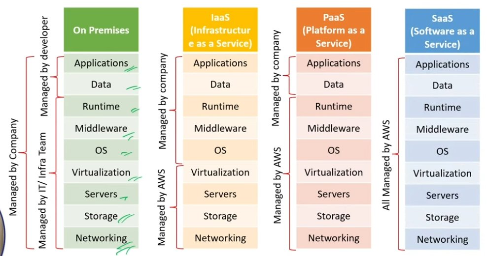
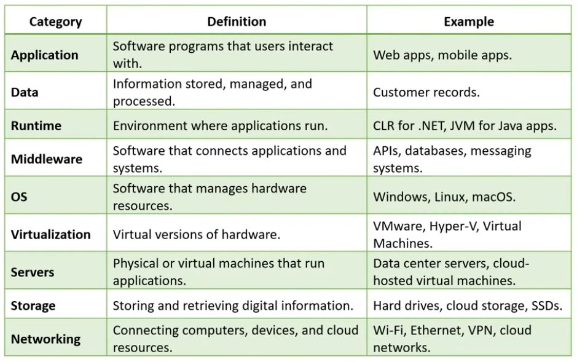
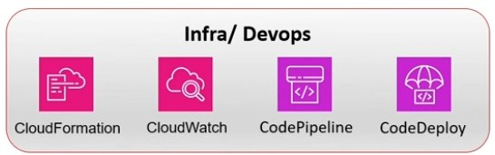
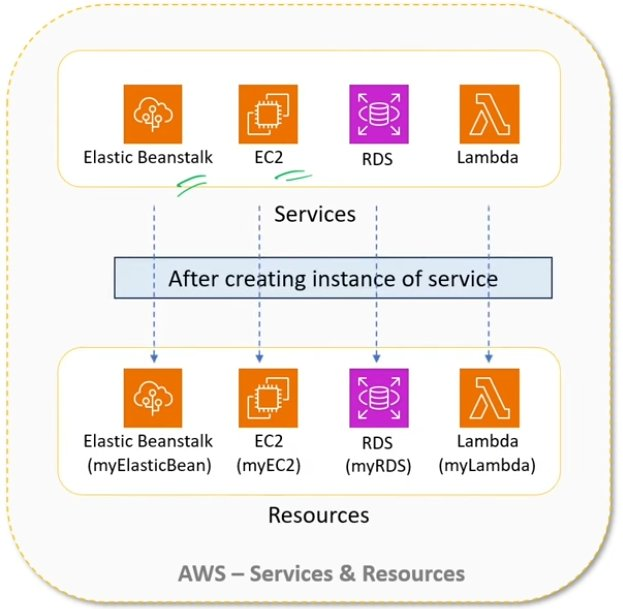
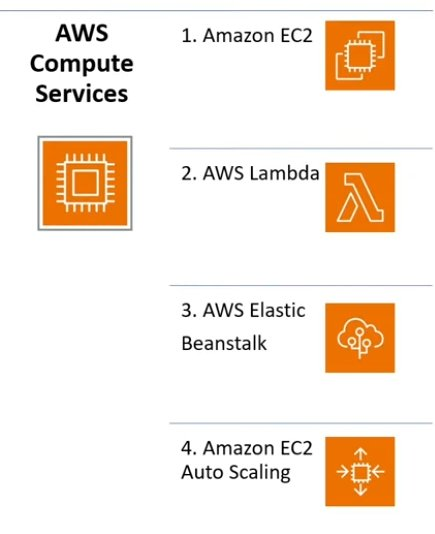
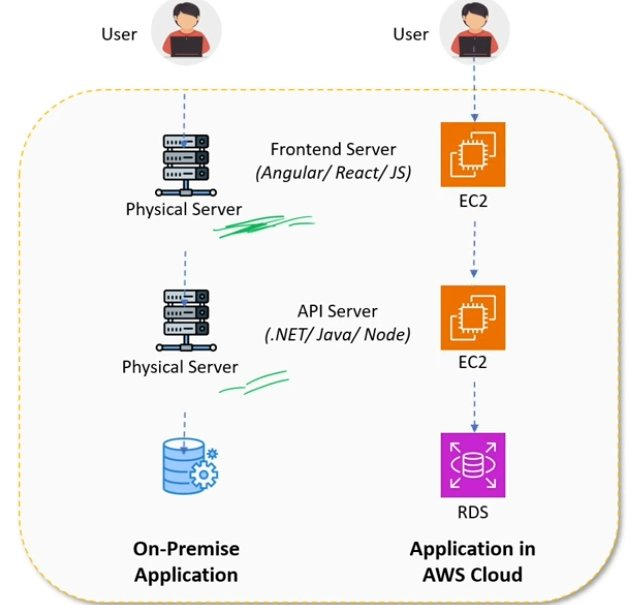
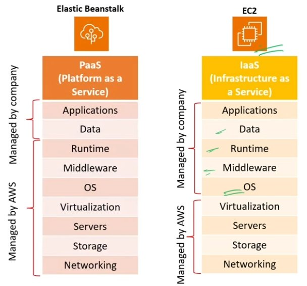
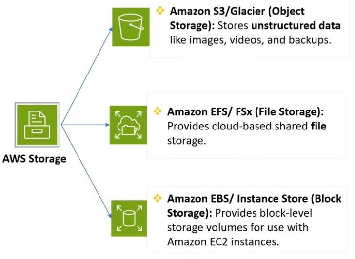
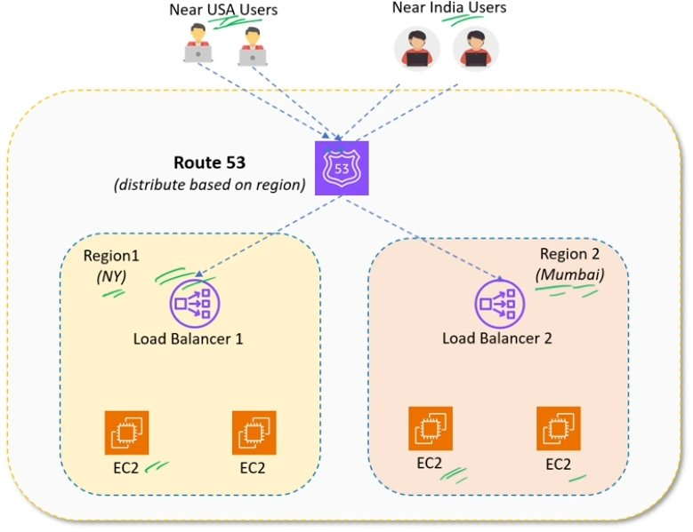

# ☁️ AWS Basics — Interview Preparation Guide

> **Goal:** Understand core AWS concepts clearly enough to explain them confidently in any interview.
> Each question includes the original definition + extra interview tips, key points, and memory aids.

---

## 📖 Table of Contents

| # | Question |
|---|----------|
| 1 | [Cloud Service Models — IaaS, PaaS, SaaS](#q1) |
| 2 | [Main Categories of AWS Services — Top 25](#q2) |
| 3 | [AWS Resource vs AWS Service](#q3) |
| 4 | [AWS Regions and Availability Zones](#q4) |
| 5 | [AWS Compute Services — Top 5](#q5) |
| 6 | [Amazon EC2 Instances](#q6) |
| 7 | [AWS Elastic Beanstalk](#q7) |
| 8 | [AWS Storage Types](#q8) |
| 9 | [Amazon Route 53](#q9) |
| 10 | [Infrastructure as Code (IaC) — CloudFormation / CDK](#q10) |

---

<a name="q1"></a>
## ❓ Q1. What are the main cloud service models? Difference between IaaS, PaaS, and SaaS?

### 📖 Definition

Cloud service models define **how much of the infrastructure is managed by the cloud provider vs. you (the company/developer)**. There are three main models:

- **IaaS (Infrastructure as a Service)** — You manage everything from OS upward; AWS provides hardware, networking, and virtualisation.
- **PaaS (Platform as a Service)** — You manage only your application and data; AWS manages everything below (OS, middleware, runtime).
- **SaaS (Software as a Service)** — AWS (or another vendor) manages everything; you just use the software.

---

### 🧱 Infrastructure Layer Breakdown

The 9 layers of IT infrastructure — understanding which ones YOU manage vs. AWS manages is the key to understanding IaaS / PaaS / SaaS:



---

### 📊 IaaS vs PaaS vs SaaS vs On-Premises — Full Comparison



---

### 🗂️ Quick-Reference Summary Table

| Model | You Manage | AWS Manages | AWS Example |
|-------|-----------|-------------|-------------|
| **On-Premises** | Everything | Nothing | Your own data centre |
| **IaaS** | App, Data, Runtime, Middleware, OS | Virtualisation, Servers, Storage, Networking | EC2 |
| **PaaS** | App, Data | Runtime, Middleware, OS, and below | Elastic Beanstalk |
| **SaaS** | Nothing (just use it) | Everything | Gmail, Salesforce, AWS WorkMail |

---

### 💡 Interview Tips

> 🔥 **Memory trick:** Think of it as a pizza analogy:
> - **IaaS** = Bake at home (you bring dough, toppings, oven skill — AWS gives the kitchen)
> - **PaaS** = Take & bake (AWS gives you the dough, you add toppings & bake)
> - **SaaS** = Delivery pizza (you just eat it — AWS does everything)

> 🔥 **Common follow-up:** *"Give a real AWS example of each model."*
> - **IaaS** → Amazon EC2 (you manage OS, runtime, app)
> - **PaaS** → AWS Elastic Beanstalk (you just upload code)
> - **SaaS** → Amazon WorkMail, AWS Chime

> 🔥 **Key point to mention:** The more the cloud manages, the **less control** you have but the **faster** you can deploy.

---

<a name="q2"></a>
## ❓ Q2. What are the main categories of AWS services? What are the top 25 services?

### 📖 Definition

AWS offers **200+ services** organised into categories. For most real-world projects, you'll regularly use services from these 6 major categories:

1. **Compute** — Processing power to run your apps
2. **Database** — Store and query structured/unstructured data
3. **Storage** — Store files, objects, and block data
4. **Networking & Content Delivery** — Connect, route, and secure your infrastructure
5. **Messaging & Integration** — Communicate between services asynchronously
6. **Security** — Control access, manage secrets, encrypt data

---

### 🗂️ Top AWS Services by Category


---

### 🛠️ Infra / DevOps Services



---

### 📋 Top 25 AWS Services — Quick Reference

| # | Service | Category | One-Line Purpose |
|---|---------|----------|-----------------|
| 1 | **EC2** | Compute | Virtual servers in the cloud |
| 2 | **Lambda** | Compute | Run code without managing servers (serverless) |
| 3 | **Elastic Beanstalk** | Compute | Deploy apps without managing infrastructure (PaaS) |
| 4 | **ECS** | Compute | Run Docker containers at scale |
| 5 | **S3** | Storage | Store any file/object (images, videos, backups) |
| 6 | **EBS** | Storage | Block storage attached to EC2 instances |
| 7 | **EFS** | Storage | Shared file system across multiple EC2 instances |
| 8 | **RDS** | Database | Managed relational DB (MySQL, PostgreSQL, etc.) |
| 9 | **DynamoDB** | Database | Managed NoSQL key-value database |
| 10 | **Aurora** | Database | High-performance managed relational DB (MySQL/Postgres compatible) |
| 11 | **ElastiCache (Redis)** | Database | In-memory cache for fast data retrieval |
| 12 | **VPC** | Networking | Isolated private network within AWS |
| 13 | **Route 53** | Networking | DNS and global traffic routing |
| 14 | **CloudFront** | Networking | CDN — deliver content fast via edge locations |
| 15 | **ELB** | Networking | Load balancer — distribute traffic across EC2s |
| 16 | **API Gateway** | Networking | Create and manage REST/WebSocket APIs |
| 17 | **SNS** | Messaging | Pub/sub notifications (push to many subscribers) |
| 18 | **SQS** | Messaging | Message queue (decouple services) |
| 19 | **EventBridge** | Messaging | Event-driven architecture and routing |
| 20 | **IAM** | Security | Control who can access what in AWS |
| 21 | **Secrets Manager** | Security | Store and rotate secrets (DB passwords, API keys) |
| 22 | **KMS** | Security | Create and manage encryption keys |
| 23 | **CloudFormation** | Infra/DevOps | Infrastructure as Code (IaC) using templates |
| 24 | **CloudWatch** | Infra/DevOps | Monitoring, logging, and alerting |
| 25 | **CodePipeline / CodeDeploy** | Infra/DevOps | CI/CD pipeline for automated deployments |

---

### 💡 Interview Tips

> 🔥 **Common question:** *"Which AWS services have you used and why?"*
> Even if you haven't used all of them, describe the **purpose** of each category and name the key services. Interviewers want to see breadth of awareness.

> 🔥 **Key point:** For any typical web project the core stack is:
> **EC2 or Elastic Beanstalk** (compute) + **RDS** (database) + **S3** (storage) + **VPC** (networking) + **IAM** (security)

---

<a name="q3"></a>
## ❓ Q3. What is a Resource in AWS? How is it different from a Service in AWS?

### 📖 Definition

**AWS Service** — A service is a tool or feature offered by AWS to perform tasks like computing, storage, networking, or security.

**AWS Resource** — A resource in AWS is an **instance of a service** that you can create, configure, and use in the cloud.

> 💡 **Simple analogy:** AWS Service is like a **class** and AWS Resource is like an **object or instance** of that class.

---

### 🖼️ Services vs Resources — Visual Explanation



---

### 📋 Concrete Examples

| AWS Service | Example Resource Created |
|-------------|--------------------------|
| Amazon EC2 | `myWebServer` — a specific virtual machine you launched |
| Amazon S3 | `my-profile-photos-bucket` — a specific storage bucket you created |
| Amazon RDS | `myProductionDB` — a specific database instance you configured |
| AWS Lambda | `myOrderProcessor` — a specific function you deployed |
| AWS IAM | `AdminUser` — a specific user account you created |

---

### 💡 Interview Tips

> 🔥 **The key distinction:** You don't *pay* for a service — you pay for the **resources** you create from that service. For example, EC2 is free to know about; it's the specific EC2 instances (resources) you run that incur charges.

> 🔥 **Follow-up:** *"How do you identify a resource in AWS?"*
> Every AWS resource has a unique identifier called an **ARN (Amazon Resource Name)**, e.g.:
> `arn:aws:ec2:us-east-1:123456789:instance/i-0abcd1234ef567890`

---

<a name="q4"></a>
## ❓ Q4. What are AWS Regions and Availability Zones? How are they different?

### 📖 Definition

**AWS Region** — A geographical area where AWS has **multiple data centers** (e.g., `us-east-1` = N. Virginia, `ap-south-1` = Mumbai).

**AWS Availability Zone (AZ)** — A **physically separate data center** within an AWS Region. Each Region contains 2–6 AZs.

> It ensures **high availability** by protecting your application from failure in a single data center.

---

### 🗺️ Visual Structure

```
🌍 AWS GLOBAL INFRASTRUCTURE
│
├── Region: US East (N. Virginia) — us-east-1
│   ├── AZ: us-east-1a  (Data Center A)
│   ├── AZ: us-east-1b  (Data Center B)
│   └── AZ: us-east-1c  (Data Center C)
│
├── Region: Asia Pacific (Mumbai) — ap-south-1
│   ├── AZ: ap-south-1a
│   ├── AZ: ap-south-1b
│   └── AZ: ap-south-1c
│
└── Region: EU (Ireland) — eu-west-1
    ├── AZ: eu-west-1a
    ├── AZ: eu-west-1b
    └── AZ: eu-west-1c
```

---

### 📊 Regions vs Availability Zones — Comparison

| Feature | AWS Region | Availability Zone |
|---------|-----------|-------------------|
| **Definition** | Geographical area with multiple data centers | Physically separate data center within a Region |
| **Scope** | Broad geographic area (country/continent) | Specific facility within a Region |
| **Number** | 30+ Regions worldwide | 2–6 AZs per Region |
| **Connected by** | Internet (with AWS backbone) | High-speed, low-latency private fibre |
| **Use case** | Choose based on user location / compliance | Deploy across multiple AZs for high availability |
| **Example** | `ap-south-1` (Mumbai) | `ap-south-1a`, `ap-south-1b` |

---

### 💡 Interview Tips

> 🔥 **Key question:** *"Why would you deploy your application across multiple AZs?"*
> **Answer:** For **High Availability (HA)**. If one AZ goes down (power outage, fire, hardware failure), your app keeps running in the other AZs. AWS services like ELB, RDS Multi-AZ, and Auto Scaling distribute across AZs automatically.

> 🔥 **Region selection factors to mention:**
> 1. **Latency** — choose closest to your users
> 2. **Compliance / Data residency** — some countries require data to stay local (GDPR in Europe)
> 3. **Service availability** — not all AWS services are in every Region
> 4. **Cost** — pricing varies slightly by Region

> 🔥 **Extra concept:** There are also **Edge Locations** (300+) used by CloudFront CDN — even smaller than AZs, used purely for content caching close to users.

---

<a name="q5"></a>
## ❓ Q5. What are AWS Compute Services? Name the top 5.

### 📖 Definition

**AWS Compute Services** provide cloud-based processing power, auto-scaling, and execution environments for applications. In simple terms — they are the services that **run your code**.

---

### 🖥️ Top AWS Compute Services



---

### 📋 Top 5 Compute Services — Explained

| # | Service | Type | Best For |
|---|---------|------|----------|
| 1 | **Amazon EC2** | IaaS — Virtual Machines | Full control over OS, runtime, scaling. Traditional apps, custom environments. |
| 2 | **AWS Lambda** | Serverless — Functions | Event-driven code execution. No server management. Pay per execution. |
| 3 | **AWS Elastic Beanstalk** | PaaS — Managed Platform | Deploy web apps quickly without configuring infrastructure. |
| 4 | **Amazon EC2 Auto Scaling** | Scaling — Add/remove EC2s | Automatically adjust number of EC2s based on traffic load. |
| 5 | **Amazon ECS / EKS** | Container Orchestration | Run Docker containers at scale (ECS = AWS native, EKS = Kubernetes). |

---

### 🔄 Compute Service Decision Guide

```
Do you want to manage the server?
│
├── YES → EC2 (full control, pick OS, install anything)
│
└── NO
    ├── Is it event-driven / short-lived code?
    │   └── YES → Lambda (serverless, pay per call)
    │
    ├── Are you deploying a web app with minimal setup?
    │   └── YES → Elastic Beanstalk (PaaS, just upload code)
    │
    └── Are you using containers (Docker)?
        └── YES → ECS or EKS (container orchestration)
```

---

### 💡 Interview Tips

> 🔥 **Common question:** *"What is the difference between EC2 and Lambda?"*
> **Answer:** EC2 is a virtual machine that runs 24/7 — you pay for uptime. Lambda is serverless — it runs only when triggered by an event (HTTP request, S3 upload, schedule) and you pay per execution (first 1M calls/month are free). Lambda is ideal for microservices and event-driven architectures; EC2 is better for long-running, stateful workloads.

---

<a name="q6"></a>
## ❓ Q6. What are Amazon EC2 Instances? When would you use them in a project?

### 📖 Definition

**Amazon EC2 (Elastic Compute Cloud) Instances** are cloud-based virtual servers that allow users to run applications **without needing to buy or manage physical hardware**.

---

### 🖼️ On-Premise vs EC2 in AWS Cloud



---

### 📋 EC2 Key Concepts

| Concept | Explanation |
|---------|-------------|
| **Instance Type** | Defines CPU, RAM, storage (e.g., `t3.micro`, `m5.large`, `c6g.xlarge`) |
| **AMI** | Amazon Machine Image — the OS template used to launch an instance (Amazon Linux, Ubuntu, Windows) |
| **Key Pair** | SSH keys to securely connect to your EC2 instance |
| **Security Group** | Acts as a virtual firewall — controls inbound/outbound traffic rules |
| **Elastic IP** | A static public IP address you can attach to an EC2 instance |
| **Auto Scaling** | Automatically add/remove EC2 instances based on CPU/traffic load |

---

### 💰 EC2 Pricing Models

| Pricing Type | Description | Save vs On-Demand | Best For |
|-------------|-------------|-------------------|----------|
| **On-Demand** | Pay per hour/second, no commitment | — | Dev/test, unpredictable workloads |
| **Reserved** | 1 or 3 year commitment | Up to 72% | Steady, predictable production workloads |
| **Spot** | Bid on unused AWS capacity | Up to 90% | Fault-tolerant, batch jobs, flexible start/end |
| **Savings Plans** | Flexible commitment ($/hour) | Up to 66% | Mix of instance types/regions |

---

### 🛠️ When to Use EC2 in a Project

Use EC2 when you need:
- Full control over the **operating system and runtime** (install custom software, use specific Linux distro)
- **Long-running applications** (web servers, API servers, game servers)
- **Lift-and-shift** migrations — moving existing on-premise apps to the cloud as-is
- Applications that require **persistent state** or specific CPU/RAM/GPU configurations
- Running a **database** on a custom setup (though RDS is usually preferred)

---

### 💡 Interview Tips

> 🔥 **Common question:** *"What is an AMI?"*
> **Answer:** An AMI (Amazon Machine Image) is a pre-configured template that contains the OS (e.g., Ubuntu 22.04), application server, and any pre-installed software. When you launch an EC2 instance, you pick an AMI as the base image. You can also create custom AMIs from existing instances (useful for Auto Scaling — so all new instances launch with your pre-configured stack).

> 🔥 **Security Group tip:** Security Groups are **stateful** — if you allow inbound traffic on port 80, the response is automatically allowed out. NACLs (Network Access Control Lists) are **stateless** — you must explicitly define both inbound and outbound rules.

---

<a name="q7"></a>
## ❓ Q7. What is AWS Elastic Beanstalk? For what purpose can you use it?

### 📖 Definition

**AWS Elastic Beanstalk** is a fully managed **Platform-as-a-Service (PaaS)** that enables developers to deploy and scale web applications and services **without managing the infrastructure**.

> You upload your code → Elastic Beanstalk automatically handles: provisioning EC2 instances, load balancing, auto-scaling, monitoring, and deployments.

---

### 🖼️ Elastic Beanstalk (PaaS) vs EC2 (IaaS) — What You Manage



---

### 🔄 How Elastic Beanstalk Works

```
DEVELOPER WORKFLOW:
  1. Write your app code (.NET / Java / Node.js / Python / Ruby / Go / PHP)
  2. Upload code to Elastic Beanstalk (via console, CLI, or CI/CD)
  3. Elastic Beanstalk automatically provisions:
     ├── EC2 instances (to run your app)
     ├── Elastic Load Balancer (to distribute traffic)
     ├── Auto Scaling group (to handle traffic spikes)
     ├── RDS (optional — if you add a database)
     └── CloudWatch (for monitoring and alerts)
  4. Your app is live — you just manage your code!
```

---

### ⚖️ Elastic Beanstalk vs EC2 vs Lambda

| Feature | Elastic Beanstalk | EC2 | Lambda |
|---------|------------------|-----|--------|
| **Type** | PaaS | IaaS | Serverless |
| **Setup effort** | Low | High | Very Low |
| **Control** | Medium | Full | Minimal |
| **Scaling** | Auto (managed) | Manual or Auto Scaling | Auto |
| **Best for** | Web apps, APIs | Custom server needs | Event-driven functions |
| **Underlying** | Uses EC2 under the hood | Raw virtual machine | No visible server |

---

### 💡 Interview Tips

> 🔥 **Key point:** Elastic Beanstalk is **free** — you only pay for the underlying resources it provisions (EC2, RDS, etc.). The Beanstalk service itself has no additional charge.

> 🔥 **Common question:** *"Is Elastic Beanstalk the same as EC2?"*
> **Answer:** No. Elastic Beanstalk **uses** EC2 internally but manages it for you. With raw EC2 you configure everything manually. Elastic Beanstalk is a PaaS layer on top — good for rapid deployments. However if you need precise control over OS, networking, or custom software installs, use EC2 directly.

> 🔥 **Supported platforms:** Node.js, Python, Ruby, PHP, Java (Tomcat), .NET (IIS), Go, Docker.

---

<a name="q8"></a>
## ❓ Q8. What is AWS Storage? What are the types of AWS Storage?

### 📖 Definition

**AWS Storage** is a cloud-based storage solution that allows you to **store, access, and manage data over the internet** — without maintaining physical hardware.

---

### 🗂️ Three Types of AWS Storage



---

### 📋 Storage Types — Detailed Comparison

| Storage Type | AWS Service | What It Stores | Use Case |
|-------------|-------------|----------------|----------|
| **Object Storage** | **S3** (Standard, Intelligent-Tiering) | Unstructured data — files, images, videos, backups | Static website hosting, media storage, data lakes, backups |
| **Object Storage (Archive)** | **S3 Glacier / Glacier Deep Archive** | Long-term archival data | Compliance archives, backups you rarely access |
| **File Storage** | **EFS** (Elastic File System) | Shared file system (like a network drive) | Multiple EC2 instances sharing the same files |
| **File Storage (Windows)** | **FSx** (for Windows/Lustre) | Windows file shares, HPC workloads | Windows apps needing shared storage |
| **Block Storage** | **EBS** (Elastic Block Store) | Low-level blocks — like a hard drive for EC2 | Boot volumes, databases on EC2, high-performance I/O |
| **Temporary Block** | **Instance Store** | Ephemeral storage on the physical host | Temporary buffers, caches (data lost when instance stops!) |

---

### 🔑 S3 Key Concepts (Most Common in Interviews)

| Concept | Explanation |
|---------|-------------|
| **Bucket** | Container for objects (like a top-level folder). Globally unique name required. |
| **Object** | Any file stored in S3 (up to 5TB per object) |
| **Key** | The full path/name of the object in the bucket |
| **Versioning** | Keep multiple versions of the same object — protect against accidental deletion |
| **Lifecycle Policy** | Automatically move objects between storage tiers or delete after X days |
| **S3 Presigned URL** | Temporary URL to give someone time-limited access to a private object |
| **Static Website** | S3 can host a static HTML/CSS/JS website directly |

---

### 💡 Interview Tips

> 🔥 **Memory trick for storage types:**
> - **S3** = Store **any file** anywhere (Object — like Google Drive)
> - **EBS** = Store **EC2's hard drive** (Block — like an SSD plugged in)
> - **EFS** = Store **shared drive** across many EC2s (File — like a network drive)

> 🔥 **Common question:** *"What is the difference between EBS and S3?"*
> **Answer:** EBS is block storage **attached to a single EC2 instance** — it acts like a hard drive (can only be attached to one EC2 at a time by default). S3 is object storage accessible over the internet by any service — used for files, images, backups. EBS is low-latency for database I/O; S3 is scalable and globally accessible.

> 🔥 **Important:** S3 is **99.999999999% durable** (11 nines) — AWS replicates your data across at least 3 AZs.

---

<a name="q9"></a>
## ❓ Q9. What is Amazon Route 53? How does it manage global traffic?

### 📖 Definition

**AWS Route 53** is a **DNS-based traffic routing service** that distributes user requests across AWS regions based on rules like user location or latency.

> Route 53 is Amazon's highly available and scalable DNS (Domain Name System) service. It translates human-readable domain names (e.g., `www.myapp.com`) into IP addresses, and routes traffic intelligently based on routing policies.

---

### 🌐 Route 53 — Global Traffic Routing



---

### 🔄 How Route 53 Works

```
USER TYPES: www.myapp.com
      │
      ▼
ROUTE 53 DNS LOOKUP
  "Where is this user from? What's the best server?"
      │
      ├── User in USA   → Route to us-east-1 (New York)     → Load Balancer 1 → EC2s
      ├── User in India → Route to ap-south-1 (Mumbai)      → Load Balancer 2 → EC2s
      └── User in EU    → Route to eu-west-1 (Ireland)      → Load Balancer 3 → EC2s
```

---

### 📋 Route 53 Routing Policies

| Routing Policy | How It Works | Use Case |
|---------------|-------------|----------|
| **Simple** | Route to a single resource | Basic single-server setup |
| **Weighted** | Split traffic by % between multiple resources | A/B testing, gradual rollouts (e.g., 90% v1, 10% v2) |
| **Latency** | Route to the region with lowest latency for user | Global apps — best performance per user |
| **Geolocation** | Route based on user's geographic location | Serve localised content, data residency compliance |
| **Failover** | Route to primary; switch to secondary if primary fails | Disaster recovery / high availability |
| **Geoproximity** | Route based on proximity with ability to bias | Fine-grained geographic control |
| **Multi-value** | Return multiple healthy IPs | Simple load balancing without a load balancer |

---

### 💡 Interview Tips

> 🔥 **Why "Route 53"?** Port 53 is the standard DNS port. Hence the name.

> 🔥 **Common question:** *"What is the difference between Route 53 and a Load Balancer (ELB)?"*
> **Answer:** Route 53 works at the **DNS level** — it decides which Region/IP to send traffic to before the request even hits AWS. ELB works within a single region, distributing traffic across multiple EC2 instances. In a typical setup they work together: Route 53 routes to the correct region → ELB distributes within that region.

> 🔥 **Health Checks:** Route 53 can monitor the health of your endpoints and automatically stop routing traffic to unhealthy resources (failover behaviour).

---

<a name="q10"></a>
## ❓ Q10. What is Infrastructure as Code (IaC) in AWS? Explain CloudFormation / CDK.

### 📖 Definition

**Infrastructure as Code (IaC)** is a DevOps practice that allows you to **define, provision, and manage infrastructure using code** instead of manual processes (clicking through the AWS console).

> Instead of manually creating EC2 instances, VPCs, and databases through the console, you write code/templates that describe your infrastructure — and AWS automatically provisions everything.

---

### 🖼️ IaC in the CI/CD Pipeline


---

### 🔄 IaC vs Manual Provisioning

```
MANUAL (clicking in console):             IaC (code):
──────────────────────────────────        ──────────────────────────────────
1. Log into AWS console                   1. Write template/code
2. Navigate to EC2                        2. Run: aws cloudformation deploy
3. Click "Launch Instance"                3. Done! ✓
4. Select AMI, instance type, etc.
5. Repeat for EVERY environment           Reproducible across all environments!
   (dev, staging, production)             Version-controlled in Git.
6. Easy to make mistakes                  Automated, consistent, auditable.
```

---

### 📦 AWS IaC Tools

| Tool | Language | Description |
|------|----------|-------------|
| **AWS CloudFormation** | YAML / JSON | AWS-native IaC — declare resources in templates, AWS provisions them |
| **AWS CDK** (Cloud Development Kit) | TypeScript, Python, Java, C# | Write infrastructure in a real programming language — compiles to CloudFormation |
| **AWS SAM** | YAML | Simplified CloudFormation for serverless apps (Lambda, API Gateway) |
| **Terraform** | HCL | Third-party (HashiCorp) — multi-cloud IaC, very popular in industry |

---

### 🔧 CloudFormation Example

```yaml
# cloudformation-template.yaml
# Creates an EC2 instance and an S3 bucket:

AWSTemplateFormatVersion: '2010-09-09'
Description: 'Simple EC2 + S3 example'

Resources:
  # EC2 Instance:
  MyWebServer:
    Type: AWS::EC2::Instance
    Properties:
      InstanceType: t3.micro
      ImageId: ami-0c55b159cbfafe1f0   # Amazon Linux 2 AMI
      Tags:
        - Key: Name
          Value: my-web-server

  # S3 Bucket:
  MyStorageBucket:
    Type: AWS::S3::Bucket
    Properties:
      BucketName: my-unique-app-bucket-2025
      VersioningConfiguration:
        Status: Enabled

Outputs:
  WebServerPublicIP:
    Description: Public IP of the web server
    Value: !GetAtt MyWebServer.PublicIp
```

```bash
# Deploy the stack:
aws cloudformation deploy \
  --template-file cloudformation-template.yaml \
  --stack-name my-app-stack \
  --capabilities CAPABILITY_IAM
```

---

### 📊 Benefits of IaC

| Benefit | Description |
|---------|-------------|
| **Reproducibility** | Same infrastructure across dev, staging, production — no "works on my machine" |
| **Version Control** | Infrastructure changes tracked in Git — audit trail, rollback capability |
| **Automation** | No manual clicking — integrate into CI/CD pipeline |
| **Speed** | Spin up entire environments in minutes |
| **Cost Control** | Easily destroy and recreate environments — don't pay for idle resources |
| **Documentation** | The code IS the documentation of your infrastructure |

---

### 💡 Interview Tips

> 🔥 **Common question:** *"What is the difference between CloudFormation and Terraform?"*
> **Answer:** CloudFormation is AWS-native and tightly integrated — free to use, best for AWS-only environments. Terraform is a third-party tool (HashiCorp) that supports multiple cloud providers (AWS, Azure, GCP) in one codebase. Terraform is more popular in multi-cloud organisations; CloudFormation is preferred for AWS-only shops.

> 🔥 **CDK vs CloudFormation:** CDK lets you write infrastructure in Python/TypeScript/Java instead of YAML. CDK synthesises (compiles) to a CloudFormation template under the hood. It's preferred by developers who find YAML verbose — you get loops, conditionals, and real OOP constructs.

> 🔥 **Key term — "Stack":** In CloudFormation, a **Stack** is a collection of AWS resources that are managed as a single unit. You deploy, update, and delete stacks together.

---

## 🧠 Quick Memory Cheatsheet

```
IaaS  = YOU manage OS upward     → EC2
PaaS  = YOU manage App + Data    → Elastic Beanstalk
SaaS  = YOU just use it          → Gmail / WorkMail

Compute:  EC2, Lambda, Elastic Beanstalk, ECS, Auto Scaling
Database: RDS, DynamoDB, Aurora, ElastiCache (Redis)
Storage:  S3 (objects), EBS (EC2 disk), EFS (shared files)
Network:  VPC, Route 53, CloudFront, ELB, API Gateway
Security: IAM, Secrets Manager, KMS
DevOps:   CloudFormation, CloudWatch, CodePipeline

Region   = Geographical area (us-east-1, ap-south-1)
AZ       = Single data center WITHIN a region
Service  = The tool AWS offers (like a class)
Resource = Your instance of that service (like an object)
IaC      = Define infrastructure in code (CloudFormation / Terraform)
```

---

*Guide built from AWS Basics interview prep material. Definitions preserved from original source; extra context added for interview depth.*
