# ☁️ AWS Intermediate — Interview Preparation Guide

> All **original definitions are preserved exactly**. Extra interview tips, comparison tables, and memory aids are added throughout for deeper interview preparation.

---

## 📖 Table of Contents

| # | Question |
|---|---------|
| 1 | [What is Cloud Computing? What is AWS?](#q1) |
| 2 | [5 Advantages of AWS Over On-Premises](#q2) |
| 3 | [Cloud Service Models — IaaS, PaaS, SaaS](#q3) |
| 4 | [AWS Shared Responsibility Model](#q4) |
| 5 | [Scenario: Avoid Buying Servers](#q5) |
| 6 | [Scenario: Existing On-Prem + AWS](#q6) |
| 7 | [Who Patches the OS?](#q7) |
| 8 | [Main AWS Service Categories — Top 25](#q8) |
| 9 | [What is Hybrid Cloud?](#q9) |
| 10 | [AWS Resource vs AWS Service](#q10) |
| 11 | [Resource Groups and AWS Tags](#q11) |
| 12 | [AWS Regions and Availability Zones](#q12) |
| 13 | [AWS Compute Services — Top 5](#q13) |
| 14 | [Amazon EC2 Instances](#q14) |
| 15 | [Horizontal vs Vertical Scaling](#q15) |
| 16 | [AWS Auto Scaling Groups](#q16) |
| 17 | [EC2 Instance Types](#q17) |
| 18 | [On-Demand, Reserved, and Spot Instances](#q18) |
| 19 | [AWS Elastic Beanstalk](#q19) |
| 20 | [5 Features of Elastic Beanstalk](#q20) |
| 21 | [AWS Lambda Functions](#q21) |
| 22 | [Why Keep Lambda Separate?](#q22) |
| 23 | [What is Serverless?](#q23) |
| 24 | [Amazon RDS](#q24) |
| 25 | [RDS vs RDS Custom](#q25) |
| 26 | [Scenario: Global NoSQL with Low Latency](#q26) |
| 27 | [Virtual Private Cloud (VPC)](#q27) |
| 28 | [EC2 in VPC — Public Access](#q28) |
| 29 | [Subnets in VPC](#q29) |
| 30 | [Elastic Load Balancer (ELB)](#q30) |
| 31 | [Amazon Route 53](#q31) |
| 32 | [AWS IAM](#q32) |
| 33 | [CI/CD Pipeline](#q33) |
| 34 | [AWS DevOps Toolchain](#q34) |
| 35 | [Amazon CloudWatch](#q35) |
| 36 | [Amazon SQS](#q36) |
| 37 | [SQS Advantages for Microservices](#q37) |
| 38 | [SQS Message Order — Standard vs FIFO](#q38) |
| 39 | [Click Stream Analysis](#q39) |
| 40 | [Authentication vs Authorization](#q40) |
| 41 | [IAM vs On-Prem Active Directory](#q41) |
| 42 | [AWS Storage Types](#q42) |
| 43 | [Amazon S3](#q43) |
| 44 | [Amazon EBS](#q44) |
| 45 | [Block Storage vs Object Storage](#q45) |
| 46 | [Top 5 AWS Services Deep Dive](#q46) |
| 47 | [Amazon RDS Deep Dive](#q47) |
| 48 | [EC2 vs Elastic Beanstalk](#q48) |
| 49 | [Scenario: Multi-Region Auto Scaling](#q49) |
| 50 | [EC2 vs Lambda](#q50) |
| 51 | [RDS vs DynamoDB](#q51) |
| 52 | [Amazon Aurora vs RDS](#q52) |

---

<a name="q1"></a>
## ❓ Q1. What is Cloud Computing? What is AWS?

### 📖 Definition

Cloud computing is the delivery of computing services like servers, storage, databases, networking, software, and AI over the internet (the cloud) instead of using physical hardware or local servers.

AWS (Amazon Web Services) is a cloud computing platform provided by Amazon, offering a wide range of services for building, deploying, and managing applications and infrastructure.

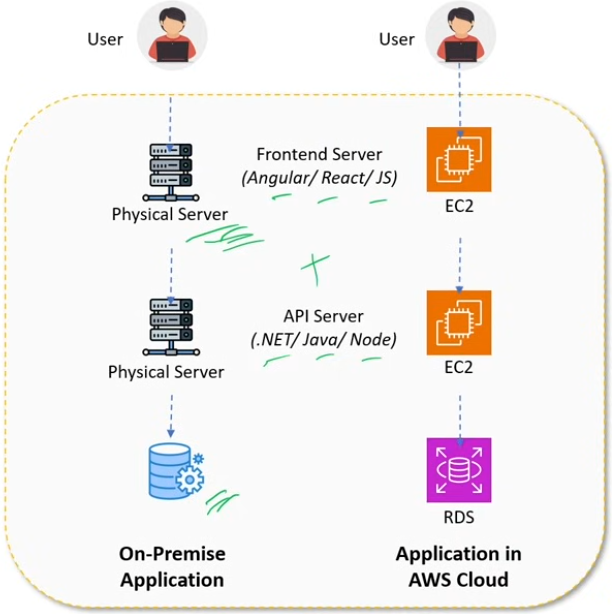

---

### 📋 5 Core Characteristics of Cloud Computing (NIST Definition)

| Characteristic | Description | Example |
|----------------|-------------|---------|
| **On-demand self-service** | Provision resources instantly, no human needed | Launch EC2 in 60 seconds |
| **Broad network access** | Access from any device via the internet | Manage AWS from phone, laptop, CLI |
| **Resource pooling** | Shared infrastructure across customers | Multiple companies share AWS data centres |
| **Rapid elasticity** | Scale up or down in minutes | Auto Scaling adds EC2s during traffic spikes |
| **Measured service** | Pay only for what you consume | Billed per second/hour for EC2 |

### 💡 Interview Tips

> 🔥 **One-liner:** "Cloud computing is renting IT infrastructure over the internet instead of owning it. AWS is Amazon's cloud platform with 200+ services — compute, storage, databases, AI, and more."

> 🔥 **Market share stat:** AWS holds ~31% of the global cloud market — the #1 provider, ahead of Azure (~25%) and Google Cloud (~11%).

---

<a name="q2"></a>
## ❓ Q2. What are the 5 Advantages of Using AWS Over On-Premises?

### 📖 Definition

Advantages of using AWS cloud:

1. **Cost Savings:** Pay-as-you-go model — no need to buy expensive hardware; pay only for what you use. No maintenance costs.
2. **Auto-scaling & Flexibility:** Automatically increases or decreases resources based on demand. Instant loads can be handled.
3. **High Availability:** 99.99% uptime SLA, means more reliable than traditional servers.
4. **Disaster Recovery:** Automated disaster recovery and data backup because data is stored across multiple data centers.
5. **Advanced Security:** AWS uses AI-driven threat detection, encryption, and multi-layer security.

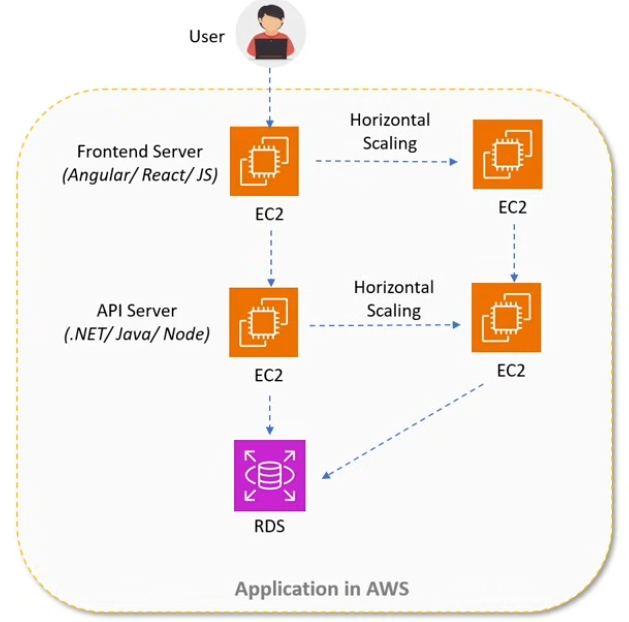

---

### 📋 On-Premises vs AWS — Full Comparison

| Aspect | On-Premises | AWS Cloud |
|--------|------------|-----------|
| **Upfront Cost** | High — buy servers, hardware, licenses | Zero — pay-as-you-go |
| **Maintenance** | Your IT team handles everything | AWS manages physical infrastructure |
| **Scaling** | Slow — order and install hardware | Instant — minutes to scale |
| **Availability** | Depends on your setup | 99.99% SLA per service |
| **Disaster Recovery** | Manual, expensive | Built-in, automated across AZs |
| **Security** | You manage fully | Shared responsibility model |
| **Global Reach** | Limited to your servers' location | 30+ Regions, 100+ Edge Locations |

### 💡 Interview Tips

> 🔥 **Memory trick (C-A-H-D-S):** **C**ost savings → **A**uto-scaling → **H**igh availability → **D**isaster recovery → **S**ecurity.

> 🔥 **Extra point:** AWS offers **global reach** — deploy in 30+ regions worldwide, giving users low-latency access regardless of location — impossible to replicate cost-effectively on-premises.

---

<a name="q3"></a>
## ❓ Q3. What are the Main Cloud Service Models? Difference Between IaaS, PaaS, and SaaS?

### 📖 Definition

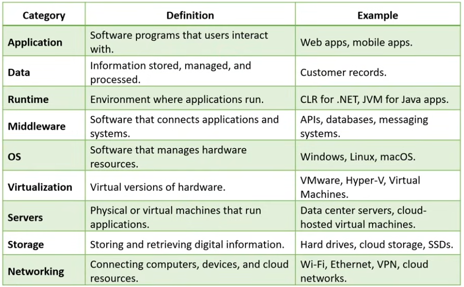

---

### 📋 IaaS vs PaaS vs SaaS — Quick Reference

| Model | You Manage | AWS Manages | AWS Example |
|-------|-----------|-------------|-------------|
| **IaaS** | App + Data + Runtime + Middleware + OS | Virtualisation + Servers + Storage + Networking | EC2 |
| **PaaS** | App + Data only | Everything else | Elastic Beanstalk, RDS |
| **SaaS** | Nothing — just use it | Everything | WorkMail, Chime |
| **On-Premises** | Everything | Nothing | Your own data centre |

### 📋 The 9 Infrastructure Layers (Know for Follow-ups)

| Layer | Description | Example |
|-------|-------------|---------|
| Application | Software users interact with | Web app, mobile app |
| Data | Information stored and processed | Customer records |
| Runtime | Environment where apps run | CLR for .NET, JVM for Java |
| Middleware | Connects applications and systems | APIs, databases, messaging |
| OS | Manages hardware resources | Windows, Linux, macOS |
| Virtualisation | Virtual versions of hardware | VMware, Hyper-V |
| Servers | Physical or virtual machines | Data centre servers |
| Storage | Storing digital information | Hard drives, cloud storage |
| Networking | Connecting devices and cloud resources | Wi-Fi, Ethernet, VPN |

### 💡 Interview Tips

> 🔥 **Pizza memory trick:** IaaS = bake at home (AWS gives you kitchen/hardware), PaaS = take & bake (AWS gives you dough/runtime, you add your app), SaaS = delivery pizza (just use it, AWS does everything).

---

<a name="q4"></a>
## ❓ Q4. What is the AWS Shared Responsibility Model?

### 📖 Definition

The AWS Shared Responsibility Model defines who is responsible for what when using AWS cloud services. It splits responsibilities between AWS and the customer (company).

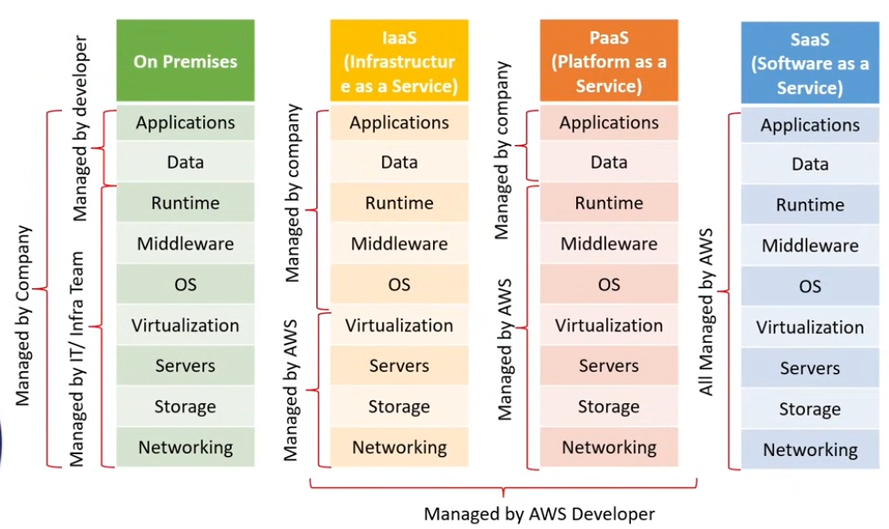

---

### 📋 Responsibility Split at a Glance

| Responsibility | AWS ("Security OF the Cloud") | Customer ("Security IN the Cloud") |
|---------------|-------------------------------|-------------------------------------|
| Physical data centres | ✅ | ❌ |
| Virtualisation / hypervisor | ✅ | ❌ |
| Global network infrastructure | ✅ | ❌ |
| Guest OS patching (EC2) | ❌ | ✅ |
| Application code security | ❌ | ✅ |
| IAM / access control | ❌ | ✅ |
| Data encryption choices | Tools provided | ✅ You enable it |
| VPC / Security Group config | ❌ | ✅ |

### 💡 Interview Tips

> 🔥 **Simple summary:** AWS owns **security OF the cloud** (hardware, facilities). You own **security IN the cloud** (your data, OS patches, who has access, encryption choices).

> 🔥 **Model shifts by service:** EC2 (IaaS) — you patch OS. RDS (PaaS) — AWS patches the DB engine. SaaS — AWS manages everything.

---

<a name="q5"></a>
## ❓ Q5. Your Team Wants to Avoid Purchasing Servers for a New App. What AWS Model Would You Suggest?

### ✅ Answer: Use PaaS (Platform as a Service) like AWS Elastic Beanstalk.

### 📖 Explanation

These models allow you to focus only on your application code without buying or managing physical servers. AWS handles all the infrastructure, scaling, and maintenance. It's fast, cost-effective, and perfect for launching new applications quickly.

### 📋 Why PaaS for This Scenario

| Concern | PaaS Solution |
|---------|--------------|
| Don't want to buy servers | AWS provisions EC2 automatically |
| Don't want to manage OS | AWS handles OS updates and patches |
| Need auto-scaling | Built in — scales with traffic |
| Fast deployment needed | Upload code → live in minutes |
| Limited DevOps resource | AWS manages load balancing and monitoring |

### 💡 Interview Tips

> 🔥 **Specific services to mention:** Elastic Beanstalk for web apps/REST APIs, App Runner for container apps, Lambda for event-driven serverless workloads.

> 🔥 **Key phrase:** "PaaS lets the team focus on business logic rather than infrastructure management — reducing time-to-market and operational overhead."

---

<a name="q6"></a>
## ❓ Q6. Your Client Wants to Use Their Existing On-Prem Server with AWS. What Cloud Model Fits Best?

### ✅ Answer: Hybrid Cloud

### 📖 Explanation

Hybrid Cloud lets you connect your on-premise servers with AWS cloud services. It helps you gradually shift to the cloud while still using your existing hardware. It's best for companies who need to keep some data local due to security or compliance.

### 📋 Hybrid Cloud Use Cases

| Scenario | Why Hybrid |
|---------|------------|
| Banking data must stay on-premises (regulation) | Keep sensitive DB on-prem, run app tier on AWS |
| Gradual cloud migration | Move services one-by-one, not all at once |
| Legacy systems that can't move to cloud | Keep legacy on-prem, new services on AWS |
| Low-latency local processing needed | Process locally, sync results to AWS |

### 💡 Interview Tips

> 🔥 **AWS Hybrid services to mention:** AWS Direct Connect (private fibre line to AWS), AWS VPN (encrypted tunnel over internet), AWS Outposts (AWS hardware rack in your data centre), AWS Storage Gateway (sync on-prem storage to S3).

---

<a name="q7"></a>
## ❓ Q7. Who is Responsible for Patching the OS in IaaS, PaaS, and SaaS?

### ✅ Answer: IaaS — You | PaaS — Shared | SaaS — AWS

### 📖 Explanation

In IaaS, you manage the OS yourself. In PaaS, AWS handles the OS, but you manage your app. In SaaS, AWS manages everything including the OS. The responsibility shifts more to AWS as you move from IaaS to SaaS.

### 📋 OS Patching by Model

| Model | OS Patching | DB Patching | App Patching | Example |
|-------|------------|------------|--------------|---------|
| **IaaS (EC2)** | ✅ You | ✅ You | ✅ You | Install MySQL on EC2 — you patch all |
| **PaaS (Beanstalk)** | ✅ AWS | ✅ AWS | ✅ You | You only update your app code |
| **PaaS (RDS)** | ✅ AWS | ✅ AWS | N/A | AWS applies DB engine updates |
| **SaaS** | ✅ AWS | ✅ AWS | ✅ AWS | Just log in and use it |

### 💡 Interview Tips

> 🔥 **Memory rule:** The higher up the stack you move, the less you patch. IaaS = patch everything from OS up. SaaS = patch nothing.

---

<a name="q8"></a>
## ❓ Q8. What are the Main Categories of AWS Services? What are the Top 25 Services?

### 📖 Definition

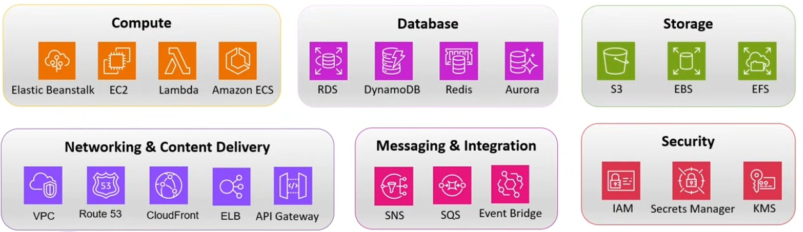

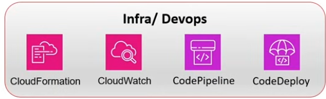

---

### 📋 Top 25 AWS Services — Quick Reference

| # | Service | Category | Purpose |
|---|---------|----------|---------|
| 1 | **EC2** | Compute | Virtual servers in the cloud |
| 2 | **Lambda** | Compute | Serverless event-driven code execution |
| 3 | **Elastic Beanstalk** | Compute | Deploy apps without managing infra (PaaS) |
| 4 | **ECS** | Compute | Run Docker containers at scale |
| 5 | **S3** | Storage | Object storage — images, videos, backups |
| 6 | **EBS** | Storage | Block storage attached to EC2 |
| 7 | **EFS** | Storage | Shared file system across EC2 instances |
| 8 | **RDS** | Database | Managed relational DB (MySQL, PostgreSQL…) |
| 9 | **DynamoDB** | Database | Managed NoSQL key-value database |
| 10 | **Aurora** | Database | High-performance MySQL/PostgreSQL DB |
| 11 | **ElastiCache (Redis)** | Database | In-memory cache for fast data retrieval |
| 12 | **VPC** | Networking | Isolated private network within AWS |
| 13 | **Route 53** | Networking | DNS and global traffic routing |
| 14 | **CloudFront** | Networking | CDN — fast content delivery via edge locations |
| 15 | **ELB** | Networking | Load balancer — distribute traffic across EC2s |
| 16 | **API Gateway** | Networking | Create and manage REST/WebSocket APIs |
| 17 | **SNS** | Messaging | Pub/sub push notifications to many subscribers |
| 18 | **SQS** | Messaging | Message queue — decouple services asynchronously |
| 19 | **EventBridge** | Messaging | Event-driven architecture and routing |
| 20 | **IAM** | Security | Control who can access what in AWS |
| 21 | **Secrets Manager** | Security | Store and rotate secrets / API keys |
| 22 | **KMS** | Security | Create and manage encryption keys |
| 23 | **CloudFormation** | Infra/DevOps | Infrastructure as Code — YAML/JSON templates |
| 24 | **CloudWatch** | Infra/DevOps | Monitoring, logging, and alerting |
| 25 | **CodePipeline / CodeDeploy** | Infra/DevOps | CI/CD pipeline for automated deployments |

---

<a name="q9"></a>
## ❓ Q9. What is Hybrid Cloud?

### 📖 Definition

**Hybrid Cloud = On-premises + AWS cloud**

Hybrid Cloud means combining on-premises infrastructure (like your own data center or servers) with AWS cloud services, so they work together.

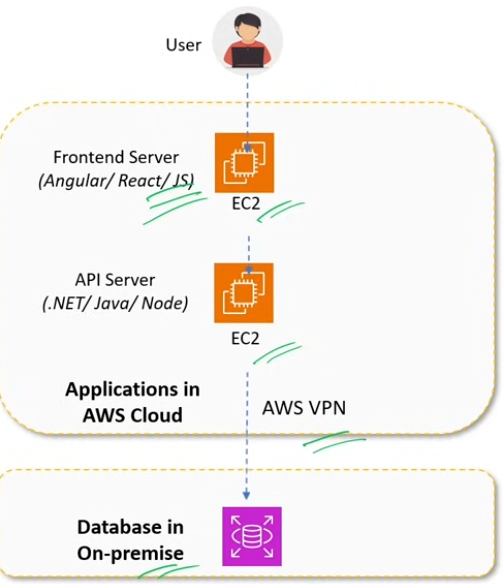

---

### 📋 Cloud Deployment Models Compared

| Model | Infrastructure Location | Use Case |
|-------|------------------------|---------|
| **On-Premises** | Fully in your own data centre | Full control, strict compliance |
| **Public Cloud** | Fully in AWS | Cost-effective, scalable, modern apps |
| **Hybrid Cloud** | Mix — some on-prem, some AWS | Gradual migration, compliance, legacy |
| **Multi-Cloud** | AWS + Azure + GCP | Avoid vendor lock-in, best-of-breed |

### 💡 Interview Tips

> 🔥 **Real scenario:** A bank keeps financial data on-premises (regulatory requirement) but runs its customer-facing web app on AWS EC2. The app connects to the on-prem DB via AWS Direct Connect for low-latency, secure access.

---

<a name="q10"></a>
## ❓ Q10. What is a Resource in AWS? How is it Different from a Service in AWS?

### 📖 Definition

**AWS Service** — A service is a tool or feature offered by AWS to perform tasks like computing, storage, networking, or security.

**AWS Resource** — A resource in AWS is an instance of a service that you can create, configure, and use in the cloud.

For example, AWS Service is like a **class** and AWS Resource is like an **object or instance** of that class.

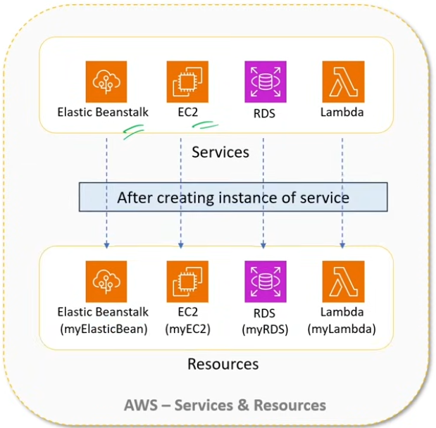

---

### 📋 Service vs Resource Examples

| AWS Service | Resource You Create | Example Name |
|-------------|---------------------|--------------|
| Amazon EC2 | A specific virtual machine | `myWebServer` |
| Amazon S3 | A specific storage bucket | `my-app-uploads-bucket` |
| Amazon RDS | A specific database instance | `myProductionDB` |
| AWS Lambda | A specific function | `myOrderProcessor` |
| AWS IAM | A specific user | `AdminUser` |

### 💡 Interview Tips

> 🔥 **Key billing point:** You don't pay for a **service** — you pay for the **resources** you create. EC2 costs nothing to know about; the EC2 instances you actually run incur charges.

> 🔥 **ARN:** Every AWS resource has a unique identifier — an ARN (Amazon Resource Name). Format: `arn:aws:ec2:us-east-1:123456789:instance/i-0abc1234`

---

<a name="q11"></a>
## ❓ Q11. What are Resource Groups in AWS? What are AWS Tags?

### 📖 Definition

**Resource Group** is a logical collection of related AWS resources which can be managed together.

**Why to use?** — It allows you to manage, organize, and control resources efficiently.

**AWS Tags** are key-value pairs (like `Project: Website` or `Environment: Dev`) that you assign to AWS resources to organize, manage, and group them.

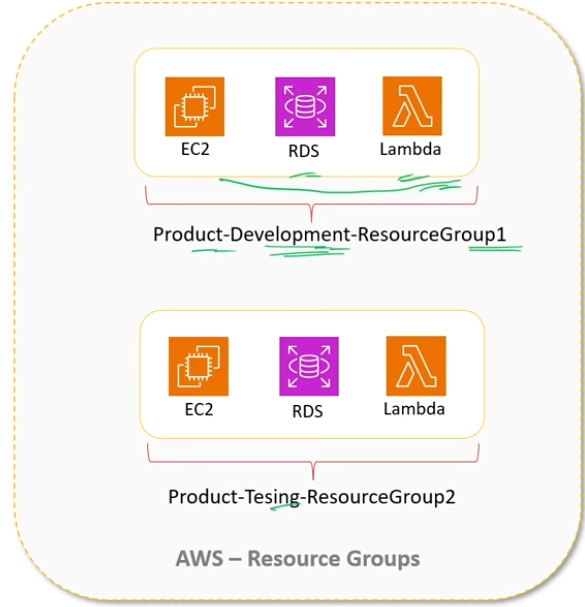

---

### 📋 Common Tagging Strategy

| Tag Key | Example Values | Purpose |
|---------|----------------|---------|
| `Environment` | `Dev`, `Staging`, `Production` | Separate environments |
| `Project` | `WebApp`, `DataPipeline` | Group by project |
| `Owner` | `team-backend`, `john@company.com` | Track who owns resources |
| `CostCenter` | `Marketing`, `Engineering` | Allocate cloud costs by department |
| `AutoStop` | `true`, `false` | Automation — stop dev instances overnight |

### 💡 Interview Tips

> 🔥 **Tags = Cost visibility:** AWS Cost Explorer breaks down your bill by tag — see exactly how much `Project: WebApp` vs `Project: DataPipeline` costs. Essential for multi-team organisations.

> 🔥 **Resource Groups + Systems Manager:** Run commands across all EC2 instances tagged `Environment: Production` at once — e.g., apply a patch to all production servers in one action.

---

<a name="q12"></a>
## ❓ Q12. What are AWS Regions and Availability Zones? How are they Different?

### 📖 Definition

**AWS Region** is a geographical area where AWS has multiple data centers.

**AWS Availability Zone** is a physically separate data center within an AWS Region.

It ensures high availability by protecting your application from failure in a single data center.

---

### 📋 Regions vs Availability Zones

| Feature | AWS Region | Availability Zone (AZ) |
|---------|-----------|------------------------|
| **Definition** | Geographical area containing multiple data centres | One physically separate data centre within a Region |
| **Count** | 30+ Regions worldwide | 2–6 AZs per Region |
| **Connected by** | AWS global backbone | High-speed low-latency private fibre links |
| **Choose based on** | User location, compliance, service availability | Deploy across AZs for high availability |
| **Example** | `ap-south-1` (Mumbai) | `ap-south-1a`, `ap-south-1b`, `ap-south-1c` |

```
🌍 AWS GLOBAL STRUCTURE
│
├── Region: US East (N. Virginia) — us-east-1
│   ├── AZ: us-east-1a  ← separate physical building
│   ├── AZ: us-east-1b  ← separate physical building
│   └── AZ: us-east-1c  ← separate physical building
│
└── Region: Asia Pacific (Mumbai) — ap-south-1
    ├── AZ: ap-south-1a
    └── AZ: ap-south-1b
```

### 💡 Interview Tips

> 🔥 **Why multiple AZs?** If one AZ has a power failure or disaster, your app keeps running in other AZs. ELB, RDS Multi-AZ, and Auto Scaling Groups all distribute across AZs automatically.

> 🔥 **Region selection factors:** (1) Latency — closest to your users, (2) Compliance — GDPR requires EU data in EU, (3) Service availability — not all services in every region, (4) Cost — pricing varies by region.

---

<a name="q13"></a>
## ❓ Q13. What are AWS Compute Services? Name the Top 5.

### 📖 Definition

AWS Compute Services provide cloud-based processing power, auto-scaling, and execution environments for applications.

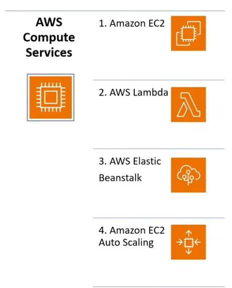

---

### 📋 Top 5 Compute Services Compared

| # | Service | Type | Best For |
|---|---------|------|---------|
| 1 | **Amazon EC2** | IaaS — Virtual Machines | Full OS control, custom environments, long-running apps |
| 2 | **AWS Lambda** | Serverless | Event-driven short tasks, pay per execution |
| 3 | **AWS Elastic Beanstalk** | PaaS | Deploy web apps/APIs without configuring infrastructure |
| 4 | **EC2 Auto Scaling** | Scaling | Automatically add/remove EC2s based on traffic rules |
| 5 | **Amazon ECS / EKS** | Containers | Run and orchestrate Docker containers at scale |

### 💡 Interview Tips

> 🔥 **Decision guide:** Need full OS control → EC2 | Short event-driven tasks → Lambda | Just deploy a web app → Elastic Beanstalk | Running containers → ECS/EKS.

---

<a name="q14"></a>
## ❓ Q14. What are Amazon EC2 Instances? When Would You Use Them in a Project?

### 📖 Definition

Amazon EC2 Instances are cloud-based virtual servers that allow users to run applications without needing to buy or manage physical hardware.

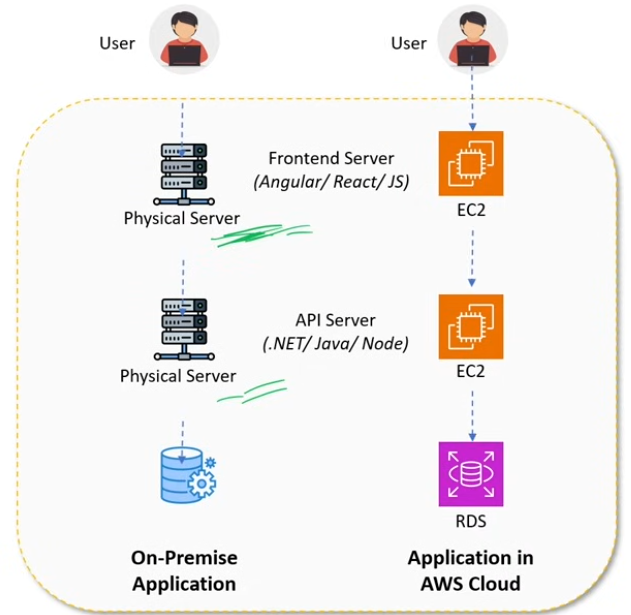

---

### 📋 When to Use EC2

| Scenario | Why EC2 |
|---------|---------|
| Lift-and-shift migration | Move existing on-prem app to cloud as-is |
| Custom OS / runtime needed | Install any software on any Linux/Windows distro |
| Long-running web or API servers | Runs 24/7, persistent process |
| Database on custom setup | Full control (though RDS is usually preferred) |
| ML model training | GPU instances available (p3, p4 families) |

### 📋 Key EC2 Concepts to Know

| Concept | Description |
|---------|-------------|
| **AMI** | Amazon Machine Image — OS + software template to launch instances |
| **Instance Type** | Defines CPU, RAM, storage (e.g. `t3.micro`, `m5.large`) |
| **Key Pair** | SSH keys to securely connect to your instance |
| **Security Group** | Virtual firewall — controls inbound/outbound traffic |
| **Elastic IP** | Static public IP you can attach to an instance |
| **User Data** | Bootstrap script that runs when instance first starts |

---

<a name="q15"></a>
## ❓ Q15. What are the Differences Between Horizontal and Vertical Scaling? When to Use What?

### 📖 Definition

| Horizontal Scaling (Scale-Out/In) | Vertical Scaling (Scale-Up/Down) |
|----------------------------------|----------------------------------|
| Adds more EC2 instances | Increases the size of a single EC2 instance (CPU/RAM) |
| Best for Stateless applications (Microservices, Web Apps) | Best for Stateful applications (Monolithic Apps) |
| More cost-effective — auto scaling possible using Auto Scaling Groups | Expensive — auto scaling is not possible |

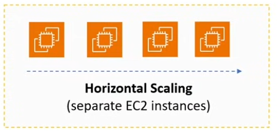

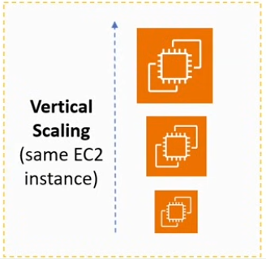

---

### 📋 Extended Comparison

| Feature | Horizontal Scaling | Vertical Scaling |
|---------|-------------------|-----------------|
| **How** | Add more instances | Upgrade the same instance (bigger CPU/RAM) |
| **Downtime** | None — add without stopping existing | Usually requires instance restart |
| **Limit** | Virtually unlimited | Capped by the largest available instance type |
| **Auto Scaling** | ✅ Yes — via Auto Scaling Groups | ❌ Not automatic |
| **Fault tolerance** | High — other instances keep running if one fails | Low — single point of failure |
| **Best for** | Web apps, APIs, stateless microservices | Databases, legacy monolithic apps |

### 💡 Interview Tips

> 🔥 **Memory trick:** Horizontal = more servers side-by-side (adding lanes to a highway). Vertical = bigger server (widening each lane). Horizontal is almost always preferred in AWS — automated, fault-tolerant, cost-effective.

> 🔥 **Stateless vs Stateful:** Stateless apps (REST APIs) scale horizontally because any instance handles any request. Stateful apps (traditional databases) are harder — state must be shared across instances.

---

<a name="q16"></a>
## ❓ Q16. What are AWS Auto Scaling Groups / EC2 Auto Scaling?

### 📖 Definition

An Auto Scaling Group service is a set of EC2 instances that automatically scale based on traffic or custom rules which you can set.

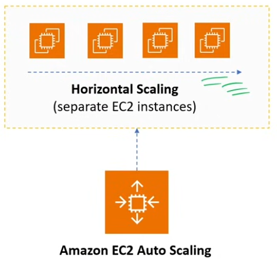

---

### 📋 Auto Scaling Group — Key Settings

| Setting | Description | Example |
|---------|-------------|---------|
| **Minimum capacity** | Fewest EC2s that always run | `2` — always 2 instances minimum |
| **Maximum capacity** | Most EC2s allowed | `10` — never exceed 10 |
| **Desired capacity** | Target under normal load | `4` — ideal at normal traffic |
| **Scaling policy** | Rule that triggers scaling | Scale out when CPU > 70% for 5 min |
| **Launch template** | EC2 config for new instances | AMI, instance type, security group |

### 💡 Interview Tips

> 🔥 **ASG always works with a Load Balancer** — ASG adds/removes instances, the ELB automatically distributes traffic to all healthy instances.

> 🔥 **Scaling types:** Target Tracking (keep CPU at 50%), Step Scaling (add 2 instances per 20% CPU above threshold), Scheduled Scaling (add at 9am, remove at 6pm).

---

<a name="q17"></a>
## ❓ Q17. What are EC2 Instance Types?

### 📖 Definition

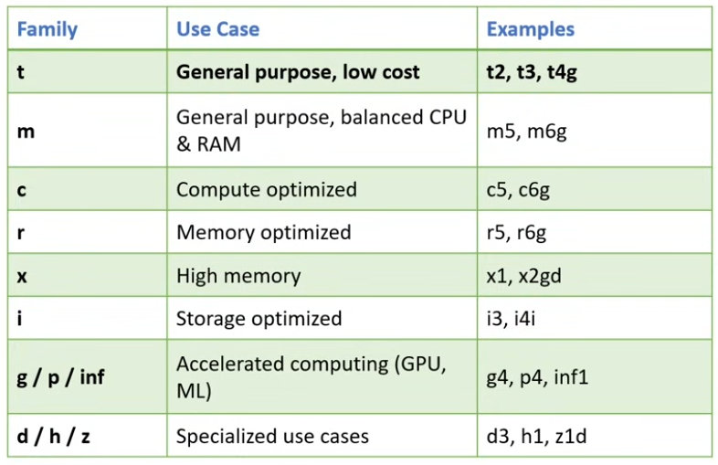

---

### 📋 Instance Family Summary

| Family | Optimised For | Examples | Use Case |
|--------|--------------|---------|---------|
| **t** | General purpose, low cost (burstable) | t3.micro, t3.small | Dev/test, low-traffic sites |
| **m** | General purpose, balanced CPU & RAM | m5.large, m6g.xlarge | Web servers, small DBs |
| **c** | Compute optimised | c5.xlarge, c6g.2xlarge | High-performance APIs, batch jobs |
| **r** | Memory optimised | r5.large, r6g.xlarge | In-memory caches, analytics |
| **x** | High memory | x1.16xlarge, x2gd | SAP HANA, large in-memory DBs |
| **i** | Storage optimised | i3.large, i4i.xlarge | High I/O databases, NoSQL |
| **g / p / inf** | GPU / ML accelerated | g4dn, p3, inf1 | ML training, video encoding |
| **d / h / z** | Specialised | d3.xlarge, h1, z1d | Dense storage, high-frequency trading |

### 💡 Interview Tips

> 🔥 **Naming convention:** `m5.2xlarge` — `m` = family, `5` = generation (higher = better performance), `2xlarge` = size. Always prefer newer generations for better price/performance.

> 🔥 **Free tier:** `t3.micro` is part of the AWS Free Tier (750 hours/month for 12 months) — ideal for learning and dev/test.

---

<a name="q18"></a>
## ❓ Q18. What are On-Demand, Reserved, and Spot Instances?

### 📖 Definition

**On-Demand Instance:** Pay only for what you use, with no commitment. Ideal for short-term or unpredictable workloads.

**Reserved Instance:** Pre-book a server for 1 or 3 years and save money. Best for steady, long-term use.

**Spot Instance:** Buy unused capacity at huge discounts. Can be interrupted anytime. Great for flexible or batch jobs.

---

### 📋 All EC2 Pricing Models Compared

| Pricing Type | Commitment | Discount vs On-Demand | Best For | Risk |
|-------------|-----------|----------------------|---------|------|
| **On-Demand** | None | 0% (baseline) | Dev/test, unpredictable workloads | None |
| **Reserved (1yr)** | 1 year | Up to 40% | Steady production workloads | Low |
| **Reserved (3yr)** | 3 years | Up to 72% | Long-term stable applications | Medium |
| **Spot** | None | Up to 90% | Batch jobs, ML training | High — 2-min termination notice |
| **Savings Plans** | 1 or 3 year $/hr | Up to 66% | Mix of instance types/regions | Low |
| **Dedicated Host** | On-demand or reserved | 0–70% | Compliance, BYOL software | None |

### 💡 Interview Tips

> 🔥 **Spot termination:** AWS gives a 2-minute warning before terminating a Spot instance. Design apps to checkpoint state to SQS or S3 to handle interruption gracefully.

> 🔥 **Smart cost strategy:** Reserved for baseline load (always-on), On-Demand for predictable spikes, Spot for batch/ML jobs. This combination can cut EC2 bills by 60–70%.

---

<a name="q19"></a>
## ❓ Q19. What is AWS Elastic Beanstalk? For What Purpose Can You Use It?

### 📖 Definition

AWS Elastic Beanstalk is a fully managed Platform-as-a-Service (PaaS) that enables developers to deploy and scale web applications and services without managing the infrastructure.

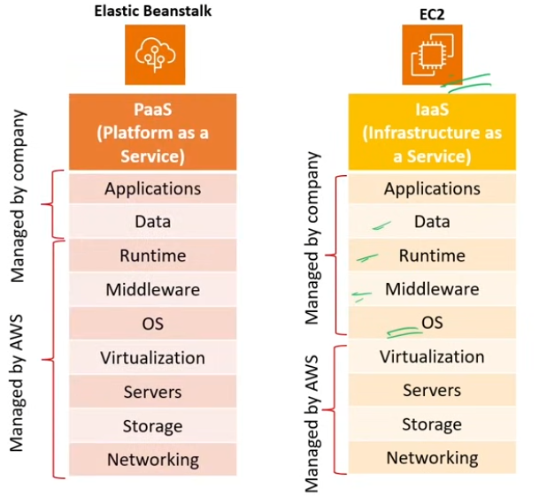

---

### 📋 What Elastic Beanstalk Manages For You

```
YOU:   Upload your code (.NET / Java / Node.js / Python / PHP / Ruby / Go / Docker)
         ↓
AWS:   Provisions EC2 instances
       Sets up Elastic Load Balancer
       Configures Auto Scaling Group
       Connects CloudWatch monitoring
       Applies OS and platform updates
         ↓
RESULT: Your app is live — you manage only your code!
```

### 💡 Interview Tips

> 🔥 **Elastic Beanstalk is FREE** — you only pay for the underlying EC2, RDS, and other resources it provisions. No additional charge for the orchestration layer.

> 🔥 **Under the hood:** Beanstalk uses EC2 internally. Unlike true serverless (Lambda), you can still SSH into the EC2 instances for debugging if needed.

---

<a name="q20"></a>
## ❓ Q20. What are the 5 Main Features / Advantages of AWS Elastic Beanstalk?

### 📖 Definition

Features of AWS Elastic Beanstalk:

1. **Supports Multiple Programming Languages:** .NET, Java, Python, Node.js, PHP, Ruby.
2. **Built-in Scalability:** Automatically scales up/down based on traffic.
3. **Fully Managed:** AWS handles OS updates, security, and maintenance.
4. **High Availability:** Supports auto-failover & backups.
5. **Secure & Compliant:** Built-in authentication.

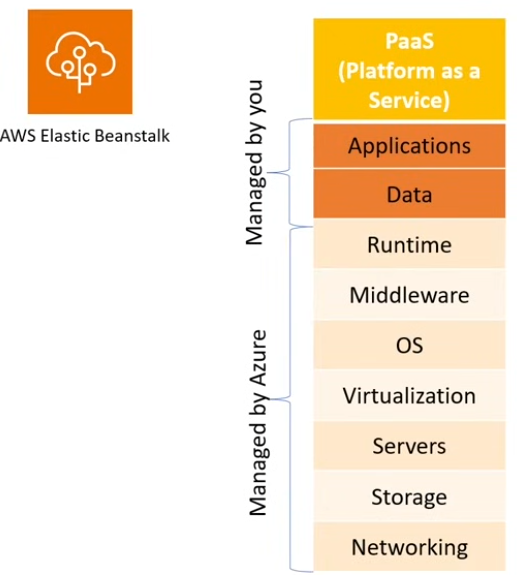

---

### 📋 Elastic Beanstalk vs EC2 vs Lambda

| Feature | Elastic Beanstalk | EC2 | Lambda |
|---------|------------------|-----|--------|
| **Type** | PaaS | IaaS | Serverless |
| **Setup effort** | Low | High | Very Low |
| **OS control** | Limited | Full | None |
| **Scaling** | Auto-managed | Manual or ASG | Fully automatic |
| **Pricing** | Pay for underlying EC2/RDS | Pay per uptime | Pay per request |
| **Best for** | Web apps, REST APIs | Custom server needs | Event-driven functions |

---

<a name="q21"></a>
## ❓ Q21. What are AWS Lambda Functions? Have You Ever Used Them in a Project?

### 📖 Definition

AWS Lambda is a serverless compute service that lets you run code in response to events, without managing servers.

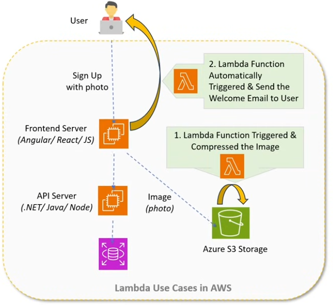

---

### 📋 Lambda — Key Concepts

| Concept | Description |
|---------|-------------|
| **Trigger** | Event that invokes Lambda (S3 upload, API Gateway, SQS, schedule) |
| **Handler** | The entry-point function in your code |
| **Runtime** | Language — Node.js, Python, Java, .NET, Go, Ruby |
| **Memory** | 128MB to 10GB — you configure |
| **Timeout** | Max execution time — up to 15 minutes |
| **Concurrency** | Scales automatically — many parallel instances |

### 📋 Common Lambda Trigger Events

| Trigger Source | Use Case |
|---------------|---------|
| **API Gateway** | Build REST APIs without a server |
| **S3 Event** | Process uploaded file (resize image, parse CSV) |
| **SQS Message** | Process queue messages asynchronously |
| **CloudWatch Events** | Scheduled tasks (cron jobs) |
| **DynamoDB Stream** | React to database changes in real time |
| **SNS Notification** | Send emails or SMS on events |

### 💡 Interview Tips

> 🔥 **Lambda pricing:** First 1 million requests per month are FREE. After that $0.20 per million. Also charged per GB-second of compute. Very cost-effective for infrequent or bursty workloads.

> 🔥 **Cold start:** Lambda has a startup delay when a function hasn't run recently. Use Provisioned Concurrency for latency-sensitive functions to keep them warm.

---

<a name="q22"></a>
## ❓ Q22. Why Not Include the Lambda Function Code Directly Within the Main Application?

### 📖 Definition

Because AWS Lambda runs independently, it improves the performance of the main application by keeping it lighter, faster, and easier to maintain.

---

### 📋 Benefits of Keeping Lambda Separate

| Benefit | Explanation |
|---------|-------------|
| **Performance** | Main app doesn't wait for heavy background tasks |
| **Scalability** | Lambda scales independently — thousands of parallel executions |
| **Decoupling** | Change Lambda code without touching the main application |
| **Cost** | Lambda only runs and bills when triggered — not 24/7 |
| **Maintainability** | Smaller focused functions — easier to test and debug |

### 💡 Interview Tips

> 🔥 **Real example:** User registers → Main app saves to DB instantly (fast response to user) → Triggers Lambda async → Lambda compresses profile photo, sends welcome email, updates analytics. Heavy work happens in background, user gets instant feedback.

---

<a name="q23"></a>
## ❓ Q23. What Exactly is Serverless in AWS? Is it Truly Server-less?

### 📖 Definition

Serverless in AWS means running code without managing servers.

No, it's not truly "server-less" — servers still exist, but you don't manage them.

---

### 📋 Serverless vs Traditional

| Aspect | Traditional (EC2) | Serverless (Lambda) |
|--------|------------------|---------------------|
| **You provision servers** | ✅ Yes | ❌ No |
| **You patch OS** | ✅ Yes | ❌ No |
| **You manage scaling** | ✅ Yes (via ASG) | ❌ No — automatic |
| **You pay for** | Uptime (even when idle) | Actual execution time only |
| **Max run time** | Unlimited | 15 minutes |
| **Best for** | Long-running services | Short event-driven tasks |

### 💡 Interview Tips

> 🔥 **Full serverless stack on AWS:** Lambda (compute) + API Gateway (HTTP) + DynamoDB (database) + S3 (storage) + SNS/SQS (messaging) = build a complete app with zero server management.

---

<a name="q24"></a>
## ❓ Q24. What is Amazon RDS? How is it Different from a Regular Database?

### 📖 Definition

Amazon RDS is a fully managed, cloud-based relational database service from AWS.

It is offered as a Platform as a Service (PaaS).

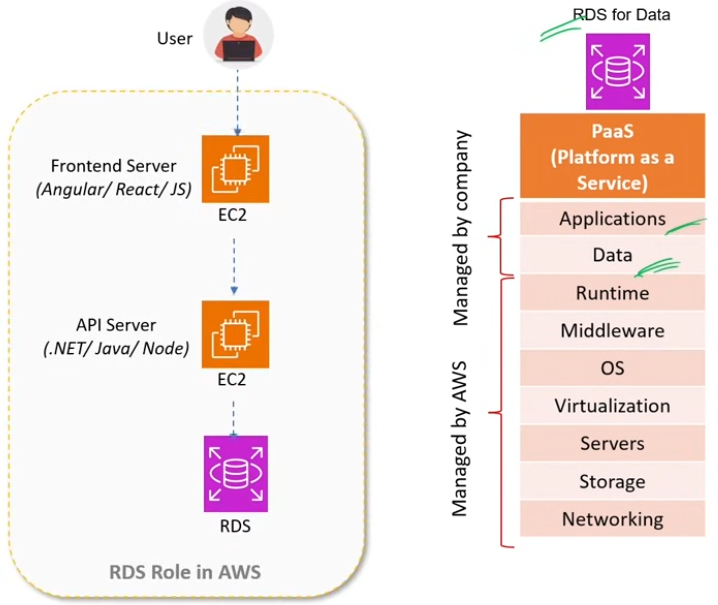

---

### 📋 RDS vs Self-Managed Database on EC2

| Feature | Amazon RDS (Managed) | DB on EC2 (Self-managed) |
|---------|---------------------|--------------------------|
| **Setup time** | Minutes — click to deploy | Hours — manual install and configure |
| **OS patching** | AWS does it | You do it |
| **DB engine patching** | AWS does it | You do it |
| **Automated backups** | Daily + point-in-time restore | You script it manually |
| **High availability** | Multi-AZ with one click | Complex manual replication setup |
| **Read replicas** | Built-in, one click | Manual replication configuration |
| **Monitoring** | CloudWatch integrated | Manual setup |
| **OS-level access** | Limited (by design) | Full — you own the server |

### 📋 Supported RDS Database Engines

MySQL · PostgreSQL · MariaDB · Oracle · SQL Server · IBM Db2

### 💡 Interview Tips

> 🔥 **RDS Multi-AZ:** Creates a standby replica in another AZ. If primary fails, AWS automatically fails over in 1–2 minutes with zero data loss. Always use Multi-AZ for production.

> 🔥 **RDS Read Replicas:** Read-only copies for offloading read traffic. Use for reporting, analytics, and read-heavy workloads. Can be promoted to standalone DB if needed.

---

<a name="q25"></a>
## ❓ Q25. What is the Difference Between Amazon RDS and Amazon RDS Custom?

### 📖 Definition

| Feature | Amazon RDS (Standard) | Amazon RDS Custom |
|---------|----------------------|-------------------|
| **Control over OS & DB** | No — fully managed by AWS | Yes — you can access OS, DB, configurations |
| **Who manages Patching/Backups** | AWS manages it | You manage it manually |
| **Custom DB Configurations** | Limited | Full flexibility (init scripts, agents) |
| **Use Case** | Typical web apps, internal tools | Legacy apps, custom DB needs, 3rd-party tools |

### 💡 Interview Tips

> 🔥 **When to use RDS Custom:** When you need to install 3rd-party agents on the DB server, run custom OS-level scripts, or migrate legacy Oracle/SQL Server apps that require full DB access.

> 🔥 **RDS Custom still manages** backups, snapshots, and Multi-AZ replication — it just adds OS-level access that standard RDS intentionally restricts.

---

<a name="q26"></a>
## ❓ Q26. Your Global App Needs a NoSQL Database with Great Response Times. What Would You Choose?

### ✅ Answer: Amazon DynamoDB

### 📖 Explanation

DynamoDB is a fully managed, multi-Region NoSQL database that provides low-latency reads/writes at any scale. It supports global tables, which makes it perfect for apps with a worldwide user base.

### 📋 Why DynamoDB for This Scenario

| Requirement | DynamoDB Feature |
|------------|-----------------|
| Global availability | Global Tables — replicate to multiple regions automatically |
| Low latency | Single-digit millisecond response times |
| NoSQL flexibility | Key-value and document data model |
| Massive scale | Handles millions of requests per second |
| Fully managed | No servers, no OS patches |
| Cost flexibility | On-demand or provisioned capacity modes |

### 💡 Interview Tips

> 🔥 **DynamoDB Accelerator (DAX):** In-memory cache for DynamoDB — reduces read latency from milliseconds to microseconds. Use when you need extreme read speeds.

---

<a name="q27"></a>
## ❓ Q27. What is a Virtual Private Cloud (VPC) in AWS? Why Do We Need It?

### 📖 Definition

A Virtual Private Cloud (VPC) is a private network in AWS where you can place your cloud resources like EC2 instances and databases.

AWS automatically creates a default VPC in each region.

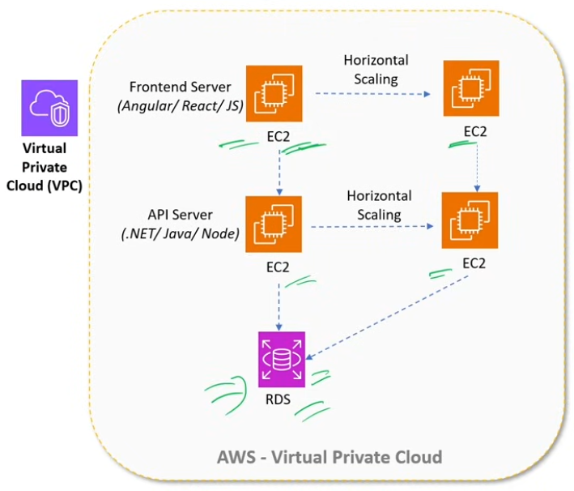

---

### 📋 VPC Core Components

| Component | Purpose |
|-----------|---------|
| **Subnet** | Logical division — public (internet-facing) or private (internal) |
| **Internet Gateway** | Allows public subnet resources to reach the internet |
| **NAT Gateway** | Allows private subnet resources to reach internet (outbound only) |
| **Security Group** | Stateful firewall at the EC2 instance level |
| **NACL** | Stateless firewall at the subnet level |
| **Route Table** | Rules for routing traffic within VPC and to internet |
| **VPC Peering** | Private connection between two VPCs |

### 💡 Interview Tips

> 🔥 **Architecture best practice:** Web servers in public subnets (internet-facing), application servers and databases in private subnets (no direct internet access). Use NAT Gateway so private instances can reach the internet for updates.

> 🔥 **Security Groups are stateful** — allow inbound port 80 and the response is automatically allowed out. NACLs are stateless — you define both inbound and outbound rules explicitly.

---

<a name="q28"></a>
## ❓ Q28. How are Applications Hosted on EC2 Instances Inside a VPC Accessible to Outside Users?

### 📖 Definition

To allow public access to an EC2 instance in a VPC, the instance must be assigned a **Public IP address or an Elastic IP address**, and it must be in a **public subnet** with internet access.

### 📋 Steps to Make EC2 Publicly Accessible

| Step | Action |
|------|--------|
| 1 | Place EC2 in a **public subnet** |
| 2 | Attach an **Internet Gateway** to the VPC |
| 3 | Add route: `0.0.0.0/0 → Internet Gateway` in Route Table |
| 4 | Assign a **Public IP** or **Elastic IP** to the instance |
| 5 | Open required ports in **Security Group** (e.g. 80, 443) |

### 💡 Interview Tips

> 🔥 **Elastic IP vs Public IP:** A regular public IP changes every time you stop/start the instance. An Elastic IP is static — stays the same. Use Elastic IP for DNS records and firewall whitelists.

> 🔥 **Production pattern:** Internet → Application Load Balancer (in public subnet) → EC2 (in private subnet). The EC2 never has a public IP — only the ELB does. Much more secure.

---

<a name="q29"></a>
## ❓ Q29. What is a Subnet in AWS VPC? What's the Purpose of Using It?

### 📖 Definition

A Subnet in AWS is a smaller logical segment of a Virtual Private Cloud (VPC).

**Why Use Subnets?**

1. **Segmentation:** Separate tiers (web/app/db) for better control.
2. **Security:** Apply different Security Groups to control traffic.

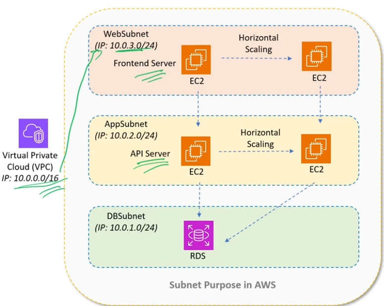

---

### 📋 Public vs Private Subnets

| Feature | Public Subnet | Private Subnet |
|---------|--------------|----------------|
| **Internet access** | Direct — via Internet Gateway | Indirect — outbound only via NAT Gateway |
| **Resources hosted** | Load balancers, bastion hosts | App servers, databases, caches |
| **Has public IP** | Yes (optional) | No |
| **Route table points to** | Internet Gateway | NAT Gateway |

### 💡 Interview Tips

> 🔥 **Classic 3-tier architecture:** Public subnet → ALB | Private app subnet → EC2 instances | Private data subnet → RDS. The database has zero internet exposure — most secure setup.

---

<a name="q30"></a>
## ❓ Q30. What is AWS Elastic Load Balancer (ELB)? What are the Types of Load Balancers?

### 📖 Definition

AWS Load Balancer distributes incoming traffic across multiple EC2 instances to ensure high availability, scalability, and fault tolerance.

**Types of Load Balancers:**
1. Network Load Balancer (NLB)
2. Application Load Balancer (ALB)
3. Classic Load Balancer (CLB)
4. Gateway Load Balancer (GWLB)

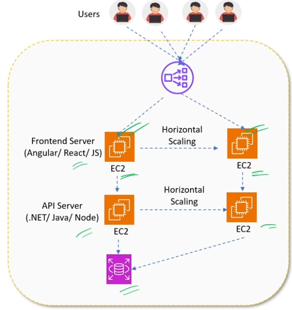

---

### 📋 Load Balancer Types Compared

| Type | OSI Layer | Use Case | Key Feature |
|------|-----------|---------|-------------|
| **ALB** (Application) | Layer 7 — HTTP/HTTPS | Web apps, REST APIs, microservices | Path-based & host-based routing, WebSocket |
| **NLB** (Network) | Layer 4 — TCP/UDP | Real-time apps, gaming, low latency | Millions of requests/sec, static IP |
| **CLB** (Classic) | Layer 4 & 7 | Legacy apps | Old — use ALB or NLB for new projects |
| **GWLB** (Gateway) | Layer 3 | Third-party security appliances | Inspect traffic through firewalls before routing |

### 💡 Interview Tips

> 🔥 **ALB is most common** for modern web applications — use it when you need URL path routing (`/api/*` → service A, `/admin/*` → service B) or host-based routing.

> 🔥 **ELB + ASG:** When ASG adds a new EC2 instance, it registers automatically with the ELB. When an instance becomes unhealthy, ELB stops routing to it and ASG replaces it.

---

<a name="q31"></a>
## ❓ Q31. What is Amazon Route 53? How Does it Manage Global Traffic?

### 📖 Definition

AWS Route 53 is a DNS-based traffic routing service that distributes user requests across AWS regions based on rules like user location or latency.

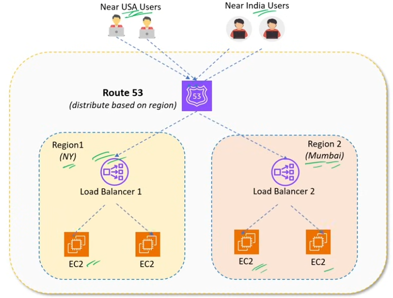

---

### 📋 Route 53 Routing Policies

| Policy | How It Works | Use Case |
|--------|-------------|---------|
| **Simple** | Route to a single resource | Basic single-server setup |
| **Weighted** | Split traffic by percentage (e.g. 90%/10%) | A/B testing, gradual rollouts |
| **Latency** | Route to lowest-latency region | Global apps — best user performance |
| **Geolocation** | Route based on user's country | Localised content, compliance |
| **Failover** | Primary → failover if primary is down | Disaster recovery |
| **Geoproximity** | Route based on proximity with adjustable bias | Fine-grained geographic control |
| **Multi-value** | Return multiple healthy IPs | Simple load balancing |

### 💡 Interview Tips

> 🔥 **Why "Route 53"?** Port 53 is the standard DNS port — hence the name.

> 🔥 **Route 53 vs ELB:** Route 53 operates at DNS level — routes globally to the correct region before hitting AWS. ELB operates within a region — distributes across EC2 instances. Use them together: Route 53 (global routing) → ELB (regional load balancing).

---

<a name="q32"></a>
## ❓ Q32. What is AWS IAM (Identity and Access Management)?

### 📖 Definition

AWS IAM (Identity and Access Management) is a secure cloud-based service in AWS that helps organizations verify users and control access to AWS services and resources.

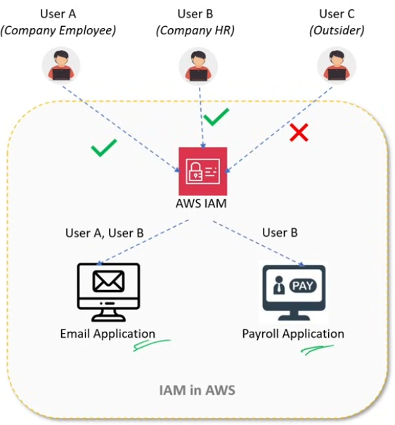

---

### 📋 IAM Core Concepts

| Concept | Description | Example |
|---------|-------------|---------|
| **User** | Individual identity with credentials | `john@company.com` |
| **Group** | Collection of users — apply policies to all | `Developers`, `Admins` |
| **Role** | Temporary identity assumed by services or users | EC2 role to read from S3 |
| **Policy** | JSON document defining allow/deny permissions | Allow `s3:GetObject` on `my-bucket` |
| **MFA** | Multi-factor authentication | Required for console login |

### 📋 IAM Best Practices

| Practice | Why |
|----------|-----|
| Never use root account for daily tasks | Root has unlimited power — too risky |
| Use IAM Roles for EC2/Lambda (not access keys) | No credentials stored in code |
| Apply least privilege | Give only permissions needed for the task |
| Enable MFA on all accounts | Protect against password compromise |
| Rotate access keys regularly | Reduce risk from leaked credentials |

### 💡 Interview Tips

> 🔥 **IAM is global** — not region-specific. One IAM user works across all AWS regions.

> 🔥 **IAM vs Cognito:** IAM manages access to AWS services (for developers and apps). Cognito manages end-user authentication for your web/mobile apps (sign-up, login, social login).

---

<a name="q33"></a>
## ❓ Q33. What is a CI/CD Pipeline? How Have You Used it in Your Project?

### 📖 Definition

A CI/CD pipeline is an automated process used by developers and DevOps teams to build, test, and deploy code quickly and reliably.

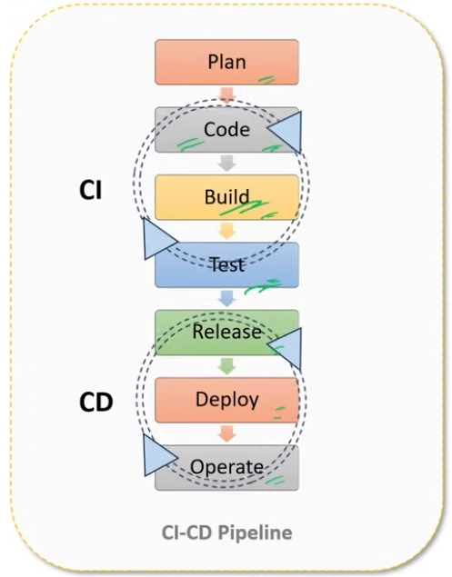

---

### 📋 CI/CD Stages Explained

| Stage | Full Name | What Happens |
|-------|-----------|-------------|
| **CI** | Continuous Integration | Every commit auto-builds and runs tests |
| **CD** | Continuous Delivery | Tested code auto-deployed to staging, ready for production |
| **CD** | Continuous Deployment | Auto-deployed to production after all tests pass |

### 📋 AWS CI/CD Tools

| Tool | Role |
|------|------|
| **CodeCommit** | Git repository (AWS-native, like GitHub) |
| **CodeBuild** | Compile, test, build Docker images |
| **CodeDeploy** | Deploy to EC2, Lambda, ECS |
| **CodePipeline** | Orchestrates the full pipeline — connects all tools |

### 💡 Interview Tips

> 🔥 **Example answer:** "In my project, every git push to main triggered CodePipeline — CodeBuild ran unit tests, built a Docker image, pushed to ECR, and CodeDeploy deployed to ECS. Zero manual steps from code to production."

> 🔥 **CodePipeline integrates with GitHub** — you're not locked into CodeCommit. Most teams use GitHub + CodeBuild + CodeDeploy.

---

<a name="q34"></a>
## ❓ Q34. What are the Key Components of the AWS DevOps Toolchain?

### 📖 Definition

| DevOps Stage | Purpose | AWS Tool(s) |
|-------------|---------|------------|
| **1. Plan** | Project planning, issue tracking | Jira, Trello, or 3rd-party tools |
| **2. Code** | Source code management | AWS CodeCommit (Git-based) |
| **3. Build** | Compile, test, package code | AWS CodeBuild |
| **4. Test** | Automated testing | CodeBuild + 3rd-party via CodePipeline |
| **5. Release** | CI/CD orchestration | AWS CodePipeline |
| **6. Deploy** | Application deployment | AWS CodeDeploy (EC2, Lambda, ECS) |
| **7. Operate** | Monitoring, logging, incidents | CloudWatch, AWS X-Ray, Systems Manager |

---

### ❓ How Would You Automate Deployment After Every Code Commit?

**Answer:** Use AWS CodePipeline with CodeCommit, CodeBuild, and CodeDeploy.

**Explanation:** CodePipeline detects a code push to CodeCommit (or GitHub), triggers CodeBuild to build it, and then CodeDeploy to deploy it — fully automating the release process after each commit.

### 💡 Interview Tips

> 🔥 **Blue/Green Deployment with CodeDeploy:** New version deployed alongside old — switch traffic when ready. Zero downtime and instant rollback if something goes wrong.

> 🔥 **buildspec.yml:** The CodeBuild config file in your repo root — defines install steps, test commands, build commands, and artifact output.

---

<a name="q35"></a>
## ❓ Q35. What is Amazon CloudWatch and How Does it Support Developers?

### 📖 Definition

Amazon CloudWatch is a monitoring service that collects, analyzes, and visualizes performance data, logs, and metrics from your AWS applications and infrastructure.

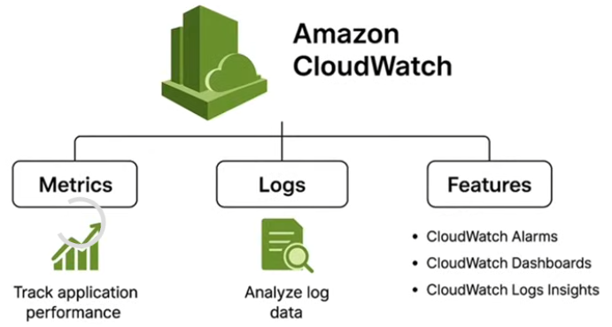

---

### 📋 CloudWatch Key Features

| Feature | Description | Example |
|---------|-------------|---------|
| **Metrics** | Time-series data from AWS services | EC2 CPU usage, RDS connections, Lambda duration |
| **Logs** | Collect and search application logs | Application errors, access logs |
| **Alarms** | Trigger actions when metric crosses threshold | SNS notification if CPU > 80% |
| **Dashboards** | Custom real-time visual panels | Ops monitoring dashboard |
| **Logs Insights** | Query and analyse logs with a SQL-like language | Find all ERROR lines in the last hour |
| **Container Insights** | Monitor ECS/EKS clusters | Container CPU, memory, network |

### 💡 Interview Tips

> 🔥 **CloudWatch + Auto Scaling:** Alarm on CPU > 70% → triggers ASG policy to add EC2 instances. This is the standard auto-scaling pattern in every production AWS setup.

> 🔥 **CloudWatch Logs Agent:** Install on EC2 to stream application logs to CloudWatch — then search, filter, and set alarms on log patterns (e.g., alert if ERROR appears more than 10 times in 5 minutes).

---

<a name="q36"></a>
## ❓ Q36. What is Amazon SQS (Simple Queue Service)? Can You Share an Example?

### 📖 Definition

Amazon SQS is a fully managed message queuing service that enables asynchronous communication between microservices, improving decoupling, reliability, and scalability.

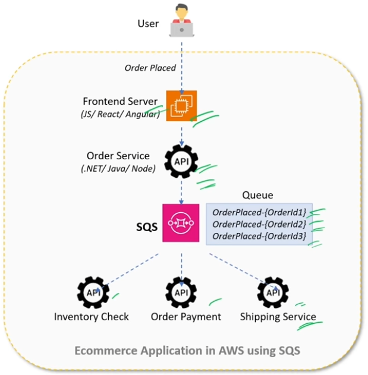

---

### 📋 How SQS Works

```
PRODUCER (Order Service)          SQS QUEUE           CONSUMER (Payment Service)
        │                             │                          │
        │── sendMessage(order) ──────►│                          │
        │   (non-blocking, async)     │◄──── receiveMessage() ───│
        │                             │                          │
        │   (continues processing     │──── deleteMessage() ─────│
        │    other requests)          │     (after processing)   │
```

### 📋 SQS vs SNS

| Feature | SQS | SNS |
|---------|-----|-----|
| **Pattern** | Queue — pull-based | Pub/Sub — push-based |
| **Consumers** | One consumer processes each message | Many subscribers receive each message |
| **Message storage** | Retained up to 14 days | Not stored — delivered immediately |
| **Use case** | Task queue, work distribution | Fan-out notifications, alerts |

### 💡 Interview Tips

> 🔥 **Real example:** E-commerce order placed → Order Service puts message in SQS → Payment, Inventory, and Email services each process independently from their own queues. If Payment Service goes down, messages wait safely — no data lost.

---

<a name="q37"></a>
## ❓ Q37. What are the Advantages of Using SQS to Decouple Microservices?

### 📖 Definition

| Without SQS (Direct Calls — Synchronous) | With SQS (Asynchronous) |
|------------------------------------------|-------------------------|
| Services are blocked, waiting for responses — UI waits longer, may freeze | Services not blocked — sends message and moves on, UI responds faster |
| Tight connection between services (hard to scale) | Loose connection — easy to scale and manage |
| Can slow down or crash under heavy load | Handles high traffic smoothly |

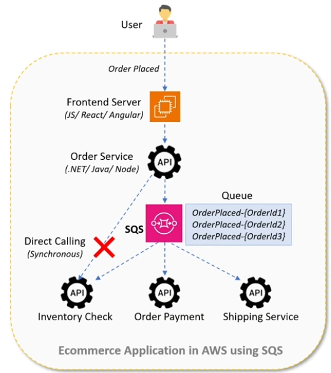

---

### 📋 Extended Benefits of SQS Decoupling

| Benefit | Explanation |
|---------|-------------|
| **Fault tolerance** | If consumer crashes, messages wait safely in queue — no data lost |
| **Load levelling** | Queue absorbs traffic spikes — consumers process at their own rate |
| **Independent scaling** | Scale producer and consumer services independently |
| **Dead Letter Queue (DLQ)** | Failed messages move to DLQ after N retries — inspect without blocking queue |
| **Language agnostic** | Producer in Node.js, consumer in Python — no coupling required |

---

<a name="q38"></a>
## ❓ Q38. In What Order are Messages Processed by Amazon SQS?

### 📖 Definition

| Standard Queue (Default) | FIFO Queue |
|--------------------------|------------|
| Messages are delivered at least once, but delivery order is not guaranteed | Ensures messages are delivered in First-In, First-Out order with exactly-once delivery |
| High throughput — suitable when message order isn't critical | Use when order matters — financial transactions or logs |

---

### 📋 Standard vs FIFO — Full Comparison

| Feature | Standard Queue | FIFO Queue |
|---------|---------------|------------|
| **Ordering** | Best-effort (not guaranteed) | Strict FIFO guaranteed |
| **Delivery** | At-least-once (duplicates possible) | Exactly-once processing |
| **Throughput** | Unlimited | 300 msgs/sec (3,000 with batching) |
| **Use case** | Notifications, log processing, emails | Payment processing, order workflows |
| **Naming** | Any name | Must end in `.fifo` |

### 💡 Interview Tips

> 🔥 **At-least-once** means your consumer must be **idempotent** — processing the same message twice should produce the same result as once (e.g. check if order already processed before processing).

---

<a name="q39"></a>
## ❓ Q39. What is Click Stream Analysis? How is it Useful?

### 📖 Definition

Click Stream Analysis is the process of capturing, processing, and analyzing user interactions (clicks, page views, searches, etc.) on a website or application, to understand user behavior and show them better content and ads in future.

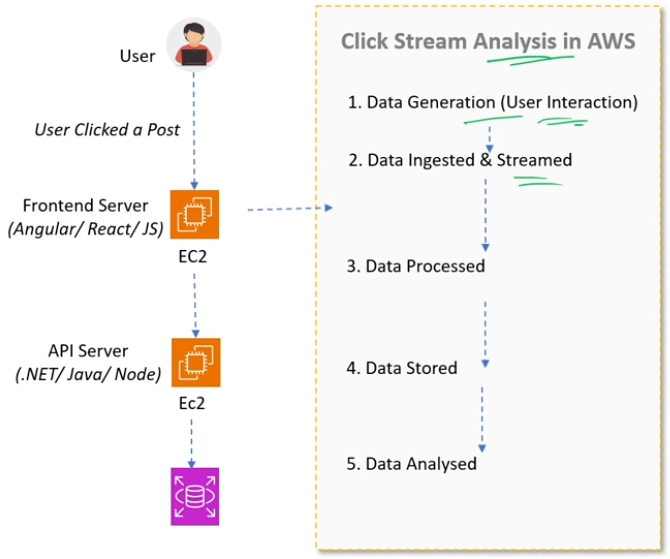

---

### 📋 Click Stream — AWS Architecture

```
User actions on website (clicks, scrolls, searches)
         ↓
Amazon Kinesis Data Streams (real-time ingestion)
         ↓
AWS Lambda (real-time processing) or Kinesis Firehose (batch to S3)
         ↓
Amazon S3 (raw data lake)
         ↓
Amazon Athena or Amazon Redshift (query and analyse)
         ↓
Amazon QuickSight (dashboards) + ML / Personalise (recommendations)
```

### 💡 Interview Tips

> 🔥 **Business value:** Netflix uses click stream analysis to know which thumbnails get the most clicks, which shows users pause on, and what time of day spikes occur — driving recommendations and content investment decisions.

---

<a name="q40"></a>
## ❓ Q40. What are Authentication and Authorization?

### 📖 Definition

**Authentication** is the process of verifying the identity of a user by validating their credentials such as username and password.

**Authorization** is the process of allowing authenticated users access to resources.

**Authentication always precedes Authorization.**

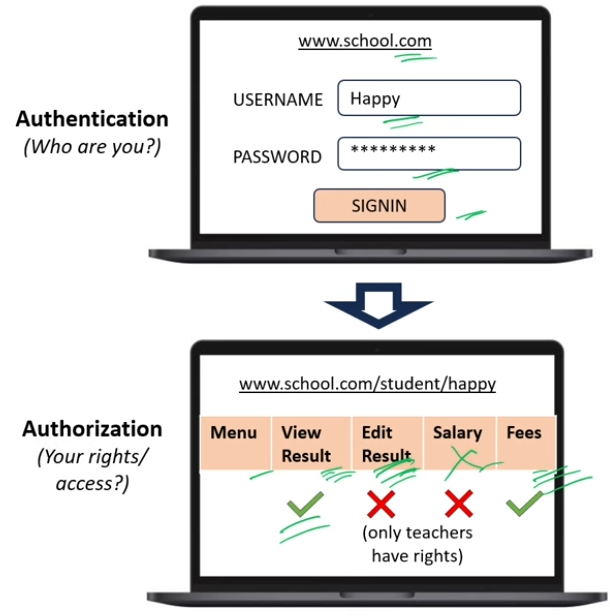

---

### 📋 Authentication vs Authorization

| Aspect | Authentication (AuthN) | Authorization (AuthZ) |
|--------|----------------------|----------------------|
| **Question** | Who are you? | What can you do? |
| **Verifies** | Identity | Permissions |
| **How** | Username/password, MFA, OAuth token | IAM policies, RBAC, ACLs |
| **AWS Service** | AWS Cognito, IAM | AWS IAM policies |
| **Happens** | First | Second — only after AuthN |
| **Example** | Log in with Google | Can this user access this S3 bucket? |

### 💡 Interview Tips

> 🔥 **Memory trick:** AuthN = Passport (proves who you are). AuthZ = Visa (says where you're allowed to go).

> 🔥 **AWS Cognito:** Managed service for end-user authentication — handles sign-up, login, MFA, social login (Google, Facebook). Returns JWT tokens your app uses for authorization decisions.

---

<a name="q41"></a>
## ❓ Q41. What is the Key Difference Between AWS IAM and On-Prem Active Directory?

### ✅ Answer: IAM is cloud-native; AD is on-premises and domain-based.

### 📖 Explanation

IAM (Identity and Access Management) manages permissions for AWS resources, not machines. Active Directory manages users, devices, and policies in Windows networks. IAM is resource-access focused, while AD is network-access focused.

### 📋 IAM vs Active Directory

| Feature | AWS IAM | Active Directory (AD) |
|---------|---------|----------------------|
| **Scope** | AWS cloud resources | Windows network (machines, users) |
| **Manages** | API access to AWS services | Logins, computers, group policies |
| **Protocol** | AWS API, HTTPS | LDAP, Kerberos |
| **Location** | Cloud-native, global | On-premises (or Azure AD for cloud) |
| **Use case** | Grant Lambda read access to S3 | Domain login for company PCs |
| **Integration** | Integrates via AWS Directory Service | Syncs to AWS via AD Connector |

### 💡 Interview Tips

> 🔥 **AWS Directory Service** lets you connect your on-prem Active Directory with AWS — employees use their existing Windows credentials to access AWS resources (SSO experience across on-prem and cloud).

---

<a name="q42"></a>
## ❓ Q42. What is AWS Storage? What are the Types of AWS Storage?

### 📖 Definition

AWS Storage is a cloud-based storage solution that allows you to store, access, and manage data over the internet.

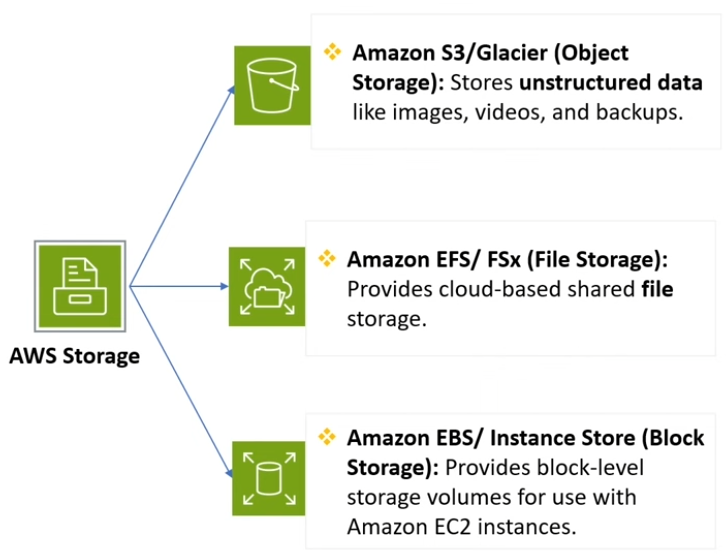

---

### 📋 Three Storage Types at a Glance

| Type | Service | Stores | Use Case |
|------|---------|--------|---------|
| **Object Storage** | S3, S3 Glacier | Any file as an object | Web storage, data lakes, archives |
| **File Storage** | EFS, FSx | Shared file system (network drive) | Multiple EC2s sharing the same files |
| **Block Storage** | EBS, Instance Store | Low-level blocks like a hard disk | EC2 boot volumes, databases |

### 💡 Interview Tips

> 🔥 **Memory trick:** S3 = Google Drive (access files via URL, anywhere). EBS = External hard drive for your EC2 (fast, attached, persistent). EFS = Shared network drive (multiple EC2s read/write same files).

---

<a name="q43"></a>
## ❓ Q43. Explain Amazon S3. When Would You Use It in Your Project?

### 📖 Definition

Amazon S3 is used to store large files like images, videos, documents, or backups.

S3 is best when you want to access them easily through URLs or APIs — especially in web, mobile, or cloud-based applications.

Editing files in Blob storage manually is difficult, because the files are stored as objects, not as regular files in a file system.

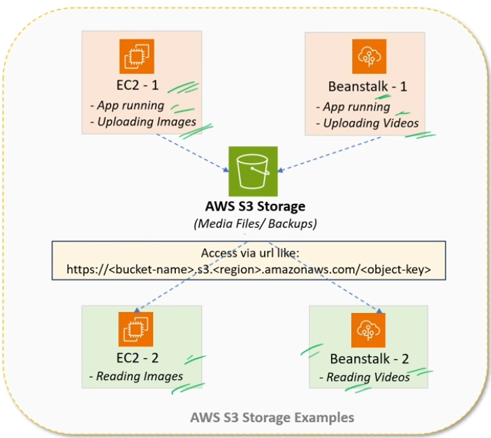

---

### 📋 S3 Key Concepts

| Concept | Description |
|---------|-------------|
| **Bucket** | Container for objects — must have globally unique name |
| **Object** | Any file stored in S3 — up to 5TB per object |
| **Versioning** | Keep multiple versions — protect from accidental deletion |
| **Lifecycle Policy** | Auto-move to cheaper storage tier or delete after X days |
| **Presigned URL** | Temporary URL for private object access (e.g. 15-min download link) |
| **Static Website** | Host HTML/CSS/JS directly from S3 bucket |

### 📋 S3 Storage Classes

| Class | Use Case | Cost vs Standard |
|-------|---------|-----------------|
| **S3 Standard** | Frequently accessed data | Baseline |
| **S3 Infrequent Access (IA)** | Accessed less than once a month | ~40% cheaper |
| **S3 Glacier Instant** | Archives needing instant retrieval | ~68% cheaper |
| **S3 Glacier Deep Archive** | Long-term cold storage (hours to retrieve) | Lowest cost |

### 💡 Interview Tips

> 🔥 **S3 durability:** 99.999999999% (11 nines) — AWS replicates data across at least 3 Availability Zones. Essentially zero data loss.

> 🔥 **S3 is NOT a file system** — you can't edit part of a file in place. Download, modify, and re-upload. For true file-system access across multiple EC2s, use EFS.

---

<a name="q44"></a>
## ❓ Q44. What is Amazon Elastic Block Store (EBS)? How Does it Support EC2 Instances?

### 📖 Definition

Amazon EBS is used to provide persistent block storage to EC2 instances, so that your data remains safe even if the instance is stopped or restarted.

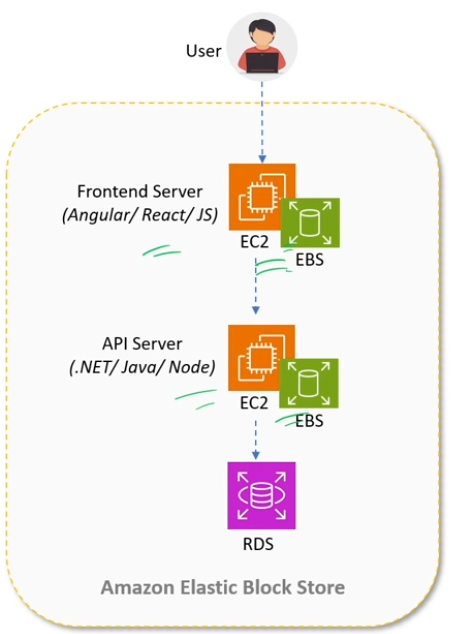

---

### 📋 EBS Key Features

| Feature | Description |
|---------|-------------|
| **Persistence** | Data survives instance stop and restart — unlike Instance Store |
| **Attachment** | Attached to one EC2 at a time (in the same AZ) |
| **Snapshots** | Point-in-time backup to S3 — restore or copy to another region |
| **Encryption** | At-rest encryption using AWS KMS |
| **Resize** | Increase size and change type without downtime |
| **Performance** | SSD (gp3, io2) or HDD (st1, sc1) options |

### 📋 EBS Volume Types

| Type | Best For | Max IOPS |
|------|---------|----------|
| **gp3** (General Purpose SSD) | Most workloads — default choice | 16,000 |
| **io2** (Provisioned IOPS SSD) | High-performance databases | 64,000 |
| **st1** (Throughput HDD) | Big data, data warehouses | 500 MB/s |
| **sc1** (Cold HDD) | Infrequently accessed data | 250 MB/s |

---

<a name="q45"></a>
## ❓ Q45. What is the Difference Between Block Storage and Object Storage?

### 📖 Definition

| Feature | Block Storage | Object Storage |
|---------|--------------|----------------|
| **AWS Service** | Amazon EBS, Amazon EFS | Amazon S3 |
| **Storage Format** | Data split into fixed-size blocks | Data stored as objects (file + metadata) |
| **Access Method** | Mount like a hard disk via NFS/iSCSI | Access via HTTP API or URLs |
| **Use Case** | Databases, Operating Systems, low-latency apps | Backups, media files, logs, archives |

---

### 📋 Extended Block vs Object Comparison

| Feature | Block Storage (EBS) | Object Storage (S3) |
|---------|--------------------|--------------------|
| **Latency** | Low — milliseconds | Higher — milliseconds to seconds |
| **Mutability** | Edit parts of a file in place | Must replace the entire object |
| **Max size** | 64TB per volume | 5TB per object, unlimited total |
| **Shared access** | One EC2 at a time | Any service globally via URL |
| **Cost per GB** | Higher | Lower |
| **Best for** | Running databases, OS volumes | Media files, backups, static web assets |

### 💡 Interview Tips

> 🔥 **Simple analogy:** Block storage = external hard drive plugged into your computer (fast, local, exclusive). Object storage = Dropbox or Google Drive (accessible globally via URL, cheap at scale).

---

<a name="q46"></a>
## ❓ Q46. Top 5 AWS Services Deep Dive

**Top 5 AWS Services:** EC2 · Elastic Beanstalk · Lambda · S3 · RDS

---

### 1. Amazon EC2

Amazon EC2 Instances are cloud-based virtual servers that allow users to run applications without needing to buy or manage physical hardware.

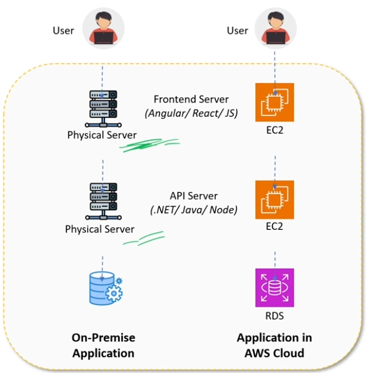

---

### 2. AWS Elastic Beanstalk

AWS Elastic Beanstalk is a fully managed Platform-as-a-Service (PaaS) that enables developers to deploy and scale web applications and services without managing the infrastructure.

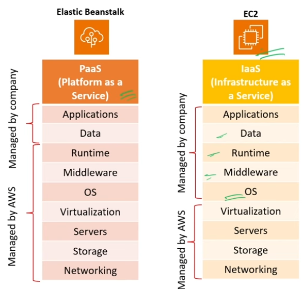

---

### 3. AWS Lambda

AWS Lambda is a serverless compute service that lets you run code in response to events, without managing servers.

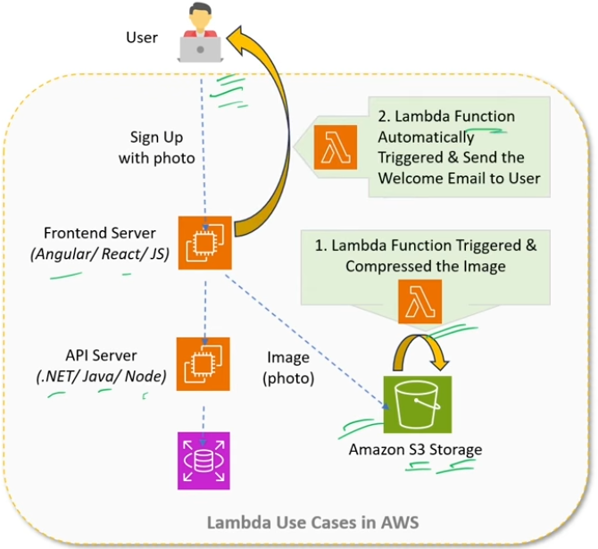

---

### 4. Amazon S3

Amazon S3 is used to store large files like images, videos, documents, or backups. S3 is best when you want to access them easily through URLs or APIs — especially in web, mobile, or cloud-based applications.

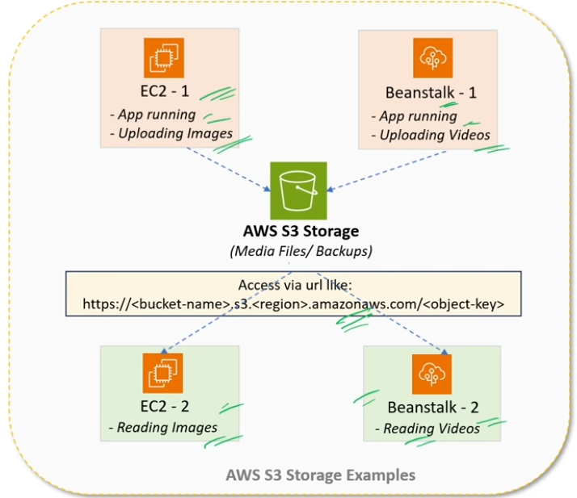

---

### 5. Amazon RDS

Amazon RDS is a fully managed, cloud-based relational database service from AWS, offered as a Platform as a Service (PaaS).

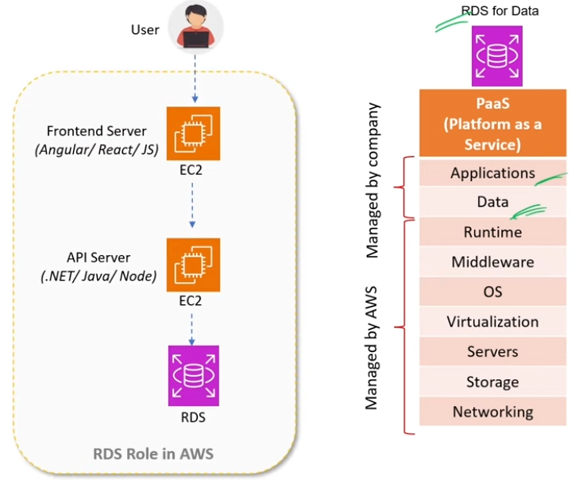

---

<a name="q47"></a>
## ❓ Q47. What is Amazon RDS? How is it Different from a Regular Database?

### 📖 Definition

Amazon RDS is a fully managed, cloud-based relational database service from AWS.

It is offered as a Platform as a Service (PaaS).


---

### 📋 RDS vs Self-Managed DB on EC2 — Full Comparison

| Feature | Amazon RDS | Database on EC2 |
|---------|-----------|-----------------|
| **Install and setup** | Automated — minutes | Manual — hours |
| **OS patching** | AWS | You |
| **DB engine patching** | AWS | You |
| **Automated backups** | Daily + point-in-time restore built-in | You script manually |
| **Multi-AZ failover** | One-click | Complex manual replication |
| **Read replicas** | Built-in | Manual replication |
| **Monitoring** | CloudWatch integrated | Manual setup |
| **Cost** | Higher per GB | Lower (but high time cost) |
| **Control** | Limited OS access | Full root access |

---

<a name="q48"></a>
## ❓ Q48. What is the Difference Between Amazon EC2 and Elastic Beanstalk? When to Use What?

### 📖 Definition

| Amazon EC2 | AWS Elastic Beanstalk |
|-----------|----------------------|
| Cloud-based virtual servers where you can install any software and manage configurations | A Platform-as-a-Service (PaaS) that allows hosting web applications, APIs, and mobile apps without managing the servers or infrastructure |
| User-managed: You handle OS updates, security, scaling, load balancing & application installation | Fully managed: AWS handles OS, security, scaling and load balancing |
| Use Case: Hosting custom applications, databases, and workloads that need full control | Hosting web apps, APIs, and mobile backends with automatic scaling |

---

### 📋 Decision Guide

```
Do you need full control over OS, custom software, or networking?
    ├── YES → Use EC2
    └── NO
         ├── Short event-driven tasks → Lambda
         ├── Web app or API with minimal setup → Elastic Beanstalk
         └── Docker containers → ECS / EKS
```

---

<a name="q49"></a>
## ❓ Q49. Your Client Wants Automatic Scaling Across Multiple Regions. Which Compute Option Supports This?

### ✅ Answer: Amazon Global Accelerator + Regional Auto Scaling Groups

### 📖 Explanation

Use Auto Scaling in each region and route traffic using Global Accelerator or Route 53. This setup distributes load globally and ensures apps scale independently in each region for high availability.

### 📋 Multi-Region Auto Scaling Architecture

```
Users worldwide
      ↓
AWS Global Accelerator (routes to nearest, healthiest region)
      ↓
Route 53 (latency-based or geolocation DNS routing)
      ↓
┌──────────────────┐        ┌──────────────────────┐
│ Region: us-east  │        │ Region: ap-south     │
│ ALB              │        │ ALB                  │
│ Auto Scaling     │        │ Auto Scaling         │
│ [EC2] [EC2] [EC2]│        │ [EC2] [EC2]          │
│ RDS Multi-AZ     │        │ RDS Read Replica     │
└──────────────────┘        └──────────────────────┘
```

### 💡 Interview Tips

> 🔥 **Global Accelerator vs CloudFront:** Global Accelerator routes TCP/UDP traffic to your application (good for dynamic APIs). CloudFront caches content at edge locations (good for static assets and cacheable API responses). Use both together in production.

---

<a name="q50"></a>
## ❓ Q50. What is the Difference Between EC2 and Lambda?

### 📖 Definition

| Feature | Amazon EC2 | AWS Lambda |
|---------|-----------|-----------|
| **Type** | Virtual Machine (server) | Serverless compute service |
| **Server Management** | You manage servers, OS, patches | No server to manage |
| **Pricing** | Pay per hour or second (based on uptime) | Pay per request + execution time |
| **Use Case** | Long-running apps, full control | Short tasks, event-driven, APIs, automation |

---

### 📋 Extended EC2 vs Lambda Comparison

| Feature | EC2 | Lambda |
|---------|-----|--------|
| **Max run time** | Unlimited | 15 minutes |
| **Startup time** | Minutes (first launch) | Milliseconds (warm) / seconds (cold start) |
| **Scaling** | Manual or Auto Scaling Group | Fully automatic — concurrent executions |
| **State** | Stateful — data persists on EBS | Stateless — no persistent storage |
| **Cost at zero traffic** | Pays 24/7 even if idle | Free — only charges on invocation |
| **Cost at scale** | Predictable, fixed | Can grow — monitor per-request costs |
| **OS access** | Full root access | None |

### 💡 Interview Tips

> 🔥 **Hybrid approach:** EC2 (or ECS) for your long-running API server + Lambda for async background tasks triggered by S3, SQS, or scheduled events. This is the most common production pattern.

---

<a name="q51"></a>
## ❓ Q51. When to Use Amazon RDS (RDBMS) and When to Use DynamoDB (NoSQL)?

### 📖 Definition

RDS (RDBMS) is suitable for applications that require high-value and complex transactions and data integrity (ACID), such as banking, finance, and e-commerce.

DynamoDB (NoSQL) is suitable when data volume is huge, fast, and doesn't need complex relationships or strict rules.

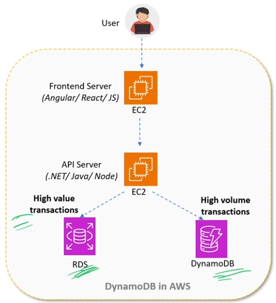

---

### 📋 RDS vs DynamoDB — Full Comparison

| Feature | Amazon RDS | Amazon DynamoDB |
|---------|-----------|-----------------|
| **Type** | Relational (SQL) | NoSQL — key-value / document |
| **Schema** | Fixed — structured tables | Flexible — each item can differ |
| **Query** | Complex SQL, joins, aggregations | Simple key-value lookups |
| **ACID compliance** | Full ACID | Single-item ACID only |
| **Scale** | Vertical + read replicas | Horizontal — limitless scale |
| **Latency** | Milliseconds | Single-digit milliseconds |
| **Use case** | Banking, ERP, e-commerce orders | Gaming leaderboards, IoT, user sessions |
| **Managed** | ✅ PaaS | ✅ Fully serverless |

### 💡 Interview Tips

> 🔥 **Decision rule:** Complex relationships + strict consistency + SQL queries → RDS. Massive scale + speed + flexible schema → DynamoDB.

---

<a name="q52"></a>
## ❓ Q52. What is Amazon Aurora? How is it Different from Amazon RDS?

### 📖 Definition

Amazon RDS is a fully managed service for multiple databases like MySQL, PostgreSQL, Oracle, SQL Server, MariaDB etc.

Amazon Aurora is a fully managed high-performance database compatible with only MySQL & PostgreSQL.

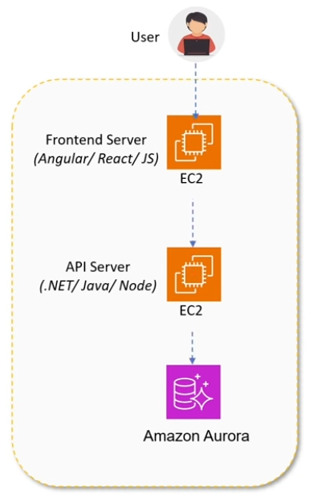

---

### 📋 Aurora vs RDS — Full Comparison

| Feature | Amazon RDS | Amazon Aurora |
|---------|-----------|---------------|
| **Supported engines** | MySQL, PostgreSQL, Oracle, SQL Server, MariaDB | MySQL and PostgreSQL only |
| **Performance** | Standard | 5× faster than MySQL, 3× faster than PostgreSQL |
| **Storage** | Up to 64TB | Auto-scales up to 128TB |
| **Read replicas** | Up to 5 | Up to 15 |
| **Failover time** | 60–120 seconds | Under 30 seconds |
| **Replication lag** | Minutes | Milliseconds |
| **Global DB** | Cross-region read replicas | Aurora Global Database — 1 sec global replication |
| **Serverless option** | ❌ | ✅ Aurora Serverless v2 — auto-scales capacity |
| **Cost** | Standard | ~20% more than RDS (but significantly faster) |

### 💡 Interview Tips

> 🔥 **When to choose Aurora over RDS:** You need MySQL or PostgreSQL AND need maximum performance, faster failover, more read replicas, or near-zero latency global replication.

> 🔥 **Aurora Serverless v2:** Scales DB capacity up and down automatically based on demand — pay per Aurora Capacity Unit consumed. Perfect for variable or unpredictable workloads.

---

## 🧠 Master Cheatsheet

```
CLOUD MODELS
  IaaS  = You manage OS upward          → EC2
  PaaS  = You manage App + Data only    → Elastic Beanstalk, RDS
  SaaS  = Just use it                   → WorkMail
  Hybrid = On-prem + AWS (gradual migration, compliance)

SHARED RESPONSIBILITY
  AWS owns  → Physical infra, hardware, global network
  You own   → OS patches (IaaS), data, IAM, encryption choices

SCALING
  Horizontal = More instances (stateless apps, web servers) ← preferred
  Vertical   = Bigger instance (databases, monolithic apps)

COMPUTE PICK GUIDE
  Full control needed → EC2
  Event-driven / short task → Lambda
  Deploy web app fast → Elastic Beanstalk
  Docker containers → ECS / EKS

DATABASE PICK GUIDE
  Complex SQL, ACID, relations → RDS (MySQL, PostgreSQL…)
  High-performance MySQL/PostgreSQL → Aurora
  Massive NoSQL scale + speed → DynamoDB
  In-memory caching → ElastiCache (Redis)

STORAGE PICK GUIDE
  Any file, URL access → S3
  EC2 persistent disk → EBS
  Shared file system across EC2s → EFS

NETWORKING
  Private network → VPC
  Public vs Private → Subnets
  HTTP traffic → ALB | TCP traffic → NLB
  DNS + global routing → Route 53
  Edge caching → CloudFront

SECURITY
  AWS service access control → IAM
  End-user login → Cognito
  Instance firewall (stateful) → Security Group
  Subnet firewall (stateless) → NACL

MESSAGING
  Queue (async, pull, decouple) → SQS
  Pub/Sub (push, fan-out) → SNS

DEVOPS
  CodeCommit → CodeBuild → CodeDeploy → CodePipeline = full CI/CD
  CloudWatch = monitoring, logs, alarms
  CloudFormation = Infrastructure as Code
```

---

*All original definitions from the source material are preserved exactly. Extra comparison tables, interview tips, and memory aids added for comprehensive interview preparation.*
