# JavaScript Basics

---

## 1. Selectors

Selectors in JS help to get specific elements from DOM based on IDs, class names, tag names.

---

## 2. var, let and const

- **`var`** creates a function-scoped variable.
- **`let`** creates a block-scoped variable.
- **`const`** can be assigned only once, and its value cannot be changed afterwards.

---

## 3. DOM (Document Object Model)

The DOM (Document Object Model) represents the web page as a tree-like structure that allows JavaScript to dynamically access and manipulate the content and structure of a web page.

---

## 4. Functions

A function is a reusable block of code that performs a specific task.

Arrow functions, also known as fat arrow functions, is a simpler and shorter way for defining functions in JavaScript.

---

## 5. Arrays

An array is a data type that allows you to store multiple values in a single variable.

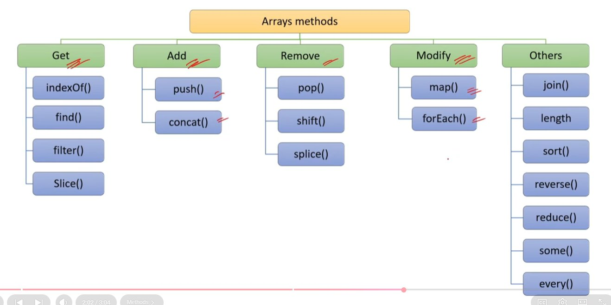

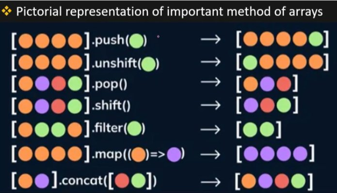

---

## 6. Objects and Scope

An object is a data type that allows you to store key-value pairs.

Scope determines where variables are defined and where they can be accessed.

---

## 7. Hoisting

Hoisting is a JavaScript behavior where functions and variable declarations are moved to the top of their respective scopes during the compilation phase.

But **`let`** does not allow Hoisting.

---

## 8. Asynchronous Programming

Asynchronous programming allows multiple tasks or operations to be initiated and executed concurrently.

Asynchronous operations do not block the execution of the code.

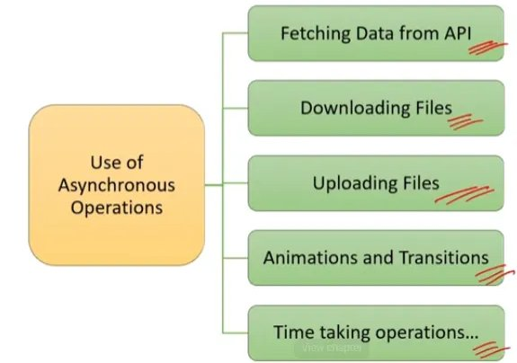

---

## 9. Primitive vs Non-Primitive Data Types

- **Primitive data types** can hold only a single value.
- Primitive data types are immutable, meaning their values, once assigned, cannot be changed.
- **Non-primitive data types** can hold multiple values.
- They are mutable and their values can be changed.

### undefined and null

- **`undefined`**: When a variable is declared but has not been assigned a value, it is automatically initialized with undefined.
- **`null`**: null variables are intentionally assigned the null value.

### Type Coercion

Type coercion is the automatic conversion of values from one data type to another during certain operations or comparisons.

---

## 10. Spread Operator

The spread operator `( ... )` is used to expand or spread elements from an iterable (such as an array, string, or object) into individual elements.

```js
// Spread Operator Examples
const array = [1, 2, 3];
console.log( ...array); // Output: 1, 2, 3
```

```js
// Copying an array
const originalArray = [1, 2, 3];
const copiedArray = [ ...originalArray];
console.log(copiedArray); // Output: [1, 2, 3]
```

```js
// Merging arrays
const array1 = [1, 2, 3];
const array2 = [4, 5];
const mergedArray = [ ...array1, ...array2];
console.log(mergedArray); // Output: [1, 2, 3, 4, 5]
```

```js
// Passing multiple arguments to a function
const numbers = [1, 2, 3, 4, 5];
sum( ...numbers);
function sum(a, b, c, d, e) {
  console.log(a + b + c + d + e); // Output: 15
}
```

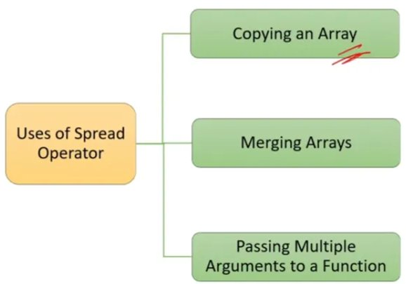

### Rest Operator

The rest operator is used in function parameters to collect all remaining arguments into an array.

```js
// Rest Operator Example
display(1, 2, 3, 4, 5);

function display(first, second, ...restArguments) {
  console.log(first);          // Output: 1
  console.log(second);         // Output: 2
  console.log(remaining);      // Output: [3, 4, 5]
}
```

---

## 11. Array Methods — Getting Elements

**`find()`** method gets the first element that satisfies a condition.

```js
// Example array
const array = [1, 2, 3, 4, 5];

let c = array.find((num) => num % 2 === 0);
console.log(c);
// Output: 2
```

**`filter()`** method gets an array of elements that satisfies a condition.

```js
// Example array
const array = [1, 2, 3, 4, 5];
let d = array.filter((num) => num % 2 === 0)
console.log(d);
// Output: [2, 4]
```

**`slice()`** method gets a subset of the array from start index to end index (end not included).

```js
const array = ["a", "b", "c", "d", "e"];

let e = array.slice(1, 4);
console.log(e); // Output: ['b', 'c', 'd']
```

---

## 12. Array Methods — Adding Elements

**`push()`** will modify the original array itself.

```js
let array1 = [1, 2];
// Using push()
array1.push(3, 4);
console.log(array1);
// Output: [1, 2, 3, 4]
```

**`concat()`** method will create a new array and not modify the original array.

```js
let array2 = [5, 6];
// Using concat()
let array3 = array2.concat(7, 8);
console.log(array3);
// Output: [5, 6, 7, 8]

console.log(array2);
// original array is not modified
// Output: [5, 6]
```

---

## 13. Array Methods — Removing Elements

**`pop()`** will remove the last element of the array.

```js
// Using pop()
let arr1 = [1, 2, 3, 4];
let popped = arr1.pop();
console.log(popped);
// Output: 4
console.log(arr1);
// Output: [1, 2, 3]
```

**`shift()`** will remove the first element of the array.

```js
// Using shift()
let arr2 = [1, 2, 3, 4];
let shifted = arr2.shift();
console.log(shifted);
// Output: 1
console.log(arr2);
// Output: [2, 3, 4]
```

---

## 14. splice()

The `splice()` method is used to add, remove, or replace elements in an array.

```js
array.splice(startIndex, deleteCount, ...itemsToAdd);
```

```js
let letters = ['a', 'b', 'c'];

// Add 'x' and 'y' at index 1
letters.splice(1, 0, 'x', 'y')
console.log(letters);
// Output: ['a', 'x', 'y', 'b', 'c']

// Removes 1 element starting from index 1
letters.splice(1, 1);
console.log(letters);
// Output: ['a', 'y', 'b', 'c']

// Replaces the element at index 2 with 'q'
letters.splice(2, 1, 'q')
console.log(letters);
// Output: ['a', 'y', 'q', 'c']
```

---

## 15. Array Methods — Modification and Iteration

The **`map()`** method is used when you want to modify each element of an array and create a new array with the modified values.

```js
// Using map()
let arr1 = [1, 2, 3];
let mapArray = arr1.map((e) => e * 2);
console.log(mapArray);
// map returns a new array
// Output: [2, 4, 6]
```

The **`forEach()`** method is used when you want to perform some operation on each element of an array without creating a new array.

```js
// Using forEach()
let arr2 = [1, 2, 3];
arr2.forEach((e) => {
  console.log(e * 2);
});
// Does not return anything
// Output: 2 4 6

console.log(arr2);
// Output: [1, 2, 3]
```

---

## 16. Array Destructuring

Array destructuring allows you to extract elements from an array and assign them to individual variables in a single statement.

```js
// Example array
const fruits = ['apple', 'banana', 'orange'];

// Array destructuring
const [firstFruit, secondFruit, thirdFruit] = fruits;

// Output
console.log(firstFruit);  // Output: "apple"
console.log(secondFruit); // Output: "banana"
console.log(thirdFruit);  // Output: "orange"
```

---

## 17. Array-like Objects in JS

Array-like objects are objects that have indexed elements and a length property, similar to arrays, but they may not have all the methods of arrays like `push()`, `pop()` & others.

```js
sum(1, 2, 3);
// Arguments Object
function sum() {
  console.log(arguments);        // Output: [1, 2, 3]
  console.log(arguments.length); // Output: 3
  console.log(arguments[0]);     // Output: 1
}
```

```js
// String
const str = "Hello";
console.log(str);        // Output: Hello
console.log(str.length); // Output: 5
console.log(str[0]);     // Output: H
```

```js
// Accessing HTML collection
var boxes = document.getElementsByClassName('box');
// Accessing elements in HTML collection using index
console.log(boxes[0]);
// Accessing length property of HTML collection
console.log(boxes.length);
```

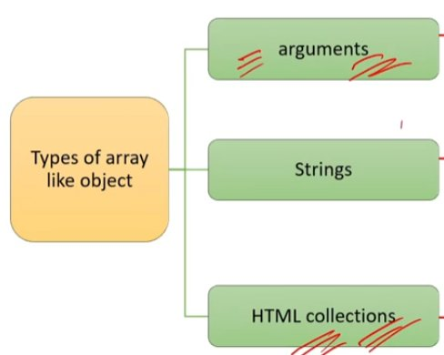

---

## 18. break and continue

The **`break`** statement is used to terminate the loop.

```js
// break statement
for (let i = 1; i <= 5; i++) {
  if (i === 3) {
    break;
  }
  console.log(i);
}
// Output: 1 2
```

The **`continue`** statement is used to skip the current iteration of the loop and move on to the next iteration.

```js
// continue statement
for (let i = 1; i <= 5; i++) {
  if (i === 3) {
    continue;
  }
  console.log(i);
}
// Output: 1 2 4 5
```

---

## 19. for...of and for...in

**`for...of`** loop is used to loop through the values of an object like arrays, strings. It allows you to access each value directly, without having to use an index.

```js
let arr = [1, 2, 3];
// for of is much simpler
for (let val of arr) {
  console.log(val);
}
// Output: 1 2 3
```

**`for...in`** loop is used to loop through the properties of an object. It allows you to iterate over the keys of an object and access the values associated by using keys as the index.

```js
// for-in loop
const person = {
  name: 'Happy',
  role: 'Developer'
};

for (let key in person) {
  console.log(person[key]);
}
// Output: Happy Developer
```

---

## 20. Higher Order Function

A Higher order function:
1. Takes one or more functions as arguments (callback function) OR
2. Returns a function as a result

```js
// Take one or more functions as arguments
function hof(func) {
  func();
}
hof(sayHello);

function sayHello() {
  console.log("Hello!");
}
// Output: "Hello!"
```

```js
// Return a function as a result
function createAdder(number) {
  return function (value) {
    return value + number;
  };
}
const addFive = createAdder(5);
console.log(addFive(2));
// Output: 7
```

---

## 21. Parameters vs Arguments

**Parameters** are the placeholders defined in the function declaration.

```js
// a and b are parameters
function add(a, b) {
  console.log(a + b);
}
```

**Arguments** are the actual values passed to a function when it is invoked or called.

```js
add(3, 4)
// 3 and 4 are arguments
```

---

## 22. First Class Function

A programming language is said to have First-class functions if functions in that language are treated like other variables.

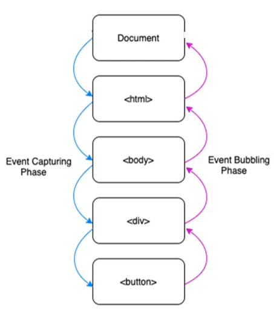

**Assignable:**

```js
// 1. Assigning function like a variable
const myFunction = function () {
  console.log("Interview, Happy!");
}

myFunction(); // Output: "Interview, Happy!"
```

**Passable as an argument:**

```js
function double(number) {
  return number * 2;
}

// 2. Passing function as an argument like a variable
function performOperation(double, value) {
  return double(value);
}

console.log(performOperation(double, 5)); // Output: 10
```

**Returnable as a Value:**

```js
// 3. A function that returns another function
function createSimpleFunction() {
  return function () {
    console.log("I am from return function.");
  };
}
const simpleFunction = createSimpleFunction();
simpleFunction(); // Output: "I am from return function."
```

---

## 23. Function Currying

Currying in JavaScript transforms a function with multiple arguments into a nested series of functions, each taking a single argument.

**Advantage:** Reusability, modularity, and specialization. Big, complex functions with multiple arguments can be broken down into small, reusable functions with fewer arguments.

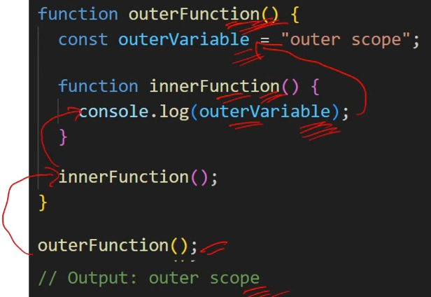

```js
// Regular function that takes two arguments
// and returns their product
function multiply(a, b) {
  return a * b;
}
```

```js
// Curried version of the multiply function
function curriedMultiply(a) {
  return function (b) {
    return a * b;
  };
}

// Create a specialized function for doubling a number
const double = curriedMultiply(2);
console.log(double(5));
// Output: 10 (2 * 5)
```

---

## 24. Call, Apply and Bind

`call`, `apply`, and `bind` are three methods in JavaScript that are used to work with functions and control how they are invoked and what context they operate in.

These methods provide a way to manipulate the `this` value and pass arguments to functions.

```js
// Defining a function that uses the "this" context and an argument
function sayHello(message) {
  console.log(`${message}, ${this.name}!`);
}
const person = { name: 'Happy' };
```

```js
// 1. call - Using the "call" method to invoke the function
// with a specific context and argument
sayHello.call(person, 'Hello');
// Output: "Hello, Happy!"
```

```js
// 2. apply - Using the "apply" method to invoke the function
// with a specific context and an array of arguments
sayHello.apply(person, ['Hi']);
// Output: "Hi, Happy!"
```

```js
// 3. bind - Using the "bind" method to create a new function
// with a specific context (not invoking it immediately)
const greetPerson = sayHello.bind(person);
greetPerson('Greetings');
// Output: "Greetings, Happy!"
```

---

## 25. Function Expression

A function expression is a way to define a function by assigning it to a variable.

```js
// Anonymous Function Expression
const add = function(a, b) {
  return a + b;
};

console.log(add(5, 3));
// Output: 8
```

```js
// Named Function Expression
const add = function sum(a, b) {
  return a + b;
};

console.log(add(5, 3));
// Output: 8
```

---

## 26. Callback Function

A callback function is a function that is passed as an argument to another function.

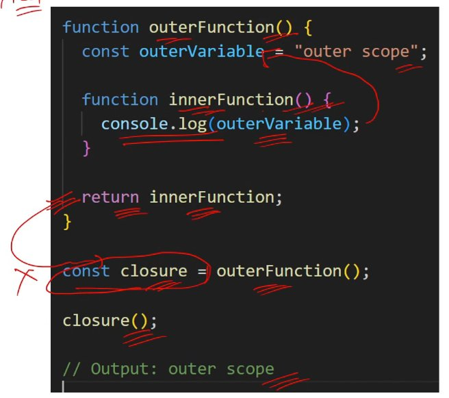

---

> **Note:** Strings in JavaScript are considered immutable because you cannot modify the contents of an existing string directly.

> **Note:** `finally` block is used to execute some code irrespective of error.

> **Note:** The `throw` statement stops the execution of the current function and passes the error to the catch block of calling function.

> **Note:** Error propagation refers to the process of passing or propagating an error from one part of the code to another by using the throw statement with try catch.

---

## 27. Deep Copy vs Shallow Copy

**Shallow copy** in nested objects case will modify the parent object property value, if cloned object property value is changed.

```js
// Original object
const person = {
  name: 'Happy',
  age: 30,
  address: {
    city: 'Delhi',
    country: 'India'
  }
};
```

```js
// Shallow copy using Object.assign()
const shallowCopy = Object.assign({}, person);

shallowCopy.address.city = 'Mumbai';

console.log(person.address.city);      // Output: "Mumbai"
console.log(shallowCopy.address.city); // Output: "Mumbai"
```

**But deep copy will not modify the parent object property value.**

```js
// Deep copy using JSON.parse() and JSON.stringify()
const deepCopy = JSON.parse(JSON.stringify(person));

deepCopy.address.city = 'Bangalore';

console.log(person.address.city);    // Output: "Delhi"
console.log(deepCopy.address.city);  // Output: "Bangalore"
```

---

## 28. Set Object

The Set object is a collection of unique values, meaning that duplicate values are not allowed.

```js
// Creating a Set to store unique numbers
const uniqueNumbers = new Set();
uniqueNumbers.add(5);
uniqueNumbers.add(10);
uniqueNumbers.add(5); // Ignore duplicate values

console.log(uniqueNumbers);
// Output: {5, 10}
```

Set provides methods for adding, deleting, and checking the existence of values in the set.

```js
// Check size
console.log(uniqueNumbers.size);
// Output: 2

// Check element existence
console.log(uniqueNumbers.has(10));
// Output: true

// Delete element
uniqueNumbers.delete(10);
console.log(uniqueNumbers.size);
// Output: 1
```

Set can be used to remove duplicate values from arrays.

```js
// Set can be used to remove duplicate values from arrays
let myArr = [1, 4, 3, 4];
let mySet = new Set(myArr);

let uniqueArray = [...mySet];
console.log(uniqueArray);
// Output: [1, 4, 3]
```

---

## 29. Map Object

The Map object is a collection of key-value pairs where each key can be of any type, and each value can also be of any type.

A Map maintains the order of key-value pairs as they were inserted.

```js
// Creating a Map to store person details
const personDetails = new Map();
personDetails.set("name", "Alice");
personDetails.set("age", 30);

console.log(personDetails.get("name"));
// Output: "Alice"

console.log(personDetails.has("age"));
// Output: true

personDetails.delete("age");
console.log(personDetails.size);
// Output: 1
```

---

## 30. Map Object vs JavaScript Object

| **Map** | **JavaScript Object** |
| --- | --- |
| Keys in a Map can be of any data type, including strings, numbers, objects, functions etc. | Keys in a regular JavaScript object are limited to strings and symbols. |
| A Map maintains the order of key-value pairs as they were inserted. | In a regular object, there is no guaranteed order of keys. |
| Useful when keys are of different types, insertion order is important. | Useful when keys are strings or symbols and there are simple set of properties. |

---

## 31. Event Bubbling and Event Capturing

Event bubbling is the process in JavaScript where an event triggered on a child element propagates up the DOM tree, triggering event handlers on its parent elements.

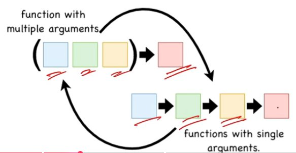

**Example:**

```html
<div id="outer">
  <div id="inner">
    <button id="myButton">Click Me</button>
  </div>
</div>
```

```js
// Get the reference of elements
var outer  = document.getElementById("outer");
var inner  = document.getElementById("inner");
var button = document.getElementById("myButton");
```

```js
// Attach event handlers with elements
outer.addEventListener("click", handleBubbling);
inner.addEventListener("click", handleBubbling);
button.addEventListener("click", handleBubbling);
```

```js
function handleBubbling(event) {
  console.log("Bubbling: " + this.id);
}
```

Event capturing is the process in JavaScript where an event is handled starting from the highest-level ancestor (the root of the DOM tree) and moving down to the target element.

```html
<div id="outer">
  <div id="inner">
    <button id="myButton">Click Me</button>
  </div>
</div>
```

```js
// Get the reference of elements
var outer  = document.getElementById("outer");
var inner  = document.getElementById("inner");
var button = document.getElementById("myButton");
```

```js
// Attach event handlers with elements
outer.addEventListener('click', handleCapture, true);
inner.addEventListener('click', handleCapture, true);
button.addEventListener('click', handleCapture, true);
```

```js
function handleCapture(event) {
  console.log("Capturing: " + this.id);
}
```

---

## 32. Concept of Lexical Scoping

The concept of lexical scoping ensures that variables declared in an outer scope are accessible in nested functions.

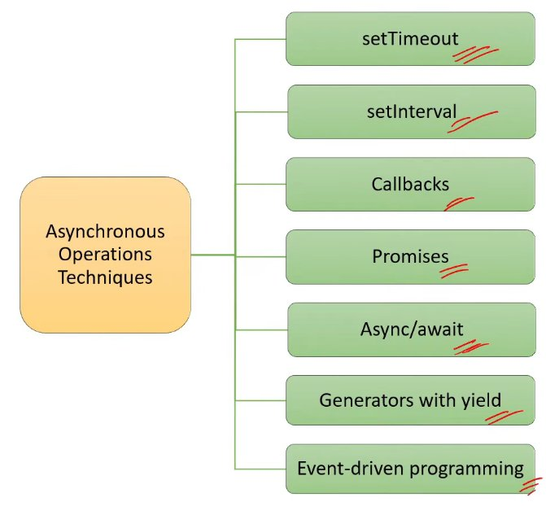

---

## 33. Closure

Closure means that an inner function always has access to the vars and parameters of its outer function, even after the outer function has returned.

This allows the function to "remember" and access variables from its outer scope, even after that outer function has finished executing.

JavaScript will always persist or maintain the state for Closures.

**The closure has three scope chains listed as follows:**
- Access to its own scope.
- Access to the variables of the outer function.
- Access to the global variables.


**Benefits of Closures:**
1. Closure can be used for data modification with data privacy (encapsulation).
2. **Persistent Data and State** - Each time `createCounter()` is called, it creates a new closure with its own separate count variable.
3. **Code Reusability** - The closure returned by `createCounter()` is a reusable counter function.

```js
function createCounter() {
  let count = 0;
  return function () {
    count++;
    console.log(count);
  };
}

// 1. Data Privacy & Encapsulation
const closure1 = createCounter();
closure1(); // Output: 1
closure1(); // Output: 2

// 2. Persistent Data and State
const closure2 = createCounter();
closure2(); // Output: 1
```

---

## 34. Asynchronous Programming in JS

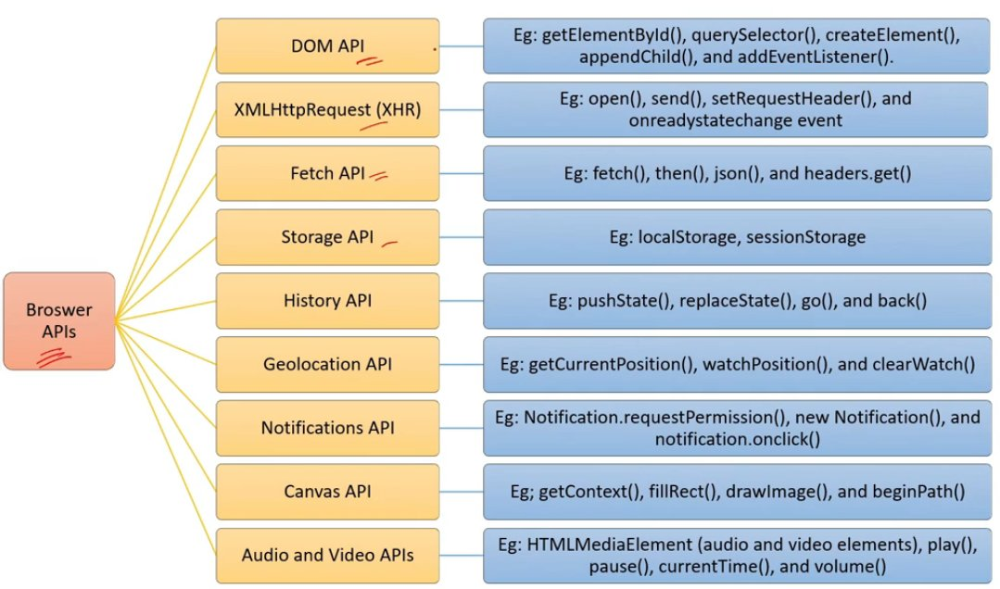

`setTimeout()` is a built-in JavaScript function that allows you to schedule the execution of a function after a specified delay asynchronously.

```js
console.log("start");

// anonymous function as callback
setTimeout(function () {
  console.log("I am not stopping anything");
}, 3000); // Start after a delay of 3 second

console.log("not blocked");

// Output:
// start
// not blocked
// I am not stopping anything
```

`setInterval()` is a built-in JavaScript function that allows you to repeatedly execute a function at a specified interval asynchronously.

```js
console.log("start");

setInterval(function () {
  console.log("I am not stopping anything");
}, 3000); // Repeat after every 3 second

console.log("not blocked");
// Output:
// start
// not blocked
// I am not stopping anything
// I am not stopping anything
// ........
```

A **JavaScript Promise** is **an object representing the eventual completion or failure of an asynchronous operation**.

**Important points about promises:**
1. Promises in JavaScript are a way to handle asynchronous operations.
2. A Promise can be in one of three states: **pending**, **resolved**, or **rejected**.
3. A promise represents a value that may not be available yet but will be available at some point in the future.

Promises are useful when you need to perform time taking operations in asynchronous manner and later handle the results when the result is available.

---

## 35. Promise.all()

`Promise.all()` is used to handle multiple promises concurrently.

`Promise.all()` takes an array of promises as input parameter and returns a single promise.

`Promise.all()` waits for all promises to resolve or at least one promise to reject.

```js
// Promise.all() method is used to handle multiple promises concurrently.
const promise1 = new Promise((resolve) => setTimeout(resolve, 1000, "Hello"));
const promise2 = new Promise((resolve) => setTimeout(resolve, 2000, "World"));
const promise3 = new Promise((resolve) => setTimeout(resolve, 1500, "Happy"));

// Promise.all takes an array of promises as input and returns a new promise.
Promise.all([promise1, promise2, promise3])
  .then((results) => {
    console.log(results); // Output: ['Hello', 'World', 'Happy']
  })
  .catch((error) => {
    console.error("Error:", error);
  });
```

The `Promise.allSettled()` method in JavaScript is used to get a promise when all inputs are settled that is either fulfilled or rejected.

**`Promise.allSettled()`** takes an array of promises as an input parameter and returns a single promise.

**`Promise.allSettled()` waits for all promises to finish execution**, whether they **resolve or reject**.

It **never rejects**. Instead, it always resolves with an array of result objects describing the outcome of each promise.

Each result object contains:
- `status` → `"fulfilled"` or `"rejected"`
- `value` → if fulfilled
- `reason` → if rejected

```js
// Promise.allSettled() handles multiple promises and waits for all to finish
const promise1 = new Promise((resolve) => setTimeout(resolve, 1000, "Hello"));
const promise2 = new Promise((_, reject) => setTimeout(reject, 2000, "Something went wrong"));
const promise3 = new Promise((resolve) => setTimeout(resolve, 1500, "Happy"));

Promise.allSettled([promise1, promise2, promise3])
  .then((results) => {
    console.log(results);

    // Example of handling results individually
    results.forEach((result, index) => {
      if (result.status === "fulfilled") {
        console.log(`Promise ${index + 1} fulfilled with:`, result.value);
      } else {
        console.log(`Promise ${index + 1} rejected with:`, result.reason);
      }
    });
  });

// Output
// [
//   { status: "fulfilled", value: "Hello" },
//   { status: "rejected", reason: "Something went wrong" },
//   { status: "fulfilled", value: "Happy" }
// ]
```

`Promise.all()` stops on the first error.

`Promise.allSettled()` waits and shows **everything.**

`Promise.race()` is used to handle multiple promises concurrently.

`Promise.race()` takes an array of promises as input parameter and returns a single promise.

```js
// Promise.race method is used to handle multiple promises concurrently.
const promise1 = new Promise((resolve) => setTimeout(resolve, 1000, "Hello"));
const promise2 = new Promise((resolve) => setTimeout(resolve, 2000, "World"));
const promise3 = new Promise((reject)  => setTimeout(reject,  1500, "Happy"));

// Promise.race takes an array of promises as input and returns a new promise.
Promise.race([promise1, promise2, promise3])
  .then((results) => {
    console.log(results); // Output: 'Hello'
  })
  .catch((error) => {
    console.error("Error:", error);
  });
```

---

## 36. Async/await and Promises

Promises and async/await can achieve the same goal of handling asynchronous operations.

Promises work with `.then()` and `.catch()`, async/await works like normal code but is still Promise-based.

```js
// Promises
function fetchData() {
  return new Promise((resolve) => {
    setTimeout(() => resolve("Data received"), 1000);
  });
}

fetchData()
  .then((result) => {
    console.log(result);
  })
  .catch((error) => {
    console.log(error);
  });
```

```js
// async-await
function fetchData() {
  return new Promise((resolve) => {
    setTimeout(() => resolve("Data received"), 1000);
  });
}

async function getData() {
  try {
    const result = await fetchData();
    console.log(result);
  } catch (error) {
    console.log(error);
  }
}

getData();
```

**async-await use:**

The `async` keyword is used to define a function as an asynchronous function, which means the code inside async function will not block the execution of other code.

The `await` keyword is used within an async function to pause the execution of the function until a Promise is resolved or rejected.

```js
function delay(ms) {
  return new Promise((resolve) =>
    setTimeout(() => {
      console.log("Running");
      resolve();
    }, ms)
  );
}

async function greet() {
  console.log("Starting...");

  delay(2000);           // Not block
  console.log("Not Blocked");

  await delay(1000);     // Block the code until completion
  console.log("Blocked");
}
greet();

// Output:
// Starting.
// Not Blocked
// Running (after 1 sec)
// Blocked
// Running (after 2 sec)
```

---

## 37. Browser API's in JS

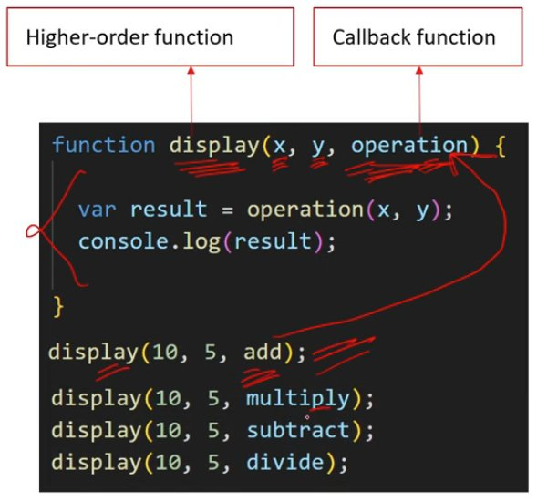

---

## 38. Web Storages

The Web Storage is used to store data locally within the browser.

**Two types of Web Storage:**
1. Local Storage
2. Session Storage

**5 uses of web storage:**
1. Storing user preferences or settings. (for eg: theme selection (dark/light), language preference etc.)
2. Caching data to improve performance.
3. Remembering User Actions and State.
4. Implementing Offline Functionality.
5. Storing Client-Side Tokens.

### Local Storage

LocalStorage is a web storage feature provided by web browsers that allows web applications to store key-value pairs of data locally on the user's device.

**Uses of local storage:**
1. Storing user preferences like language preference.
2. Caching data to improve performance.
3. Implementing Offline Functionality.
4. Storing Client-Side Tokens.

```js
// Storing data in localStorage
localStorage.setItem('key', "value");

// Retrieving data from localStorage
const value = localStorage.getItem("key");

// Removing single item from localStorage
localStorage.removeItem("key");

// Clearing all data in localStorage
localStorage.clear();
```

### Local Storage vs Session Storage

| **Local Storage** | **Session Storage** |
| --- | --- |
| Data stored in Local Storage is accessible across multiple windows, tabs, and iframes of the same origin (domain). | Data stored in Session Storage is specific to a particular browsing session and is accessible only within the same window or tab. |
| Data stored in Local Storage persists even when the browser is closed and reopened. | Data stored in Session Storage is cleared when browser window or tab is closed. |
| Data stored in Local Storage has no expiration date unless explicitly removed. | Data stored in Session Storage is temporary and lasts only for the duration of the browsing session. |

---

## 39. Cookies

Cookies are small pieces of data that are stored in the user's web browser.

```js
// Creating multiple cookies
document.cookie = "cookieName1=cookieValue1";
document.cookie = "cookieName2=cookieValue2";
document.cookie = "cookieName3=cookieValue3";

const cookieValue = getCookie("cookieName3");
console.log(cookieValue);

// Function to get cookie by cookie name
function getCookie(cookieName) {
  const cookies = document.cookie.split(";");
  for (let i = 0; i < cookies.length; i++) {
    const cookie = cookies[i].split("=");
    if (cookie[0] === cookieName) {
      return cookie[1];
    }
  }
  return "";
}
```

---

## Cookies VS Web Storage

| **Cookies** | **Web Storage (Local/Session)** |
| --- | --- |
| Cookies have a small storage capacity of up to 4KB per domain. | Web storage have a large storage capacity of up to 5-10MB per domain. |
| Cookies are automatically sent with every request. | Data stored in web storage is not automatically sent with each request. |
| Cookies can have an expiration date set. | Data stored in web storage is not associated with an expiration date. |
| Cookies are accessible both on the client-side (via JavaScript) and server-side (via HTTP headers). This allows server-side code to read and modify cookie values. | Web Storage is accessible and modifiable only on the client-side. |

---

## 40. Classes

**Classes Advantage:**
1. Object Creation
2. Encapsulation & safety
3. Inheritance
4. Code Reusability
5. Polymorphism
6. Abstraction

```js
// class example
class Person {
  constructor(name, age) {
    this.name = name;
    this.age = age;
  }
  sayHello() {
    console.log(`${this.name} - ${this.age}`);
  }
}
```

```js
// Creating objects from the class
var person1 = new Person("Alice", 25);
var person2 = new Person("Bob", 30);
```

```js
// Accessing properties and calling methods
console.log(person1.name); // Output: "Alice"
person2.sayHello();        // Output: "Bob - 30"
```

### Constructor

Constructors are special methods within classes that are automatically called when an object is created of the class using the `new` keyword.

```js
// class example
class Person {
  constructor(name, age) {
    this.name = name;
    this.age = age;
  }
  sayHello() {
    console.log(`${this.name} - ${this.age}`);
  }
}
```

```js
// Creating objects from the class
var person1 = new Person("Alice", 25);
var person2 = new Person("Bob", 30);
```

### Constructor Functions

Constructor functions are a way of creating objects and initializing their properties.

```js
// class example
class Person {
  constructor(name, age) {
    this.name = name;
    this.age = age;
  }
  sayHello() {
    console.log(`${this.name} - ${this.age}`);
  }
}

// Creating objects from the class
var person1 = new Person("Alice", 25);
var person2 = new Person("Bob", 30);

// Constructor function
function Person(name, age) {
  this.name = name;
  this.age = age;
}
```

### this Keyword

`this` keyword provides a way to access the current object or class.

```js
// class example
class Person {
  constructor(name) {
    this.name = name;
  }
  sayHello() {
    console.log(`${this.name}`);
  }
}

var person1 = new Person("Happy")
console.log(person1.name);

// constructor function
function Person(name, age) {
  this.name = name;
  this.age  = age;
}
```

---

## 41. ES6

ECMAScript (ES6) is the standard which JavaScript follows.

1. let and const
2. Arrow Functions
3. Classes
4. Template Literals
5. Destructuring Assignment
6. Default Parameters
7. Rest and Spread Operators
8. Promises
9. Modules

---

## 42. eval() Function in Javascript

`eval()` is a built-in function that evaluates a string as a JavaScript code and dynamically executes it.

```js
let x = 10;
let y = 20;
let code = "x + y";

let z = eval(code);
console.log(z);
// Output: 30
```

---

## 43. XSS (Cross-Site Scripting) attack

## 44. SQL Injection attack
