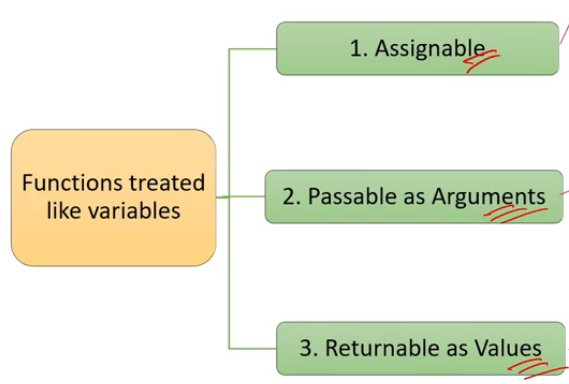

# JavaScript Interview Preparation Notes

---

## Table of Contents

1. [Variables & Scoping](#variables--scoping)
2. [Data Types](#data-types)
3. [DOM & Selectors](#dom--selectors)
4. [Arrays & Array Methods](#arrays--array-methods)
5. [Array-Like Objects](#array-like-objects)
6. [Spread & Rest Operators](#spread--rest-operators)
7. [Functions](#functions)
8. [First-Class Functions](#first-class-functions)
9. [Higher-Order Functions & Callbacks](#higher-order-functions--callbacks)
10. [Function Currying](#function-currying)
11. [Call, Apply & Bind](#call-apply--bind)
12. [Closures & Lexical Scoping](#closures--lexical-scoping)
13. [Control Flow](#control-flow)
14. [Objects, Classes & OOP](#objects-classes--oop)
15. [Deep Copy vs Shallow Copy](#deep-copy-vs-shallow-copy)
16. [Set & Map Objects](#set--map-objects)
17. [Events](#events)
18. [Asynchronous Programming](#asynchronous-programming)
19. [Promises](#promises)
20. [Async/Await](#asyncawait)
21. [Browser APIs & Web Storage](#browser-apis--web-storage)
22. [ES6 Features](#es6-features)
23. [Security](#security)

---

## Variables & Scoping

- **`var`** — function-scoped variable. Supports **hoisting** (declarations moved to top of scope during compilation).
- **`let`** — block-scoped variable. Does **not** allow hoisting.
- **`const`** — block-scoped, can be assigned only once; value cannot be changed afterwards.

**Hoisting:** JavaScript behavior where function and variable declarations are moved to the top of their respective scopes during the compilation phase. `let` does not allow hoisting.

**Scope** determines where variables are defined and where they can be accessed.

---

## Data Types

**Primitive Data Types** (immutable, hold a single value):
- `string`, `number`, `boolean`, `undefined`, `null`, `symbol`, `bigint`

**Non-Primitive Data Types** (mutable, can hold multiple values):
- `object`, `array`, `function`

**`undefined`** — A variable declared but not yet assigned a value is automatically initialized with `undefined`.

**`null`** — Variables intentionally assigned a null value.

**Type Coercion** — The automatic conversion of values from one data type to another during certain operations or comparisons.

---

## DOM & Selectors

The **DOM (Document Object Model)** represents the web page as a tree-like structure that allows JavaScript to dynamically access and manipulate the content and structure of a web page.

**Selectors** help get specific elements from the DOM based on IDs, class names, or tag names.

```js
document.getElementById('id');
document.querySelector('.class');
document.createElement('div');
element.appendChild(child);
element.addEventListener('click', handler);
```

---

## Arrays & Array Methods

An **array** is a data type that allows you to store multiple values in a single variable.


### Array Methods Overview



| Category | Methods |
|----------|---------|
| **Get** | `indexOf()`, `find()`, `filter()`, `slice()` |
| **Add** | `push()`, `concat()` |
| **Remove** | `pop()`, `shift()`, `splice()` |
| **Modify** | `map()`, `forEach()` |
| **Others** | `join()`, `length`, `sort()`, `reverse()`, `reduce()`, `some()`, `every()` |

### Visual Summary of Key Methods


### Getting Elements

**`find()`** — Returns the first element that satisfies a condition.
```js
const array = [1, 2, 3, 4, 5];
let c = array.find((num) => num % 2 === 0);
console.log(c); // Output: 2
```

**`filter()`** — Returns an array of all elements that satisfy a condition.
```js
const array = [1, 2, 3, 4, 5];
let d = array.filter((num) => num % 2 === 0);
console.log(d); // Output: [2, 4]
```

**`slice()`** — Returns a subset from start index to end index (end not included).
```js
const array = ["a", "b", "c", "d", "e"];
let e = array.slice(1, 4);
console.log(e); // Output: ['b', 'c', 'd']
```

### Adding Elements

**`push()`** — Modifies the original array.
```js
let array1 = [1, 2];
array1.push(3, 4);
console.log(array1); // Output: [1, 2, 3, 4]
```

**`concat()`** — Creates a new array, does not modify the original.
```js
let array2 = [5, 6];
let array3 = array2.concat(7, 8);
console.log(array3);  // Output: [5, 6, 7, 8]
console.log(array2);  // Output: [5, 6]  (unchanged)
```

### Removing Elements

**`pop()`** — Removes the last element.
```js
let arr1 = [1, 2, 3, 4];
let popped = arr1.pop();
console.log(popped); // Output: 4
console.log(arr1);   // Output: [1, 2, 3]
```

**`shift()`** — Removes the first element.
```js
let arr2 = [1, 2, 3, 4];
let shifted = arr2.shift();
console.log(shifted); // Output: 1
console.log(arr2);    // Output: [2, 3, 4]
```

**`splice()`** — Adds, removes, or replaces elements.
```js
// Syntax: array.splice(startIndex, deleteCount, ...itemsToAdd)
let letters = ['a', 'b', 'c'];

// Add 'x' and 'y' at index 1
letters.splice(1, 0, 'x', 'y');
console.log(letters); // Output: ['a', 'x', 'y', 'b', 'c']

// Remove 1 element starting from index 1
letters.splice(1, 1);
console.log(letters); // Output: ['a', 'y', 'b', 'c']

// Replace element at index 2 with 'q'
letters.splice(2, 1, 'q');
console.log(letters); // Output: ['a', 'y', 'q', 'c']
```

### Modifying & Iterating

**`map()`** — Creates a new array with modified values.
```js
let arr1 = [1, 2, 3];
let mapArray = arr1.map((e) => e * 2);
console.log(mapArray); // Output: [2, 4, 6]
```

**`forEach()`** — Performs an operation on each element but does NOT return a new array.
```js
let arr2 = [1, 2, 3];
arr2.forEach((e) => {
  console.log(e * 2);
});
// Output: 2 4 6
console.log(arr2); // Output: [1, 2, 3]  (unchanged)
```

### Array Destructuring

Allows extracting elements and assigning them to individual variables in a single statement.
```js
const fruits = ['apple', 'banana', 'orange'];
const [firstFruit, secondFruit, thirdFruit] = fruits;
console.log(firstFruit);  // Output: "apple"
console.log(secondFruit); // Output: "banana"
console.log(thirdFruit);  // Output: "orange"
```

---

## Array-Like Objects

Array-like objects have indexed elements and a `length` property, similar to arrays, but may not have array methods like `push()` and `pop()`.


**Types of Array-Like Objects:**
- `arguments` (inside functions)
- Strings
- HTML Collections

```js
// Arguments object
sum(1, 2, 3);
function sum() {
  console.log(arguments);        // Output: [1, 2, 3]
  console.log(arguments.length); // Output: 3
  console.log(arguments[0]);     // Output: 1
}

// String
const str = "Hello";
console.log(str.length); // Output: 5
console.log(str[0]);     // Output: H

// HTML Collection
var boxes = document.getElementsByClassName('box');
console.log(boxes[0]);
console.log(boxes.length);
```

---

## Spread & Rest Operators

### Spread Operator (`...`)

Used to expand or spread elements from an iterable into individual elements.


**Uses of Spread Operator:**
1. Copying an array
2. Merging arrays
3. Passing multiple arguments to a function

```js
const array = [1, 2, 3];
console.log(...array); // Output: 1 2 3

// Copying an array
const originalArray = [1, 2, 3];
const copiedArray = [...originalArray];
console.log(copiedArray); // Output: [1, 2, 3]

// Merging arrays
const array1 = [1, 2, 3];
const array2 = [4, 5];
const mergedArray = [...array1, ...array2];
console.log(mergedArray); // Output: [1, 2, 3, 4, 5]

// Passing multiple arguments to a function
const numbers = [1, 2, 3, 4, 5];
function sum(a, b, c, d, e) {
  console.log(a + b + c + d + e); // Output: 15
}
sum(...numbers);
```

### Rest Operator (`...`)

Used in function parameters to collect all remaining arguments into an array.

```js
display(1, 2, 3, 4, 5);

function display(first, second, ...restArguments) {
  console.log(first);          // Output: 1
  console.log(second);         // Output: 2
  console.log(restArguments);  // Output: [3, 4, 5]
}
```

---

## Functions

A **function** is a reusable block of code that performs a specific task.

**Arrow Functions** (fat arrow functions) — A simpler, shorter way to define functions.
```js
const add = (a, b) => a + b;
```

### Parameters vs Arguments

- **Parameters** — Placeholders defined in the function declaration.
- **Arguments** — Actual values passed to a function when it is invoked.

```js
// a and b are parameters
function add(a, b) {
  console.log(a + b);
}

add(3, 4); // 3 and 4 are arguments
```

### Function Expressions

A way to define a function by assigning it to a variable.

```js
// Anonymous Function Expression
const add = function(a, b) {
  return a + b;
};
console.log(add(5, 3)); // Output: 8

// Named Function Expression
const add = function sum(a, b) {
  return a + b;
};
console.log(add(5, 3)); // Output: 8
```

---

## First-Class Functions

A language has **First-Class Functions** if functions are treated like other variables. In JavaScript, functions can be:


1. **Assignable** — Assigned to a variable
2. **Passable as Arguments** — Passed to another function
3. **Returnable as Values** — Returned from a function

```js
// 1. Assignable
const myFunction = function () {
  console.log("Interview, Happy!");
};
myFunction(); // Output: "Interview, Happy!"

// 2. Passable as argument
function double(number) { return number * 2; }
function performOperation(fn, value) { return fn(value); }
console.log(performOperation(double, 5)); // Output: 10

// 3. Returnable as value
function createSimpleFunction() {
  return function () {
    console.log("I am from return function.");
  };
}
const simpleFunction = createSimpleFunction();
simpleFunction(); // Output: "I am from return function."
```

---

## Higher-Order Functions & Callbacks

### Higher-Order Function

A higher-order function either:
1. Takes one or more functions as arguments (callback function), OR
2. Returns a function as a result

```js
// Takes a function as argument
function hof(func) {
  func();
}
hof(sayHello);
function sayHello() { console.log("Hello!"); }
// Output: "Hello!"

// Returns a function
function createAdder(number) {
  return function (value) {
    return value + number;
  };
}
const addFive = createAdder(5);
console.log(addFive(2)); // Output: 7
```

### Callback Function

A callback function is a function passed as an argument to another function.


```js
// display is the higher-order function
// add, multiply, subtract, divide are callback functions
function display(x, y, operation) {
  var result = operation(x, y);
  console.log(result);
}

display(10, 5, add);
display(10, 5, multiply);
display(10, 5, subtract);
display(10, 5, divide);
```

---

## Function Currying

Currying transforms a function with multiple arguments into a nested series of functions, each taking a single argument.


**Advantages:** Reusability, modularity, and specialization. Big, complex functions can be broken down into smaller, reusable functions.

```js
// Regular function
function multiply(a, b) {
  return a * b;
}

// Curried version
function curriedMultiply(a) {
  return function (b) {
    return a * b;
  };
}

// Create a specialized function for doubling
const double = curriedMultiply(2);
console.log(double(5)); // Output: 10 (2 * 5)
```

---

## Call, Apply & Bind

`call`, `apply`, and `bind` are methods used to control how functions are invoked and what context (`this`) they operate in.

```js
function sayHello(message) {
  console.log(`${message}, ${this.name}!`);
}
const person = { name: 'Happy' };

// call — invokes with specific context and arguments
sayHello.call(person, 'Hello');
// Output: "Hello, Happy!"

// apply — invokes with specific context and an array of arguments
sayHello.apply(person, ['Hi']);
// Output: "Hi, Happy!"

// bind — creates a new function with specific context (does NOT invoke immediately)
const greetPerson = sayHello.bind(person);
greetPerson('Greetings');
// Output: "Greetings, Happy!"
```

---

## Closures & Lexical Scoping

### Lexical Scoping

The concept of lexical scoping ensures that variables declared in an outer scope are accessible in nested functions.


```js
function outerFunction() {
  const outerVariable = "outer scope";

  function innerFunction() {
    console.log(outerVariable); // Can access outer variable
  }

  innerFunction();
}
outerFunction();
// Output: outer scope
```

### Closure

A closure means that an inner function always has access to the variables and parameters of its outer function, **even after the outer function has returned**.

JavaScript will always persist or maintain the state for closures.

**The closure has three scope chains:**
- Access to its own scope
- Access to variables of the outer function
- Access to global variables


```js
function outerFunction() {
  const outerVariable = "outer scope";

  function innerFunction() {
    console.log(outerVariable);
  }

  return innerFunction;
}

const closure = outerFunction();
closure();
// Output: outer scope
```

**Benefits of Closures:**
1. **Data Privacy (Encapsulation)** — Private variables not accessible from outside
2. **Persistent Data and State** — Each call to `createCounter()` creates its own separate `count`
3. **Code Reusability** — The returned closure is a reusable function

```js
function createCounter() {
  let count = 0;
  return function () {
    count++;
    console.log(count);
  };
}

// Data Privacy & Persistent State
const closure1 = createCounter();
closure1(); // Output: 1
closure1(); // Output: 2

const closure2 = createCounter(); // Independent state
closure2(); // Output: 1
```

---

## Control Flow

### break vs continue

- **`break`** — Terminates the loop entirely.
- **`continue`** — Skips the current iteration and moves to the next.

```js
// break
for (let i = 1; i <= 5; i++) {
  if (i === 3) break;
  console.log(i);
}
// Output: 1 2

// continue
for (let i = 1; i <= 5; i++) {
  if (i === 3) continue;
  console.log(i);
}
// Output: 1 2 4 5
```

### for...of vs for...in

- **`for...of`** — Loops through the **values** of an iterable (arrays, strings).
- **`for...in`** — Loops through the **keys/properties** of an object.

```js
// for...of
let arr = [1, 2, 3];
for (let val of arr) {
  console.log(val);
}
// Output: 1 2 3

// for...in
const person = { name: 'Happy', role: 'Developer' };
for (let key in person) {
  console.log(person[key]);
}
// Output: Happy Developer
```

---

## Objects, Classes & OOP

An **object** is a data type that allows you to store key-value pairs.

### Classes

**Advantages of Classes:**
1. Object Creation
2. Encapsulation & Safety
3. Inheritance
4. Code Reusability
5. Polymorphism
6. Abstraction

```js
class Person {
  constructor(name, age) {
    this.name = name;
    this.age = age;
  }
  sayHello() {
    console.log(`${this.name} - ${this.age}`);
  }
}

const person1 = new Person("Alice", 25);
const person2 = new Person("Bob", 30);

console.log(person1.name); // Output: "Alice"
person2.sayHello();        // Output: "Bob - 30"
```

### Constructor

Constructors are special methods within classes automatically called when an object is created using the `new` keyword.

### Constructor Functions

A way of creating objects and initializing their properties (pre-ES6 style).

```js
function Person(name, age) {
  this.name = name;
  this.age = age;
}
const person1 = new Person("Alice", 25);
```

### `this` Keyword

`this` provides a way to access the current object or class.

```js
class Person {
  constructor(name) {
    this.name = name;
  }
  sayHello() {
    console.log(`${this.name}`);
  }
}
```

---

## Deep Copy vs Shallow Copy

- **Shallow Copy** — In nested objects, changing a property on the cloned object also modifies the original object.
- **Deep Copy** — Changes to the cloned object do NOT affect the original object.

```js
const person = {
  name: 'Happy',
  age: 30,
  address: { city: 'Delhi', country: 'India' }
};

// Shallow copy — nested objects are still linked
const shallowCopy = Object.assign({}, person);
shallowCopy.address.city = 'Mumbai';
console.log(person.address.city);      // Output: "Mumbai"  (also changed!)
console.log(shallowCopy.address.city); // Output: "Mumbai"

// Deep copy — fully independent
const deepCopy = JSON.parse(JSON.stringify(person));
deepCopy.address.city = 'Bangalore';
console.log(person.address.city);    // Output: "Delhi"     (unchanged)
console.log(deepCopy.address.city);  // Output: "Bangalore"
```

> **Note:** Strings in JavaScript are considered immutable — you cannot modify the contents of an existing string directly.

---

## Set & Map Objects

### Set

A `Set` is a collection of **unique** values (no duplicates allowed).

```js
const uniqueNumbers = new Set();
uniqueNumbers.add(5);
uniqueNumbers.add(10);
uniqueNumbers.add(5); // Ignored (duplicate)

console.log(uniqueNumbers);          // Output: {5, 10}
console.log(uniqueNumbers.size);     // Output: 2
console.log(uniqueNumbers.has(10));  // Output: true
uniqueNumbers.delete(10);
console.log(uniqueNumbers.size);     // Output: 1

// Remove duplicates from array
let myArr = [1, 4, 3, 4];
let uniqueArray = [...new Set(myArr)];
console.log(uniqueArray); // Output: [1, 4, 3]
```

### Map

A `Map` is a collection of **key-value pairs** where keys can be of any type. It maintains insertion order.

```js
const personDetails = new Map();
personDetails.set("name", "Alice");
personDetails.set("age", 30);

console.log(personDetails.get("name")); // Output: "Alice"
console.log(personDetails.has("age"));  // Output: true
personDetails.delete("age");
console.log(personDetails.size);         // Output: 1
```

### Map vs Object

| Feature | Map | Object |
|---|---|---|
| Key Types | Any type | Strings/Symbols only |
| Insertion Order | Maintained | Not guaranteed |
| Size | `.size` property | Manual count |
| Iteration | Direct iteration | Requires `Object.keys()` |

---

## Events

### Event Bubbling & Capturing


**Event Bubbling** — When an event is triggered on a child element, it **propagates up** the DOM tree, triggering event handlers on parent elements.

**Event Capturing** — An event is handled starting from the **highest-level ancestor** (root of DOM) and moving **down** to the target element.

```
Event Capturing Phase (↓):  Document → <html> → <body> → <div> → <button>
Event Bubbling Phase (↑):   <button> → <div> → <body> → <html> → Document
```

```js
// Event Bubbling (default — no 3rd argument)
outer.addEventListener("click", handleBubbling);
inner.addEventListener("click", handleBubbling);
button.addEventListener("click", handleBubbling);

function handleBubbling(event) {
  console.log("Bubbling: " + this.id);
}

// Event Capturing (pass 'true' as 3rd argument)
outer.addEventListener('click', handleCapture, true);
inner.addEventListener('click', handleCapture, true);
button.addEventListener('click', handleCapture, true);

function handleCapture(event) {
  console.log("Capturing: " + this.id);
}
```

---

## Asynchronous Programming

**Asynchronous programming** allows multiple tasks or operations to be initiated and executed concurrently without blocking code execution.


**Use cases of Asynchronous Operations:**
- Fetching data from API
- Downloading files
- Uploading files
- Animations and transitions
- Time-consuming operations

### Asynchronous Techniques


| Technique | Description |
|---|---|
| `setTimeout` | Executes a function once after a delay |
| `setInterval` | Repeatedly executes a function at a set interval |
| Callbacks | Function passed as argument, called later |
| Promises | Object representing eventual completion/failure |
| Async/Await | Syntactic sugar over Promises |
| Generators with `yield` | Pausable functions |
| Event-driven programming | Reacts to events |

### setTimeout

```js
console.log("start");

setTimeout(function () {
  console.log("I am not stopping anything");
}, 3000);

console.log("not blocked");

// Output:
// start
// not blocked
// I am not stopping anything  (after 3 seconds)
```

### setInterval

```js
console.log("start");

setInterval(function () {
  console.log("I am not stopping anything");
}, 3000); // Repeats every 3 seconds

console.log("not blocked");
// Output:
// start
// not blocked
// I am not stopping anything
// I am not stopping anything
// ........
```

---

## Promises

A **Promise** is an object representing the eventual completion or failure of an asynchronous operation.

**Three states of a Promise:**
1. **Pending** — Initial state
2. **Resolved/Fulfilled** — Operation completed successfully
3. **Rejected** — Operation failed

```js
function fetchData() {
  return new Promise((resolve) => {
    setTimeout(() => resolve("Data received"), 1000);
  });
}

fetchData()
  .then((result) => {
    console.log(result); // Output: "Data received"
  })
  .catch((error) => {
    console.log(error);
  });
```

### Promise.all()

Handles multiple promises **concurrently**. Waits for **all** to resolve, or rejects on the **first** rejection.

```js
const promise1 = new Promise((resolve) => setTimeout(resolve, 1000, "Hello"));
const promise2 = new Promise((resolve) => setTimeout(resolve, 2000, "World"));
const promise3 = new Promise((resolve) => setTimeout(resolve, 1500, "Happy"));

Promise.all([promise1, promise2, promise3])
  .then((results) => {
    console.log(results); // Output: ['Hello', 'World', 'Happy']
  })
  .catch((error) => {
    console.error("Error:", error);
  });
```

### Promise.allSettled()

Waits for **all** promises to finish (whether resolved or rejected). Never rejects itself.

```js
Promise.allSettled([promise1, promise2, promise3])
  .then((results) => {
    results.forEach((result, index) => {
      if (result.status === "fulfilled") {
        console.log(`Promise ${index + 1} fulfilled with:`, result.value);
      } else {
        console.log(`Promise ${index + 1} rejected with:`, result.reason);
      }
    });
  });
// Output:
// [{ status: "fulfilled", value: "Hello" }, ...]
```

> **`Promise.all()`** — stops on first error.  
> **`Promise.allSettled()`** — waits and shows everything.

### Promise.race()

Resolves/rejects as soon as the **first** promise settles.

```js
Promise.race([promise1, promise2, promise3])
  .then((result) => {
    console.log(result); // Output: 'Hello' (first to resolve)
  })
  .catch((error) => {
    console.error("Error:", error);
  });
```

---

## Async/Await

`async/await` is syntactic sugar over Promises that makes asynchronous code look and behave like synchronous code.

- **`async`** — Defines a function as asynchronous; code inside will not block other code.
- **`await`** — Pauses the execution of the async function until the Promise resolves or rejects.

```js
function fetchData() {
  return new Promise((resolve) => {
    setTimeout(() => resolve("Data received"), 1000);
  });
}

async function getData() {
  try {
    const result = await fetchData();
    console.log(result); // Output: "Data received"
  } catch (error) {
    console.log(error);
  }
}

getData();
```

```js
function delay(ms) {
  return new Promise((resolve) =>
    setTimeout(() => {
      console.log("Running");
      resolve();
    }, ms)
  );
}

async function greet() {
  console.log("Starting...");

  delay(2000);           // Not blocking
  console.log("Not Blocked");

  await delay(1000);     // Blocks until complete
  console.log("Blocked");
}
greet();

// Output:
// Starting...
// Not Blocked
// Running (after 1 sec)
// Blocked
// Running (after 2 sec)
```

---

## Browser APIs & Web Storage

### Browser APIs


| API | Key Methods/Properties |
|---|---|
| **DOM API** | `getElementById()`, `querySelector()`, `createElement()`, `appendChild()`, `addEventListener()` |
| **XMLHttpRequest (XHR)** | `open()`, `send()`, `setRequestHeader()`, `onreadystatechange` |
| **Fetch API** | `fetch()`, `then()`, `json()`, `headers.get()` |
| **Storage API** | `localStorage`, `sessionStorage` |
| **History API** | `pushState()`, `replaceState()`, `go()`, `back()` |
| **Geolocation API** | `getCurrentPosition()`, `watchPosition()`, `clearWatch()` |
| **Notifications API** | `Notification.requestPermission()`, `new Notification()`, `notification.onclick()` |
| **Canvas API** | `getContext()`, `fillRect()`, `drawImage()`, `beginPath()` |
| **Audio/Video APIs** | `HTMLMediaElement`, `play()`, `pause()`, `currentTime()`, `volume()` |

### Web Storage

Used to store data locally within the browser.

**Two types:**
1. **Local Storage** — Data persists even after browser is closed.
2. **Session Storage** — Data is cleared when the tab/window is closed.

**5 uses of Web Storage:**
1. Storing user preferences (theme, language)
2. Caching data to improve performance
3. Remembering user actions and state
4. Implementing offline functionality
5. Storing client-side tokens

```js
// Local Storage
localStorage.setItem('key', 'value');
const value = localStorage.getItem('key');
localStorage.removeItem('key');
localStorage.clear();
```

### Local Storage vs Session Storage

| Local Storage | Session Storage |
|---|---|
| Accessible across multiple tabs/windows | Specific to a particular tab/window |
| Persists even when browser is closed | Cleared when tab/window is closed |
| No expiration date | Temporary, lasts only for the session |

### Cookies

Small pieces of data stored in the user's browser.

```js
// Creating cookies
document.cookie = "cookieName1=cookieValue1";
document.cookie = "cookieName2=cookieValue2";

// Function to get a cookie by name
function getCookie(cookieName) {
  const cookies = document.cookie.split(";");
  for (let i = 0; i < cookies.length; i++) {
    const cookie = cookies[i].split("=");
    if (cookie[0].trim() === cookieName) {
      return cookie[1];
    }
  }
  return "";
}
```

### Cookies vs Web Storage

| Feature | Cookies | Web Storage (Local/Session) |
|---|---|---|
| Storage Capacity | ~4KB per domain | 5–10MB per domain |
| Sent with requests | Automatically sent with every HTTP request | Not sent with requests |
| Expiration | Can set an expiration date | No expiration (Local) / Session-based |
| Accessibility | Client-side + server-side | Client-side only |

---

## ES6 Features

ECMAScript (ES6) is the standard which JavaScript follows.

1. `let` and `const`
2. Arrow Functions
3. Classes
4. Template Literals
5. Destructuring Assignment
6. Default Parameters
7. Rest and Spread Operators
8. Promises
9. Modules

---

## Security

### eval() Function

`eval()` evaluates a string as JavaScript code and dynamically executes it. **Avoid using in production** due to security risks.

```js
let x = 10;
let y = 20;
let code = "x + y";
let z = eval(code);
console.log(z); // Output: 30
```

### XSS (Cross-Site Scripting) Attack

An attacker injects malicious scripts into content that is served to other users.

### SQL Injection Attack

An attacker inserts malicious SQL code into a query to manipulate the database.

---

## Important Notes

- `finally` block executes code **irrespective of errors**.
- The `throw` statement stops execution of the current function and passes the error to the `catch` block of the calling function.
- **Error propagation** refers to passing an error from one part of the code to another using `throw` with `try...catch`.
- Strings in JavaScript are **immutable** — you cannot modify the contents of an existing string directly.

---

> 📁 **GitHub Upload Instructions:**  
> Push **both** this `JavaScript_Interview_Prep.md` file **and** the `images/` folder to the **same directory** in your repo.  
> Example repo structure:
> ```
> your-repo/
> ├── JavaScript_Interview_Prep.md
> └── images/
>     ├── image_1.png
>     ├── image_2.png
>     └── ...
> ```
> GitHub will automatically render all images inside the markdown.
