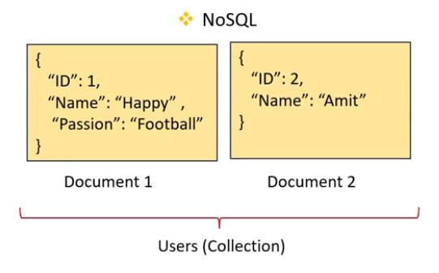
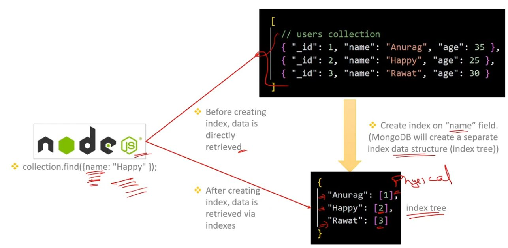
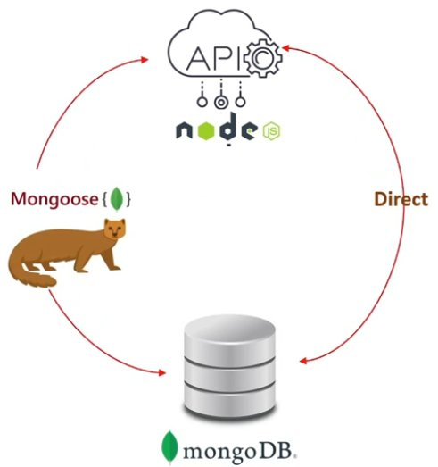

# MongoDB Basics

---

## Table of Contents

| # | Topic |
|---|-------|
| 1 | [What is MongoDB?](#1-what-is-mongodb) |
| 2 | [NoSQL vs RDBMS](#2-nosql-vs-rdbms) |
| 3 | [Documents and Collections in NoSQL](#3-documents-and-collections-in-nosql) |
| 4 | [Connecting to MongoDB from Node.js](#4-connecting-to-mongodb-from-nodejs) |
| 5 | [Query Operators in MongoDB](#5-query-operators-in-mongodb) |
| 6 | [Projection in MongoDB](#6-projection-in-mongodb) |
| 7 | [Indexes in MongoDB](#7-indexes-in-mongodb) |
| 8 | [What is Mongoose?](#8-what-is-mongoose) |
| 9 | [Role of Schema in Mongoose](#9-role-of-schema-in-mongoose) |

---

## 1. What is MongoDB?

**MongoDB** is a popular open-source, NoSQL database management system.

**NoSQL (Not Only SQL)** databases are designed to handle structured, semi-structured, and unstructured data.

---

## 2. NoSQL vs RDBMS

| RDBMS (SQL) | NoSQL |
| --- | --- |
| RDBMS are designed to handle structured data (predefined and fixed schemas). | NoSQL databases are designed to handle structured, semi-structured, and unstructured data. |
| RDBMS use the relational model, where data is stored in tables with rows and columns. | NoSQL databases use a variety of flexible data models, such as document, columnar, and graph. |
| RDBMS are suitable for applications that require complex transactions and data integrity (ACID), such as banking, finance, and e-commerce. | NoSQL databases are designed to handle large volumes of data with high-speed read and write operations, such as social media, IoT, and gaming. |

---

## 3. Documents and Collections in NoSQL

A **document** is a semi-structured data structure (XML, JSON format) that stores information in a NoSQL database. It is similar to a row in a table in a RDBMS.

A **"collection"** is a group of documents that are stored together in a NoSQL database. It is similar to a table in a RDBMS.



---

## 4. Connecting to MongoDB from Node.js

MongoDB can be connected from Node by calling the **`connect()`** method of the `MongoClient` class.

```js
// 1. Install mongodb: npm install mongodb

// mongo.js
const { MongoClient } = require("mongodb"); // 2. Import mongodb

const uri = "mongodb://127.0.0.1:27017/mydatabase"; // Connection URI
// const uri = "mongodb://localhost:27017/mydatabase";

// 3. Create a new MongoClient using connection URI
const client = new MongoClient(uri);

async function connectToMongoDB() {
	try {
		await client.connect(); // 4. Connect to the MongoDB server
		console.log("Connected to MongoDB");
		return client.db(); // 5. Return the database object
	} catch (error) {
		throw error; // 6. Throw error if connection fails
	}
}

module.exports = connectToMongoDB; // 7. Export the function
```

---

## 5. Query Operators in MongoDB

**Query operators** are special keywords or symbols used to perform operations like comparison, logical operations in queries.

```js
{ field: { $operator: value } } // syntax
{ age: { $lte: 30 } }           // use case
```

---

## 6. Projection in MongoDB

**Projection** is the way of specifying which fields should be returned in the query results.

Projection can be implemented by using the **`project`** method.

```js
const connectToMongoDB = require("./mongo");

async function main() {
	const database   = await connectToMongoDB();
	const collection = database.collection("users");

	// Scenario 1: Include all fields
	const cursor1 = collection.find({});
	for await (const doc of cursor1) { console.log(doc); }
	// Output: { _id: 'XXX', name: 'Happy', age: 25 }

	// Scenario 2: Include 'name' and '_id' fields, exclude 'age'
	const cursor2 = collection.find({}).project({ name: 1 });
	for await (const doc of cursor2) { console.log(doc); }
	// Output: { _id: 'XXX', name: 'Happy' }

	// Scenario 3: Include 'name' and 'age' fields, exclude '_id'
	const cursor3 = collection.find({}).project({ name: 1, _id: 0 });
	for await (const doc of cursor3) { console.log(doc); }
	// Output: { name: 'Happy', age: 25 }
}
main();
```

**SQL Equivalent:**

```sql
         |-- Projection --|
SELECT _id, name, age
FROM Users
WHERE name = 'Happy';
```

---

## 7. Indexes in MongoDB

**Indexes** are data structures that improve the speed of data retrieval operations on collections.

- By default, an index is automatically created on the `_id` field.
- MongoDB automatically updates the index tree as documents are inserted, updated, or deleted, ensuring the index remains accurate.
- When querying with indexed fields, MongoDB uses the index to efficiently locate matching documents, avoiding a full collection scan.



---

## 8. What is Mongoose?

**Mongoose** is an Object Data Modeling (ODM) library for MongoDB and Node.js.

Mongoose provides a schema-based solution to model application data.

### Advantages of Mongoose over Directly Using MongoDB

1. Data validation.
2. Middleware Support.
3. Define relationships between collections.



---

## 9. Role of Schema in Mongoose

A **schema** in Mongoose defines the structure, validation rules, and behavior of MongoDB documents, ensuring data consistency and integrity.

It's defined using the **`mongoose.Schema()`** function.

```js
const mongoose = require("mongoose");

// Define a Mongoose schema
const userSchema = new mongoose.Schema({
	name: {
		type: String,
		required: true,
		minlength: 3,
	},
	email: {
		type: String,
		required: true,
	},
	age: Number,
});

// Create a Mongoose model from the schema
const User = mongoose.model("User", userSchema);
module.exports = User;
```
