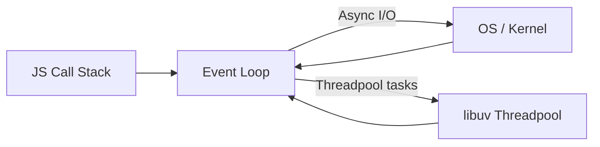
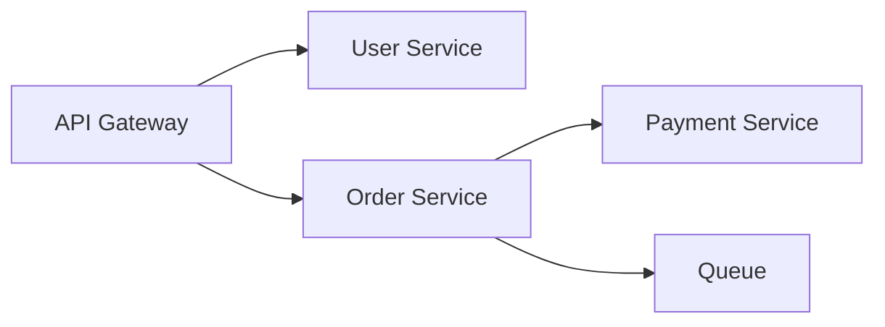

# 🟢 Node.js — 100 Interview Questions (Ultimate Beginner‑Friendly Guide)

> Format for **every** question:
- **Answer (2–4 sentences)** — simple and memorable  
- **Key Points** — bullet list for interview  
- **Use Cases / When to use** — quick practical view  
- **Code / Command Example** — working snippet (or CLI)  

> Recommended Node version for examples: **Node 18+** (works in Node 20+ too).

---

## How to study (fast + effective)
1) Read the **One‑liner** of each answer once.  
2) For each section, **type the code snippets** (muscle memory).  
3) Before interview: revise **Cheat Sheet + Common Traps** at the bottom.

---

## Quick “How Node works” mental model (memorize)

Node.js runs JavaScript on a single main thread using an **event loop**. Most I/O is non-blocking and handled by the OS / libuv. For CPU-heavy tasks, you use **worker_threads** or **child_process**.



---

## Table of Contents (Grouped Easy → Tough)

- **Node.js Basics (Q1–Q10)**
- **Core Modules (Q11–Q19)**
- **Async Programming (Q20–Q24)**
- **Networking & Express (Q25–Q29)**
- **Errors & Debugging (Q30–Q34)**
- **Testing (Q35–Q38)**
- **Databases (Q39–Q41)**
- **Performance (Q42–Q45)**
- **Concurrency (Q46–Q48)**
- **Microservices (Q49–Q50)**
- **Security (Q51–Q53)**
- **WebSockets (Q54–Q55)**
- **Deployment (Q56–Q58)**
- **Versioning (Q59–Q60)**
- **Advanced (Q61–Q65)**
- **Frameworks & Libraries (Q66–Q69)**
- **Integrations (Q70–Q72)**
- **Frontend + SSR (Q73–Q74)**
- **Best Practices (Q75–Q77)**
- **Scaling (Q78–Q80)**
- **Message Queues (Q81–Q83)**
- **Cloud + Serverless (Q84–Q85)**
- **Environment Management (Q86–Q88)**
- **CI/CD (Q89–Q90)**
- **Problem Solving Scenarios (Q91–Q93)**
- **DevOps / IoT / ML / API Design (Q94–Q100)**

---

# Node.js Basics (Q1–Q10)

## 1) What is Node.js and why is it used?
**Answer:** Node.js is an open‑source, cross‑platform JavaScript runtime that executes JS outside the browser. It’s built on Google’s **V8 engine** and designed around **event-driven, non-blocking I/O**, making it efficient for handling many concurrent connections. It’s widely used for APIs, microservices, real-time applications, and backend services.

**Key Points**
- **Non-blocking I/O** + **event loop** = high concurrency
- V8 = fast JavaScript execution
- **npm** ecosystem accelerates development
- Same language front-end + back-end (JS/TS)

**Use Cases**
- REST APIs, realtime chat, streaming, microservices, IoT gateways

**Code Example (tiny HTTP server)**
```js
const http = require("http");

http.createServer((req, res) => {
  res.writeHead(200, { "Content-Type": "text/plain" });
  res.end("Hello Node!");
}).listen(3000, () => console.log("Server on http://localhost:3000"));
```

---

## 2) How does Node.js handle child threads?
**Answer:** Node.js runs JavaScript on a single main thread, but it can still use multiple CPU cores by offloading work. For I/O-heavy operations, libuv uses an internal **thread pool** (e.g., fs, crypto). For CPU-heavy tasks you explicitly use **worker_threads**, and for running separate processes you use **child_process** or **cluster**.

**Key Points**
- Main thread runs event loop; don’t block it
- libuv threadpool handles some blocking work behind the scenes
- CPU-bound tasks → **worker_threads** (threads) or **child_process** (processes)

**Use Cases**
- Image processing, compression, hashing, large JSON transforms

**Code Example (worker_threads)**
```js
// worker-demo.js
const { Worker, isMainThread, parentPort } = require("worker_threads");

if (isMainThread) {
  const worker = new Worker(__filename);
  worker.on("message", (msg) => console.log("Main got:", msg));
  worker.postMessage(40);
} else {
  parentPort.on("message", (n) => parentPort.postMessage(n + 2));
}
```

---

## 3) Describe event-driven programming in Node.js.
**Answer:** Event-driven programming means your program reacts to events (HTTP request, timer, stream data) rather than running in a blocking sequence. Node uses an **EventEmitter** pattern: you register listeners and Node calls them when events are emitted. This matches I/O workloads naturally.

**Key Points**
- Events + listeners (callbacks) are core to Node APIs
- Great for I/O (network, file, streams)
- Promotes decoupled architecture

**Use Cases**
- HTTP servers, WebSockets, streams, job systems

**Code Example**
```js
const { EventEmitter } = require("events");
const bus = new EventEmitter();

bus.on("user:created", (user) => console.log("Send welcome mail:", user.email));
bus.emit("user:created", { email: "a@b.com" });
```

---

## 4) What is the event loop in Node.js?
**Answer:** The event loop is the scheduler that lets Node process many asynchronous operations on a single JS thread. It repeatedly checks queues (timers, I/O callbacks, microtasks) and runs callbacks when the call stack is clear. This is why Node can handle many connections efficiently.

**Key Points**
- Rendered as phases: timers → poll(I/O) → check(setImmediate) → close
- Microtasks: `process.nextTick` and Promises run with higher priority
- If you block the loop (CPU loop), everything slows

**Use Cases**
- Servers handling thousands of connections concurrently

**Code Example (ordering demo)**
```js
console.log("start");
setTimeout(() => console.log("timeout"), 0);
setImmediate(() => console.log("immediate"));
Promise.resolve().then(() => console.log("promise"));
process.nextTick(() => console.log("nextTick"));
console.log("end");
```

---

## 5) Node.js vs traditional web server technologies?
**Answer:** Traditional servers often use a thread-per-request model, which can waste resources when many requests wait on I/O. Node uses a single event loop + non-blocking I/O, which is efficient for high concurrency. Traditional stacks can still be better for CPU-heavy workloads unless Node uses workers/processes.

**Key Points**
- Node excels at I/O-bound workloads
- Thread-per-request stacks can be simpler for CPU heavy tasks
- Node can still scale CPU work via workers/processes

**Use Cases**
- Realtime, APIs, gateway services, streaming

**Example (what not to do)**
```js
// ❌ CPU loop blocks everything:
while (true) {}
```

---

## 6) Explain “non-blocking” in Node.js.
**Answer:** Non-blocking means Node doesn’t pause the main thread while waiting for slow operations like file reads or database queries. Instead, it registers a callback/promise and continues processing other tasks. When the operation finishes, Node schedules the callback.

**Key Points**
- I/O runs in background (OS/libuv)
- Callback/promise runs later
- Keeps server responsive

**Use Cases**
- File I/O, network calls, database queries

**Code Example**
```js
const fs = require("fs");

fs.readFile("a.txt", "utf8", (err, data) => {
  if (err) return console.error(err);
  console.log("file:", data);
});

console.log("This prints first (non-blocking).");
```

---

## 7) How do you update Node.js to the latest version?
**Answer:** The best practice is using a version manager so you can switch Node versions per project. On Linux/macOS, `nvm` or `fnm` is common; on Windows, `nvm-windows` or official installers work. Always verify using `node -v`.

**Key Points**
- Version managers prevent breaking your system Node
- Different projects can require different Node versions
- Use LTS for production

**Use Cases**
- Maintaining multiple Node versions on one machine

**Commands**
```bash
node -v
npm -v
# nvm (mac/linux):
nvm install --lts
nvm use --lts
```

---

## 8) What is npm and what is it used for?
**Answer:** npm is Node’s package manager and registry. It installs dependencies, manages versions, runs scripts, and publishes packages. Most Node projects rely on `package.json` + lockfiles for reproducible builds.

**Key Points**
- `dependencies` vs `devDependencies`
- lockfile: `package-lock.json`
- scripts: `npm run ...`

**Use Cases**
- Installing Express, linting tools, test frameworks, build tooling

**Commands**
```bash
npm init -y
npm i express
npm i -D eslint nodemon
npm run test
```

---

## 9) How do you manage packages in a Node.js project?
**Answer:** You declare dependencies in `package.json` and install them into `node_modules` using npm/yarn/pnpm. Use a lockfile for consistent installs, and follow semver to control upgrade risk. For teams, keep scripts in `package.json` for common tasks.

**Key Points**
- Use `npm ci` in CI for clean reproducible installs
- Keep dependencies updated (security patches)
- Avoid global installs in production systems

**Use Cases**
- Team projects, CI/CD pipelines

**Commands**
```bash
npm ci
npm outdated
npm audit
npm audit fix
```

---

## 10) What is a package.json file?
**Answer:** `package.json` is the project manifest: it stores project metadata, dependency lists, scripts, entry points, and configuration hints. It’s essential for installs, builds, and deployments. Most tooling reads from it.

**Key Points**
- scripts, dependencies, version, main/type
- `type: "module"` enables ESM
- Keep scripts consistent for team

**Use Cases**
- Building, testing, running, publishing libraries

**Example**
```json
{
  "name": "my-api",
  "version": "1.0.0",
  "type": "commonjs",
  "scripts": {
    "dev": "node server.js",
    "test": "node test.js"
  },
  "dependencies": { "express": "^4.19.0" }
}
```

---

# Node.js Core Modules (Q11–Q19)

## 11) Describe some core modules of Node.js.
**Answer:** Node includes built-in modules for common tasks like filesystem access, HTTP servers, path utilities, crypto, and streams. They are available without installing anything and are optimized for Node runtime.

**Key Points**
- `fs`, `http`, `path`, `events`, `stream`, `crypto`, `os`, `url`, `zlib`, `net`
- Prefer built-ins where possible (less dependency risk)

**Use Cases**
- Build servers, read files, gzip responses, hash data, etc.

**Code Example**
```js
const os = require("os");
const path = require("path");
console.log("CPUs:", os.cpus().length);
console.log("Join:", path.join("/a", "b", "c"));
```

---

## 12) Create a simple server using the HTTP module.
**Answer:** Node’s `http` module can create a server without frameworks. You define a request handler `(req, res)` and call `.listen(port)`. This is the foundation under frameworks like Express.

**Key Points**
- `req.method`, `req.url`, `req.headers`
- `res.statusCode`, `res.setHeader`, `res.end()`

**Use Cases**
- Minimal services, health endpoints, learning fundamentals

**Code Example**
```js
const http = require("http");

const server = http.createServer((req, res) => {
  if (req.url === "/health") {
    res.writeHead(200, { "Content-Type": "application/json" });
    return res.end(JSON.stringify({ ok: true }));
  }
  res.writeHead(404);
  res.end("Not Found");
});

server.listen(3000, () => console.log("Listening 3000"));
```

---

## 13) Purpose of the File System (fs) module.
**Answer:** The `fs` module provides APIs to read, write, rename, and manage files/directories. In servers, prefer async methods to avoid blocking the event loop. For large files, use streams to avoid loading everything into memory.

**Key Points**
- `fs.promises` for async/await
- Avoid `readFileSync` on server paths
- Use streams for large file I/O

**Use Cases**
- Logs, uploads, reading templates, backups

**Code Example**
```js
const fs = require("fs/promises");

async function demo() {
  await fs.writeFile("hello.txt", "Hello");
  const txt = await fs.readFile("hello.txt", "utf8");
  console.log(txt);
}
demo();
```

---

## 14) What is the Buffer class in Node.js?
**Answer:** `Buffer` represents raw binary data in Node. It’s used heavily in file/network operations and encoding/decoding. Buffers are fixed-length; if you need bigger, allocate a new one.

**Key Points**
- byte arrays for binary data
- encodings: utf8, base64, hex
- used in streams, crypto, sockets

**Use Cases**
- file chunks, network packets, crypto hashes

**Code Example**
```js
const buf = Buffer.from("Hey!");
console.log(buf);                // <Buffer ...>
console.log(buf.toString("utf8"));
console.log(buf.toString("base64"));
```

---

## 15) Streams in Node.js and types.
**Answer:** Streams process data in chunks to reduce memory usage and enable backpressure (flow control). Types include Readable, Writable, Duplex, and Transform streams. Streams are key for large files and network I/O.

**Key Points**
- Efficient for large data
- Supports `pipe()` pipelines
- Backpressure prevents memory blowups

**Use Cases**
- file upload/download, gzip compression, video streaming

**Code Example (pipe + gzip)**
```js
const fs = require("fs");
const zlib = require("zlib");

fs.createReadStream("big.txt")
  .pipe(zlib.createGzip())
  .pipe(fs.createWriteStream("big.txt.gz"))
  .on("finish", () => console.log("compressed"));
```

---

## 16) How do you read and write files in Node.js?
**Answer:** For small files, use `fs.promises.readFile/writeFile`. For big files, use streams with `createReadStream/createWriteStream`. This keeps memory stable and improves performance under load.

**Key Points**
- async/await with `fs/promises`
- streams for large data
- handle errors (`try/catch` + `.on("error")`)

**Use Cases**
- config files, logs, uploads, downloads

**Code Example**
```js
const fs = require("fs/promises");

async function rw() {
  await fs.writeFile("a.txt", "data");
  const d = await fs.readFile("a.txt", "utf8");
  console.log(d);
}
rw();
```

---

## 17) How do you use EventEmitter in Node.js?
**Answer:** `EventEmitter` lets you publish/subscribe to events inside your app. It’s used by many Node internals (streams, HTTP). It helps decouple producers and consumers.

**Key Points**
- `.on(event, handler)` subscribe
- `.emit(event, payload)` publish
- remove listeners to avoid memory leaks

**Use Cases**
- internal app events, job completion notifications, streams

**Code Example**
```js
const { EventEmitter } = require("events");
const e = new EventEmitter();

function onData(x) { console.log("data:", x); }
e.on("data", onData);
e.emit("data", 123);
e.off("data", onData);
```

---

## 18) What is the QueryString module?
**Answer:** `querystring` is an older Node module to parse/build URL query strings. Modern code usually prefers `URL` and `URLSearchParams` which are standards-based.

**Key Points**
- `URLSearchParams` is recommended now
- Handles encoding/decoding properly

**Use Cases**
- parsing query params from URLs

**Code Example**
```js
const u = new URL("https://site.com/search?q=node&sort=asc");
console.log(u.searchParams.get("q"));   // node
console.log(u.searchParams.toString()); // q=node&sort=asc
```

---

## 19) How do you manage path operations in Node.js?
**Answer:** Use `path` to join, normalize, and resolve file paths safely across OSes. Never build paths by manual string concatenation; it breaks on Windows separators and increases security risk.

**Key Points**
- `path.join`, `path.resolve`, `path.extname`
- helps avoid path bugs across OS

**Use Cases**
- serving files, reading templates, saving uploads

**Code Example**
```js
const path = require("path");
const file = path.join(__dirname, "public", "index.html");
console.log(file);
```

---

# Asynchronous Programming (Q20–Q24)

## 20) What are callbacks in Node.js?
**Answer:** A callback is a function passed as an argument and executed later, often after an async operation completes. Node commonly uses “error-first callbacks” where the first parameter is `err`.

**Key Points**
- error-first: `(err, data) => {}`
- easy to create nesting (callback hell)

**Use Cases**
- older APIs, low-level Node APIs

**Code Example**
```js
const fs = require("fs");
fs.readFile("a.txt", "utf8", (err, data) => {
  if (err) return console.error(err);
  console.log(data);
});
```

---

## 21) What is callback hell and how to avoid it?
**Answer:** Callback hell is deeply nested callbacks that make code hard to read and error handling messy. Avoid it using Promises, async/await, or by splitting logic into named functions.

**Key Points**
- nesting → unreadable
- error handling becomes duplicated
- Promises/async-await flatten flow

**Use Cases**
- legacy code refactors

**Code Example (async/await)**
```js
const fs = require("fs/promises");

async function run() {
  const a = await fs.readFile("a.txt", "utf8");
  const b = await fs.readFile("b.txt", "utf8");
  console.log(a + b);
}
run().catch(console.error);
```

---

## 22) Explain promises in Node.js.
**Answer:** A Promise represents a value that will be available in the future (fulfilled) or fail (rejected). Promises allow chaining and centralized error handling with `.catch()`.

**Key Points**
- states: pending → fulfilled/rejected
- chainable `.then()`
- error propagation with `.catch()`

**Use Cases**
- modern async flows, API calls

**Code Example**
```js
Promise.resolve(5)
  .then(x => x * 2)
  .then(console.log) // 10
  .catch(console.error);
```

---

## 23) How do async/await functions work in Node.js?
**Answer:** `async` functions always return a Promise. `await` pauses execution inside the async function until the awaited Promise resolves or rejects. It makes async code look synchronous and improves readability.

**Key Points**
- wrap with `try/catch`
- still non-blocking for the event loop
- parallelize with `Promise.all`

**Use Cases**
- API handlers, service layers

**Code Example**
```js
async function fetchBoth() {
  const [a, b] = await Promise.all([Promise.resolve(1), Promise.resolve(2)]);
  return a + b;
}
fetchBoth().then(console.log);
```

---

## 24) Sync vs async methods in fs module?
**Answer:** Synchronous fs methods block the event loop and should be avoided in servers. Asynchronous fs methods return immediately and complete later, keeping the server responsive.

**Key Points**
- use sync only in scripts/CLI startup logic
- prefer async in servers

**Use Cases**
- async for servers, sync for tiny scripts

**Code Example**
```js
const fs = require("fs");
fs.readFile("a.txt", "utf8", () => {});
// vs:
// fs.readFileSync("a.txt", "utf8"); // blocks
```

---

# Networking in Node.js (Q25–Q29)

## 25) How does Node.js handle HTTP requests and responses?
**Answer:** Node creates a server socket and emits a request event for each incoming HTTP request. Your handler receives `req` (incoming request stream) and `res` (outgoing response stream). You write headers and body, then end the response.

**Key Points**
- req/res are streams
- you can stream response for large data
- parse body for POST (Express helps)

**Use Cases**
- APIs, proxies, gateways

**Code Example**
```js
const http = require("http");

http.createServer((req, res) => {
  res.setHeader("Content-Type", "application/json");
  res.end(JSON.stringify({ method: req.method, url: req.url }));
}).listen(3000);
```

---

## 26) What is Express.js and why is it important?
**Answer:** Express is a minimal web framework that makes routing, middleware, and request parsing simpler. It provides a structured way to build APIs with reusable middlewares and cleaner error handling.

**Key Points**
- routing + middleware chain
- JSON parsing, params, query parsing
- huge ecosystem

**Use Cases**
- REST APIs, backend services

**Code Example**
```js
const express = require("express");
const app = express();
app.use(express.json());

app.get("/health", (req, res) => res.json({ ok: true }));
app.listen(3000);
```

---

## 27) How do you create a RESTful API with Node.js?
**Answer:** A REST API uses HTTP methods (GET/POST/PUT/DELETE) and resource-based routes (e.g., `/users`). In Express, you define route handlers, validate input, and return consistent JSON responses with correct status codes.

**Key Points**
- correct status codes (200, 201, 400, 401, 404, 500)
- validation and consistent error format
- pagination for lists

**Use Cases**
- CRUD services, microservices

**Code Example**
```js
const express = require("express");
const app = express();
app.use(express.json());

let users = [{ id: 1, name: "A" }];

app.get("/users", (req, res) => res.json(users));
app.post("/users", (req, res) => {
  const u = { id: Date.now(), name: req.body.name };
  users.push(u);
  res.status(201).json(u);
});
app.listen(3000);
```

---

## 28) What is middleware in Node.js (Express)?
**Answer:** Middleware is a function that runs before your route handler and can modify `req/res` or stop the request. Middleware is used for logging, authentication, validation, rate limiting, and parsing.

**Key Points**
- signature: `(req, res, next)`
- ordering matters
- can short-circuit response

**Use Cases**
- auth, request logs, validation, caching

**Code Example**
```js
app.use((req, res, next) => {
  console.log(req.method, req.url);
  next();
});
```

---

## 29) How do you ensure security in HTTP headers with Node.js?
**Answer:** Use secure headers like CSP, HSTS, X-Content-Type-Options, and X-Frame-Options to reduce common web attacks. In Express, the `helmet` library configures many headers safely.

**Key Points**
- use Helmet
- configure CSP properly
- enable HTTPS + HSTS

**Use Cases**
- production APIs and web apps

**Code Example**
```js
const helmet = require("helmet");
app.use(helmet());
```

---

# Error Handling & Debugging (Q30–Q34)

## 30) How do you handle errors in Node.js?
**Answer:** Handle errors close to where they occur, and centralize error responses for APIs. With async/await use try/catch; in Express use error middleware. Always log errors with context (request id).

**Key Points**
- try/catch for async
- error middleware in Express
- never crash on user errors

**Use Cases**
- stable APIs, predictable error responses

**Code Example (Express error middleware)**
```js
app.get("/boom", (req, res) => { throw new Error("boom"); });

app.use((err, req, res, next) => {
  console.error(err);
  res.status(500).json({ message: "Internal Server Error" });
});
```

---

## 31) Describe error-first callback patterns.
**Answer:** In many Node APIs, callbacks follow `(err, result)` convention. You always check `err` first; if it exists, handle it and return early to avoid using invalid data.

**Key Points**
- consistent pattern across Node ecosystem
- easy to wrap into Promises

**Use Cases**
- working with legacy callback APIs

**Code Example**
```js
function read(cb) {
  cb(null, "ok");
}
read((err, data) => {
  if (err) return console.error(err);
  console.log(data);
});
```

---

## 32) Common debugging techniques for Node apps?
**Answer:** Use logs and structured logging for production issues, and use the Node inspector for step debugging. For performance issues, use CPU profiling and heap snapshots to find hot paths and memory leaks.

**Key Points**
- Node inspector (`--inspect`)
- VSCode debugger breakpoints
- profiling: clinic.js, heap snapshots

**Use Cases**
- slow APIs, memory leaks, production incidents

**Command Example**
```bash
node --inspect index.js
```

---

## 33) Explain process.nextTick().
**Answer:** `process.nextTick` schedules a callback to run **before** Promises and before returning to the event loop phases. Overusing it can starve the event loop (prevent I/O/timers from running), causing performance issues.

**Key Points**
- highest priority microtask in Node
- can cause starvation if recursive

**Use Cases**
- rare: internal libraries, very small deferrals

**Code Example**
```js
process.nextTick(() => console.log("nextTick"));
Promise.resolve().then(() => console.log("promise"));
```

---

## 34) What is the global object in Node.js?
**Answer:** Node’s global object is `global` (similar to `window` in browsers). It contains process-wide utilities like `setTimeout`, `Buffer`, and `process`. Avoid storing app state on `global` as it makes code hard to test and reason about.

**Key Points**
- `global`, `process`, `Buffer` exist everywhere
- avoid polluting global scope

**Code Example**
```js
console.log(typeof global.setTimeout); // function
```

---

# Testing in Node.js (Q35–Q38)

## 35) Testing frameworks for Node?
**Answer:** Common choices include Jest (all-in-one), Mocha + Chai (classic), and Vitest (fast modern). For integration and E2E, use Supertest for HTTP and Playwright/Cypress for browser testing.

**Key Points**
- unit tests (functions)
- integration tests (DB/API)
- e2e tests (full flow)

**Command Example**
```bash
npm i -D jest supertest
```

---

## 36) Explain mocking in Node.js.
**Answer:** Mocking replaces real dependencies (DB, network, filesystem) with fake implementations so tests run fast and deterministically. You can mock functions with Jest or use dependency injection.

**Key Points**
- isolate unit under test
- faster, predictable tests

**Use Cases**
- API clients, database layers

**Code Example (Jest mock)**
```js
const api = { getUser: async () => ({ id: 1 }) };
jest.spyOn(api, "getUser").mockResolvedValue({ id: 2 });
```

---

## 37) Why is benchmarking important in Node.js?
**Answer:** Benchmarking helps you find performance regressions and identify bottlenecks under realistic load. Node apps often fail due to event loop blocking, slow DB queries, or memory pressure—benchmarks expose these early.

**Key Points**
- measure throughput/latency
- compare before/after changes
- detect event loop lag

**Command Example (autocannon)**
```bash
npx autocannon -c 50 -d 10 http://localhost:3000/health
```

---

## 38) How do you test an HTTP server in Node.js?
**Answer:** Use integration tests with Supertest to call routes without opening real network ports (Express apps). For full end-to-end, run server and test with a real HTTP client.

**Key Points**
- test status code, body, headers
- test error paths too

**Code Example (Supertest)**
```js
const request = require("supertest");
const app = require("./app");

test("GET /health", async () => {
  const res = await request(app).get("/health");
  expect(res.status).toBe(200);
});
```

---

# Node.js with Databases (Q39–Q41)

## 39) Connect MySQL with Node.js?
**Answer:** Use a driver like `mysql2` and prefer connection pools for production. Always use parameterized queries to avoid SQL injection.

**Key Points**
- use pooling for concurrency
- parameterized queries

**Code Example**
```js
const mysql = require("mysql2/promise");

(async () => {
  const pool = mysql.createPool({ host: "localhost", user: "root", database: "test" });
  const [rows] = await pool.query("SELECT ? AS ok", [1]);
  console.log(rows);
  await pool.end();
})();
```

---

## 40) Use MongoDB (NoSQL) with Node.js?
**Answer:** Use the native MongoDB driver or Mongoose ODM. MongoDB fits document-style data with flexible schemas; Mongoose adds schemas, validation, and model methods.

**Key Points**
- flexible documents
- indexes matter for performance
- schema enforcement can be app-level (Mongoose)

**Code Example (Mongoose)**
```js
const mongoose = require("mongoose");

(async () => {
  await mongoose.connect("mongodb://127.0.0.1:27017/test");
  const User = mongoose.model("User", new mongoose.Schema({ name: String }));
  await User.create({ name: "Alice" });
  console.log(await User.findOne({ name: "Alice" }));
  await mongoose.disconnect();
})();
```

---

## 41) Role of ORM/ODM in Node.js?
**Answer:** ORMs/ODMs map database rows/documents to objects and provide higher-level APIs for queries, relations, migrations, and validation. They speed development, but you must still understand indexes and query performance.

**Key Points**
- ORM: SQL (Sequelize, Prisma)
- ODM: MongoDB (Mongoose)
- tradeoff: abstraction vs performance tuning

**Use Cases**
- rapid development, maintainable data access layer

**Example**
```js
// Prisma example idea: prisma.user.findMany()
```

---

# Node.js Performance (Q42–Q45)

## 42) Monitor Node app performance?
**Answer:** Monitor latency, error rate, memory, CPU, and event loop lag. Use APM tools (Datadog/New Relic) or open-source stacks (Prometheus + Grafana). For deep dives, use CPU profiles and heap snapshots.

**Key Points**
- event loop lag is a big Node metric
- memory usage + GC pauses
- request traces (distributed tracing)

**Command Example**
```js
console.log(process.memoryUsage());
```

---

## 43) What is clustering and how does it work?
**Answer:** Clustering creates multiple Node processes (workers) to utilize multiple CPU cores, usually behind the same port. A master process distributes connections to workers. This improves throughput on multi-core machines.

**Key Points**
- multiple processes, not threads
- good for CPU scaling
- use PM2/K8s often in production instead

**Code Example**
```js
const cluster = require("cluster");
const http = require("http");
const os = require("os");

if (cluster.isPrimary) {
  const n = os.cpus().length;
  for (let i = 0; i < n; i++) cluster.fork();
} else {
  http.createServer((req, res) => res.end("ok")).listen(3000);
}
```

---

## 44) Prevent memory leaks in Node?
**Answer:** Memory leaks often come from unbounded caches, event listeners not removed, and large objects kept in scope. Track heap usage, take heap snapshots, and ensure resources (streams/sockets/timers) are cleaned up.

**Key Points**
- remove listeners/timers
- avoid ever-growing arrays/maps
- close DB connections, streams

**Use Cases**
- long-running servers, workers

**Command Example**
```bash
node --inspect index.js
# then take heap snapshot in DevTools
```

---

## 45) Explain `--inspect` flag.
**Answer:** `--inspect` enables Node’s debugging protocol so you can attach Chrome DevTools or VSCode debugger. `--inspect-brk` breaks at the first line so you can debug startup logic.

**Key Points**
- great for stepping through code
- also supports profiling

**Commands**
```bash
node --inspect app.js
node --inspect-brk app.js
```

---

# Concurrency in Node.js (Q46–Q48)

## 46) How does Node.js handle concurrency?
**Answer:** Node achieves concurrency via non-blocking I/O and the event loop. While JavaScript runs on one thread, many I/O operations happen in parallel through OS/libuv. For CPU-bound parallelism, you use workers/processes.

**Key Points**
- concurrency ≠ parallelism
- parallelism requires workers/processes

**Use Cases**
- high-concurrency APIs, realtime systems

**Example**
```js
await Promise.all([fetch(url1), fetch(url2)]);
```

---

## 47) Difference between `process` and `child_process` modules?
**Answer:** `process` provides information/control over the current Node process (env, argv, exit, signals). `child_process` lets you spawn external commands or new Node processes.

**Key Points**
- `process.env`, `process.argv`, `process.on("SIGTERM")`
- `child_process.exec/spawn/fork`

**Code Example**
```js
console.log(process.pid);
console.log(process.env.NODE_ENV);
```

---

## 48) How do worker threads work?
**Answer:** Worker threads run JavaScript in parallel threads inside the same process. They communicate via message passing or shared memory. Use them for CPU-heavy tasks so the event loop stays responsive.

**Key Points**
- good for CPU-bound work
- message passing overhead exists

**Use Cases**
- hashing, image processing, data crunching

**Example**
```js
// same as Q2 worker example
```

---

# Node.js and Microservices (Q49–Q50)

## 49) How is Node used in microservices?
**Answer:** Node is popular for microservices because it’s lightweight, fast for I/O, and JSON-first. Teams build many small services that communicate over HTTP/gRPC or messaging systems. Node’s ecosystem helps with fast iteration.

**Key Points**
- small deployable units
- independent scaling
- needs observability (logs/traces)

**Use Cases**
- API gateway, auth, notification services

**Diagram**


---

## 50) Inter-process communication (IPC) in microservices?
**Answer:** Microservices communicate via synchronous protocols (HTTP/gRPC) and asynchronous messaging (RabbitMQ/Kafka). Messaging improves resilience and decoupling. Choose based on latency requirements and reliability.

**Key Points**
- HTTP/gRPC for request-response
- MQ for events and async workflows

**Use Cases**
- orders pipeline, notifications, audit logs

**Example**
```js
// HTTP: fetch("http://service/api")
```

---

# Security in Node.js (Q51–Q53)

## 51) Common security best practices for Node apps?
**Answer:** Secure Node apps by validating input, using secure headers, avoiding dangerous eval/HTML injection, and keeping dependencies updated. Also protect secrets using environment variables and secure storage.

**Key Points**
- validation (Zod/Joi)
- helmet + rate limiting
- dependency scanning (npm audit)
- least privilege for DB creds

**Example**
```bash
npm audit
npm audit fix
```

---

## 52) Protect Node app from XSS attacks?
**Answer:** Prevent XSS by escaping untrusted output, avoiding unsafe HTML rendering, and applying a strict Content Security Policy (CSP). On the server, sanitize user-generated HTML if you must store/display it.

**Key Points**
- output escaping
- CSP via Helmet
- avoid `dangerouslySetInnerHTML` on frontend

**Example**
```js
// sanitize input if you must accept HTML (use a sanitizer library)
```

---

## 53) Environment variables and how to use them?
**Answer:** Environment variables store configuration outside code (12-factor principle). Node reads them via `process.env`. Use `.env` in local dev and real env vars in production.

**Key Points**
- never hardcode secrets
- keep env-based configs per environment

**Code Example**
```js
require("dotenv").config();
const PORT = process.env.PORT || 3000;
```

---

# Node.js and WebSockets (Q54–Q55)

## 54) What are WebSockets and how do they work with Node?
**Answer:** WebSockets create a persistent, full-duplex connection between client and server over a single TCP socket. Unlike HTTP request/response, WebSockets allow server push, making them ideal for real-time updates.

**Key Points**
- persistent connection
- bi-directional messages
- good for realtime

**Use Cases**
- chat, live dashboards, multiplayer games

---

## 55) Set up a WebSocket server in Node.js?
**Answer:** Use `ws` for lightweight WebSockets or Socket.IO for features like rooms and fallback transports. The server listens for connections, then handles messages.

**Code Example (`ws`)**
```js
const WebSocket = require("ws");
const wss = new WebSocket.Server({ port: 8081 });

wss.on("connection", (ws) => {
  ws.send("welcome");
  ws.on("message", (msg) => ws.send("echo: " + msg));
});
```

---

# Node.js Deployment (Q56–Q58)

## 56) Deploy Node app in production?
**Answer:** Production deployment includes environment configuration, process management, logging, monitoring, and reverse proxying. Use a process manager (PM2) or containers (Docker/K8s) and add health checks.

**Key Points**
- run behind Nginx/Traefik
- logs + metrics + alerts
- zero-downtime restarts

**Use Cases**
- SaaS backends, internal services

---

## 57) What is PM2 and how is it used?
**Answer:** PM2 is a Node process manager that keeps apps alive, restarts on crash, supports clustering, and manages logs. It’s commonly used on VMs.

**Commands**
```bash
npm i -g pm2
pm2 start server.js --name my-api
pm2 start server.js -i max
pm2 logs
```

---

## 58) Docker with Node.js?
**Answer:** Docker packages your app with its runtime and dependencies, ensuring consistent environments across dev and production. Build a small image, run with env variables, and expose a port.

**Dockerfile**
```dockerfile
FROM node:20-alpine
WORKDIR /app
COPY package*.json ./
RUN npm ci --omit=dev
COPY . .
EXPOSE 3000
CMD ["node","server.js"]
```

---

# Version Control / Versioning (Q59–Q60)

## 59) How do you manage versioning of a Node.js API?
**Answer:** Version APIs to avoid breaking clients. Most common is URL versioning (`/api/v1/...`) plus deprecation strategy. For internal services, header-based versioning can work too.

**Key Points**
- don’t break old clients
- deprecate and migrate gradually

**Example**
```txt
GET /api/v1/users
GET /api/v2/users
```

---

## 60) Semantic versioning (semver) and importance?
**Answer:** Semver uses `MAJOR.MINOR.PATCH`. MAJOR = breaking changes, MINOR = new backward-compatible features, PATCH = bug fixes. It helps teams upgrade safely and predictably.

**Key Points**
- use caret/tilde carefully in dependencies
- lockfiles for reproducible builds

---

# Node.js Advanced Topics (Q61–Q65)

## 61) exports vs module.exports?
**Answer:** `module.exports` is the actual exported object; `exports` is just a reference to it. If you reassign `exports`, it stops pointing to `module.exports`, so exports won’t work as expected.

**Key Points**
- modify `exports.x = ...` (safe)
- reassign `module.exports = ...` (safe)
- reassign `exports = ...` (not exported)

**Code Example**
```js
exports.a = 1;              // ok
module.exports = { b: 2 };  // ok
exports = { c: 3 };         // ❌ does not export
```

---

## 62) Create a simple TCP server in Node.js?
**Answer:** Use Node’s `net` module for low-level TCP servers. TCP is raw sockets (not HTTP) and is common for custom protocols, IoT, and internal services.

**Code Example**
```js
const net = require("net");

net.createServer((socket) => {
  socket.write("hello\n");
  socket.on("data", (d) => socket.write("echo:" + d));
}).listen(9000, () => console.log("TCP server 9000"));
```

---

## 63) What is REPL in Node.js?
**Answer:** REPL is an interactive shell where you can run JS line-by-line and inspect values immediately. It’s great for quick experiments and debugging.

**Command**
```bash
node
```

---

## 64) Role of a reverse proxy with Node apps?
**Answer:** A reverse proxy (Nginx/Traefik) sits in front of Node to handle SSL termination, compression, caching, routing, and rate limiting. It also helps with load balancing and static asset serving.

**Key Points**
- HTTPS termination
- request routing + load balancing
- security headers and limits

---

## 65) How do streams enhance performance?
**Answer:** Streams process data in chunks, which reduces memory usage and supports backpressure so fast producers don’t overwhelm slow consumers. This is critical for large files and network responses.

**Key Points**
- low memory footprint
- backpressure control
- pipeline patterns

**Example**
```js
readableStream.pipe(transformStream).pipe(writableStream);
```

---

# Frameworks and Libraries (Q66–Q69)

## 66) Popular frameworks/libraries in Node ecosystem?
**Answer:** Common frameworks are Express, Fastify, Koa, and NestJS. Popular libraries include Mongoose/Prisma for DB, Socket.IO/ws for realtime, and BullMQ/amqplib for queues.

**Key Points**
- Express: ecosystem
- Fastify: performance
- NestJS: enterprise structure

---

## 67) Koa vs Express?
**Answer:** Koa is more minimal and designed around async/await middleware. Express is the classic standard with more built-in conventions and a massive ecosystem. Koa gives more control; Express gives faster setup.

---

## 68) What is NestJS and when choose it?
**Answer:** NestJS is an opinionated framework with modules, controllers, DI, and decorators (TypeScript-first). Choose it for large enterprise apps where structure and maintainability matter.

---

## 69) Benefits of TypeScript with Node.js?
**Answer:** TypeScript adds types, reduces runtime bugs, and improves refactoring and onboarding. It provides safer APIs and better IDE support for large codebases.

**Example**
```ts
type User = { id: string; name: string };
```

---

# Integrations & Third-Party Modules (Q70–Q72)

## 70) Integrate Node with a third-party API?
**Answer:** Use `fetch`/axios with timeouts, retries, and proper error handling. For reliability, implement backoff on 429/5xx and use circuit breakers in critical systems.

**Code Example (timeout with AbortController)**
```js
async function getWithTimeout(url, ms = 5000) {
  const ctrl = new AbortController();
  const id = setTimeout(() => ctrl.abort(), ms);
  try {
    const res = await fetch(url, { signal: ctrl.signal });
    return await res.json();
  } finally {
    clearTimeout(id);
  }
}
```

---

## 71) What is Socket.IO?
**Answer:** Socket.IO is a realtime library that provides rooms, reconnection, and fallbacks when WebSockets aren’t available. It’s easier than raw ws for complex realtime apps.

---

## 72) How GraphQL is used with Node?
**Answer:** Use Apollo Server or GraphQL Yoga to define schemas and resolvers. GraphQL is useful when clients need flexible queries and you want to reduce over/under-fetching.

---

# Node.js with Frontend Technologies (Q73–Q74)

## 73) How does Node interact with Angular/React?
**Answer:** Node usually serves APIs consumed by frontend apps, handles authentication, and can do SSR. Node can also serve built static assets and act as a BFF (backend-for-frontend).

---

## 74) What is SSR and how achieve it with Node?
**Answer:** SSR renders HTML on the server for faster first paint and SEO, then hydrates on the client. In practice, Next.js is the common Node-based SSR solution for React.

---

# Best Practices (Q75–Q77)

## 75) Coding conventions and best practices?
**Answer:** Use layered architecture (routes/controllers/services), consistent error handling, input validation, and structured logging. Avoid blocking the event loop and ensure proper resource cleanup.

---

## 76) Twelve-factor app principles in Node?
**Answer:** Store config in env, build stateless services, treat logs as event streams, and keep dev/prod parity. These principles improve scalability and deployment reliability.

---

## 77) Code linting in Node?
**Answer:** Linting enforces style and prevents common mistakes. Use ESLint + Prettier and run in CI.

**Commands**
```bash
npm i -D eslint prettier
npx eslint .
```

---

# Scaling Node.js Applications (Q78–Q80)

## 78) Strategies for scaling Node apps?
**Answer:** Scale horizontally (more instances), use load balancers, caching (Redis), queues for background jobs, and optimize DB queries/indexes. Node scales well when you keep the event loop free.

---

## 79) Session management in scaled apps?
**Answer:** Store sessions in shared storage (Redis) or use stateless JWTs. Avoid in-memory sessions because multiple instances won’t share memory.

---

## 80) Microservices and scalability?
**Answer:** Microservices let you scale components independently but add complexity (observability, coordination, networking). Use them when organization size and scaling needs justify it.

---

# Message Queues (Q81–Q83)

## 81) What are message queues and how used in Node?
**Answer:** Message queues decouple producers and consumers and smooth traffic spikes. Node services publish jobs/events and background workers process them reliably.

---

## 82) Implement RabbitMQ with Node?
**Answer:** Use `amqplib` to publish and consume messages. You typically declare exchanges/queues and acknowledge messages after processing.

**Mini snippet (concept)**
```js
// Producer/consumer patterns are usually split across services.
// Use amqplib in real code.
```

---

## 83) Significance of ZeroMQ?
**Answer:** ZeroMQ is a brokerless messaging library that provides patterns like pub/sub and push/pull with very low overhead. It’s used in high-performance systems but requires careful design.

---

# Cloud Services (Q84–Q85)

## 84) How AWS/Azure/GCP facilitate Node deployment?
**Answer:** Clouds provide managed compute, networking, scaling, logging, and managed databases. You can deploy Node on VMs, containers, or serverless services quickly.

---

## 85) Serverless architecture and Node?
**Answer:** Serverless runs functions on demand (e.g., AWS Lambda), scaling automatically and charging per execution. Node is commonly used for event-driven tasks and small APIs.

---

# Environment Management (Q86–Q88)

## 86) Manage multiple Node versions on same machine?
**Answer:** Use nvm/fnm/nvs and store the desired version per project (`.nvmrc`). This prevents “works on my machine” issues.

---

## 87) What are .env files and how work?
**Answer:** `.env` stores local environment variables which are loaded into `process.env` using libraries like `dotenv`. Never commit secrets to git.

**Snippet**
```js
require("dotenv").config();
console.log(process.env.DB_URL);
```

---

## 88) Usage of config module?
**Answer:** A config module organizes per-environment settings and merges defaults with environment overrides. It helps keep config consistent across dev/stage/prod.

---

# CI/CD (Q89–Q90)

## 89) What is CI/CD for Node apps?
**Answer:** CI runs tests/lint/build on every change; CD automates deployment after passing checks. It reduces bugs and speeds releases.

---

## 90) Set up a CI/CD pipeline for Node project?
**Answer:** Typical pipeline: install dependencies → lint → test → build → deploy. Use GitHub Actions/GitLab CI/Jenkins and cache npm installs.

---

# Interview Problem Solving and Scenarios (Q91–Q93)

## 91) Troubleshoot a slow Node app?
**Answer:** First determine if it’s CPU, I/O, DB, or memory. Measure event loop lag, take CPU profile, check DB slow queries, and inspect memory/GC.

**Quick checklist**
- event loop lag
- CPU profile (hot functions)
- DB query time + indexes
- external API latency
- memory growth/heap snapshot

---

## 92) Handle file uploads in Node?
**Answer:** For small uploads, use middleware like `multer`. For large uploads, stream to storage (S3) using presigned URLs or streaming pipelines, and enforce file size limits.

---

## 93) Heavy computation tasks in Node?
**Answer:** Don’t block the event loop. Use worker_threads for CPU work, or move the computation to a separate service/queue worker.

---

# Node.js and DevOps (Q94–Q95)

## 94) Role of Node app in DevOps?
**Answer:** Node apps run backend services, automation scripts, and build tooling. Many DevOps pipelines use Node for CLI tools and orchestration.

---

## 95) Containerization and benefits for Node apps?
**Answer:** Containers provide consistent runtime across environments and simplify deployment/scaling. They isolate dependencies and reduce “environment drift”.

---

# Node.js and IoT (Q96–Q97)

## 96) How is Node used in IoT?
**Answer:** Node is used for gateway services, MQTT brokers/clients, telemetry collection, and realtime dashboards. It’s lightweight and good at handling many device connections.

---

## 97) Considerations for IoT Node apps?
**Answer:** Plan for unreliable networks, retry/backoff, memory constraints, and secure device authentication. Use efficient protocols (MQTT) and avoid heavy CPU on edge devices.

---

# Node.js and Machine Learning (Q98–Q99)

## 98) Can Node be used for machine learning?
**Answer:** Yes, but most ML training happens in Python. Node typically integrates ML by calling ML services (REST/gRPC), or running inference via TensorFlow.js or ONNX runtimes.

---

## 99) ML libraries/tools for Node?
**Answer:** Common tools include `@tensorflow/tfjs-node` and calling external Python ML services. For production, an ML inference service is often simpler and scalable.

---

# APIs and Node.js (Q100)

## 100) Best practices for designing RESTful APIs in Node?
**Answer:** Use resource-based routes, correct HTTP methods/status codes, input validation, consistent error format, pagination, authentication/authorization, and observability (logs/metrics). Document APIs using OpenAPI/Swagger.

**Key Points**
- consistent response shape
- proper status codes
- validation + rate limit
- versioning + docs

---

# ✅ Cheat Sheet (15-minute revision)

- Node = **V8 + event loop + non-blocking I/O + libuv**
- Main thread should never be blocked by CPU loops
- Async I/O → event loop; CPU work → workers/processes
- Streams = chunked processing + backpressure
- Express = middleware chain
- Production = reverse proxy + process manager + monitoring + secure headers

---

# ⚠️ Common Interview Traps (avoid these)
- Using `fs.readFileSync()` inside request handlers
- Doing heavy CPU work in a route handler
- Forgetting error middleware in Express
- Not handling timeouts/retries for 3rd party APIs
- Memory leak by never removing listeners/timers
