# Node Basics

---

## Table of Contents

| # | Topic |
|---|-------|
| 1 | [What is Node.js?](#1-what-is-nodejs) |
| 2 | [Runtime Environment vs Framework](#2-runtime-environment-vs-framework) |
| 3 | [Synchronous vs Asynchronous Programming](#3-synchronous-vs-asynchronous-programming) |
| 4 | [Events, Event Emitter, Event Queue, Event Loop & Event Driven](#4-events-event-emitter-event-queue-event-loop--event-driven) |
| 5 | [Role of package.json](#5-role-of-packagejson) |
| 6 | [Modules in Node](#6-modules-in-node) |
| 7 | [Ways to Export a Module](#7-ways-to-export-a-module) |
| 8 | [Types of Modules in Node](#8-types-of-modules-in-node) |
| 9 | [Top 5 Built-in Modules](#9-top-5-built-in-modules) |
| 10 | [fs Module](#10-fs-module) |
| 11 | [path Module](#11-path-module) |
| 12 | [os Module](#12-os-module) |
| 13 | [Event Module](#13-event-module) |
| 14 | [http Module](#14-http-module) |
| 15 | [Express](#15-express) |
| 16 | [Express Middleware](#16-express-middleware) |
| 17 | [Types of Middleware in Express.js](#17-types-of-middleware-in-expressjs) |
| 18 | [Application-level vs Route-level Middleware](#18-application-level-vs-route-level-middleware) |
| 19 | [Error Handling Middleware](#19-error-handling-middleware) |
| 20 | [Built-in Middleware & Serving Static Files](#20-built-in-middleware--serving-static-files) |
| 21 | [Third-party Middleware](#21-third-party-middleware) |
| 22 | [Advantages of Middleware in Express.js](#22-advantages-of-middleware-in-expressjs) |
| 23 | [Routing in Express.js](#23-routing-in-expressjs) |
| 24 | [How to Implement Routing & Define Routes](#24-how-to-implement-routing--define-routes) |
| 25 | [Routing in Real Applications](#25-routing-in-real-applications) |
| 26 | [Route Handlers & Route Parameters](#26-route-handlers--route-parameters) |
| 27 | [Router Object & Router Methods](#27-router-object--router-methods) |
| 28 | [app.get() vs router.get()](#28-appget-vs-routerget) |
| 29 | [express.Router()](#29-expressrouter) |
| 30 | [Real Application Use of Routing](#30-real-application-use-of-routing) |
| 31 | [Route Chaining](#31-route-chaining) |
| 32 | [Route Nesting](#32-route-nesting) |
| 33 | [Template Engines in Express.js](#33-template-engines-in-expressjs) |
| 34 | [Implementing EJS Template Engine](#34-implementing-ejs-template-engine) |
| 35 | [REST & RESTful API](#35-rest--restful-api) |
| 36 | [HTTP Request and Response Structures](#36-http-request-and-response-structures) |
| 37 | [Top 5 REST Guidelines](#37-top-5-rest-guidelines) |
| 38 | [HTTP Verbs and HTTP Methods](#38-http-verbs-and-http-methods) |
| 39 | [GET, POST, PUT & DELETE HTTP Methods](#39-get-post-put--delete-http-methods) |
| 40 | [PUT vs PATCH Methods](#40-put-vs-patch-methods) |
| 41 | [Idempotence in RESTful APIs](#41-idempotence-in-restful-apis) |
| 42 | [Role of Status Codes in RESTful APIs](#42-role-of-status-codes-in-restful-apis) |
| 43 | [CORS in RESTful APIs](#43-cors-in-restful-apis) |
| 44 | [Serialization & Deserialization](#44-serialization--deserialization) |
| 45 | [Versioning in RESTful APIs](#45-versioning-in-restful-apis) |
| 46 | [API Documentation](#46-api-documentation) |
| 47 | [Typical Structure of a REST API Project in Node](#47-typical-structure-of-a-rest-api-project-in-node) |
| 48 | [Authentication and Authorization](#48-authentication-and-authorization) |
| 49 | [Basic Authentication](#49-basic-authentication) |
| 50 | [Hashing and Salt in Securing Passwords](#50-hashing-and-salt-in-securing-passwords) |
| 51 | [Creating Hash Passwords in Node.js](#51-creating-hash-passwords-in-nodejs) |
| 52 | [API Key Authentication](#52-api-key-authentication) |
| 53 | [Token-based and JWT Authentication](#53-token-based-and-jwt-authentication) |
| 54 | [Error Handling in Node.js](#54-error-handling-in-nodejs) |
| 55 | [Debugging Node.js Applications](#55-debugging-nodejs-applications) |

---

## 1. What is Node.js?

**Node / Node.js** is a runtime environment for executing JavaScript code on the server side.

Browsers execute JavaScript on the client side, and similarly, Node.js executes JavaScript on the server side.

**V8** is a JavaScript engine for the JavaScript language.

### 7 Main Features of Node.js

1. **Single Threaded**
2. **Asynchronous:** Enables handling multiple concurrent requests & non-blocking execution of thread.
3. **Event-Driven Architecture:** Efficient handling of events. Great for real-time applications like chat applications, gaming applications (using web sockets) where bidirectional communication is required.
4. **V8 JavaScript Engine:** Built on the V8 JS engine from Google Chrome, Node.js executes code fast.
5. **Cross-Platform:** Supports deployment on various operating systems, enhancing flexibility.
6. **NPM (Node Package Manager)**
7. **Real-Time Capabilities**

---

## 2. Runtime Environment vs Framework

- **Runtime Environment:** Primarily focuses on providing the necessary infrastructure for code execution, including services like memory management and I/O operations.
- **Framework:** Primarily focuses on simplifying the development process by offering a structured set of tools, libraries, and best practices.

---

## 3. Synchronous vs Asynchronous Programming

| Synchronous Programming | Asynchronous Programming |
| --- | --- |
| Tasks are executed one after another in a sequential manner. | Tasks can start, run, and complete in parallel. |
| Each task must complete before the program moves on to the next task. | Tasks can be executed independently of each other. |
| Execution of code is blocked until a task is finished. | Asynchronous operations are typically non-blocking. |
| Synchronous operations can lead to blocking and unresponsiveness. | It enables better concurrency and responsiveness. |

---

## 4. Events, Event Emitter, Event Queue, Event Loop & Event Driven

- **Event:** Signals that something has happened in a program.
- **Event Emitter:** Create or emit events.
- **Event Queue:** Events emitted are queued (stored) in the event queue.
- **Event Handler (Event Listener):** Function that responds to specific events.
- **Event Loop:** The event loop picks up events from the event queue and executes them in the order they were added.
- **Event Driven Architecture:** It means operations in Node are driven or based by events.

---

## 5. Role of package.json

The **package.json** file contains project metadata (information about the project). For example, project name, version, description, author, license etc.

---

## 6. Modules in Node

A **module** contains a specific functionality that can be easily reused within a Node.js application.

Ideally in Node.js, a JavaScript file can be treated as a module.

A module is a broader concept that encapsulates functionality, while a function is a specific set of instructions within that module. Modules can contain multiple functions and variables.

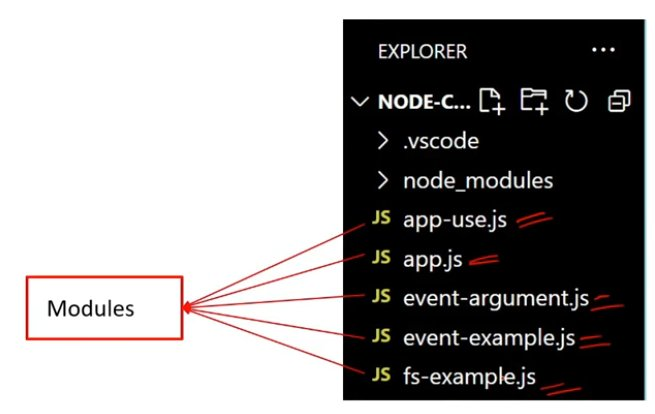

---

## 7. Ways to Export a Module

### 1. Using `module.exports`

`module.exports` object can be used to export the module.

```js
// Exporting a function
function sayHello(name) {
	console.log("Hello, " + name);
}

// Exporting a variable
const pi = 3.14159;

// Exporting an object
const myObject = {
	key: "value",
};

// Using module.exports
module.exports.sayHello = sayHello;
module.exports.pi = pi;
module.exports.myObject = myObject;
```

### 2. Using `exports` Directly

`exports` object can also be used directly to export the module.

```js
// Exporting a function
exports.sayHello = function (name) {
	console.log("Hello, " + name);
};

// Exporting a variable
exports.pi = 3.14159;

// Exporting an object
exports.myObject = {
	key: "value",
};
```

---

## 8. Types of Modules in Node

1. **Built-in Module (Core Modules):** These are already present modules in Node.js which provide essential functionalities. For example, `fs` (file system), `http` (HTTP server), `path` (path manipulation), and `util` (utilities).
2. **Local Modules:** These are user-defined modules (JS files) created by developers for specific functionalities.
3. **Third-Party Modules:** These are external packages or libraries created by the community and provide additional functionalities for Node projects. You install third-party modules using the `npm install` command. For example, `npm install lodash`.

---

## 9. Top 5 Built-in Modules

1. `fs`
2. `path`
3. `os`
4. `events`
5. `http`

---

## 10. fs Module

The **fs (File System)** module in Node provides a set of methods for interacting with the file system.

```js
// fs-example.js
const fs = require("fs");

// Reading the contents of a file asynchronously
fs.readFile("fs.txt", "utf8", (err, data) => {
	if (err) {
		return;
	}
	console.log("File contents:", data);
});

// Writing to a file asynchronously
const contentToWrite = "Some content";
fs.writeFile("fs.txt", contentToWrite, "utf8", (err) => {
	if (err) {
		return;
	}
	console.log("Write operation complete.");
});
```

### 7 Main Functions of the fs Module

1. `fs.readFile()` — Reads the content of the file specified.
2. `fs.writeFile()` — Writes data to the specified file, creating the file if it does not exist.
3. `fs.appendFile()` — Appends data to a file. If the file does not exist, it is created.
4. `fs.unlink()` — Deletes the specified file.
5. `fs.readdir()` — Reads the contents of a directory.
6. `fs.mkdir()` — Creates a new directory.
7. `fs.rmdir()` — Removes the specified directory.

---

## 11. path Module

The **path** module provides utilities for joining, resolving, parsing, formatting, normalizing, and manipulating paths.

```js
// path-example.js
const path = require('path');

// Joining Path Segments
const fullPath = path.join('/docs', 'file.txt');
console.log(fullPath);
// Output: /docs/file.txt

// Parsing Path
const parsedPath = path.parse('/docs/file.txt');
console.log(parsedPath);
/*
Output: { root: '/', dir: '/docs', base: 'file.txt',
          ext: '.txt', name: 'file' }
*/
```

### 5 Main Functions of the path Module

```js
const path = require('path');

// Joining path segments together
const fullPath = path.join(__dirname, 'folder', 'file.txt');

// Resolving the absolute path
const absolutePath = path.resolve('folder', 'file.txt');

// Getting the directory name of a path
const directoryName = path.dirname('/folder/file.txt');

// Getting the file extension of a path
const fileExtension = path.extname('/folder/file.txt');

// Parsing a path into an object with its components
const pathObject = path.parse('/folder/file.txt');
```

---

## 12. os Module

The **os** module in Node.js provides a set of methods for interacting with the operating system.

The operating system module can be used by developers for building cross-platform applications or performing system-related tasks in Node.js applications.

```js
const os = require('os');

// 1. Get Platform Information
console.log(os.type());
// Output: 'Windows_NT' or 'Linux'

// 2. Get Current User Information
console.log(os.userInfo());
// Output: { uid: -1, gid: -1, username: 'anaya' ... }

// 3. Get Memory Information in bytes
console.log(os.totalmem()); // Output: 14877265920
console.log(os.freemem());  // Output: 4961570816
```

---

## 13. Event Module

1. The **events** module is used to handle events.
2. The **EventEmitter** class of the events module is used to register event listeners and emit events.
3. An event listener is a function that will be executed when a particular event occurs.
4. The **`on()`** method is used to register event listeners.

```js
// Import events module
const EventEmitter = require('events');

// Create an instance of EventEmitter class
const myEmitter = new EventEmitter();

// Register an event listener
myEmitter.on('eventName', () => {
	console.log('Event occurred');
});

// Emit the event
myEmitter.emit('eventName');

// Output: Event occurred
```

**Events Arguments:**

```js
const EventEmitter = require("events");

// Create an instance of EventEmitter class
const myEmitter = new EventEmitter();

// Register an event listener for the 'eventName' event
myEmitter.on("eventName", (arg1, arg2) => {
	console.log("Event occurred with arguments:", arg1, arg2);
});

// Emit the 'eventName' event with arguments
myEmitter.emit("eventName", "Arg 1", "Arg 2");

// Output: Event occurred with arguments: Arg 1 Arg 2
```

### What is the difference between a function and an event?

A **function** is a reusable piece of code that performs a specific task when invoked or called.

**Events** represent actions that can be observed and responded to. Events will call functions internally.

---

## 14. http Module

The **HTTP** module can create an HTTP server that listens to server ports and gives a response back to the client.

### createServer() Method

The **`createServer()`** method of the http module in Node.js is used to create an HTTP server.

```js
// createServer.js
// 1. Import the 'http' module to create an HTTP server
const http = require("http");

// 2. Create an HTTP server using the 'createServer' method
const server = http.createServer((req, res) => {
	// Handle incoming HTTP requests here
	res.end("Hello, World!");
});

// 3. Set port on which server will listen for incoming requests
const port = 3000;

// 4. Start the server and listen on the specified port
server.listen(port, () => {
	console.log(`Server listening on port ${port}`);
});

// 5. Run command in terminal: node createServer.js
```

---

## 15. Express

### Advantages of Using Express.js with Node.js

1. **Simplified Web Development:** Express.js provides a lightweight framework that simplifies the process of building web applications in Node.js.
2. **Middleware Support:** Easy integration of middleware functions into the application's request-response cycle.
3. **Flexible Routing System:** Defining routes for handling different HTTP methods (GET, POST, PUT, DELETE, etc.) and URL patterns is easy.
4. **Template Engine Integration:** Express.js supports various template engines making it easy to generate dynamic HTML content on the server side.

### Creating an HTTP Server Using Express.js

```js
// Creating an HTTP server using Express.js

// Step 1: Import Express
const express = require("express");

// Step 2: Create an Express application
const app = express(); // Server created

// Step 3: Define the port number
const PORT = 3000;

// Step 4: Start the Express server and listen on the specified port
app.listen(PORT, () => {
	console.log(`Express server running ${PORT}`);
});
```

Create an Express.js application by requiring the express module and calling the `express()` function:

```js
const express = require("express");
const app = express();
```

Start an Express.js server by calling the `listen()` method on the application object (`app`) and specifying the port number:

```js
const PORT = 3000;
app.listen(PORT, () => {
	console.log(`Server is running on :${PORT}`);
});
```

---

## 16. Express Middleware

A **middleware** in Express.js is a function that handles HTTP requests, performs operations, and passes control to the next middleware.

### How to Implement Middleware in Express.js

1. Initialize an Express application.
2. Define a middleware function `myMiddleware`.
3. Use `app.use()` to mount `myMiddleware` globally, meaning it will be executed for every incoming request to the application.
4. Start the server by listening on a specified port (defaulting to port 3000) using `app.listen()`.

```js
// Create and execute middleware
const express = require("express");
const app = express();

// Define middleware function
const myMiddleware = (req, res, next) => {
	// Middleware logic goes here
	res.send("Interview Happy!");
	next(); // Call the next middleware function
};

// Use middleware globally for all routes
app.use(myMiddleware);

// Start the server
const PORT = 3000;
app.listen(PORT, () => {
	console.log(`Server is running ${PORT}`);
});
```

> The **`app.use()`** method is used to execute (mount) middleware functions globally.

### Purpose of the next Parameter in Express.js

The **`next` parameter** is a callback function which is used to pass control to the next middleware function in the stack.

```js
const express = require("express");
const app = express();

const myMiddleware1 = (req, res, next) => {
	console.log("Interview");
	next(); // Call the next middleware function
};

const myMiddleware2 = (req, res, next) => {
	console.log("Happy");
	next();
};

app.use(myMiddleware1);
app.use(myMiddleware2); // Only executes if above has next() method

// Start the server
const PORT = 3000;
app.listen(PORT, () => {
	console.log(`Server is running ${PORT}`);
});
```

### Middleware Globally for a Specific Route

Use `app.use('/specificRoute', myMiddleware)` to apply middleware globally for a specific route in Express.js.

```js
const express = require('express');
const app = express();

const middleware = (req, res, next) => {
	res.send('Middleware for specific route');
	next();
};

// Use middleware globally for specific routes
app.use('/example', middleware);

const PORT = 3000;
app.listen(PORT, () => {
	console.log(`Server is running ${PORT}`);
});
```

### Request Pipeline in Express

The request pipeline in Express.js is a series of middleware functions that handle incoming HTTP requests and pass control to the next function.

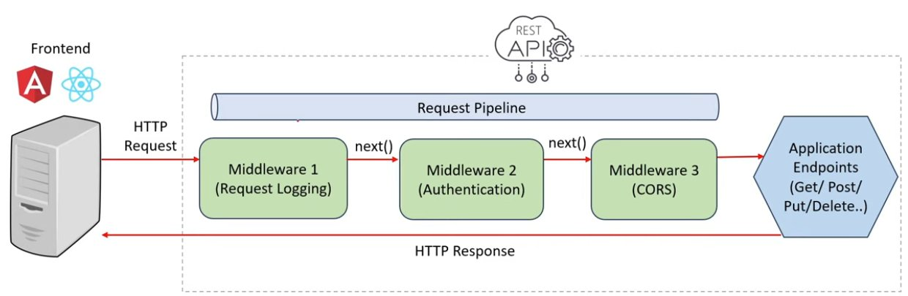

---

## 17. Types of Middleware in Express.js

1. **Application-level middleware:** Middleware applied to all routes; commonly used for logging, authentication, etc.
2. **Router-level middleware:** Middleware specific to certain routes; applied using router.
3. **Error-handling middleware:** Middleware for handling errors; declared after other middleware, triggered on errors.
4. **Built-in middleware:** Pre-packaged middleware included with Express.js, like for serving static files.
5. **Third-party middleware:** Middleware developed by others, not part of Express.js core; adds various functionalities.

---

## 18. Application-level vs Route-level Middleware

**Application-level middleware** applies globally to all incoming requests in the entire Express.js application.

```js
const express = require("express");
const app = express();

// Define middleware function
const myMiddleware = (req, res, next) => {
	// Middleware logic goes here
	res.send("Hello World!");
	next(); // Call the next middleware function
};

// Use middleware globally for all routes
app.use(myMiddleware);

// Start the server
const PORT = 3000;
app.listen(PORT, () => {
	console.log(`Server is running ${PORT}`);
});
```

**Route-level middleware** applies only to specific routes, not for all incoming requests.

```js
const express = require('express');
const app = express();

const middleware = (req, res, next) => {
	res.send('Middleware for specific route');
	next();
};

// Use middleware for specific routes only
app.use('/example', middleware);

const PORT = 3000;
app.listen(PORT, () => {
	console.log(`Server is running ${PORT}`);
});
```

---

## 19. Error Handling Middleware

**Error handling middleware** in Express is a special kind of middleware used to manage errors happening while handling incoming requests.

To implement error handling in Express, define middleware with **four parameters** `(err, req, res, next)`. The additional error object parameter will be used for error handling.

```js
const express = require("express");
const app = express();

// Middleware generating error
app.use((req, res, next) => {
	// Simulate an error
	next(new Error("An error occurred"));
});

// Error-handling middleware
app.use((err, req, res, next) => {
	console.error(err.stack);
	res.status(500).send("Something went wrong!");
});

// Start the server
const PORT = 3000;
app.listen(PORT, () => {
	console.log(`Server is running on ${PORT}`);
});
```

**If you have 5 middlewares, which one handles errors?**

In case of multiple middlewares, error-handling middleware should be defined **last** (after all other middlewares) because when an error occurs, Express.js will search for the next error-handling middleware, skipping any regular middleware or route handlers.

```js
// Multiple middlewares
app.use(middleware1);
app.use(middleware2); // Error occurred here
app.use(middleware3); // Skipped
app.use(middleware4); // Skipped

// Error-handling middleware (defined last)
app.use((err, req, res, next) => {
	console.error(err.stack);
	res.status(500).send("Something went wrong!");
});
```

---

## 20. Built-in Middleware & Serving Static Files

**Built-in middlewares** are built-in functions inside the Express framework which provide common functionalities.

**`express.static()`** middleware is used for serving static files.

```js
const express = require("express");
const app = express();

// Serve static files from the 'public' directory
app.use(express.static("public"));

// Other routes and middleware can be defined here

// Start the server
const PORT = 3000;
app.listen(PORT, () => {
	console.log(`Server is running on :${PORT}`);
});
```

---

## 21. Third-party Middleware

**Third-party middleware** in Express.js are modules developed by third-party developers (not part of the core Express.js).

Third-party middlewares provide functionalities like logging, security, body parsing, and compression.

Examples: `morgan`, `helmet`, `body-parser`, `compression` etc.

```js
// Third-party middlewares
// npm install helmet body-parser compression

const express = require('express');
const helmet = require('helmet');
const bodyParser = require('body-parser');
const compression = require('compression');

const app = express();

// Use the helmet middleware for setting HTTP security headers
app.use(helmet());

// Use the body-parser middleware for parsing request bodies
app.use(bodyParser.json());
app.use(bodyParser.urlencoded({ extended: true }));

// Use the compression middleware for compressing HTTP responses
app.use(compression());
```

---

## 22. Advantages of Middleware in Express.js

1. **Modularity:** Middleware allows you to modularize your application's functionality into smaller, self-contained units. Each middleware function can handle a specific task or concern, such as logging, authentication, or error handling.
2. **Reusability:** Middlewares can be reused at multiple places and that makes application code easier to maintain.
3. **Improved Request Handling:** Middleware functions have access to both the request (`req`) and response (`res`) objects which enables you to perform validations on request or modify the response before sending it back to the client.
4. **Flexible Control Flow:** Middleware functions can be applied globally to all routes or selectively to specific routes, allowing you to control the flow of request processing in your application.
5. **Third-party Middlewares:** Express.js offers a wide range of third-party middleware packages that provide additional functionality. For example: `body-parser`, `cors` etc.

---

## 23. Routing in Express.js

**Routing** is the process of directing incoming HTTP requests to the appropriate handler functions based on the request's method (e.g., GET, POST) and the URL path.

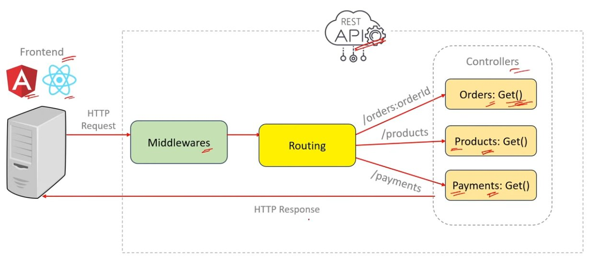

### Middleware vs Routing

| Middleware | Routing |
| --- | --- |
| Middleware are functions. | Routing is a process. |
| Middleware functions can access the request and response objects, then they can: (a) perform some actions (logic like authorization), (b) end the request-response cycle, (c) call the next middleware function. | Routing is the process of directing incoming HTTP requests to the appropriate handler functions (GET, PUT, POST, DELETE). |

---

## 24. How to Implement Routing & Define Routes

To implement routing, first define the routes.

In Express.js, routes are defined using the **`app.METHOD()`** functions (where `METHOD` is the HTTP request method — e.g., GET, POST, PUT, DELETE — and `app` is an instance of the Express application).

```js
const express = require("express");
const app = express();

// Define a route for handling GET requests
app.get("/", (req, res) => {
	res.send("Interview Happy!");
});

// Define a route for handling POST requests
app.post("/login", (req, res) => {
	// Handle login logic
});

// Start the server
const PORT = 3000;
app.listen(PORT, () => {
	console.log(`Server is running on ${PORT}`);
});
```

---

## 25. Routing in Real Applications

### 5 Steps for Setting Up Routing

1. Import Express
2. Set Middlewares
3. Import Controllers
4. Define Routes for different endpoints
5. Start the server

```js
const express = require("express");
const app = express();

// Middlewares

// Import Controllers
const ordersController   = require("./controllers/ordersController");
const productsController = require("./controllers/productsController");
const paymentsController = require("./controllers/paymentsController");

// Routes
app.get("/orders/:orderId", ordersController.getOrderById);
app.get("/products",        productsController.listProducts);
app.get("/payments",        paymentsController.paymentInfo);

// Start the server
const PORT = 3000;
app.listen(PORT, () => {
	console.log(`Server is running on http://localhost:${PORT}`);
});
```

---

## 26. Route Handlers & Route Parameters

**Route handler** is the second argument passed to `app.get()` or `app.post()` — i.e., `(req, res)`.

The route handler function is used to process the request and generate a response.

```js
const express = require("express");
const app = express();

// Define a route for handling GET requests
app.get("/", (req, res) => {        // (req, res) => Route Handler
	res.send("Interview Happy!");
});

// Define a route for handling POST requests
app.post("/login", (req, res) => {  // (req, res) => Route Handler
	// Handle login logic
});

// Start the server
const PORT = 3000;
app.listen(PORT, () => {
	console.log(`Server is running on ${PORT}`);
});
```

### Route Parameters in Express.js

**Route parameters** in Express.js allow you to capture dynamic values from the URL paths.

Route parameters can be accessed using the **`req.params`** object.

```js
const express = require("express");
const app = express();

// Define a route with a route parameter
app.get("/users/:userId", (req, res) => {
	// Access the value of the userId parameter
	const userId = req.params.userId;
	res.send(`User ID: ${userId}`);
});

// Start the server
const PORT = 3000;
app.listen(PORT, () => {
	console.log(`Server is running on :${PORT}`);
});
```

---

## 27. Router Object & Router Methods

The **router object** is a mini version of an Express application which is used for handling routes.

**Router Methods** are functions provided by the Router object to define routes for different HTTP methods (GET, POST, DELETE, etc.).

```js
// router.js
const express = require("express");

// Create a router object
const router = express.Router();

// Define a route for the root URL ('/')
router.get("/", (req, res) => {
	res.send("Interview Happy");
});

// Export the router object
module.exports = router;
```

```js
// app.js
const express = require("express");
const router  = require("./router");
const app     = express();

// Mount the router object on a path
app.use("/api", router);

// Start the server
app.listen(3000, () => {
	console.log("Server is running");
});
```

### Types of Router Methods

1. `router.get(path, callback)`
2. `router.post(path, callback)`
3. `router.put(path, callback)`
4. `router.delete(path, callback)`

---

## 28. app.get() vs router.get()

### app.get()

1. The `app.get()` method is used to define routes directly on the application object.
2. Routes defined using `app.get()` are automatically mounted on the root path (`/`).
3. Routes defined using `app.get()` are not modular and cannot be reused in other applications.

```js
// app-get.js
const express = require("express");
const app = express();

app.get("/", (req, res) => {
	res.send("Interview Happy");
});

app.listen(3000, () => {
	console.log("Server is running");
});
```

### router.get()

1. The `router.get()` method is used to define routes on a router object.
2. Routes defined using `router.get()` are not automatically mounted; they must be explicitly mounted using `app.use()`.
3. Routes defined using `router.get()` are modular and can be reused in other applications by exporting the router object.

```js
// router.js
const express = require("express");
const router  = express.Router();

// Define a route for the root URL ('/')
router.get("/", (req, res) => {
	res.send("Interview Happy");
});

// Export the router object
module.exports = router;
```

---

## 29. express.Router()

**`express.Router`** is a class in Express.js that returns a new router object.

```js
// router-get.js
const express = require("express");
const router  = express.Router();

// Define a route for the root URL ('/')
router.get("/", (req, res) => {
	res.send("Interview Happy");
});

// Export the router object
module.exports = router;
```

---

## 30. Real Application Use of Routing

Routing is used for authenticating requests based on the token available in the request header.

```js
const express = require('express');
const app    = express();
const router = express.Router();

// Route-level middleware for authentication
const authenticate = (req, res, next) => {
	if (req.headers.authorization === 'Bearer myToken') {
		next(); // Proceed to the next middleware
	} else {
		res.status(401).send('Unauthorized');
	}
};

// Apply route middleware to specific route
router.get('/protected', authenticate, (req, res) => {
	res.send('This is a protected route');
});

// Mount the router
app.use('/api', router);
```

---

## 31. Route Chaining

**Route chaining** is a process of defining multiple route handlers for a single route.

This pattern helps in modularity, organizing code, improving readability, and separating concerns.

```js
const express = require("express");
const app = express();

function middleware1(req, res, next) {
	console.log("Middleware 1");
	next();
}

function middleware2(req, res, next) {
	console.log("Middleware 2");
	next();
}

// Route chaining example
app.get("/route", middleware1, middleware2, (req, res) => {
	console.log("Route handler");
	res.send("Route chaining example");
});

app.listen(3000, () => {
	console.log('Server is running');
});
// Output: Middleware 1  Middleware 2  Route handler
```

---

## 32. Route Nesting

**Route nesting** organizes routes hierarchically by grouping related routes under a common URL prefix.

**Advantage:** This allows you to create more modular and structured routes, making your codebase easier to manage and maintain.

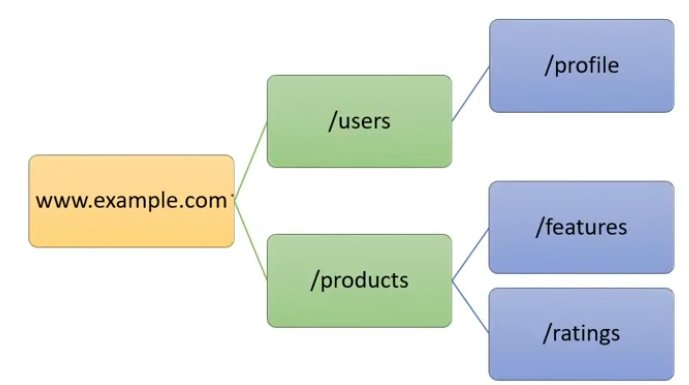

```js
// usersRouter.js
const express     = require("express");
const usersRouter = express.Router();

// Route 1: www.example.com/users
usersRouter.get("/", (req, res) => {
	res.send("Users Home Page");
});

// Route 2: www.example.com/users/profile
usersRouter.get("/profile", (req, res) => {
	res.send("User Profile Page");
});

module.exports = usersRouter;
```

```js
// productsRouter.js
const express        = require("express");
const productsRouter = express.Router();

// Route 1: www.example.com/products
// Route 2: www.example.com/products/features
// Route 3: www.example.com/products/ratings

module.exports = productsRouter;
```

```js
// app.js
const express = require("express");
const app     = express();

// Import routers
const usersRouter    = require("./usersRouter");
const productsRouter = require("./productsRouter");

// Mount routers
app.use("/users",    usersRouter);
app.use("/products", productsRouter);

// Start the server
app.listen(3000, () => {
	console.log("Server is running on port 3000");
});
```

---

## 33. Template Engines in Express.js

**Template engines** are libraries that enable developers to generate dynamic HTML content by combining static HTML templates with data.

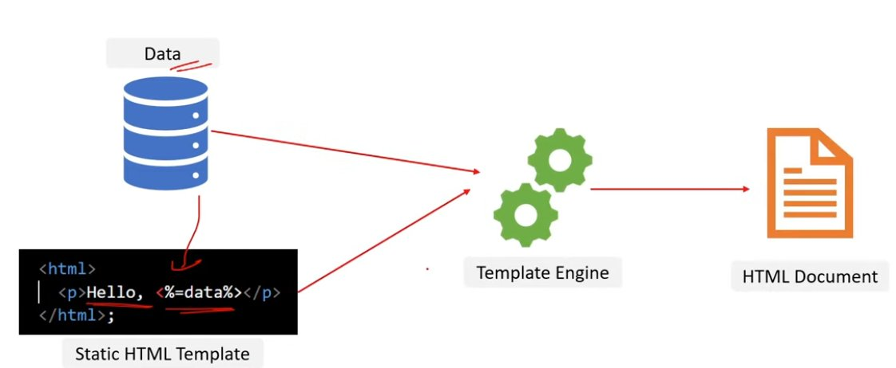

### Template Engine Libraries

1. EJS (Embedded JavaScript)
2. Handlebars
3. Pug (formerly Jade)
4. Mustache
5. Nunjucks

---

## 34. Implementing EJS Template Engine

```bash
npm install ejs
```

**Folder structure:**
```
|- Express-TemplateEngine
    |- views
        |- index.ejs
    |- server.js
```

```html
<!-- index.ejs -->
<html lang="en">
<head>
	<title>EJS Example</title>
</head>
<body>
	<h1><%= title %></h1>
	<p>Static HTML Template</p>
</body>
</html>
```

```js
// server.js
const express = require('express');
const app     = express();
const path    = require('path');

// Set the view engine to EJS
app.set('view engine', 'ejs');

// Set the views directory
app.set('views', path.join(__dirname, 'views'));

// Route to render the index.ejs template
app.get('/', (req, res) => {
	res.render('index', { title: 'Node.js with EJS' });
});

// Start the server
const PORT = process.env.PORT || 3000;
app.listen(PORT, () => {
	console.log(`Server is running on :${PORT}`);
});
```

---

## 35. REST & RESTful API

**REST (Representational State Transfer)** is an architectural style for designing networked applications (REST is a set of guidelines for creating APIs).

**RESTful API** is a service which follows REST principles/guidelines.

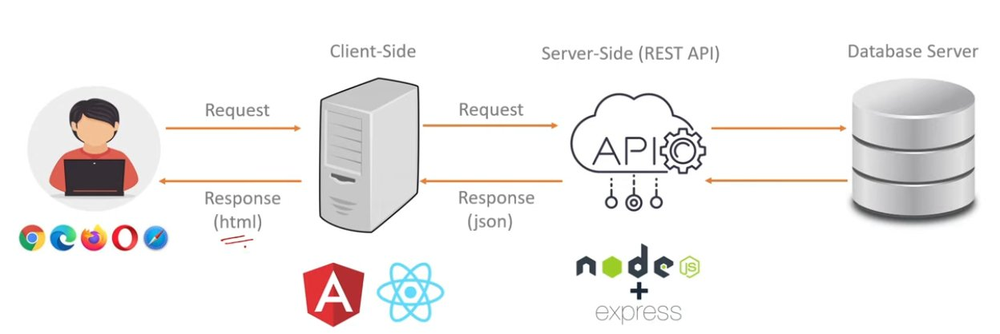

---

## 36. HTTP Request and Response Structures

### HTTP Request

1. An HTTP (Hypertext Transfer Protocol) request is a message sent by a client (such as a web browser or a mobile app) to a server, requesting a particular action or resource.
2. It contains HTTP Action (GET, POST...), URL, Request Body, Request Header.

### HTTP Response

1. An HTTP response is a message sent by a server back to the client in response to an HTTP request.
2. It includes status code, content type, content.


---

## 37. Top 5 REST Guidelines

1. **Separation of Client & Server:** The implementation of the client and the server must be done independently.
   - *Advantage:* Independence allows easier maintenance, scalability, and evolution.

2. **Stateless:** The server will not store anything about the latest HTTP request the client made.
   - *Advantage:* It will treat every request as a new request. It simplifies server implementation as it is not overloading it with state management.

3. **Uniform Interface:** Identify the resources by URL (e.g., `www.abc.com/api/questions`).
   - *Advantage:* Standardized URLs, making it easy to understand and use the API.

4. **Cacheable:** The API response should be cacheable to improve the performance.
   - *Advantage:* Caching API responses improves performance by reducing the need for repeated requests to the server.

5. **Layered System:** The system should follow a layered pattern.
   - *Advantage:* A layered system, such as the Model-View-Controller (MVC) pattern, promotes modular design and separation of concerns.

---

## 38. HTTP Verbs and HTTP Methods

**HTTP methods**, also known as HTTP verbs, are a set of actions that a client can take on a resource.

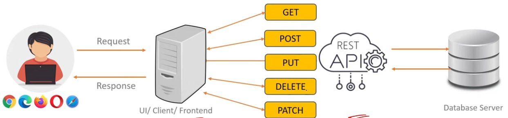

---

## 39. GET, POST, PUT & DELETE HTTP Methods

| HTTP Method | Action | Example |
| --- | --- | --- |
| GET | Retrieve data from a specified resource | `www.example.com/users` (retrieve users list) `www.example.com/users/123` (retrieve single user of id - 123) |
| POST | Submit data to be processed | `www.example.com/users` (submit and create a new user from data provided in request) |
| PUT | Update a resource or create a new resource if it does not exist | `www.example.com/users/123` (update user 123 details from data provided in request) |
| DELETE | Request removal of a resource | `www.example.com/users/123` (delete user 123) |

---

## 40. PUT vs PATCH Methods

**Similarity:** Both PUT and PATCH methods are used to update a resource by replacing the resource with the new data provided in the request.

**Difference:**

**PUT — Full Resource Replacement:** In a PUT request, the client sends the full updated resource in the request body, replacing the existing resource on the server.

```js
// PUT URL: www.example.com/users/123
// PUT request body
{
	"id": 123,
	"name": "John Doe Updated",
	"email": "john@example.com",
	"age": 26
}
```

**PATCH — Partial Updates:** In a PATCH request, the client sends specific changes or instructions for modifying the resource, updating only certain fields without resending the entire resource.

```js
// PATCH URL: www.example.com/users/123
// PATCH request body
{
	"email": "john@example.com",
	"age": 26
}
```

---

## 41. Idempotence in RESTful APIs

**Idempotence** means performing an operation multiple times should have the same outcome as performing it once. For example, sending multiple identical GET requests will always return the same response.

- **Idempotent Methods:** GET, PUT, DELETE
- **Non-Idempotent Methods:** POST

---

## 42. Role of Status Codes in RESTful APIs

| Category | Code | Meaning |
| --- | --- | --- |
| **1XX (Info)** | 100 | Continue |
| **2XX (Success)** | 200 | OK |
| | 201 | Created |
| | 202 | Accepted |
| | 204 | No Content |
| **3XX (Redirection)** | 300 | Multiple Choices |
| **4XX (Client Error)** | 400 | Bad Request |
| | 401 | Unauthorized |
| | 403 | Forbidden |
| | 404 | Not Found |
| **5XX (Server Error)** | 500 | Internal Server Error |
| | 501 | Not Implemented |
| | 502 | Bad Gateway |
| | 503 | Service Unavailable |

---

## 43. CORS in RESTful APIs

**CORS (Cross-Origin Resource Sharing)** is a security feature implemented in web browsers that restricts web pages or scripts from making requests to a different domain than the one that served the web page.

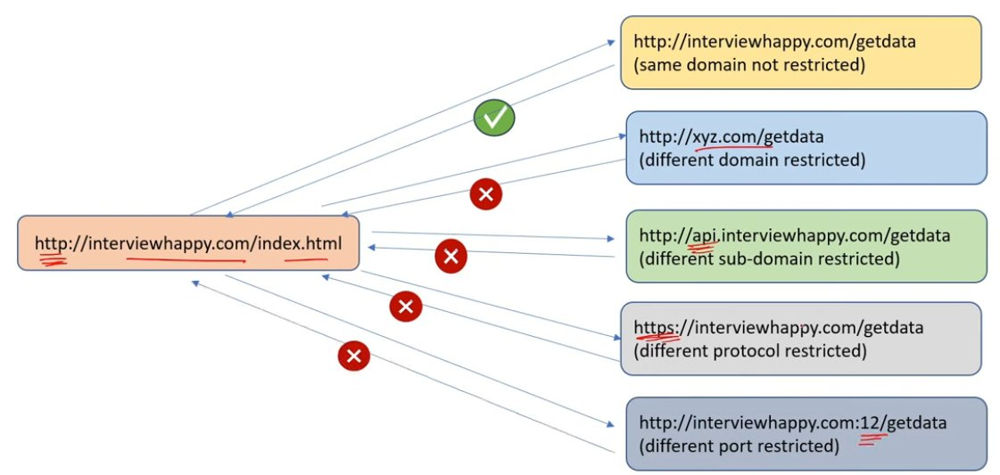

CORS restrictions can be removed by enabling CORS middleware in the application.

```js
const express = require('express');
const cors    = require('cors'); // Import cors module

const app = express();

// Enable CORS middleware for all routes
app.use(cors());

// Optionally, configure CORS to allow requests from specific origins
// app.use(cors({
//   origin: 'http://example.com' // Replace with your allowed origin
// }));

// Define your routes and route handlers below
app.get('/api/data', (req, res) => {
	res.json({ message: 'Hello from the API!' });
});

app.listen(3000, () => {
	console.log('Server is running');
});
```

---

## 44. Serialization & Deserialization

**Serialization** is the process of converting an object into a format that can be stored, transmitted, or reconstructed later.

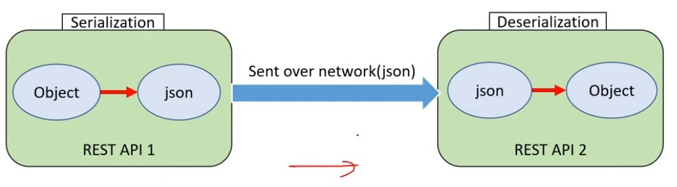

### Types of Serialization

1. Binary Serialization
2. XML Serialization
3. JSON Serialization

Serialize a JavaScript object into JSON format using **`JSON.stringify()`**:

```js
// Serialization (to JSON)
const obj = { name: "Happy", age: 39 };

const jsonStr = JSON.stringify(obj);

console.log("Serialized JSON:", jsonStr);
// Output: Serialized JSON: {"name":"Happy","age":39}
```

**Deserialization** is the process of converting serialized data, such as binary/XML/JSON data, back into an object.

Deserialize a JSON string into a JavaScript object using **`JSON.parse()`**:

```js
// Deserialization (from JSON)
const jsonStr2 = '{"name":"Happy","age":39}';

const obj2 = JSON.parse(jsonStr2);

console.log("Deserialized JSON:", obj2);
// Output: Deserialized JSON: { name: 'Happy', age: 39 }
```

---

## 45. Versioning in RESTful APIs

**Versioning** in RESTful APIs refers to the practice of maintaining multiple versions of an API to support backward compatibility.

```
https://api.example.com/v1/resource
https://api.example.com/v2/resource
https://api.example.com/v3/resource
```

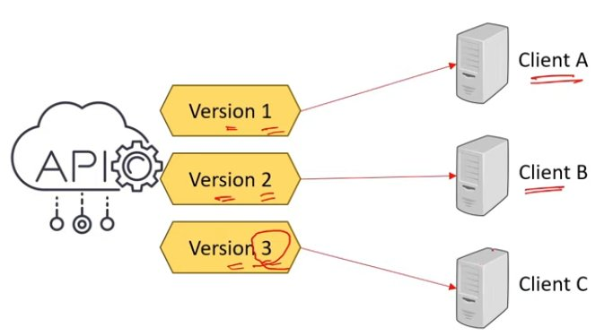

---

## 46. API Documentation

An **API document** describes the functionality, features, and usage of a REST API.

### REST API Documentation Formats

1. Swagger (OpenAPI)
2. RAML
3. API Blueprint

---

## 47. Typical Structure of a REST API Project in Node

```
/ecommerce-project-root
| -- node_modules
| -- src
| | -- controllers
| | | -- productController.js
| | | -- userController.js
| | -- models
| | | -- productModel.js
| | | -- userModel.js
| | -- routes
| | | -- productRoutes.js
| | | -- userRoutes.js
| | -- utils
| | | -- errorHandlers.js
| | | -- validators.js
| | -- app.js
| -- .gitignore
| -- package.json
```

- **node_modules:** Directory where npm packages are installed.
- **src:** Source code directory.
- **controllers:** Contains files responsible for handling business logic.
- **models:** Defines data models.
- **routes:** Defines API routes.
- **utils:** Contains reusable functions used across the project.
- **app.js:** Initializes and configures the Express application. Connects routes, middleware, and other configurations.
- **.gitignore:** A file that specifies files and directories to be ignored by version control (e.g., `node_modules`, `*.log`).
- **package.json:** The file that contains metadata about the project and its dependencies.

---

## 48. Authentication and Authorization

**Authentication** is the process of verifying the identity of a user by validating their credentials such as username and password.

### 5 Types of Authentication

1. Basic (Username and Password) Authentication
2. API Key Authentication
3. Token-based Authentication (JWT)
4. Multi-factor Authentication (MFA)
5. Certificate-based Authentication

**Authorization** is the process of allowing an authenticated user access to resources. Authentication always precedes Authorization.

---

## 49. Basic Authentication

In **Basic Authentication**, the user passes their credentials on a POST request. At the Node REST API end, credentials are verified, and a response is sent back.

The disadvantage of it is, Basic Authentication sends credentials in plain text over the network, so it is not considered a secure method of authentication.

---

## 50. Hashing and Salt in Securing Passwords

**Hashing** is a process of converting a password into a fixed-size string of characters using a mathematical algorithm.

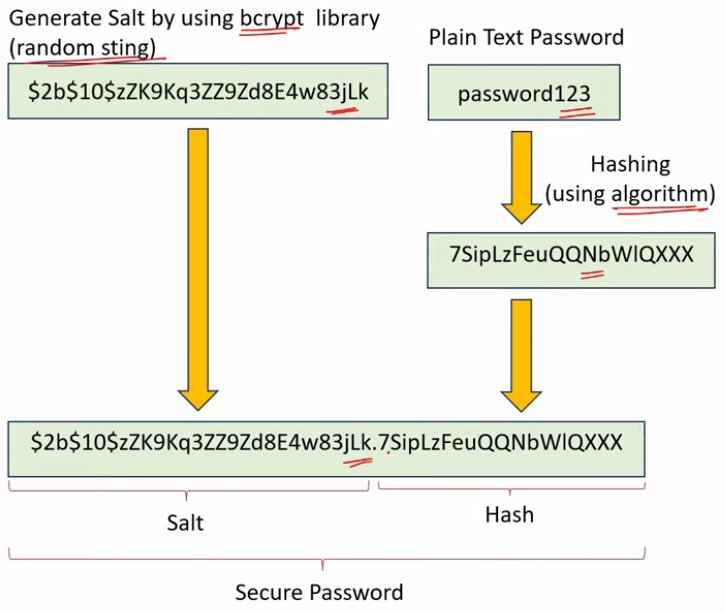

---

## 51. Creating Hash Passwords in Node.js

1. Generate a random salt
2. Create a hash object using SHA-256
3. Update the hash object with the salt and password
4. Get the hashed data in a hexadecimal string
5. Return the salt and hashed password as a string

```js
const crypto = require("crypto");

// Define a function to hash and salt a password
function hashAndSaltPassword(password) {
	// 1. Generate a random salt
	const salt = crypto.randomBytes(16).toString("hex");

	// 2. Create a hash object using SHA-256
	const hash = crypto.createHash("sha256");

	// 3. Update the hash object with the salt and password
	hash.update(salt + password);

	// 4. Get the hashed data in a hexadecimal string
	const hexHash = hash.digest("hex");

	// 5. Return the salt and hashed password as a string
	return salt + "." + hexHash;

	// Output: 8b18c67adab66e2d597ea0c036faa02b.3fdaf32ff5f8.
}
```

---

## 52. API Key Authentication

In **API Key Authentication**, the API owner will share an API key with the users and this key will authenticate the users of that API.

The disadvantage of it is, API keys can be shared or stolen, therefore it may not be suitable for all scenarios.

---

## 53. Token-based and JWT Authentication

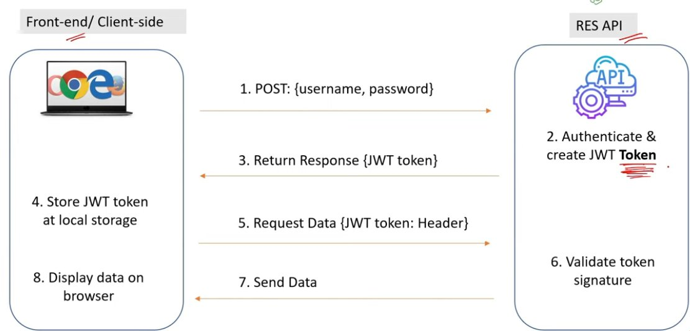

### JWT Token has 3 Parts

1. Header
2. Payload
3. Signature

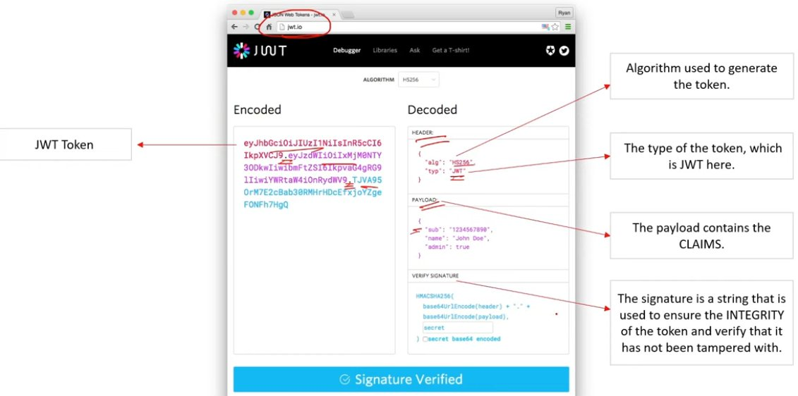

**JWT token is inside Request Header**

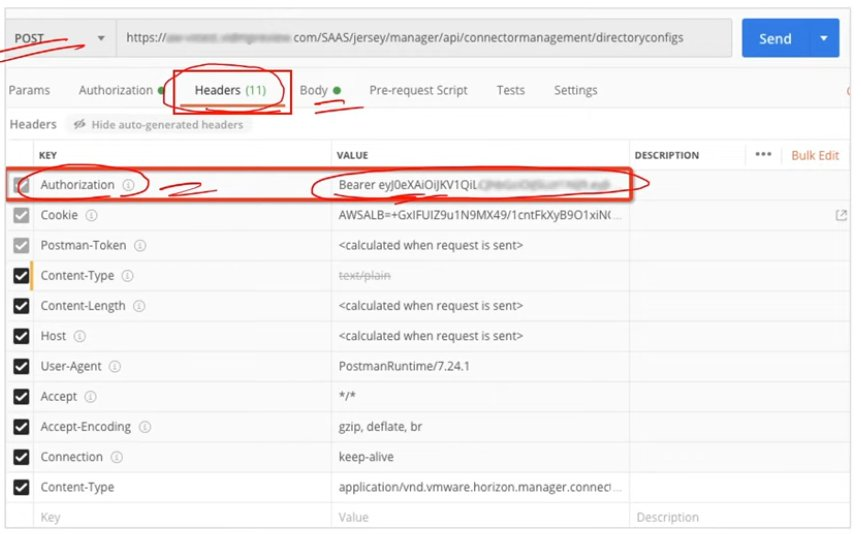

---

## 54. Error Handling in Node.js

**Error handling** is the process of managing errors that occur during the execution of a program or system.

### 4 Ways to Implement Error Handling in Node.js

1. Try-Catch (Sync)
2. Error-First Callbacks (Async)
3. Promises (Async)
4. Try-Catch with async-await (Async)

### 1. Try-Catch (Synchronous)

Handle errors in synchronous operations using `try-catch-finally`:

- **TRY** — A try block is a block of code inside which any error can occur.
- **CATCH** — When any error occurs in the TRY block, it is passed to the catch block to handle it.
- **FINALLY** — The finally block is used to execute a given set of statements, whether an exception occurs or not.

```js
try {
	// Synchronous operation that may throw an error
	throw new Error("Synchronous error");
} catch (error) {
	// Handle the error
	console.error("Error caught:", error.message);
} finally {
	// Code that runs regardless of whether an error occurred or not
	console.log("Finally block executed");
}
// Output: Error caught: Synchronous error
// Output: Finally block executed
```

### 2. Error-First Callbacks (Asynchronous)

**Error-First Callbacks** is a convention in Node.js for handling asynchronous operations.

They are called Error-First Callbacks because the first argument of a callback function is reserved for an error object.

```js
// Define the error-first callback function
const errorFirstCallback = (error, result) => {
	if (error) {
		console.error("Error:", error.message);
		return;
	}
	console.log("Result:", result);
};

// Call the asynchronous operation and pass the error-first callback function
asyncOperation(errorFirstCallback);

// Function simulating an asynchronous operation
function asyncOperation(callback) {
	// Simulate an asynchronous operation
	setTimeout(() => {
		const error = new Error("Async operation error");
		// Pass error as the first argument of the callback
		callback(error, null);
	}, 0);
}
// Output: Error: Async operation error
```

### 3. Promises (Asynchronous)

`.catch()` method is used in Promises for error handling.

```js
const asyncOperationPromise = new Promise((resolve, reject) => {
	// Perform asynchronous operation
	if (operationSuccessful) {
		resolve(result);
	} else {
		reject(new Error("Operation failed"));
	}
});

asyncOperationPromise
	.then((result) => console.log(result))
	.catch((error) => console.error(error.message));
```

### 4. async-await with Try-Catch (Asynchronous)

`try-catch` block is used with `async-await` for handling errors.

```js
// Simulating an asynchronous operation
function asyncOperation() {
	return new Promise((resolve, reject) => {
		// Perform asynchronous operation
		const operationSuccessful = Math.random() < 0.5;
		if (operationSuccessful) {
			resolve("Async operation result");
		} else {
			reject(new Error("Operation failed"));
		}
	});
}

// Async function to handle the asynchronous operation
async function handleAsyncOperation() {
	try {
		const result = await asyncOperation();
		console.log("Result:", result);
	} catch (error) {
		console.error("Error:", error.message);
	}
}

// Call the async function
handleAsyncOperation();
```

---

## 55. Debugging Node.js Applications

### Debugging Techniques in Node.js

1. `console.log()`
2. `debugger` statement
3. Node.js inspector
4. Visual Studio Code debugger
5. Chrome DevTools
