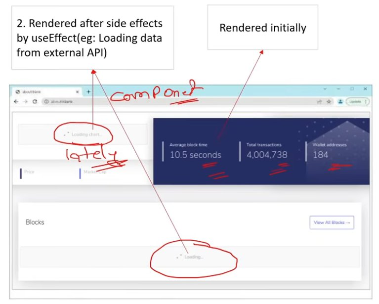
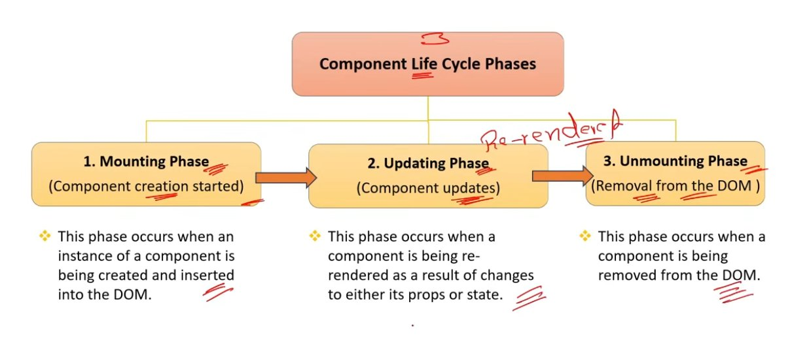
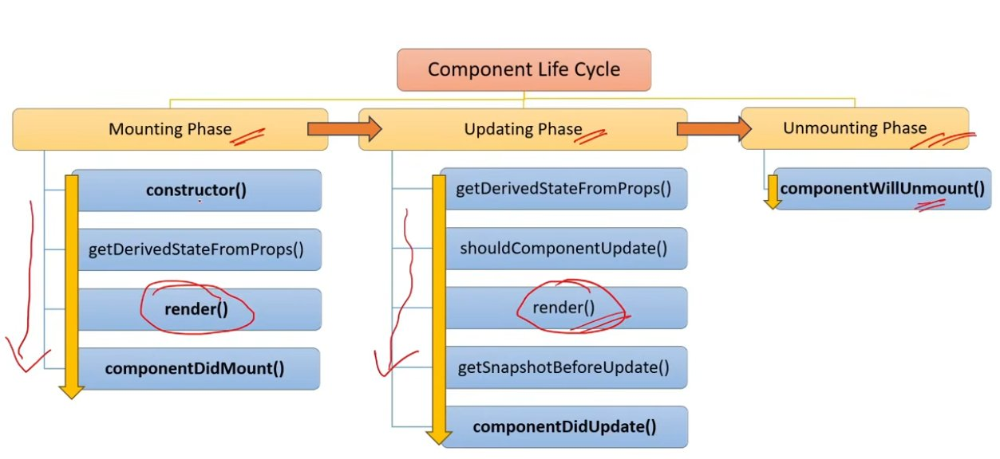
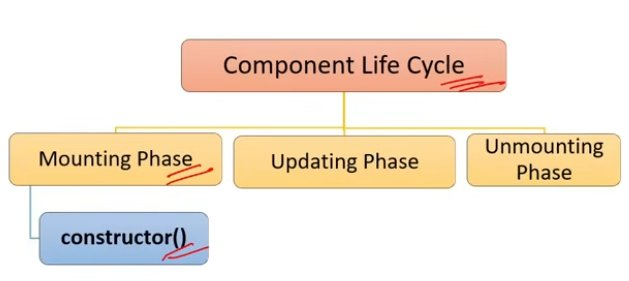
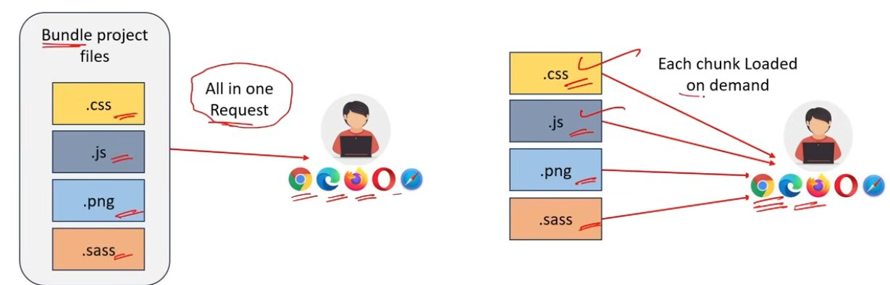
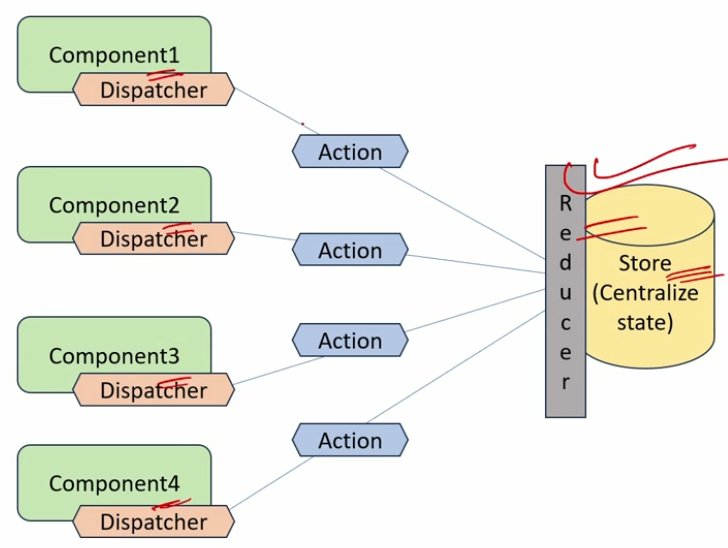
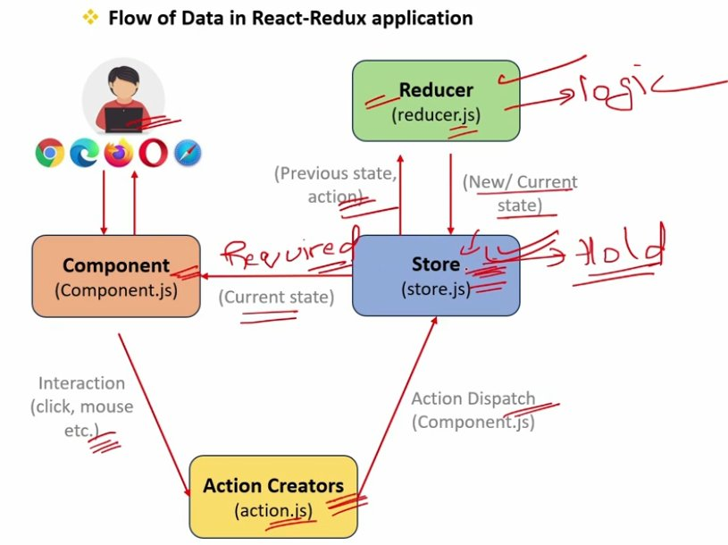
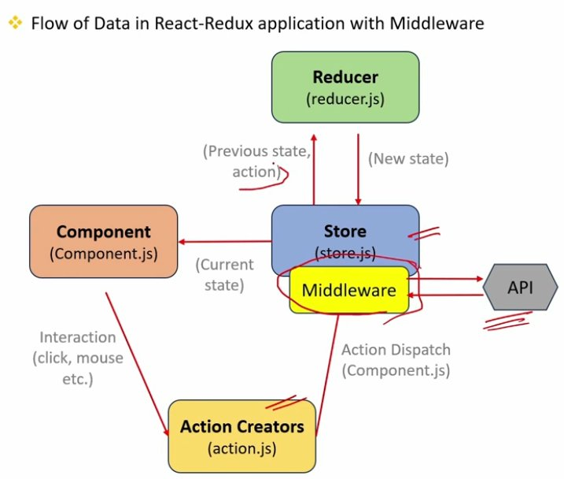

# React Basics

---

## Table of Contents

| # | Topic |
|---|-------|
| 1 | [What is DOM?](#1-what-is-dom) |
| 2 | [Virtual DOM](#2-virtual-dom) |
| 3 | [React Components](#3-react-components) |
| 4 | [SPA (Single Page Application)](#4-spa-single-page-application) |
| 5 | [7 Key Features of React](#5-7-key-features-of-react) |
| 6 | [JSX in React](#6-jsx-in-react) |
| 7 | [Declarative and Imperative Syntax](#7-declarative-and-imperative-syntax) |
| 8 | [Arrow Function Expression in JSX](#8-arrow-function-expression-in-jsx) |
| 9 | [Main Files in a React Project](#9-main-files-in-a-react-project) |
| 10 | [How React App Loads and Displays Components](#10-how-react-app-loads-and-displays-components) |
| 11 | [React is a Framework or a Library?](#11-react-is-a-framework-or-a-library) |
| 12 | [Reusability and Composition](#12-reusability-and-composition) |
| 13 | [State, Stateless, Stateful and State Management](#13-state-stateless-stateful-and-state-management) |
| 14 | [Props in JSX](#14-props-in-jsx) |
| 15 | [NPM, Public Folder, src Folder, index.html](#15-npm-public-folder-src-folder-indexhtml) |
| 16 | [Role of index.js and ReactDOM](#16-role-of-indexjs-and-reactdom) |
| 17 | [Role of App.js](#17-role-of-appjs) |
| 18 | [Role of function, return and export default](#18-role-of-function-return-and-export-default) |
| 19 | [Advantages of JSX](#19-advantages-of-jsx) |
| 20 | [What is Babel?](#20-what-is-babel) |
| 21 | [Spread Operator in JSX](#21-spread-operator-in-jsx) |
| 22 | [Iterating over a List — map() Method](#22-iterating-over-a-list--map-method) |
| 23 | [Transpiler vs Compiler](#23-transpiler-vs-compiler) |
| 24 | [What are React Components?](#24-what-are-react-components) |
| 25 | [Passing Data Between Functional Components](#25-passing-data-between-functional-components) |
| 26 | [Prop Drilling](#26-prop-drilling) |
| 27 | [Functional vs Class Components](#27-functional-vs-class-components) |
| 28 | [Routing and Router in React](#28-routing-and-router-in-react) |
| 29 | [Roles of Routes and Route Components](#29-roles-of-routes-and-route-components) |
| 30 | [Role of exact Prop in React Routing](#30-role-of-exact-prop-in-react-routing) |
| 31 | [React Hooks](#31-react-hooks) |
| 32 | [Role of useState() Hook](#32-role-of-usestate-hook) |
| 33 | [Role of useEffect() Hook](#33-role-of-useeffect-hook) |
| 34 | [Role of useContext() Hook](#34-role-of-usecontext-hook) |
| 35 | [Component Lifecycle Phases](#35-component-lifecycle-phases) |
| 36 | [Constructors in Class Components](#36-constructors-in-class-components) |
| 37 | [Controlled Components](#37-controlled-components) |
| 38 | [Code Splitting in React](#38-code-splitting-in-react) |
| 39 | [Role of Lazy, import() and Suspense](#39-role-of-lazy-import-and-suspense) |
| 40 | [Higher-Order Components (HOC)](#40-higher-order-components-hoc) |
| 41 | [Top 3 Ways to Achieve State Management](#41-top-3-ways-to-achieve-state-management) |
| 42 | [React Profiler](#42-react-profiler) |
| 43 | [fetch vs axios for API Calls](#43-fetch-vs-axios-for-api-calls) |
| 44 | [Optimizing Performance in React](#44-optimizing-performance-in-react) |
| 45 | [Reactive Programming](#45-reactive-programming) |
| 46 | [Passing Data from Child to Parent Component](#46-passing-data-from-child-to-parent-component) |
| 47 | [Role of Redux in React](#47-role-of-redux-in-react) |
| 48 | [Core Principles of Redux](#48-core-principles-of-redux) |
| 49 | [Provider Component and Redux Store](#49-provider-component-and-redux-store) |
| 50 | [Middleware in React-Redux](#50-middleware-in-react-redux) |

---

## 1. What is DOM?

**DOM (Document Object Model)** represents the web page as a tree-like structure which allows JavaScript to dynamically access and manipulate the content and structure of a web page.

---

## 2. Virtual DOM

React uses a **Virtual DOM** to efficiently update the UI without re-rendering the entire page, which helps improve performance and make the application more responsive.

| DOM | Virtual DOM |
| --- | --- |
| DOM is actual representation of the webpage. | Virtual DOM is lightweight copy of the DOM. |
| Re-renders the entire page when updates occur. | Re-renders only the changed parts efficiently. |
| Can be slower, especially with frequent updates. | Optimized for faster rendering. |
| Suitable for static websites and simple applications. | Ideal for dynamic and complex single-page applications with frequent updates. |

---

## 3. React Components

In React, a **component** is a reusable building block for creating user interfaces.

```jsx
// 1. Import the React library
import React from "react";

// 2. Define a functional component
function Component() {
	// 3. Return JSX to describe the component's UI
	return (
		<div>
			<h1>I am a React Reusable Component</h1>
		</div>
	);
}

// 4. Export the component to make it available for use in other files
export default Component;
```

---

## 4. SPA (Single Page Application)

A **Single Page Application (SPA)** is a web application that have only one single web page.

Whenever user do some action on the website, then in response content is dynamically updated without refreshing or loading a new page.

---

## 5. 7 Key Features of React

1. Virtual DOM
2. Component Based Architecture
3. Reusability & Composition
4. JSX (JavaScript XML)
5. Declarative Syntax
6. Community & Ecosystem
7. React Hooks

---

## 6. JSX in React

1. JSX stands for **JavaScript XML**.
2. JSX is used by React to write HTML-like code.
3. JSX is converted to JavaScript via tools like Babel, because Browsers understand JavaScript not JSX.

---

## 7. Declarative and Imperative Syntax

**Declarative syntax** focuses on describing the desired result without specifying the step-by-step process. JSX in React is used to write declarative syntax.

```jsx
// Declarative syntax using JSX
function App() {
	return <h1>Interview Happy</h1>;
}
```

**Imperative syntax** involves step by step process to achieve a particular goal. JavaScript has an imperative syntax.

```jsx
// Imperative syntax (non-React) using JavaScript
function App() {
	const element = document.createElement("h1");
	element.textContent = "Interview Happy";
	document.body.appendChild(element);
}
```

---

## 8. Arrow Function Expression in JSX

The **arrow function expression** syntax is a concise way of defining functions.

```jsx
// Regular Function Declaration
function AppFunc(props) {
	return (
		<div>
			<h1>{props.name}</h1>
		</div>
	);
}
export default AppFunc;

// Arrow Function Expression
const ArrowFunc = (props) => {
	return (
		<div>
			<h1>{props.name}</h1>
		</div>
	);
};
export default ArrowFunc;
```

---

## 9. Main Files in a React Project

| File | Role |
| --- | --- |
| `index.html` | Single page for React application. |
| `Components/component1.js` | Your application components. |
| `App.js` | Main component or container or Root component. |
| `App.test.js` *(Optional)* | Used for writing tests for the App.js file. |
| `Index.css` *(Optional)* | Global CSS file that serves as the main stylesheet for the entire application. |
| `index.js` | Entry point for JavaScript. Renders the main React component (App) into the root DOM element. |

---

## 10. How React App Loads and Displays Components

*(Refer to the project structure: `index.html` → `index.js` → `App.js` → Child Components)*

---

## 11. React is a Framework or a Library?

React is commonly referred to as a **JavaScript library**.

**Library:** Developers import the libraries at the top and then used its functions in components.

---

## 12. Reusability and Composition

React provides reusability and composition through its **component-based architecture**.

- **Reusability:** Once you create a component, you can re-use it in different parts of your application or even in multiple projects.
- **Composition:** Composition is creating new and big components by combining existing small components. Its advantage is, change to one small component will not impact other components.

---

## 13. State, Stateless, Stateful and State Management

**"State"** refers to the current data of the component.

**Stateful** or **state management** means, when a user performs some actions on the UI, then the React application should be able to update and re-render that data or state on the UI.

---

## 14. Props in JSX

**Props (properties)** are a way to pass data from a parent component to a child component.

```jsx
function App() {
	return (
		<>
			<ChildComponent name="Happy" purpose="Interview" />
		</>
	);
}

function ChildComponent(props) {
	return <div>{props.name}, {props.purpose}!</div>;
}
// Output: Happy, Interview!
```

---

## 15. NPM, Public Folder, src Folder, index.html

- **NPM (Node Package Manager):** Used to manage the dependencies for your React project, including the React library itself.
- **node_modules folder:** Contains all the dependencies of the project, including the React libraries.
- **Public folder:** Contains static assets that are served directly to the user's browser, such as images, fonts, and the index.html file.
- **src folder:** Used to store all the source code of the application which is then responsible for the dynamic changes in your web application.
- **index.html file:** The main HTML file (SPA) in React application. Here the div with `id="root"` will be replaced by the component inside index.js file.

---

## 16. Role of index.js and ReactDOM

**ReactDOM** is a JavaScript library that renders components to the DOM or browser.

The **index.js** file is the JavaScript file that replaces the root element of the index.html file with the newly rendered components.

```html
<!-- index.html -->
<!DOCTYPE html>
<html lang="en">
	<head>
		<title>React App</title>
	</head>
	<body>
		<div id="root"></div>
	</body>
</html>
```

```jsx
// index.js
import React from "react";
import ReactDOM from "react-dom/client";
import "./index.css";
import App from "./App";

const root = ReactDOM.createRoot(document.getElementById("root"));

root.render(
	<React.StrictMode>
		<App />
	</React.StrictMode>
);
```

---

## 17. Role of App.js

**App.js** file contain the root component (`App`) of React application.

- App component is like a container for other components.
- App.js defines the structure, layout, and routing in the application.

```jsx
// App.js
import AppChild from "./Others/AppChild";

function App() {
	return (
		<div>
			<AppChild></AppChild>
		</div>
	);
}
export default App;
```

---

## 18. Role of function, return and export default

- **`function` keyword:** Used to define a JavaScript function that represents your React component. It is like a placeholder which contains all the code or logic of component. The function takes in props as its argument (if needed) and returns JSX.
- **`return`:** Used to return the element from the function.
- **`export default`:** Export statement is used to make a component available for import using "import" statement in other files.

---

## 19. Advantages of JSX

**Advantages of JSX:**

1. Improve code readability and writability
2. Error checking in advance (Type safety)
3. Support JavaScript expressions
4. Improved performance
5. Code reusability

```jsx
function App() {
	const name = 'John';

	return (
		<div>
			{/* Javascript expressions */}
			<h1>Hello, {name}!</h1>
			<p>{2 + 2} sum</p>
		</div>
	);
	// Output: Hello John! 4 sum
}
```

---

## 20. What is Babel?

**Babel** in React is used to transpile JSX syntax into regular JavaScript which browser can understand.

```jsx
// JSX syntax (input)
return (
	<div className="App">
		<h1>Hello!</h1>
		<p>Happy</p>
	</div>
);
```

> **Babel converts JSX syntax into** 👇

```jsx
// Regular JavaScript (Babel output)
return React.createElement(
	'div',
	{ className: 'App' },
	React.createElement('h1', null, 'Hello!'),
	React.createElement('p', null, 'Happy')
);
```

---

## 21. Spread Operator in JSX

The **spread operator (`...`)** is used to expand or spread an array or object.

```jsx
function App() {
	const props = { name: 'Happy', purpose: 'Interview' };

	return (
		<>
			<ChildComponent {...props} />
		</>
	);
}
```

```jsx
function ChildComponent(props) {
	return <div>{props.name}, {props.purpose}</div>;
}
// Output: Happy, Interview!
```

---

## 22. Iterating over a List — map() Method

The **`map()` method** allows you to iterate over an array and modify its elements using a callback function.

```jsx
function App() {
	// Define an array of numbers
	const numbers = [1, 2, 3, 4, 5];

	return (
		<>
			{numbers.map((number) => (number * 2))}
		</>
	);
	// Output: 2 4 6 8 10
}
```

---

## 23. Transpiler vs Compiler

- **Transpiler:** A tool that converts source code from one high-level programming language (JSX) to another high-level programming language (JavaScript). Example: Babel.
- **Compiler:** A tool that converts high-level programming language (Java) into a lower-level language (machine code or bytecode).

---

## 24. What are React Components?

In React, a **component** is a reusable building block for creating user interfaces.

```jsx
// 1. Import the React library
import React from "react";

// 2. Define a functional component
function Component() {
	// 3. Return JSX to describe the component's UI
	return (
		<div>
			<h1>I am a React Reusable Component</h1>
		</div>
	);
}

// 4. Export the component to make it available for use in other files
export default Component;
```

### Types of Components

**1. Functional Components**
- Declared as a JavaScript function.
- They are stateless component, but with the help of hooks, they can now manage state also.

**2. Class Components**
- Defined using JavaScript classes.
- They are stateful components by using the lifecycle methods.
- The `render` method in a class component is responsible for returning JSX.

```jsx
import React, { Component } from 'react';

class AppClass extends Component {
	render() {
		return <h1>Interview Happy</h1>;
	}
}

export default AppClass;
```

### Passing Data Between Class Components

`this.props` can be used in child component to access properties/data passed from parent component.

```jsx
// Parent Component
class ParentComponent extends Component {
	render() {
		const dataToSend = "Hello from Parent!";
		return (
			<div>
				<ChildComponent message={dataToSend} />
			</div>
		);
	}
}
export default ParentComponent;
```

```jsx
// Child Component
class ChildComponent extends Component {
	render() {
		return (
			<div>
				<p>Message: {this.props.message}</p>
			</div>
		);
	}
}
export default ChildComponent;
```

---

## 25. Passing Data Between Functional Components

**Props (properties)** are a way to pass data from a parent component to a child component.

```jsx
function App() {
	return (
		<>
			<ChildComponent name="Happy" purpose="Interview" />
		</>
	);
}
```

```jsx
function ChildComponent(props) {
	return <div>{props.name}, {props.purpose}!</div>;
}
// Output: Happy, Interview!
```

---

## 26. Prop Drilling

**Prop drilling** is the process of passing down props through multiple layers of components.

### 5 Ways to Avoid Prop Drilling

1. Using Context API
2. Using Redux
3. Using Component Composition
4. Using Callback Functions
5. Using Custom Hooks

---

## 27. Functional vs Class Components

| Functional Component | Class Component |
| --- | --- |
| Syntax: Defined as a JS function. | Defined as a JS (ES6) class. |
| State: Originally stateless but can now maintain state using hooks. | Can manage local state with `this.state`. |
| Lifecycle methods: No. | Yes. |
| Readability: More readable & concise. | Verbose (complex). |
| `this` keyword: Not used. | Yes — Access props using `this.props`. |
| Does not have `render` method. | Has `render` method. |

---

## 28. Routing and Router in React

**Routing** allows you to create a single-page web application with navigation, without the need for a full-page refresh.

**React Router** is a library for handling routing and enables navigation and rendering of different components based on the URL.

```jsx
import React from "react";
import { Routes, Route, Link } from "react-router-dom";

// Elements or imported components
const Home    = () => <h2>Home</h2>;
const About   = () => <h2>About</h2>;
const Contact = () => <h2>Contact</h2>;

const AppRoute = () => (
	<div>
		{/* Navigation links */}
		<nav>
			<ul>
				<li><Link to="/">Home</Link></li>
				<li><Link to="/about">About</Link></li>
				<li><Link to="/contact">Contact</Link></li>
			</ul>
		</nav>
```

> **Use `<Routes>` instead of Link Router** 👇

```jsx
		{/* Routes */}
		<Routes>
			<Route path="/"        element={<Home />} />
			<Route path="/about"   element={<About />} />
			<Route path="/contact" element={<Contact />} />
		</Routes>
	</div>
);

export default AppRoute;
```

```jsx
// index.js
import AppRoute from "./Others/AppRoute";
import { BrowserRouter as Router } from "react-router-dom";

const root = ReactDOM.createRoot(document.getElementById("root"));
root.render(
	<Router>
		<AppRoute />
	</Router>
);
```

---

## 29. Roles of Routes and Route Components

- **`<Routes>`** — Used as the root container for declaring your collection of routes.
- **`<Route>`** — Used to define a route and specify the component that should render when the route matches.

For example, in this code if user enters `websitename.com/about` in the URL, then matching `About` component will be rendered.

```jsx
import React from "react";
import { Routes, Route, Link } from "react-router-dom";

{/* Routes */}
<Routes>
	<Route path="/"        element={<Home />} />
	<Route path="/about"   element={<About />} />
	<Route path="/contact" element={<Contact />} />
</Routes>

export default AppRoute;
```

**Route parameters** in React Router are a way to pass dynamic values (data) to the component as part of the URL path.

```jsx
{/* userId is the route parameter */}
<Route path="/users/:userId" component={UserProfile} />
```

**Switch component** ensures that only the first matching `<Route>` is rendered and rest are ignored. For example, Switch is commonly used to handle 404 or "not found" routes.

```jsx
import { Switch, Route } from 'react-router-dom';

<Switch>
	<Route path="/users"     element={<UsersList />} />
	<Route path="/users/:id" element={<UserProfile />} />
</Switch>
```

---

## 30. Role of exact Prop in React Routing

The **`exact` prop** is used with the `<Route>` component to match exactly to the provided path.

```jsx
{/* Without exact (default behavior) */}
{/* Matches "/about", "/about/team", "/about/contact" etc. */}
<Route path="/about" component={About} />
```

```jsx
{/* With exact */}
{/* Only matches "/about" */}
<Route path="/about" exact component={About} />
```

---

## 31. React Hooks

**React Hooks** are inbuilt functions provided by React that allow functional components to use state and lifecycle features.

Before Hooks, class components lifecycle methods were used to maintain state in React applications.

### Top React Hooks

| Hook | Purpose |
| --- | --- |
| `useState` | State |
| `useEffect` | Side effects |
| `useContext` | Context |
| `useReducer` | Complex state |
| `useCallback` | Memoization |
| `useMemo` | Performance |
| `useRef` | Refs |
| `useLayoutEffect` | Synchronous Side effects |

### State, Stateless, Stateful and State Management

**"State"** refers to the current data of the component.

**Stateful** or **state management** means, when a user performs some actions on the UI, then the React application should be able to update and re-render that data or state on the UI.

```jsx
// Without using state (Stateless Example)
import React from "react";

function ComponentState() {
	let count = 0; // Initial state

	const increment = () => {
		count += 1; // State updated
		console.log(`Count: ${count}`);
	};

	return (
		<div>
			<p>Stateless Example</p>
			<p>Count: {count}</p> {/* Not updating in UI */}
			<button onClick={increment}>Click</button>
		</div>
	);
}

export default ComponentState;
// In this example the console will log the output
// but the output will not update in the UI
```

---

## 32. Role of useState() Hook

The **`useState` hook** enables functional components to manage state.

**How `useState()` works:** The `useState()` function accepts the initial state value as the parameter and returns an array with two elements:

1. The first element is the **current state value** (`count` in this code).
2. The second element is the **function that is used to update the state** (`setCount` in this code).

> The concept of assigning array elements to individual variables is called **array destructuring**.

```jsx
// state  : the current state value.
// setState: the function used to update the state.
const [state, setState] = useState(initialValue);
```

```jsx
import React, { useState } from "react";

function UseState() {
	// Array destructuring
	const [count, setCount] = useState(0);
	// 0        : initial state
	// count    : current state value
	// setCount : function used to update the state

	const increment = () => {
		setCount(count + 1);
		console.log(`Count: ${count + 1}`);
	};

	return (
		<div>
			<p>Stateful Example</p>
			<p>Count: {count}</p> {/* Updating in UI */}
			<button onClick={increment}>Click</button>
		</div>
	);
}
export default UseState;
```

---

## 33. Role of useEffect() Hook

The **`useEffect` Hook** in React is used to perform side effects in functional components.

For example, data fetching from API, subscriptions or any other operation that needs to be performed after the component has been rendered.



### 2 Points to Remember about useEffect()

1. `useEffect()` is called **after the component renders**. Example: side effects.
2. `useEffect()` function will accept two parameters: **(Effect function, dependency array)**.

```jsx
import React, { useEffect } from "react";

function UseEffect() {
	useEffect(() => {
		const fetchData = async () => {
			const response = await fetch(
				"https://jsonplaceholder.typicode.com/posts/1"
			);
			const result = await response.json();
			console.log("Title:", result.title);
		};
		fetchData();
	}, []);

	return (
		<div>
			<p>Data is being fetched...</p>
		</div>
	);
}

export default UseEffect;
```

**Dependencies array (optional)** acts as a trigger for `useEffect` to re-run — meaning if any of the dependency values change, the code inside `useEffect()` will be executed again.

An **empty array `[]`** indicates that the effect function should only run **once**.

---

## 34. Role of useContext() Hook

**`useContext`** in React provides a way to pass data from parent to child component without using props.

```jsx
// MyContext.js
import { createContext } from "react";

const MyContext = createContext();

export default MyContext;
```

```jsx
// Parent.js
const Parent = () => {
	const contextValue = "Hello from Context!";

	return (
		<MyContext.Provider value={contextValue}>
			{/* Your component tree */}
			<Child></Child>
		</MyContext.Provider>
	);
};
export default Parent;
```

```jsx
// Child.js
const Child = () => {
	const contextValue = useContext(MyContext);

	return <p>{contextValue}</p>;
	// return (
	// <MyContext.Consumer>
	// 	{(contextValue) => <div>{contextValue}</div>}
	// </MyContext.Consumer>
	// );
};
export default Child;
```

- **`createContext()`** function returns an object with **Provider** and **Consumer** properties.
- The **Provider** property is responsible for providing the context value to all its child components.
- **`useContext()`** method or **Consumer** property can be used to consume the context value in child components.

> Use `useContext` instead of props when you want to avoid prop drilling and access context values directly within deeply nested components.

### useContext() Use Cases

1. **Theme Switching (Dark/Light):** You can centralize and pass the theme selection of the application from the parent to all the deep child components.
2. **Localization (language selection):** You can centralize and pass the language selection of the application from the parent to all the child components.
3. **Centralize Configuration Settings:** Common configuration settings like API endpoints can be centralized and a change in the parent component will pass the setting to all its child components.
4. **User Preferences:** Any other user preferences apart from theme and localization can also be centralized.
5. **Notification System:** Components that trigger or display notifications can access the notification state from the context.

---

## 35. Component Lifecycle Phases

**Component lifecycle methods** are special methods that get called at various stages of a component's life.





---

## 36. Constructors in Class Components

A **constructor** is a special method that is called when an instance of the class is created.

Constructor is used for initializing the component's state or performing any setup that is needed before the component is rendered.



```jsx
class ConstructorExample extends Component {
	constructor(props) {
		super(props);

		// Initialize the state
		this.state = {
			count: 0,
		};
	}

	render() {
		return (
			<h2>Count: {this.state.count}</h2>
		);
	}
}
export default ConstructorExample;
```

- **`super` keyword:** Used in the constructor of a class component to call the constructor of the parent class. This is necessary to ensure that the initialization logic of the parent class is executed.
- **`render()` method:** Returns the React elements that will be rendered to the DOM.

### Two-Step Process to Maintain State

1. **`this.setState()`** method is used to update the state.
2. **`this.state`** property is used to render the updated state in the DOM.

**`componentDidMount()`** lifecycle method in React is the part of mounting phase and is called after a component has been rendered to the DOM. Mostly used for side effects. For example, external data fetching or setting up subscriptions.

---

## 37. Controlled Components

A **controlled component** is a component whose form elements (like input fields or checkboxes) are controlled by the state of the application.

```jsx
// Controlled Component
const Controlled = () => {
	// State to store the input value
	const [inputValue, setInputValue] = useState("");

	// Event handler for input changes
	const handleInputChange = (e) => {
		// Update the state with the new input value
		setInputValue(e.target.value);
	};

	return (
		<div>
			{/* Input controlled by the state */}
			<input
				type="text"
				value={inputValue}
				onChange={handleInputChange}
				placeholder="Type..."
			/>
			{/* Display the current state value */}
			<p>You typed: {inputValue}</p>
		</div>
	);
};
export default Controlled;
```

```jsx
// Uncontrolled Component
const Uncontrolled = () => {
	// Create a ref to access the input value
	const inputRef = useRef(null);

	const handleClick = () => {
		// Access the input value directly using ref
		const value = inputRef.current.value;
		alert(`You typed: ${value}`);
	};

	return (
		<div>
			{/* Uncontrolled input with ref */}
			<input type="text" ref={inputRef} placeholder="Type something..." />
			<button onClick={handleClick}>Click</button>
		</div>
	);
};
export default Uncontrolled;
```

| Controlled Components | Uncontrolled Components |
| --- | --- |
| Values are controlled by React state. | Values are not controlled by React state. |
| Event handlers update React state. | No explicit state update; values can be accessed directly from the DOM. |
| Don't depend on `useRef()`. | Commonly uses `useRef()` to access form element values. |
| Re-renders on state changes. | Less re-rendering since values are not directly tied to React state. |
| A recommended and standard practice for form handling in React. | Useful in certain scenarios but less commonly considered a best practice. |

### Characteristics of Controlled Components

1. **State Control:** The value of the form element is stored in the component's state.
2. **Event Handling:** Changes to the form element trigger an event (e.g., `onChange` for input fields).
3. **State Update:** The event handler updates the component's state with the new value of the form element.
4. **Re-rendering:** The component re-renders with the updated state, and the form element reflects the new value.

### Top 3 Benefits of Using Controlled Components

1. In controlled components, form elements have their values managed by React state, ensuring a single source of truth.
2. This approach facilitates predictable and synchronized updates, making it easier to implement features such as form validation, and dynamic rendering, and seamless integration with React's lifecycle methods.
3. Controlled components offer better control and maintainability compared to uncontrolled components, making them the best practice for handling forms in React applications.

> The **preferred and recommended approach** for handling forms in React is by using controlled components.

**How can you handle multiple input fields in a controlled form?**
Maintain separate state variables for each input field and update them individually using the `onChange` event.

**How do you handle form validation in a controlled component?**
By using conditional rendering based on the state and validate input values before updating the state.

---

## 38. Code Splitting in React

**Code splitting** is a technique where we split the bundle into smaller chunks and load components only when needed using `React.lazy` and `Suspense`. It improves performance and reduces initial load time.

> **In short:** Load component code only when needed instead of loading everything at once.

**This improves:**
- Faster initial load
- Better performance
- Smaller bundle size

**Folder Structure:**
```
src/
├── App.js
└── CodeSplit.js
```



### 3 Steps for Code Splitting in React

1. Use `React.lazy()` to lazily import components.
2. Wrap components with `Suspense` to handle loading.
3. Configure your build tool (e.g., Webpack) for dynamic imports.

```jsx
// CodeSplit.js — Component to load lazily
import React from "react";

const CodeSplit = () => {
  return <div>My Component Loaded!</div>;
};

export default CodeSplit;
```

```jsx
// App.js — Lazy loading component
import React, { lazy, Suspense } from "react";

// Lazy load component
const CodeSplit = lazy(() => import("./CodeSplit"));

function App() {
  return (
    <div>
      <h1>Main App Component</h1>
      {/* Suspense shows fallback while loading */}
      <Suspense fallback={<div>Loading component...</div>}>
        <CodeSplit />
      </Suspense>
    </div>
  );
}

export default App;
```

**React Code Splitting uses:**
- `lazy()`
- `Suspense`
- dynamic `import()`

**Dynamic import:**
```jsx
import("./CodeSplit") // returns Promise
```

### Without Code Splitting vs With Code Splitting

**Without:**
```
main.bundle.js (500kb)
```

**With:**
```
main.bundle.js (200kb)
CodeSplit.chunk.js (300kb — loaded later)
```
> Better performance.

```jsx
// webpack installation command
// npm install webpack webpack-cli --save-dev

// webpack.config.js (under root)
const path = require("path");
module.exports = {
  mode: "production",
  entry: {
    main: "./src/index.js"
  },
  output: {
    filename: "[name].[contenthash].js",
    chunkFilename: "[name].[contenthash].chunk.js",
    path: path.resolve(__dirname, "dist"),
    clean: true
  },
  optimization: {
    splitChunks: {
      chunks: "all"
    }
  }
};
```

---

## 39. Role of Lazy, import() and Suspense

- **`React.lazy`** — A function that allows you to load a component lazily. It enables code splitting by allowing you to import a component asynchronously/dynamically, meaning component is loaded only when needed.
- **`Suspense`** — Used to display a fallback UI while the lazily loaded component is being fetched.
- **`import()`** — Returns a promise that allow dynamic loading of modules.
- **`fallback` prop** — Provides a loading indicator or UI while the dynamically imported component is being loaded.

### 5 Pros of Code Splitting

1. Faster Initial Load Time
2. Optimized Bandwidth Usage
3. Improved Caching
4. Parallel Loading
5. Easier Maintenance

**Can you dynamically load CSS files using code splitting in React?**
Yes, using dynamic `import()` for CSS files allows you to load styles on-demand along with the corresponding components.

**How do you inspect and analyze the generated chunks in a React application?**
Use tools like **Webpack Bundle Analyzer** to analyze the size and composition of chunks.

---

## 40. Higher-Order Components (HOC)

A **Higher-Order Component** is a component which takes another component as an argument and adds extra features to another component.

HOC can be used for providing logging functionality to all the components in a reusable way.

```jsx
// Syntax
const EnhancedComponent = HOC(OriginalComponent);
```

### Step 1: Create HOC — HocLogger.js

```jsx
import React from "react";

const HocLogger = (WrappedComponent) => {
  return function WithLogger(props) {
    console.log("Component rendered:", WrappedComponent.name);
    return <WrappedComponent {...props} />;
  };
};

export default HocLogger;
```

### Step 2: Create Normal Component — HocUse.js

```jsx
import React from "react";

const HocUse = () => {
  return <div>My Component Content</div>;
};

export default HocUse;
```

### Step 3: Wrap Component Using HOC

```jsx
import HocLogger from "./HocLogger";
import HocUse from "./HocUse";

const EnhancedComponent = HocLogger(HocUse);

export default EnhancedComponent;
```

### Step 4: Render in index.js

```jsx
import React from "react";
import ReactDOM from "react-dom/client";
import EnhancedComponent from "./EnhancedComponent";

const root = ReactDOM.createRoot(document.getElementById("root"));
root.render(<EnhancedComponent />);
```

### Visual Flow

```
HocUse (Normal Component)
        ↓
HocLogger(HocUse)
        ↓
EnhancedComponent
        ↓
Rendered Component with extra functionality
```

---

## 41. Top 3 Ways to Achieve State Management

### 1. useState Hook
- **When to use:** Simple component-level state.
- **Reason:** Ideal for applications having small components and isolated state because it is Lightweight and built into React only.

### 2. Context API
- **When to use:** Prop drilling avoidance for sharing global data.
- **Reason:** Simplifies data passing through the component tree, reducing the need for manual prop drilling.

### 3. Redux
- **When to use:** Large-scale applications with complex state.
- **Reason:** Centralized store and actions provide a predictable state management pattern, aiding in debugging and scalability.

---

## 42. React Profiler

**React Profiler** is a set of tools in React that allows developers to profile (analyze) the performance of a React application.

```jsx
// Wrap the section of code you want to profile
// with the React.Profiler component.
<React.Profiler id="example" onRender={callback}>
	{/* Your code to profile */}
</React.Profiler>

// Define a callback function (onRender) that
// will be called whenever the component tree
// within the Profiler is committed.
function callback(id, phase, actualDuration, baseDuration, startTime, commitTime) {
	// Process profiling data
	// Start time, End Time, Execution Time
}
```

---

## 43. fetch vs axios for API Calls

| Fetch | Axios |
| --- | --- |
| `fetch` is a built-in JavaScript function, so it doesn't require any additional libraries. | Axios is a third-party library, that simplifies the process of making HTTP requests. |
| `fetch` returns Promises, making it easy to work with asynchronous code using `async/await` syntax. | Axios allows you to use interceptors, which can be good for tasks like request/response logging, authentication, and error handling. |
| If you want to keep HTTP requests simple, `fetch` is a good choice. | If you want to intercept HTTP request/response, or improve error handling then Axios has more features to do it. |

```jsx
// Using fetch
fetch("https://api.example.com/data")
	.then((response) => response.json())
	.then((data) => console.log(data))
	.catch((error) => console.error("Error:", error));
```

```jsx
// Using axios
// Installation command: npm install axios
import axios from "axios";

axios.get("https://api.example.com/data")
	.then((response) => console.log(response.data))
	.catch((error) => console.error("Error:", error));
```

---

## 44. Optimizing Performance in a React Application

1. **Memoization with `useMemo` and `useCallback`:** Use these hooks to memoize values and functions, reducing unnecessary recalculations.
2. **Optimizing Renders with `React.Fragment`:** Use it to avoid unnecessary wrapper elements that could cause additional DOM nodes.
3. **Lazy Loading with `React.lazy`:** Use it to load components lazily, reducing the initial bundle size and improving initial loading performance.
4. **Code Splitting:** Employ code splitting to divide your application into smaller chunks that are loaded on demand, improving initial load times.
5. **Optimizing Images and Assets:** Compress and optimize images, use responsive images, and leverage lazy loading for images to reduce network and rendering overhead.

---

## 45. Reactive Programming

**Reactive programming** is a programming paradigm that focuses on reacting to changes and events in a declarative and asynchronous manner.

- **Declarative** means a programming style where you write the code for what you want to achieve, rather than specifying step-by-step how to achieve it. For example, JSX in React has declarative syntax.
- **Asynchronously** means an action that does not block other actions.

### Ways to Implement Reactive Programming in React

1. **State and Props:** Reacting to changes in local component state and passing data reactively through props.
2. **React Hooks:** Leveraging `useState` and `useEffect` hooks for managing state and side effects in functional components.
3. **Event Handling:** Reacting to user interactions through event handling and updating state accordingly.
4. **Context API:** Sharing and managing global state reactively across components using the Context API.
5. **Redux:** Using state management libraries like Redux for managing complex application state reactively.
6. **Component Lifecycle Methods:** Using class components and lifecycle methods for handling side effects and updates.
7. **Async/Await:** Utilizing `async/await` syntax for handling asynchronous operations reactively.
8. **RxJS and Observables:** Leveraging RxJS for handling asynchronous operations and data streams in a reactive manner.

---

## 46. Passing Data from Child to Parent Component

Parent provides a **callback function** to child and then child component can then invoke this callback to pass data back to the parent.

```jsx
// Parent Component
import React from "react";
import ChildComponent from "./ChildComponent";

const ParentComponent = () => {

  // Callback function to receive data from child
  const handleChildData = (data) => { // callback
    console.log("Data received from child:", data);
  };

  return (
    <div>
      {/* Pass callback function to child */}
      <ChildComponent sendDataToParent={handleChildData} />
    </div>
  );
};

export default ParentComponent;
```

```jsx
// Child Component
import React, { useState } from "react";

const ChildComponent = ({ sendDataToParent }) => {

  const [inputValue, setInputValue] = useState("");

  const handleSend = () => {
    // Call parent callback and pass data
    sendDataToParent(inputValue);
  };

  return (
    <div>
      <input
        type="text"
        value={inputValue}
        onChange={(e) => setInputValue(e.target.value)}
      />
      <button onClick={handleSend}>Send Data to Parent</button>
    </div>
  );
};

export default ChildComponent;
```

---

## 47. Role of Redux in React

**Redux** is an open-source JavaScript library used for state management.

Redux provides a **centralized store** that holds the entire state of an application and allows components to access and update the state in a predictable manner.





### Role of Store in React Redux

- Redux store enables the application to update state using the defined reducer.
- Redux Store is a centralized place for holding the state of all the components in the application.

```jsx
// store.js
import { configureStore } from '@reduxjs/toolkit';
import counterReducer from './reducer';

const store = configureStore({
	reducer: {
		counter: counterReducer,
	},
});
export default store;
```

### Role of Reducer in Redux

A **reducer** is a function that takes the previous state and an action as arguments and returns the new state of the application.

```jsx
// reducer.js
const counterReducer = (state = { count: 0 }, action) => {
	switch (action.type) {
		case "INCREMENT":
			return { count: state.count + 1 };
		case "DECREMENT":
			return { count: state.count - 1 };
		default:
			return state;
	}
};

export default counterReducer;
```

---

## 48. Core Principles of Redux

1. **Single Source of Truth (Store):** The entire application state is stored in one place, simplifying data management and ensuring a consistent view of the application.
2. **State is Read-Only (Unidirectional):** State cannot be directly modified. To make changes to the state, you need to dispatch an action. This ensures that the state transitions are explicit and traceable.
3. **Changes using Pure Functions (Reducers):** This ensures predictability and consistency because pure functions returns the same result if the same arguments are passed.
4. **Actions Trigger State Changes (Actions):** Plain JavaScript objects (actions) describe state changes, guiding the store to invoke reducers and update the application state accordingly.
5. **Predictable State Changes with Actions:** State changes are determined by actions, fostering a predictable flow of data and simplifying debugging in response to specific actions.

---

## 49. Provider Component and Redux Store

**Provider component** of `react-redux` will make the Redux store available to all connected components.

```jsx
// index.js
import { Provider } from "react-redux";
import store from "./Redux/store";

const root = ReactDOM.createRoot(document.getElementById("root"));
root.render(
	<Provider store={store}>
		<CounterComponent />
	</Provider>
);
```

```jsx
// CounterComponent.js
// Map Redux state to component props
const mapStateToProps = (state) => {
	return {
		count: state.counter.count,
	};
};
```

### Role of the connect Function in React-Redux

The **`connect` function** is used to make the connection between a React component and the Redux store.

```jsx
import React from "react";
import { connect } from "react-redux";

// 3. Map Redux actions to component props
const mapDispatchToProps = {
	increment,
	decrement,
};

// 4. Map Redux state to component props
const mapStateToProps = (state) => {
	return {
		count: state.counter.count, // From store
	};
};

// 5. Connect the component to Redux store
export default connect(mapStateToProps, mapDispatchToProps)(CounterComponent);
```

---

## 50. Middleware in React-Redux

**Middleware** provides a mechanism to add extra functionality to the Redux store.

Middleware can intercept actions, modify them, or execute additional logic in actions before they reach the reducers.

```jsx
// Configure the Redux store with middleware
const store = configureStore({
	reducer: rootReducer,
	middleware: [thunk],
});
```


