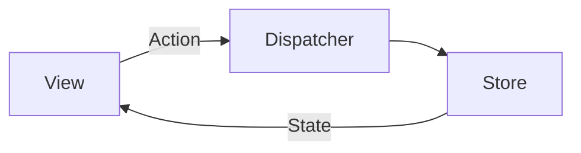
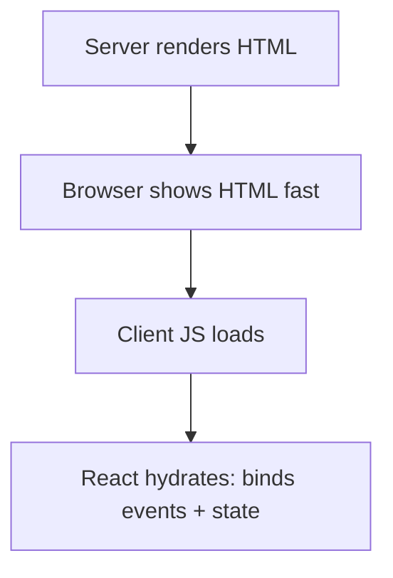
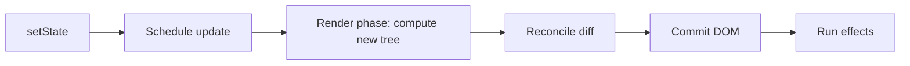

# ⚛️ React: 50 Interview Questions — Ultimate Beginner‑Friendly Guide

> Goal: **Simple definitions + interview points + small working snippets**.  
> Best use: read once end‑to‑end, then revise section‑wise before interviews.

---

## How to use this guide (fast)
- **First pass (60–90 min):** Read headings + One‑liners only.
- **Second pass (2–3 hrs):** Read bullets + type the snippets yourself.
- **Before interview (15 min):** Read the **Cheat Sheet + Tips** at the end.

---

## Table of Contents (Grouped)

- **A. Fundamentals** (Q1–Q4)
- **B. Lists & Keys** (Q5–Q6)
- **C. Forms** (Q7)
- **D. Context & Data Flow** (Q8, Q32, Q35, Q43)
- **E. Hooks** (Q9–Q18)
- **F. Rendering & Component Behavior** (Q19–Q23)
- **G. Errors, Refs, Portals** (Q20–Q24, Q27)
- **H. Testing, Debugging, StrictMode** (Q25, Q28–Q29)
- **I. i18n, Code Splitting, Performance** (Q30–Q33, Q31)
- **J. Architecture & Patterns** (Q33–Q34, Q39, Q41–Q42, Q44)
- **K. Data Fetching** (Q36, Q40)
- **L. SSR / SSG / Hydration** (Q26, Q37–Q38)
- **M. React Internals** (Q45–Q48)
- **N. Suspense** (Q49)
- **O. useState Update Pipeline** (Q50)
- **Cheat Sheet + Tips** (end)

---

# A) Fundamentals

## Q1) What is React? Describe the benefits of React.

**One‑liner:** React is a **declarative UI library** for building interfaces using **components** and **state-driven rendering**.

**Interview points**
- **Declarative:** you describe UI for a state; React updates DOM.
- **Component-based:** small reusable pieces.
- **One-way data flow:** predictable state → UI.
- Big ecosystem (Router, Next.js, Redux Toolkit, Query libs).

**Mini snippet**
```jsx
function Greeting({ name }) {
  return <h1>Hello, {name}</h1>;
}
```

---

## Q2) What’s the difference between React Node, React Element, and React Component?

**One‑liner**
- **React Node:** anything renderable (element, string, number, null, array).
- **React Element:** immutable object describing UI (`type` + `props`).
- **React Component:** function/class that returns React nodes/elements.

**Snippet**
```jsx
// React Node examples:
const node1 = "text";
const node2 = 123;
const node3 = null;
const node4 = <div />; // element (also a node)

// Component:
function Box() { return <div>Hi</div>; } // returns a node
```

---

## Q3) What is JSX and how does it work?

**One‑liner:** JSX is syntax sugar that compiles into `React.createElement(...)` calls.

**Interview points**
- JSX isn’t HTML; it becomes JS objects.
- `className` instead of `class`.
- You can embed JS expressions with `{}`.

**Snippet**
```jsx
const el = <button className="btn">Click</button>;

// roughly becomes:
const el2 = React.createElement("button", { className: "btn" }, "Click");
```

---

## Q4) What is the difference between state and props in React?

**One‑liner:** **Props** are read-only inputs from parent; **state** is component’s internal data that can change and cause re-render.

**Interview points**
- Props flow **down**.
- State is managed **inside** (or in external store).
- When state changes → component re-renders.

**Snippet**
```jsx
import { useState } from "react";

function Child({ title }) { return <h2>{title}</h2>; }

export default function Parent() {
  const [title, setTitle] = useState("Hello");
  return (
    <>
      <Child title={title} />
      <button onClick={() => setTitle("Updated")}>Change</button>
    </>
  );
}
```

---

# B) Lists & Keys

## Q5) What is the purpose of the `key` prop in React?

**One‑liner:** Keys help React **match list items across renders** to update the correct DOM nodes and preserve component state.

**Interview points**
- Key = identity (not index).
- Stable unique key reduces bugs + improves diffing.

**Snippet**
```jsx
{items.map(item => (
  <ListRow key={item.id} item={item} />
))}
```

---

## Q6) Consequence of using array indices as keys?

**One‑liner:** Index keys break identity when items are inserted/removed/reordered → wrong DOM reused, wrong state sticking to wrong row.

**Classic bug example**
```jsx
// ❌ index key (can break on reorder/delete)
{items.map((item, i) => <Row key={i} item={item} />)}
```

**When index key is OK**
- List is static, never reordered/filtered, and never changes.

---

# C) Forms

## Q7) Controlled vs Uncontrolled components?

**One‑liner**
- **Controlled:** React state is the source of truth (`value` + `onChange`).
- **Uncontrolled:** DOM keeps the value; you read it via `ref`.

**Controlled snippet**
```jsx
import { useState } from "react";
export default function Controlled() {
  const [v, setV] = useState("");
  return <input value={v} onChange={e => setV(e.target.value)} />;
}
```

**Uncontrolled snippet**
```jsx
import { useRef } from "react";
export default function Uncontrolled() {
  const ref = useRef(null);
  return (
    <>
      <input ref={ref} />
      <button onClick={() => alert(ref.current.value)}>Read</button>
    </>
  );
}
```

---

# D) Context & Data Flow

## Q8) Pitfalls of using context in React?

**One‑liner:** Context can cause **wide re-renders** and become a “global dump” if overused.

**Pitfalls**
- Any provider value change triggers all consumers re-render.
- Putting large objects in context causes frequent changes.
- Harder to test/trace if used for everything.

**Mitigation**
- Split contexts (ThemeContext, AuthContext, etc.).
- Memoize provider value (`useMemo`).
- Prefer server-cache libs for API data (React Query / RTK Query).

---

## Q32) Optimize context performance to reduce rerenders?

**One‑liner:** Reduce provider value changes + reduce consumer subscriptions.

**Techniques**
- `useMemo` provider value.
- Split context into multiple contexts.
- Store stable functions with `useCallback`.
- For advanced cases: selector-based context (`use-context-selector` style approach).

**Snippet**
```jsx
const value = useMemo(() => ({ user, setUser }), [user]);
return <AuthContext.Provider value={value}>{children}</AuthContext.Provider>;
```

---

## Q35) Explain one-way data flow and its benefits.

**One‑liner:** Data flows **parent → child** via props; child requests changes via callbacks/events.

**Benefits**
- Predictable state ownership.
- Easier debugging (who owns data?).
- Easier to reason about UI updates.

**Snippet**
```jsx
function Child({ onInc }) { return <button onClick={onInc}>+1</button>; }

function Parent() {
  const [n, setN] = useState(0);
  return <Child onInc={() => setN(x => x + 1)} />;
}
```

---

## Q43) How do you decide between state, context, and external state managers?

**One‑liner:** Use the smallest tool that fits the scope of sharing + complexity.

**Rule of thumb**
- `useState`: local UI state (inputs, toggles, modal open).
- `Context`: cross-cutting concerns (theme, auth session, locale).
- Redux/Zustand: large app global state, many writers/readers, devtools.
- React Query/RTK Query: server data (caching, retries, dedupe).

---

# E) Hooks

## Q9) Benefits of using hooks in React?

**One‑liner:** Hooks let function components use state/effects, and help reuse stateful logic via custom hooks.

**Benefits**
- Less boilerplate than classes.
- Reusable logic (custom hooks).
- Clear separation of concerns.

---

## Q10) Rules of hooks?

**One‑liner:** Hooks must be called **at top-level** of React functions, **not** inside loops/conditions, and only from components/custom hooks.

**Why**
React matches hooks by call order.

---

## Q11) `useEffect` vs `useLayoutEffect`?

**One‑liner**
- `useEffect`: runs after paint (non-blocking).
- `useLayoutEffect`: runs before paint (blocks painting) → for DOM measurement.

**Snippet**
```jsx
useEffect(() => { /* fetch, subscriptions */ }, []);
useLayoutEffect(() => { /* measure DOM */ }, []);
```

---

## Q12) Purpose of callback function argument format of `setState()`?

**One‑liner:** Use functional updates when next state depends on previous state (avoids stale values).

**Snippet**
```jsx
setCount(prev => prev + 1); // ✅ safe
```

**Class version**
```jsx
this.setState(prev => ({ counter: prev.counter + 1 }));
```

---

## Q13) What does the dependency array of `useEffect` affect?

**One‑liner:** It controls when the effect runs.

- No array: runs after every render.
- `[]`: runs once (mount) + cleanup on unmount.
- `[a,b]`: runs when a or b changes.

**Snippet**
```jsx
useEffect(() => { /* runs when userId changes */ }, [userId]);
```

---

## Q14) `useRef` — what is it and when to use?

**One‑liner:** `useRef` stores a mutable value across renders **without** causing re-render.

**Use cases**
- Access DOM node (focus, measure).
- Store timer id / latest value.

**Snippet**
```jsx
const inputRef = useRef(null);
<button onClick={() => inputRef.current?.focus()}>Focus</button>
```

---

## Q15) `useCallback` — when to use?

**One‑liner:** It memoizes a function reference so memoized children don’t re-render due to new function identity.

**Snippet**
```jsx
const onSave = useCallback(() => save(id), [id]);
```

**When it matters**
- Passing callbacks to `React.memo` children.
- Dependencies of other hooks.

---

## Q16) `useMemo` — when to use?

**One‑liner:** It memoizes a computed value to avoid expensive recalculation.

**Snippet**
```jsx
const filtered = useMemo(() => items.filter(x => x.q === q), [items, q]);
```

**Don’t overuse**
Only for expensive work or stable references.

---

## Q17) `useReducer` — when to use?

**One‑liner:** Great for complex state transitions with many actions (like mini Redux inside a component).

**Snippet**
```jsx
function reducer(state, action) {
  switch (action.type) {
    case "inc": return { ...state, count: state.count + 1 };
    default: return state;
  }
}
const [state, dispatch] = useReducer(reducer, { count: 0 });
```

---

## Q18) `useId` — when to use?

**One‑liner:** Generates stable unique IDs for accessibility (label ↔ input) across SSR + hydration.

**Snippet**
```jsx
import { useId } from "react";
function Field() {
  const id = useId();
  return <>
    <label htmlFor={id}>Name</label>
    <input id={id} />
  </>;
}
```

---

# F) Rendering & Component Behavior

## Q19) What does re-rendering mean?

**One‑liner:** Re-render means React re-runs your component function to compute the next UI tree.

**Important**
- Render ≠ DOM update every time.
- React reconciles then commits minimal DOM changes.

**Snippet**
```jsx
console.log("render");
return <div>{count}</div>;
```

---

## Q20) React Fragments — what are they used for?

**One‑liner:** Group multiple elements without adding extra DOM wrapper.

**Snippet**
```jsx
return (
  <>
    <Header />
    <Content />
  </>
);
```

---

## Q21) `forwardRef()` — what is it used for?

**One‑liner:** Forward a `ref` through a component to a child DOM node (or expose imperative APIs).

**Snippet**
```jsx
import { forwardRef } from "react";
const Input = forwardRef((props, ref) => <input ref={ref} {...props} />);
```

---

## Q22) How do you reset a component’s state?

**One‑liner:** Set state back to initial value, or remount by changing `key`.

**Reset state**
```jsx
const initial = { name: "", age: 0 };
const [form, setForm] = useState(initial);
<button onClick={() => setForm(initial)}>Reset</button>
```

**Force remount**
```jsx
<MyForm key={version} />
```

---

## Q23) Why does React recommend against mutating state?

**One‑liner:** React relies on reference changes to detect updates; mutation can hide changes and break memoization.

**Bad**
```jsx
state.items.push(x);
setState(state); // ❌ same reference
```

**Good**
```jsx
setState(prev => ({ ...prev, items: [...prev.items, x] }));
```

---

# G) Errors, Portals, Boundaries

## Q24) What are error boundaries for?

**One‑liner:** Catch render-time errors in a subtree and show fallback UI instead of crashing entire app.

**Key details**
- Only class components can be error boundaries.
- Doesn’t catch async errors (promises/events) automatically.

**Snippet (minimal)**
```jsx
class ErrorBoundary extends React.Component {
  state = { hasError: false };
  static getDerivedStateFromError() { return { hasError: true }; }
  componentDidCatch(err) { console.error(err); }
  render() { return this.state.hasError ? <h3>Oops</h3> : this.props.children; }
}
```

---

## Q27) What are React Portals used for?

**One‑liner:** Render children into a DOM node outside parent hierarchy (modals/tooltips).

**Snippet**
```jsx
import { createPortal } from "react-dom";

function Modal({ open, children }) {
  if (!open) return null;
  return createPortal(
    <div className="backdrop">{children}</div>,
    document.body
  );
}
```

---

# H) Testing, Debugging, StrictMode

## Q25) How do you test React applications?

**One‑liner:** Use unit/integration tests (Jest + React Testing Library) and E2E tests (Cypress/Playwright).

**RTL example**
```jsx
// pseudo example
render(<Button />);
fireEvent.click(screen.getByText("Save"));
expect(screen.getByText("Saved")).toBeInTheDocument();
```

---

## Q28) How do you debug React applications?

**One‑liner:** React DevTools + browser devtools + clear logging + profiler.

**Checklist**
- React DevTools: components, props/state, rerenders.
- Breakpoints in browser.
- Network tab for API.
- Profiler for performance.

---

## Q29) What is StrictMode and benefits?

**One‑liner:** StrictMode is dev-only checks to reveal unsafe patterns and side effects.

**What it does (React 18 dev)**
- Intentionally double-invokes certain lifecycles/effects to detect issues.
- Helps you write “future-ready” components.

---

# I) i18n, Code Splitting, Performance

## Q30) How do you localize React applications?

**One‑liner:** Use `react-i18next`/`react-intl` with translation dictionaries and language switching.

**Snippet**
```jsx
// concept example
const t = (key) => dict[lang][key] || key;
<p>{t("welcome")}</p>
```

---

## Q31) What is code splitting?

**One‑liner:** Split JS into chunks loaded on demand to reduce initial load time.

**Snippet**
```jsx
import { lazy, Suspense } from "react";
const Settings = lazy(() => import("./Settings"));

<Suspense fallback={<p>Loading…</p>}>
  <Settings />
</Suspense>
```

---

## Q33) Higher Order Components (HOC) — what are they?

**One‑liner:** A function that takes a component and returns an enhanced component.

**Snippet**
```jsx
const withAuth = (Comp) => (props) =>
  localStorage.getItem("token") ? <Comp {...props} /> : <p>Login</p>;
```

---

# J) Architecture & Patterns

## Q34) Flux pattern and benefits?

**One‑liner:** Flux enforces unidirectional data flow: action → dispatcher → store → view.

**Benefits**
- Predictable state transitions.
- Easier debugging.
- Foundation for Redux ideas.

**Diagram**


---

## Q39) Presentational vs Container component pattern?

**One‑liner:** Presentational = UI-only; Container = data + logic.

**Snippet**
```jsx
function UserCard({ user }) { return <h3>{user.name}</h3>; } // presentational
function UserCardContainer() { /* fetch user */ return <UserCard user={user} />; }
```

---

## Q41) Render props — what are they for?

**One‑liner:** Share logic by passing a function that returns UI.

**Snippet**
```jsx
function Fetcher({ url, children }) {
  const [data, setData] = useState(null);
  useEffect(() => { fetch(url).then(r=>r.json()).then(setData); }, [url]);
  return children(data);
}

<Fetcher url="/api/user">
  {(data) => data ? <pre>{JSON.stringify(data)}</pre> : "Loading"}
</Fetcher>
```

---

## Q42) React anti-patterns?

**One‑liner:** Practices that make code buggy, slow, or hard to maintain.

**Common anti-patterns**
- Mutating state directly.
- Using index as key in dynamic lists.
- Doing side effects during render.
- God components (huge components doing everything).
- Overusing context for all state.

---

## Q44) Composition pattern in React?

**One‑liner:** Build complex UIs by composing smaller components (preferred over inheritance).

**Snippet**
```jsx
function Card({ children }) { return <div className="card">{children}</div>; }
function Page() {
  return (
    <Card>
      <h2>Title</h2>
      <p>Body</p>
    </Card>
  );
}
```

---

# K) Data Fetching

## Q36) Handle asynchronous data loading?

**One‑liner:** Fetch in effects, manage loading/error states, cancel on unmount, and cache when possible.

**Snippet**
```jsx
useEffect(() => {
  let cancelled = false;
  setLoading(true);

  fetch(url)
    .then(r => r.json())
    .then(data => { if (!cancelled) setData(data); })
    .catch(err => { if (!cancelled) setError(err); })
    .finally(() => { if (!cancelled) setLoading(false); });

  return () => { cancelled = True; }; // concept (JS uses true)
}, [url]);
```

*(In real code use AbortController / a data fetching library.)*

---

## Q40) Common pitfalls when doing data fetching?

**One‑liner:** Most bugs come from missing cleanup, missing loading/error UI, and duplicate calls.

**Pitfalls**
- Setting state after unmount.
- Race conditions: old request returns later and overwrites new data.
- Missing retry/backoff.
- Fetching in render (wrong).

---

# L) SSR / SSG / Hydration

## Q26) What is hydration?

**One‑liner:** Hydration is attaching React event handlers/state to server-rendered HTML to make it interactive.

**Diagram**


---

## Q37) Server-side rendering (SSR) and benefits?

**One‑liner:** SSR renders HTML on server per request, improving first paint and SEO.

**Benefits**
- Better SEO (content in HTML).
- Faster initial load on slow devices.
- Still needs hydration cost.

---

## Q38) Static generation (SSG) and benefits?

**One‑liner:** SSG prebuilds pages at build time and serves from CDN.

**Benefits**
- Extremely fast.
- Cheap and scalable.
- Great for marketing/blog pages.

---

# M) React Internals

## Q45) What is Virtual DOM?

**One‑liner:** In-memory representation of UI tree used for diffing before touching real DOM.

---

## Q46) How does Virtual DOM work? Benefits and downsides?

**One‑liner:** React creates a new tree on state change, diffs with old tree (reconciliation), and commits minimal DOM updates.

**Benefits**
- Efficient DOM mutations.
- Declarative programming model.

**Downsides**
- Extra work to build trees (still usually worth it).
- Not automatically fast if you render huge trees unnecessarily.

---

## Q47) What is React Fiber and why better than older approach?

**One‑liner:** Fiber is the scheduling architecture that lets React split rendering work, pause/resume, and prioritize updates.

**Why it matters**
- Keeps UI responsive during heavy work.
- Enables Concurrent features.

---

## Q48) What is reconciliation in React?

**One‑liner:** Reconciliation is the diffing process between old and new element trees to compute minimal updates.

**Key detail**
- Keys are crucial in list reconciliation.

---

# N) Suspense

## Q49) What is React Suspense and what does it enable?

**One‑liner:** Suspense lets you show fallback UI while waiting for something (code/data) and coordinate loading states.

**Most common use today**
- Code splitting with `React.lazy`.

**Snippet**
```jsx
const Page = React.lazy(() => import("./Page"));
<Suspense fallback={<p>Loading…</p>}><Page /></Suspense>
```

---

# O) useState Update Pipeline

## Q50) What happens when the `useState` setter is called?

**One‑liner:** It schedules a state update → React queues a re-render → runs reconciliation → commits minimal DOM updates → runs effects.

**Mental model**


**Interview note**
- Updates are often **batched** (especially in React 18).
- Use functional updates when based on previous value.

---

# Cheat Sheet (Memorize These)

- **Re-render:** component function runs again.
- **Effect:** side effect after commit.
- **Key:** identity across list renders.
- **Props:** inputs; **State:** memory.
- **Context:** shared values; watch rerenders.
- **Memo:** reduce unnecessary work (not default).
- **SSR:** server HTML; **Hydration:** make it interactive.
- **Fiber:** scheduling; **Reconciliation:** diff.

---

# Tips & Tricks to Learn Faster (and answer like a pro)

### 1) Best answer structure (always)
**One-liner → 3 bullets → tiny example → 1 pitfall → 1 tradeoff.**

### 2) Learn React in one sentence
> “UI = f(state, props). State changes re-run f, React updates DOM efficiently.”

### 3) Practice 5 mini-projects (guaranteed interview impact)
1. Debounced search  
2. Infinite scroll (IntersectionObserver)  
3. Modal (Portal)  
4. Auth + protected routes  
5. Todo with `useReducer`

### 4) Talk like a senior
Add one line in each answer:
- “I watch for rerenders.”
- “I clean up effects.”
- “I avoid mutation.”
- “I prefer composition.”

---

✅ If you can explain each Q in this guide confidently (with the snippet), you’re interview-ready.
