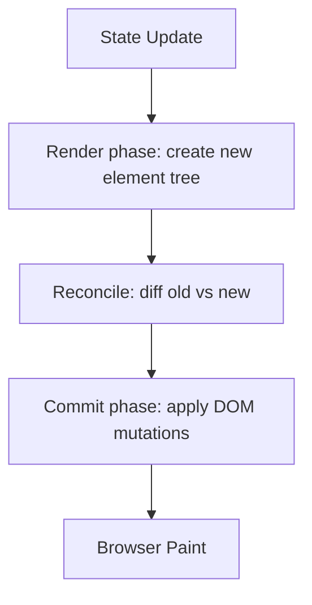

# ⚛️ React Ultimate Interview Guide (Beginner → Crack Any Interview)

> Built from your YouTube topic list + structured like a **revision-friendly interview notebook**.  
> Goal: **clear concepts + working snippets + “what to say in interview”**.

---

## 📌 How to use this file (fastest way)
- **Day 1:** Read Sections 1–6 (Core + Rendering + Lists + Components)
- **Day 2:** Read Sections 7–11 (Hooks)
- **Day 3:** Read Sections 12–15 (Custom Hooks + Routing + Redux)
- **Day 4:** Read Sections 16–22 (Performance + SSR/CSR + Web Vitals + A11y + Patterns)
- **Before interview:** Read **Cheatsheet + Most Asked Qs + Practical Questions**.

---

## 📖 Table of Contents

1. [Show me the real React](#1-show-me-the-real-react)  
2. [How React works under the hood](#2-how-react-works-under-the-hood)  
3. [Rendering process](#3-rendering-process)  
4. [Most asked interview questions](#4-most-asked-interview-questions)  
5. [Rendering lists & conditional operators](#5-rendering-lists--conditional-operators)  
6. [map / filter / reduce in React](#6-map-filter-reduce-in-react)  
7. [All about components](#7-all-about-components)  
8. [Class-ic React vs Functional components](#8-class-ic-react-vs-functional-components)  
9. [State vs Props](#9-state-vs-props-in-components)  
10. [Different types of components](#10-different-types-of-components)  
11. [React hooks interview pack](#11-react-hooks-interview-pack)  
12. [useState](#12-usestate)  
13. [useEffect + polyfill + mistakes](#13-useeffect-hook--polyfill--mistakes)  
14. [useRef](#14-useref)  
15. [useContext](#15-usecontext)  
16. [Light & Dark Mode implementation](#16-light--dark-mode-implementation)  
17. [useReducer](#17-usereducer)  
18. [useMemo & useCallback + useMemo polyfill](#18-usememo--usecallback--usememo-polyfill)  
19. [useImperativeHandle](#19-useimperativehandle)  
20. [Custom hooks interview questions + What are custom hooks](#20-custom-hooks)  
21. [useWindowSize / useFetch / useDebounce / useLocalStorage / useIntersectionObserver](#21-custom-hook-library-working-examples)  
22. [Routing in React + React Router DOM project](#22-routing-in-react--react-router-dom-mini-project)  
23. [Advance state management (Redux)](#23-advanced-state-management-redux)  
24. [Redux interview questions](#24-redux-interview-questions)  
25. [Redux Toolkit implementation](#25-redux-toolkit-implementation-rtk)  
26. [Popular performance optimizations](#26-popular-performance-optimizations)  
27. [React Profiler](#27-react-profiler)  
28. [SSR vs CSR](#28-ssr-vs-csr)  
29. [Web Vitals](#29-web-vitals)  
30. [Virtualisation](#30-virtualisation)  
31. [Code splitting](#31-code-splitting)  
32. [Accessibility](#32-accessibility-a11y)  
33. [Popular design patterns](#33-popular-design-patterns)  
34. [HOC pattern](#34-hoc-pattern)  
35. [Module pattern](#35-module-pattern)  
36. [Render props pattern](#36-render-props-pattern)  
37. [Error boundaries](#37-error-boundaries)  
38. [Practical interview questions](#38-practical-interview-questions)  
39. [Cheatsheet + memory tricks](#39-cheatsheet--memory-tricks)  
40. [Tips & tricks to learn faster](#40-tips--tricks-to-learn-faster)

---

# 1) Show me the real React

### 🔑 One-liner
> React is a **UI library** where you build UI using **components**, and React keeps UI synced with state using a predictable **render → reconcile → commit** cycle.

### ✅ What interviewers want to hear
- React is **declarative**: you describe *what UI should look like* for a given state.
- UI updates happen by **re-rendering components** (re-running function components), not manually editing DOM.
- React’s “secret sauce” is **reconciliation** (diff old vs new UI description).

### ⚡ JSX is just syntax sugar
JSX compiles to `React.createElement(...)`.

```jsx
// JSX:
const el = <h1 className="title">Hello</h1>;

// Roughly becomes:
const el2 = React.createElement("h1", { className: "title" }, "Hello");
```

### 📌 React Element vs Component
- **Element:** plain object describing UI (`{type, props}`) — *what to render*
- **Component:** function/class that returns elements — *how to build UI*

```jsx
function Hello() {            // component
  return <h1>Hello</h1>;      // returns element
}
```

---

# 2) How React works under the hood

### 🔑 One-liner
> React builds a tree of elements in memory, compares it with the previous tree (diff), and updates only the changed parts in the real DOM.

### 🧠 Virtual DOM (correct understanding)
Virtual DOM is a **concept**: React represents UI in memory. Performance comes from:
- Minimizing DOM work
- Batching updates
- Smart reconciliation + scheduling (Fiber)

### 🧵 Fiber (React 16+)
Fiber is React’s internal engine that:
- breaks work into units
- can pause/resume work
- prioritizes urgent updates (like typing/click)

### Diagram (mental model)


---

# 3) Rendering process

### 🔑 One-liner
> Render phase builds “what UI should be” and must be pure; commit phase applies changes to DOM and runs effects.

### ✅ Two phases (important!)
1) **Render phase**
- React calls your function components
- Computes next UI tree
- Must be **pure** (no side effects)

2) **Commit phase**
- React updates DOM
- Runs **layout effects** then **effects**

### 🔥 React 18 important interview points
- **Automatic batching:** multiple state updates in same event are batched into 1 render
- **StrictMode in dev** may run effects twice (to detect unsafe side effects)

### Example: render vs effect
```jsx
import { useEffect, useState } from "react";

export default function Demo() {
  const [count, setCount] = useState(0);

  console.log("Render:", count); // runs during render (every re-render)

  useEffect(() => {
    console.log("Effect:", count); // runs after DOM commit
  }, [count]);

  return <button onClick={() => setCount(c => c + 1)}>Count {count}</button>;
}
```

---

# 4) Most asked interview questions

### ✅ Quick-fire (say these first, then expand)
1) **What is React?**  
   React is a declarative UI library based on components and state-driven rendering.

2) **What triggers re-render?**  
   State update, prop change, context value change, parent re-render (child may re-render).

3) **Virtual DOM?**  
   In-memory representation of UI; React diffs trees to compute minimal DOM updates.

4) **Why keys in lists?**  
   To help React identify items across renders, avoid wrong DOM reuse/state bugs.

5) **useEffect vs useLayoutEffect?**  
   `useLayoutEffect` runs before paint (sync). `useEffect` runs after paint (async-ish).

6) **Controlled vs uncontrolled inputs?**  
   Controlled uses React state as source of truth; uncontrolled uses DOM state via refs.

7) **React.memo?**  
   Prevents re-render if props are shallow-equal (but re-renders if prop references change).

8) **useMemo/useCallback?**  
   Cache computed values / function references to reduce useless work (optimize, not default).

9) **Prop drilling?**  
   Passing props through many layers; solved by Context, Redux, composition.

10) **SSR vs CSR?**  
   SSR renders HTML on server for faster first paint & SEO; CSR renders on client after JS loads.

---

# 5) Rendering lists & conditional operators

### 🔑 One-liner
> Lists are rendered using `.map()` and conditionals using `&&`, ternary, early return, or `switch`.

## 5.1 Rendering lists (with keys)
```jsx
const users = [
  { id: 1, name: "Alice" },
  { id: 2, name: "Bob" },
];

export default function ListDemo() {
  return (
    <ul>
      {users.map(u => (
        <li key={u.id}>{u.name}</li>
      ))}
    </ul>
  );
}
```

### ✅ Key rule
- Use **stable unique keys** (id)
- Avoid index as key if list can reorder/delete (causes UI/state bugs)

## 5.2 Conditional rendering patterns
```jsx
function Status({ loading, error, user }) {
  if (loading) return <p>Loading...</p>;         // early return
  if (error) return <p>Error!</p>;

  return (
    <div>
      {user ? <h3>Hello {user.name}</h3> : <h3>Guest</h3>} {/* ternary */}
      {user?.isAdmin && <span>Admin</span>}               {/* && */}
      <p>{user?.bio || "No bio"}</p>                      {/* || fallback */}
      <p>City: {user?.city ?? "Unknown"}</p>              {/* ?? nullish */}
    </div>
  );
}
```

### ⚠️ Common gotcha
```jsx
// ❌ This renders "0" when count=0
{count && <Badge />}

// ✅ Fix
{count > 0 && <Badge />}
```

---

# 6) map / filter / reduce in React

### 🔑 One-liner
> `map` renders/transform lists, `filter` selects items, `reduce` aggregates into single value or object.

## 6.1 map (render list)
```jsx
{items.map(item => <Row key={item.id} item={item} />)}
```

## 6.2 filter + map (render filtered list)
```jsx
{items
  .filter(i => i.active)
  .map(i => <Row key={i.id} item={i} />)}
```

## 6.3 reduce (total, grouping)
```jsx
const total = cart.reduce((sum, item) => sum + item.price * item.qty, 0);

const grouped = items.reduce((acc, item) => {
  (acc[item.category] ||= []).push(item);
  return acc;
}, {});
```

---

# 7) All about components

### 🔑 One-liner
> Components are reusable UI blocks. They receive props and return elements.

### ✅ Component rules
- Must start with Capital letter (`MyComponent`)
- Must return JSX (or `null`)
- Pure render: don’t do side effects during render

### ✅ Controlled component example (forms)
```jsx
import { useState } from "react";

export default function ControlledInput() {
  const [name, setName] = useState("");

  return (
    <div>
      <input value={name} onChange={e => setName(e.target.value)} />
      <p>Typed: {name}</p>
    </div>
  );
}
```

---

# 8) Class-ic React vs Functional components

### 🔑 One-liner
> Class components use `this.state` + lifecycle methods; functional components use hooks (`useState`, `useEffect`) and are the modern default.

### ✅ Interview comparison table
| Topic | Functional | Class |
|---|---|---|
| State | `useState` | `this.state` / `this.setState` |
| Side effects | `useEffect` | `componentDidMount/Update/WillUnmount` |
| Boilerplate | Low | High |
| Modern standard | ✅ Yes | Legacy (know basics) |

### Minimal class example (for interview)
```jsx
import React from "react";

class Counter extends React.Component {
  state = { count: 0 };

  componentDidMount() {
    document.title = `Count ${this.state.count}`;
  }

  componentDidUpdate() {
    document.title = `Count ${this.state.count}`;
  }

  render() {
    return (
      <button onClick={() => this.setState({ count: this.state.count + 1 })}>
        Count {this.state.count}
      </button>
    );
  }
}
```

---

# 9) State vs Props in components

### 🔑 One-liner
> Props are **read-only inputs** from parent; state is **internal mutable data** that triggers re-renders.

### ✅ Typical interview explanation
- Props = function arguments
- State = component memory

```jsx
import { useState } from "react";

function Child({ title }) {     // title is prop
  return <h2>{title}</h2>;
}

export default function Parent() {
  const [title, setTitle] = useState("Hello"); // state

  return (
    <>
      <Child title={title} />
      <button onClick={() => setTitle("Updated")}>Change</button>
    </>
  );
}
```

---

# 10) Different types of components

### 🔑 One-liner
> Components can be classified by responsibility and how they manage logic.

### Types to mention in interview
- **Presentational** (UI-only) vs **Container** (data/logic)
- **Controlled** vs **Uncontrolled** (forms)
- **Pure** components (same input → same output)
- **Higher-order components** / **Render props** (patterns)
- **Layout** components (page shells, wrappers)

---

# 11) React hooks interview pack

### 🔑 One-liner
> Hooks are functions that let you use React features (state, effects, context, refs) in functional components.

### ✅ Hook rules
- Call hooks at top level (not in loops/conditions)
- Only call hooks in React functions (components/custom hooks)
- Hook names must start with `use...`

---

# 12) useState

### 🔑 One-liner
> `useState` gives a component local state. Setter triggers a re-render; use functional update when next state depends on previous.

### ✅ Working example: counter + safe updates
```jsx
import { useState } from "react";

export default function Counter() {
  const [count, setCount] = useState(0);

  const addTwo = () => {
    setCount(c => c + 1);
    setCount(c => c + 1);
  };

  return (
    <div>
      <p>Count: {count}</p>
      <button onClick={() => setCount(c => c + 1)}>+1</button>
      <button onClick={addTwo}>+2</button>
    </div>
  );
}
```

### ⚠️ Don’t mutate state
```jsx
// ❌ Wrong (mutation)
items.push(newItem);
setItems(items);

// ✅ Right (new reference)
setItems(prev => [...prev, newItem]);
```

---

# 13) useEffect hook + polyfill + mistakes

### 🔑 One-liner
> `useEffect` runs side effects after render. Dependency array decides when it runs. Cleanup runs on unmount or before next effect.

## 13.1 Patterns
```jsx
useEffect(() => { /* runs after every render */ });

useEffect(() => { /* runs once on mount */ }, []);

useEffect(() => { /* runs when count changes */ }, [count]);

useEffect(() => {
  const id = setInterval(() => {}, 1000);
  return () => clearInterval(id);       // cleanup
}, []);
```

## 13.2 Working example: fetch with cleanup
```jsx
import { useEffect, useState } from "react";

export default function User({ userId }) {
  const [user, setUser] = useState(null);

  useEffect(() => {
    let cancelled = false;

    async function run() {
      const res = await fetch(`https://jsonplaceholder.typicode.com/users/${userId}`);
      const data = await res.json();
      if (!cancelled) setUser(data);
    }

    run();
    return () => { cancelled = true; };
  }, [userId]);

  return <pre>{user ? JSON.stringify(user, null, 2) : "Loading..."}</pre>;
}
```

## 13.3 useEffect “polyfill” mapping to class lifecycles
```jsx
// useEffect(fn, [])           ~ componentDidMount
// useEffect(fn, [x])          ~ componentDidUpdate when x changes
// useEffect(() => cleanup, [])~ componentWillUnmount
```

## 13.4 Common mistakes
- ❌ Async directly in effect: `useEffect(async () => ...)`
- ❌ Missing deps → stale values
- ❌ Objects/arrays in deps that recreate every render (useMemo or move outside)

---

# 14) useRef

### 🔑 One-liner
> `useRef` stores a mutable value that persists across renders without causing re-renders—great for DOM access and timers.

## 14.1 DOM focus example
```jsx
import { useRef } from "react";

export default function Focus() {
  const inputRef = useRef(null);

  return (
    <div>
      <input ref={inputRef} placeholder="Type..." />
      <button onClick={() => inputRef.current?.focus()}>Focus</button>
    </div>
  );
}
```

## 14.2 Store interval id (no re-render)
```jsx
import { useEffect, useRef, useState } from "react";

export default function Timer() {
  const [sec, setSec] = useState(0);
  const idRef = useRef(null);

  const start = () => {
    if (idRef.current) return;
    idRef.current = setInterval(() => setSec(s => s + 1), 1000);
  };

  const stop = () => {
    clearInterval(idRef.current);
    idRef.current = null;
  };

  useEffect(() => () => stop(), []);

  return (
    <div>
      <p>{sec}s</p>
      <button onClick={start}>Start</button>
      <button onClick={stop}>Stop</button>
    </div>
  );
}
```

---

# 15) useContext

### 🔑 One-liner
> `useContext` shares data across the component tree without prop drilling. Every consumer re-renders when the context value changes.

### Working example: Theme context
```jsx
import { createContext, useContext, useMemo, useState } from "react";

const ThemeContext = createContext(null);

export function ThemeProvider({ children }) {
  const [theme, setTheme] = useState("light");

  const value = useMemo(() => ({
    theme,
    toggle: () => setTheme(t => (t === "light" ? "dark" : "light"))
  }), [theme]);

  return (
    <ThemeContext.Provider value={value}>
      <div style={{
        background: theme === "dark" ? "#111" : "#fff",
        color: theme === "dark" ? "#fff" : "#111",
        minHeight: "100vh",
        padding: 16
      }}>
        {children}
      </div>
    </ThemeContext.Provider>
  );
}

export function useTheme() {
  const ctx = useContext(ThemeContext);
  if (!ctx) throw new Error("useTheme must be used inside ThemeProvider");
  return ctx;
}

export function ThemeButton() {
  const { theme, toggle } = useTheme();
  return <button onClick={toggle}>Theme: {theme}</button>;
}
```

---

# 16) Light & Dark Mode Implementation

### 🔑 One-liner
> Theme is just state + CSS variables. Persist theme using localStorage and apply class/data attribute at root.

### Working version (localStorage + data-theme)
```jsx
import { useEffect, useState } from "react";

export default function ThemeApp() {
  const [theme, setTheme] = useState(() => localStorage.getItem("theme") || "light");

  useEffect(() => {
    localStorage.setItem("theme", theme);
    document.documentElement.dataset.theme = theme; // <html data-theme="dark">
  }, [theme]);

  return (
    <div>
      <button onClick={() => setTheme(t => (t === "light" ? "dark" : "light"))}>
        Toggle
      </button>
      <p>Theme is: {theme}</p>
    </div>
  );
}
```

**CSS (example)**
```css
:root[data-theme="light"] { --bg: #fff; --text: #111; }
:root[data-theme="dark"]  { --bg: #111; --text: #fff; }

body { background: var(--bg); color: var(--text); }
```

---

# 17) useReducer

### 🔑 One-liner
> `useReducer` is for complex state transitions (many actions). Reducer is a pure function: `(state, action) -> newState`.

### Working example: todo reducer
```jsx
import { useReducer, useState } from "react";

function reducer(state, action) {
  switch (action.type) {
    case "add":
      return [...state, { id: Date.now(), text: action.text, done: false }];
    case "toggle":
      return state.map(t => t.id === action.id ? { ...t, done: !t.done } : t);
    case "remove":
      return state.filter(t => t.id !== action.id);
    default:
      return state;
  }
}

export default function TodoReducer() {
  const [text, setText] = useState("");
  const [todos, dispatch] = useReducer(reducer, []);

  return (
    <div>
      <input value={text} onChange={e => setText(e.target.value)} />
      <button onClick={() => { if (text.trim()) dispatch({ type: "add", text }); setText(""); }}>
        Add
      </button>

      {todos.map(t => (
        <div key={t.id}>
          <input type="checkbox" checked={t.done} onChange={() => dispatch({ type: "toggle", id: t.id })} />
          <span style={{ textDecoration: t.done ? "line-through" : "none" }}>{t.text}</span>
          <button onClick={() => dispatch({ type: "remove", id: t.id })}>X</button>
        </div>
      ))}
    </div>
  );
}
```

---

# 18) useMemo & useCallback + useMemo polyfill

## 18.1 useMemo

### 🔑 One-liner
> `useMemo` memoizes a computed value. It avoids recomputing expensive work unless dependencies change.

```jsx
import { useMemo, useState } from "react";

function expensiveFilter(items, q) {
  return items.filter(x => x.toLowerCase().includes(q.toLowerCase()));
}

export default function Search() {
  const [q, setQ] = useState("");
  const [theme, setTheme] = useState("light");

  const items = ["Apple", "Banana", "Avocado", "Blueberry"];

  const filtered = useMemo(() => expensiveFilter(items, q), [items, q]);

  return (
    <div>
      <input value={q} onChange={e => setQ(e.target.value)} placeholder="search" />
      <button onClick={() => setTheme(t => (t === "light" ? "dark" : "light"))}>Toggle theme</button>
      <ul>{filtered.map(x => <li key={x}>{x}</li>)}</ul>
    </div>
  );
}
```

## 18.2 useCallback

### 🔑 One-liner
> `useCallback` memoizes a function reference. Helps when passing callbacks to memoized children.

```jsx
import { memo, useCallback, useState } from "react";

const Child = memo(function Child({ onClick }) {
  console.log("Child render");
  return <button onClick={onClick}>Child Button</button>;
});

export default function Parent() {
  const [count, setCount] = useState(0);
  const [text, setText] = useState("");

  const onChildClick = useCallback(() => {
    console.log("count:", count);
  }, [count]);

  return (
    <div>
      <input value={text} onChange={e => setText(e.target.value)} />
      <button onClick={() => setCount(c => c + 1)}>Inc</button>
      <Child onClick={onChildClick} />
    </div>
  );
}
```

## 18.3 useMemo Polyfill (interview concept)
```jsx
import { useRef } from "react";

function useMemoPolyfill(factory, deps) {
  const ref = useRef({ deps: undefined, value: undefined });

  const changed =
    !ref.current.deps ||
    deps.length !== ref.current.deps.length ||
    deps.some((d, i) => d !== ref.current.deps[i]);

  if (changed) {
    ref.current.value = factory();
    ref.current.deps = deps;
  }

  return ref.current.value;
}
```

---

# 19) useImperativeHandle

### 🔑 One-liner
> It lets parent call child methods via refs using `forwardRef`, exposing a controlled API.

```jsx
import { forwardRef, useImperativeHandle, useRef } from "react";

const FancyInput = forwardRef(function FancyInput(props, ref) {
  const inputRef = useRef(null);

  useImperativeHandle(ref, () => ({
    focus: () => inputRef.current?.focus(),
    clear: () => { if (inputRef.current) inputRef.current.value = ""; }
  }), []);

  return <input ref={inputRef} placeholder="Imperative API" />;
});

export default function Parent() {
  const ref = useRef(null);

  return (
    <div>
      <FancyInput ref={ref} />
      <button onClick={() => ref.current?.focus()}>Focus</button>
      <button onClick={() => ref.current?.clear()}>Clear</button>
    </div>
  );
}
```

---

# 20) Custom Hooks

### 🔑 One-liner
> Custom hooks are reusable functions starting with `use` that combine hooks into reusable logic.

---

# 21) Custom Hook Library (working examples)

## 21.1 useWindowSize
```jsx
import { useEffect, useState } from "react";

export function useWindowSize() {
  const [size, setSize] = useState(() => ({ w: window.innerWidth, h: window.innerHeight }));

  useEffect(() => {
    const onResize = () => setSize({ w: window.innerWidth, h: window.innerHeight });
    window.addEventListener("resize", onResize);
    return () => window.removeEventListener("resize", onResize);
  }, []);

  return size;
}
```

## 21.2 useFetch (no axios, no libs)
```jsx
import { useEffect, useState } from "react";

export function useFetch(url) {
  const [data, setData] = useState(null);
  const [loading, setLoading] = useState(Boolean(url));
  const [error, setError] = useState(null);

  useEffect(() => {
    if (!url) return;
    const ctrl = new AbortController();

    (async () => {
      setLoading(true);
      setError(null);
      try {
        const res = await fetch(url, { signal: ctrl.signal });
        if (!res.ok) throw new Error(`HTTP ${res.status}`);
        setData(await res.json());
      } catch (e) {
        if (e.name !== "AbortError") setError(e.message);
      } finally {
        setLoading(false);
      }
    })();

    return () => ctrl.abort();
  }, [url]);

  return { data, loading, error };
}
```

## 21.3 useDebounce (no lodash)
```jsx
import { useEffect, useState } from "react";

export function useDebounce(value, delay = 400) {
  const [v, setV] = useState(value);

  useEffect(() => {
    const id = setTimeout(() => setV(value), delay);
    return () => clearTimeout(id);
  }, [value, delay]);

  return v;
}
```

## 21.4 useLocalStorage
```jsx
import { useState } from "react";

export function useLocalStorage(key, initialValue) {
  const [value, setValue] = useState(() => {
    try {
      const raw = localStorage.getItem(key);
      return raw ? JSON.parse(raw) : initialValue;
    } catch {
      return initialValue;
    }
  });

  const setAndStore = (next) => {
    const computed = typeof next === "function" ? next(value) : next;
    setValue(computed);
    localStorage.setItem(key, JSON.stringify(computed));
  };

  return [value, setAndStore];
}
```

## 21.5 useIntersectionObserver
```jsx
import { useEffect, useRef, useState } from "react";

export function useIntersectionObserver(options) {
  const ref = useRef(null);
  const [visible, setVisible] = useState(false);

  useEffect(() => {
    const obs = new IntersectionObserver(([entry]) => setVisible(entry.isIntersecting), options);
    if (ref.current) obs.observe(ref.current);
    return () => obs.disconnect();
  }, [options]);

  return [ref, visible];
}
```

---

# 22) Routing in React + React Router DOM mini project

### 🔑 One-liner
> React Router does client-side routing: URL changes → different components render, without full page reload.

### ✅ Mini project: Auth-protected dashboard + nested routes (v6)
```jsx
import {
  BrowserRouter, Routes, Route, NavLink, Navigate, Outlet,
  useNavigate, useParams, useSearchParams
} from "react-router-dom";

function Layout() {
  return (
    <div>
      <nav style={{ display: "flex", gap: 12 }}>
        <NavLink to="/">Home</NavLink>
        <NavLink to="/users">Users</NavLink>
        <NavLink to="/dashboard">Dashboard</NavLink>
      </nav>
      <hr />
      <Outlet />
    </div>
  );
}

function Home() { return <h2>Home</h2>; }

function Users() {
  return (
    <div>
      <h2>Users</h2>
      <NavLink to="1?tab=profile">User 1</NavLink>{" "}
      <NavLink to="2?tab=settings">User 2</NavLink>
      <Outlet />
    </div>
  );
}

function UserProfile() {
  const { userId } = useParams();
  const [sp] = useSearchParams();
  const tab = sp.get("tab") || "profile";
  return <p>User {userId} — tab: {tab}</p>;
}

function Protected({ children }) {
  const ok = Boolean(localStorage.getItem("token"));
  return ok ? children : <Navigate to="/login" replace />;
}

function Login() {
  const nav = useNavigate();
  const login = () => {
    localStorage.setItem("token", "ok");
    nav("/dashboard", { replace: true });
  };
  return <button onClick={login}>Login</button>;
}

function Dashboard() {
  const nav = useNavigate();
  const logout = () => { localStorage.removeItem("token"); nav("/", { replace: true }); };
  return <div><h2>Dashboard</h2><button onClick={logout}>Logout</button></div>;
}

export default function AppRouter() {
  return (
    <BrowserRouter>
      <Routes>
        <Route path="/" element={<Layout />}>
          <Route index element={<Home />} />

          <Route path="users" element={<Users />}>
            <Route path=":userId" element={<UserProfile />} />
          </Route>

          <Route path="login" element={<Login />} />

          <Route path="dashboard" element={
            <Protected><Dashboard /></Protected>
          } />
        </Route>

        <Route path="*" element={<h2>404</h2>} />
      </Routes>
    </BrowserRouter>
  );
}
```

---

# 23) Advanced state management (Redux)

### 🔑 One-liner
> Redux manages global state in a single store via a predictable flow: dispatch action → reducer → new state → UI updates.

---

# 24) Redux interview questions

### Quick answers
- **Why Redux?** shared state across many components, predictable updates, debugging with devtools.
- **Redux vs Context?** Context injects values; Redux structures state transitions + middleware.
- **Reducer?** pure function that returns new state based on action.
- **Middleware?** intercepts actions (logging, async, caching).
- **Immutability?** predictable change detection and debugging.

---

# 25) Redux Toolkit implementation (RTK)

### 🔑 One-liner
> RTK is the official modern Redux. `createSlice` + `configureStore` removes boilerplate and uses Immer so “mutating code” is safe.

## 25.1 Setup
```bash
npm i @reduxjs/toolkit react-redux
```

## 25.2 Counter slice
```js
import { createSlice } from "@reduxjs/toolkit";

const slice = createSlice({
  name: "counter",
  initialState: { value: 0 },
  reducers: {
    inc(state) { state.value += 1; },
    dec(state) { state.value -= 1; },
    add(state, action) { state.value += action.payload; },
  }
});

export const { inc, dec, add } = slice.actions;
export default slice.reducer;
```

## 25.3 Store + Provider
```js
import { configureStore } from "@reduxjs/toolkit";
import counter from "./counterSlice";

export const store = configureStore({
  reducer: { counter }
});
```

```jsx
import ReactDOM from "react-dom/client";
import { Provider } from "react-redux";
import { store } from "./store";
import App from "./App";

ReactDOM.createRoot(document.getElementById("root")).render(
  <Provider store={store}><App /></Provider>
);
```

## 25.4 Using Redux in component
```jsx
import { useDispatch, useSelector } from "react-redux";
import { add, dec, inc } from "./counterSlice";

export default function CounterRTK() {
  const value = useSelector(s => s.counter.value);
  const dispatch = useDispatch();

  return (
    <div>
      <h3>{value}</h3>
      <button onClick={() => dispatch(dec())}>-</button>
      <button onClick={() => dispatch(inc())}>+</button>
      <button onClick={() => dispatch(add(10))}>+10</button>
    </div>
  );
}
```

---

# 26) Popular performance optimizations

### 🔑 One-liner
> Optimize by reducing unnecessary renders, heavy computations, and the amount of work sent to the browser.

---

# 27) React Profiler

### 🔑 One-liner
> Profiler shows which components re-render and how long they take.

---

# 28) SSR vs CSR

### 🔑 One-liner
> CSR renders UI in browser after JS loads; SSR renders HTML on server and hydrates on client.

---

# 29) Web Vitals

### 🔑 One-liner
> Web Vitals measure real user experience: LCP, INP, CLS.

---

# 30) Virtualisation

### 🔑 One-liner
> Render only visible items in large lists.

---

# 31) Code splitting

### 🔑 One-liner
> Split bundles into chunks; load code only when needed.

---

# 32) Accessibility (a11y)

### 🔑 One-liner
> Build UI usable by keyboard and assistive tech.

---

# 33) Popular design patterns

### 🔑 One-liner
> Reusable structures to compose UI and share logic.

---

# 34) HOC Pattern

### 🔑 One-liner
> Function that takes a component and returns an enhanced component.

---

# 35) Module Pattern

### 🔑 One-liner
> Encapsulated private state with a public API.

---

# 36) Render Props Pattern

### 🔑 One-liner
> Component uses a function prop to decide what to render.

---

# 37) Error Boundaries

### 🔑 One-liner
> Catch render errors in subtree (class-only).

---

# 38) Practical interview questions

### ✅ Projects interviewers love
- Debounced search
- Pagination/infinite scroll
- Theme toggle
- Forms validation
- Optimized list
- Protected routes

---

# 39) Cheatsheet + memory tricks

### 🔥 30-second answers
- Re-render: function runs again.
- Key: identity across renders.
- Effect: side effect after commit.
- Ref: mutable value, no re-render.
- Context: global-ish value, consumers update.
- Reducer: state transitions by actions.
- Memo: skip re-render when props same.

---

# 40) Tips & tricks to learn faster

### Answer format
**One-liner → bullets → example → pitfall**

### 5 micro projects
Counter, Fetch user, Theme, Todo reducer, Router protected route.
