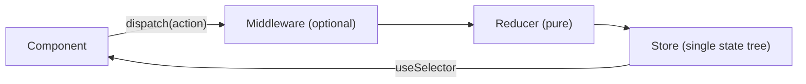
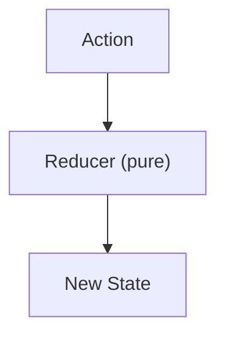
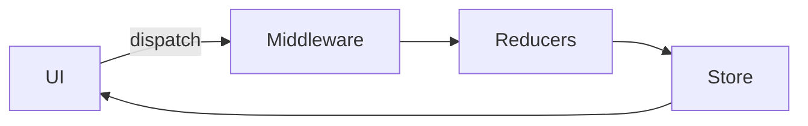

# 🧠 Redux Ultimate Interview Guide (Beginner → Crack Redux/RTK Interviews)

> Built from your notes (Redux vs Context, RTK, async, createSlice, Immer, RTK Query, mistakes) and organized **easy → tough**.  
> Goal: **simple definitions + interview bullet points + working code + diagrams + common traps**.

---

## ✅ How to use this file (fast)
- **Pass 1 (20 min):** Read only **One‑liners**.
- **Pass 2 (60–90 min):** Read bullets + type code snippets.
- **Pass 3 (30 min):** Read **Cheat Sheet + Mistakes** at the end and explain out loud.

---

## 📚 Table of Contents

1. [Redux in 30 seconds](#1-redux-in-30-seconds)
2. [Redux vs Context API](#2-redux-vs-context-api)
3. [Redux vs Redux Toolkit (RTK)](#3-redux-vs-redux-toolkit-rtk)
4. [3 Core Principles of Redux](#4-3-core-principles-of-redux)
5. [Why Redux is Predictable](#5-why-redux-is-predictable-time-travel)
6. [RTK Basics: createSlice](#6-rtk-basics-createslice)
7. [Immer: “Mutable” code, Immutable state](#7-immer-mutable-code-immutable-state)
8. [Async in Redux: Middleware (Thunk/Saga)](#8-async-in-redux-middleware-thunksaga)
9. [RTK Async: createAsyncThunk](#9-rtk-async-createasyncthunk)
10. [RTK Query: createApi (Caching Magic)](#10-rtk-query-createapi-caching-magic)
11. [RTK Query vs Thunk (When to use which)](#11-rtk-query-vs-thunk-when-to-use-which)
12. [createAsyncThunk vs createApi (Short rule)](#12-createasyncthunk-vs-createapi-short-rule)
13. [Common RTK Mistakes (Top traps)](#13-common-rtk-mistakes-top-traps)
14. [Interview Cheatsheet + Memory Tricks](#14-interview-cheatsheet--memory-tricks)
15. [Tips to Learn Faster](#15-tips-to-learn-faster)

---

# 1) Redux in 30 seconds

### 🔑 One‑liner
> Redux is a **predictable global state container**: UI dispatches actions → reducers compute new state → UI reads state.

### 🧠 Mental Model (Pipeline)
- **UI** sends intent: `dispatch(action)`
- **Reducer** computes next state (pure)
- **Store** holds single source of truth
- **UI** subscribes to state updates



### ✅ What interviewers love
- “Redux is predictable because state changes are explicit and traceable via actions.”

---

# 2) Redux vs Context API

### 🔑 One‑liner
> Context is great for **dependency injection** (theme/auth), but Redux is better for **large shared state + complex updates + debugging tooling**.

### When Context is perfect
- Theme (light/dark)
- Locale (language)
- Auth session basics (user, token presence)
- Small apps / low update frequency

### Where Context gets painful (pitfalls)
- Many consumers re-render whenever provider value changes
- Harder to structure complex updates across many features
- No built-in devtools time-travel, middleware pipeline, caching patterns

### Why Redux “pipeline beats buckets” (interview explanation)
- Context feels like passing data “bucket by bucket” through rerenders.
- Redux feels like a **pipeline**: actions flow through a consistent system.

### ✅ Interview answer (short)
> “Context is for simple global values. Redux scales better when state is updated from many places, needs middleware for async, and benefits from devtools/time-travel debugging.”

---

# 3) Redux vs Redux Toolkit (RTK)

### 🔑 One‑liner
> Redux = core engine (more boilerplate). RTK = official modern Redux that removes boilerplate and includes best practices.

### Redux (classic) requires more manual work
- action types + action creators
- switch-case reducers
- immutability manually (`...spread`)
- store setup + middleware wiring

### RTK gives you
- `configureStore()` (good defaults)
- `createSlice()` (actions + reducers in one place)
- Immer built-in (safe “mutating” syntax)
- Thunk included by default
- RTK Query (built-in data fetching + caching)

### ✅ Interview answer
> “Redux Toolkit is recommended because it standardizes patterns, reduces boilerplate, and prevents common Redux mistakes.”

---

# 4) 3 Core Principles of Redux

### 🔑 One‑liner
> Redux apps are stable because: **single source of truth**, **state is read-only**, **reducers are pure**.

1) **Single Source of Truth**
- One store holds app state tree.

2) **State is Read‑Only**
- You can’t mutate state directly.
- Only way to change state is `dispatch(action)`.

3) **Reducers are Pure**
- same input → same output
- no side effects inside reducers



---

# 5) Why Redux is Predictable (Time‑Travel)

### 🔑 One‑liner
> Redux is predictable because actions + pure reducers create a traceable history of state changes.

### Key reasons
- **Trackability:** “Which action caused this state?” → visible in devtools
- **Purity:** reducers don’t do side effects; they compute state only
- **Single store:** no ambiguity about where state lives

### Time travel advantage (interview gold)
- You can inspect past actions/state and replay.
- Debugging becomes “rewind and reproduce.”

---

# 6) RTK Basics: createSlice

### 🔑 One‑liner
> `createSlice` creates a “feature slice” of state and auto-generates action creators + reducer.

### 🍕 Pizza analogy
- Whole state = pizza
- Each feature state = slice
- Slice includes its reducers and actions

### ✅ Working code (Counter slice)
```js
// features/counter/counterSlice.js
import { createSlice } from "@reduxjs/toolkit";

const counterSlice = createSlice({
  name: "counter",
  initialState: { value: 0 },
  reducers: {
    inc(state) { state.value += 1; },
    dec(state) { state.value -= 1; },
    add(state, action) { state.value += action.payload; },
  },
});

export const { inc, dec, add } = counterSlice.actions;
export default counterSlice.reducer;
```

### Store setup
```js
// store.js
import { configureStore } from "@reduxjs/toolkit";
import counterReducer from "./features/counter/counterSlice";

export const store = configureStore({
  reducer: { counter: counterReducer },
});
```

### React usage
```jsx
import { Provider, useDispatch, useSelector } from "react-redux";
import { store } from "./store";
import { inc, dec } from "./features/counter/counterSlice";

function Counter() {
  const value = useSelector(s => s.counter.value);
  const dispatch = useDispatch();

  return (
    <div>
      <h3>{value}</h3>
      <button onClick={() => dispatch(dec())}>-</button>
      <button onClick={() => dispatch(inc())}>+</button>
    </div>
  );
}

export default function App() {
  return (
    <Provider store={store}>
      <Counter />
    </Provider>
  );
}
```

---

# 7) Immer: “Mutable” code, Immutable state

### 🔑 One‑liner
> Immer lets you write updates like `state.value++`, but it produces an immutable state update under the hood.

### Why it matters
Without Immer, deeply nested updates are messy:
```js
// Classic Redux style (manual immutability)
return {
  ...state,
  user: {
    ...state.user,
    profile: {
      ...state.user.profile,
      name: action.payload
    }
  }
};
```

With RTK + Immer:
```js
state.user.profile.name = action.payload;
```

### ✅ Interview answer
> “Immer tracks mutations on a draft and returns a new immutable result. So reducers stay simple but state remains immutable.”

---

# 8) Async in Redux: Middleware (Thunk/Saga)

### 🔑 One‑liner
> Redux reducers are synchronous; async logic is handled using **middleware** between dispatch and reducer.



### Redux Thunk (most common)
- dispatch functions (thunks) instead of plain objects
- thunk gets `(dispatch, getState)` so it can:
  - dispatch loading
  - call API
  - dispatch success/error

**Thunk example**
```js
export const fetchUserThunk = (id) => async (dispatch) => {
  dispatch({ type: "user/loading" });
  try {
    const res = await fetch(`/api/users/${id}`);
    const data = await res.json();
    dispatch({ type: "user/success", payload: data });
  } catch (e) {
    dispatch({ type: "user/error", payload: String(e) });
  }
};
```

### Redux Saga (workflow style)
- uses generator functions
- great for complex orchestration, cancellations, long workflows

### ✅ Interview answer
> “Redux itself is sync; middleware like Thunk/Saga handles async side effects. Middleware is the ‘signal system’ between actions and reducers.”

---

# 9) RTK Async: createAsyncThunk

### 🔑 One‑liner
> `createAsyncThunk` standardizes async actions and automatically generates `pending/fulfilled/rejected` action types.

### ✅ Working example
```js
// features/user/userSlice.js
import { createAsyncThunk, createSlice } from "@reduxjs/toolkit";

export const fetchUser = createAsyncThunk("user/fetch", async (id) => {
  const res = await fetch(`https://jsonplaceholder.typicode.com/users/${id}`);
  if (!res.ok) throw new Error(`HTTP ${res.status}`);
  return res.json();
});

const userSlice = createSlice({
  name: "user",
  initialState: { data: null, loading: false, error: null },
  reducers: {},
  extraReducers: (builder) => {
    builder
      .addCase(fetchUser.pending, (s) => { s.loading = true; s.error = null; })
      .addCase(fetchUser.fulfilled, (s, a) => { s.loading = false; s.data = a.payload; })
      .addCase(fetchUser.rejected, (s, a) => { s.loading = false; s.error = a.error.message; });
  },
});

export default userSlice.reducer;
```

### ✅ Interview answer
> “I use createAsyncThunk for one-off async flows like login/submission where I control the lifecycle states.”

---

# 10) RTK Query: createApi (Caching Magic)

### 🔑 One‑liner
> RTK Query is for **server state**: it handles fetching, caching, deduping, retries, and auto-refetching with almost no boilerplate.

### ✅ Working example (createApi)
```js
// services/api.js
import { createApi, fetchBaseQuery } from "@reduxjs/toolkit/query/react";

export const api = createApi({
  reducerPath: "api",
  baseQuery: fetchBaseQuery({ baseUrl: "https://jsonplaceholder.typicode.com" }),
  endpoints: (builder) => ({
    getUser: builder.query({
      query: (id) => `/users/${id}`,
    }),
    updateUser: builder.mutation({
      query: ({ id, body }) => ({
        url: `/users/${id}`,
        method: "PUT",
        body,
      }),
    }),
  }),
});

export const { useGetUserQuery, useUpdateUserMutation } = api;
```

Add to store:
```js
import { configureStore } from "@reduxjs/toolkit";
import { api } from "./services/api";

export const store = configureStore({
  reducer: { [api.reducerPath]: api.reducer },
  middleware: (getDefaultMiddleware) =>
    getDefaultMiddleware().concat(api.middleware),
});
```

Use in component:
```jsx
import { useGetUserQuery } from "./services/api";

export default function User({ id }) {
  const { data, isLoading, error, refetch } = useGetUserQuery(id);

  if (isLoading) return <p>Loading...</p>;
  if (error) return <button onClick={refetch}>Retry</button>;

  return <pre>{JSON.stringify(data, null, 2)}</pre>;
}
```

### Why it’s “magic” (interview bullets)
- Cache by query key
- Dedup concurrent requests
- Auto refetch on focus/reconnect (configurable)
- Normalized flags: `isLoading, isFetching, error`

---

# 11) RTK Query vs Thunk (When to use which)

### 🔑 One‑liner
> **RTK Query** for API data that should be cached; **Thunk/createAsyncThunk** for custom workflows.

### Quick decision table
| Use case | Best tool |
|---|---|
| Fetch list/details with caching | ✅ RTK Query |
| Auto refetch + dedupe requests | ✅ RTK Query |
| Login / payment / form submit flow | ✅ createAsyncThunk |
| Multi-step orchestration | Thunk or Saga |
| Need full control of side effects | Thunk/Saga |

### Interview answer
> “If it’s server state, I use RTK Query. If it’s a one-off workflow like login, I use createAsyncThunk.”

---

# 12) createAsyncThunk vs createApi (Short rule)

### 🔑 Short rule (memorize)
- `createAsyncThunk` = **custom async jobs** (submit/login/side effects)
- `createApi` (RTK Query) = **API layer** (fetch/cache/refetch)

---

# 13) Common RTK Mistakes (Top traps)

## Mistake 1: Mutating state in plain Redux (without Immer)
- RTK reducers can “mutate” because Immer drafts state.
- Plain Redux reducers must return immutable updates.

✅ Fix: In non-Immer reducers, always copy objects/arrays.

---

## Mistake 2: Forgetting `getDefaultMiddleware()` when adding custom middleware
If you replace middleware array incorrectly, you might remove RTK’s defaults (Thunk/serializable checks).

✅ Correct pattern:
```js
middleware: (getDefaultMiddleware) =>
  getDefaultMiddleware().concat(myMiddleware)
```

---

## Mistake 3: Duplicating state between Context and Redux
If the same data exists in two sources, you’ll lose track of truth.

✅ Fix: Decide **one owner** per state domain:
- UI/global settings → Context
- App shared client state → Redux
- Server data → RTK Query

---

# 14) Interview Cheatsheet + Memory Tricks

### 🔥 10-second answers (say these first)
- Redux = **predictable state container** with one-way flow.
- Predictable because **actions + pure reducers + single store**.
- RTK = Redux done right (less boilerplate + Immer + good defaults).
- Async = middleware (Thunk/Saga); reducers stay pure.
- RTK Query = server state caching + dedupe + refetch.

### 🧠 Memory tricks
- **Pipeline** (Redux) vs **Buckets** (Context)
- **Raw engine** (Redux) vs **Turbo engine** (RTK)
- Middleware = **signal system** between dispatch and reducer
- createSlice = **pizza slice** of state
- Immer = “write mutable, get immutable”
- RTK Query = “stop boilerplate, start caching”

---

# 15) Tips to Learn Faster

### 1) Learn the flow first (always)
Say out loud:
> “UI dispatches actions → reducers compute new state → UI reads via selectors.”

### 2) Practice one mini project (best ROI)
Build a “Users” app with:
- `createSlice` for UI state (selected user id, filters)
- RTK Query for server data (users list/details)
- One mutation (update user)

### 3) Interview confidence line (use anytime)
> “Let me separate client state from server state: Redux slice for client logic; RTK Query for server caching.”

### 4) Most common interview trap
**Mixing Context + Redux for same state.** Avoid it.

---

✅ If you can explain each section and write the code from memory, you will not freeze in Redux interviews.
